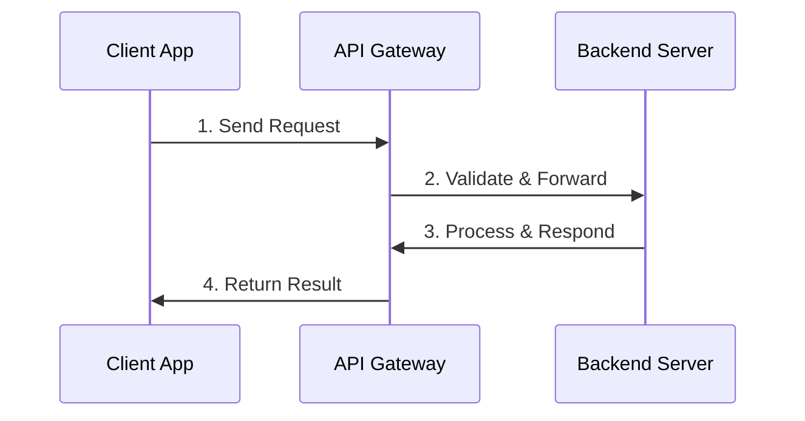
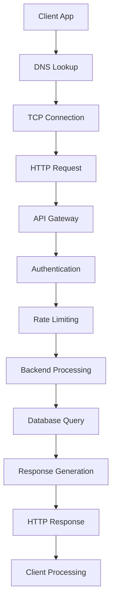

# Chapter 01: Learn the Basics

## Introduction

### What is an API?

**API (Application Programming Interface)**: A set of rules and tools that allows different software applications to communicate with each other.

**📌 Think of it like this**: A restaurant menu shows what dishes are available and how to order them. An API shows what services are available and how to request them.

### How APIs Work: Simple Flow



### Real-World API Examples

- **Weather App**: Uses weather API to get current weather
- **Social Media**: Facebook API for user authentication
- **Payment**: Stripe API for processing payments
- **Maps**: Google Maps API for location services

---

## HTTP Protocol Fundamentals

### What is HTTP?

**HTTP (HyperText Transfer Protocol)**: The foundation of data communication on the World Wide Web. It's the protocol used for transferring data between clients and servers.

### HTTP Versions Evolution

| Version | Year | Key Features |
|---------|------|--------------|
| **HTTP/1.0** | 1996 | Basic request-response model |
| **HTTP/1.1** | 1997 | Persistent connections, pipelining |
| **HTTP/2** | 2015 | Multiplexing, header compression |
| **HTTP/3** | 2022 | QUIC protocol, improved performance |

**📌 Why HTTP/2/3 matter**: Faster loading times and better performance for modern web applications.

### Core HTTP Methods

| Method | Purpose | Example |
|--------|---------|---------|
| **GET** | Retrieve data | `GET /users/123` |
| **POST** | Create new data | `POST /users` |
| **PUT** | Update existing data | `PUT /users/123` |
| **PATCH** | Partial update | `PATCH /users/123` |
| **DELETE** | Remove data | `DELETE /users/123` |

### HTTP Status Codes: Quick Reference

| Code Range | Meaning | Common Examples |
|------------|---------|-----------------|
| **200-299** | Success | 200 OK, 201 Created |
| **300-399** | Redirection | 301 Moved, 304 Not Modified |
| **400-499** | Client Error | 400 Bad Request, 404 Not Found |
| **500-599** | Server Error | 500 Internal Error |

**📌 Remember**: 2xx = Good, 3xx = Go elsewhere, 4xx = Your fault, 5xx = My fault.

### Key HTTP Headers

| Header | Purpose | Example |
|--------|---------|---------|
| **Content-Type** | Data format | `application/json` |
| **Authorization** | Authentication | `Bearer token123` |
| **Accept** | Expected response | `application/json` |
| **Cache-Control** | Caching rules | `no-cache` |

---

## URL Structure and Parameters

### Anatomy of a URL

```
https://api.example.com:443/users?page=2&limit=10
│       │           │   │    │    │       │        │
│       │           │   │    │    │       │        └─ Query Parameters
│       │           │   │    │    │       └─ Resource Path
│       │           │   │    │    └─ Port Number
│       │           │   │    └─ Domain
│       │           │   └─ Protocol
│       │           └─ Host
│       └─ API Domain
└─ Protocol
```

### Types of Parameters

| Type | Format | Purpose | Example |
|------|--------|---------|---------|
| **Path Parameters** | `/users/{id}` | Identify specific resource | `/users/123` |
| **Query Parameters** | `?key=value` | Filter, sort, paginate | `?page=2&limit=10` |
| **Header Parameters** | In HTTP headers | Authentication, metadata | `Authorization: Bearer token` |

---

## Data Formats and Content Negotiation

### Common Data Formats

| Format | Content-Type | Best For | Example |
|--------|--------------|----------|---------|
| **JSON** | `application/json` | Web APIs, JavaScript | `{"name": "John", "age": 30}` |
| **XML** | `application/xml` | Enterprise systems | `<user><name>John</name></user>` |
| **Form Data** | `multipart/form-data` | File uploads | Form submissions |

**📌 Why JSON dominates**: Lightweight, easy to read, native JavaScript support.

### Content Negotiation

The process of selecting the best representation for a given response when multiple representations are available.

**Header**: `Accept: application/json, application/xml;q=0.9`

The server will return JSON if available, otherwise XML.

---

## Web Security Basics

### CORS (Cross-Origin Resource Sharing)

**📌 Simple Explanation**: Browser security feature that prevents a web page from making requests to a different domain than the one that served the web page.

**When you need CORS**:
- Frontend on `https://myapp.com` calls API on `https://api.myapp.com`
- Different ports: `http://localhost:3000` calls `http://localhost:8080`

**Solution**: Add CORS headers to API responses:
```
Access-Control-Allow-Origin: *
Access-Control-Allow-Methods: GET, POST, PUT, DELETE
Access-Control-Allow-Headers: Content-Type, Authorization
```

### Cookies and Sessions

| Type | Purpose | Security Note |
|------|---------|---------------|
| **Session Cookie** | Temporary user session | Expires when browser closes |
| **Persistent Cookie** | Remember user preferences | Has expiration date |
| **Secure Cookie** | HTTPS only transmission | Prevents man-in-the-middle attacks |
| **HttpOnly Cookie** | Prevents JavaScript access | Reduces XSS attack risk |

---

## Caching Strategies

### HTTP Caching Headers

| Header | Purpose | Example Value |
|--------|---------|---------------|
| **Cache-Control** | How to cache response | `max-age=3600, public` |
| **ETag** | Resource version identifier | `"abc123"` |
| **Last-Modified** | Last modification timestamp | `Wed, 21 Oct 2015 07:28:00 GMT` |

### Caching Strategies

| Strategy | Use Case | Duration |
|----------|----------|----------|
| **No Cache** | Real-time data, user-specific | 0 seconds |
| **Short Cache** | Frequently updated data | 5-15 minutes |
| **Long Cache** | Static data, rarely changes | Days/weeks |

---

## Network Fundamentals

### TCP/IP Basics

**TCP (Transmission Control Protocol)**: Ensures reliable data delivery with error checking and flow control.

**IP (Internet Protocol)**: Routes data packets across networks to their destination.

**📌 Why this matters for APIs**:
- TCP ensures your API requests arrive complete and in order
- IP ensures requests reach the correct server
- Understanding helps with debugging network issues

### DNS (Domain Name System)

**📌 Simple Explanation**: The phonebook of the internet - converts domain names (`api.example.com`) to IP addresses (`192.168.1.1`).

**DNS Resolution Process**:
1. Browser checks its cache
2. Checks OS cache
3. Checks router cache
4. Checks ISP DNS server
5. Queries root DNS servers

**DNS Records for APIs**:
- **A Record**: Domain → IPv4 address
- **AAAA Record**: Domain → IPv6 address
- **CNAME Record**: Domain alias → canonical domain

---

## API Request/Response Lifecycle

### Complete Request Flow



### Common Response Patterns

| Pattern | When to Use | Response Structure |
|---------|-------------|-------------------|
| **Success** | Request completed | `{ "success": true, "data": {...} }` |
| **Error** | Something went wrong | `{ "success": false, "error": "message" }` |
| **Paginated** | Large datasets | `{ "data": [...], "total": 100, "page": 1 }` |

---

## Best Practices for API Design

### RESTful Design Principles

1. **Use Nouns for Resources**: `/users` not `/getUsers`
2. **HTTP Methods for Actions**: GET for read, POST for create
3. **Plural Nouns**: `/users` not `/user`
4. **HTTP Status Codes**: Use appropriate codes
5. **Versioning**: `/api/v1/users`

### Error Handling

```json
{
  "error": {
    "code": "USER_NOT_FOUND",
    "message": "User with ID 123 not found",
    "timestamp": "2023-12-01T10:30:00Z",
    "path": "/api/v1/users/123"
  }
}
```

### Rate Limiting

**Purpose**: Prevent API abuse and ensure fair usage.

**Headers**:
- `X-RateLimit-Limit`: 1000 requests per hour
- `X-RateLimit-Remaining`: 999 requests left
- `X-RateLimit-Reset`: Timestamp when limit resets

---

## Quick Reference: Essential Concepts

### Must-Know Terms

| Term | Simple Definition |
|------|------------------|
| **Endpoint** | Specific URL where API can be accessed |
| **Payload** | Data sent in request/response body |
| **Middleware** | Software that connects different applications |
| **Authentication** | Verifying who you are |
| **Authorization** | Verifying what you're allowed to do |
| **Idempotent** | Same result no matter how many times called |
| **Stateless** | Each request contains all info needed |

### HTTP Methods Mnemonic

**CRUD Operations**:
- **C**reate → **POST**
- **R**ead → **GET**
- **U**pdate → **PUT/PATCH**
- **D**elete → **DELETE**

### Common Status Codes to Remember

```
200: OK - Request successful
201: Created - New resource created
400: Bad Request - Invalid request
401: Unauthorized - Authentication required
403: Forbidden - Permission denied
404: Not Found - Resource doesn't exist
500: Internal Error - Server problem
```

---

## Interview Questions

### Basic Questions

1. **What is an API?**
   - A set of rules allowing different applications to communicate
   - Like a waiter taking orders between kitchen and customer

2. **What's the difference between REST and SOAP?**
   - REST: Lightweight, uses HTTP, JSON/XML data
   - SOAP: Heavyweight, XML-only, built-in standards

3. **What are HTTP status codes?**
   - 3-digit numbers indicating request result
   - 2xx: success, 3xx: redirect, 4xx: client error, 5xx: server error

### Intermediate Questions

4. **What is CORS and why do we need it?**
   - Security feature preventing cross-domain requests
   - Needed for frontend-backend separation

5. **Explain the difference between PUT and PATCH**
   - PUT: Replace entire resource
   - PATCH: Partial update of resource

6. **What is idempotency in APIs?**
   - Same result regardless of how many times called
   - GET, PUT, DELETE are idempotent; POST is not

### Advanced Questions

7. **How would you version an API?**
   - URI versioning: `/api/v1/users`
   - Header versioning: `Accept: application/vnd.api+json;version=1`
   - Query parameter: `/api/users?version=1`

8. **What's the difference between authentication and authorization?**
   - Authentication: Who you are (login with password)
   - Authorization: What you're allowed to do (permissions)

9. **How do you handle rate limiting?**
   - Token bucket algorithm
   - Sliding window counter
   - Return rate limit headers to clients

---

## Summary

### Key Takeaways

1. **APIs are communication contracts** between different software systems
2. **HTTP is the foundation** of most modern APIs
3. **RESTful design** makes APIs intuitive and consistent
4. **Security (CORS, auth)** is crucial for production APIs
5. **Caching improves performance** and reduces server load
6. **Error handling** should be consistent and informative
7. **Rate limiting** protects your API from abuse

### Before Moving Forward

Make sure you understand:
- HTTP methods and status codes
- URL structure and parameters
- Basic security concepts
- REST principles

**Next Up**: Chapter 02 explores different API styles (REST, GraphQL, SOAP, gRPC) and helps you choose the right approach for your needs.