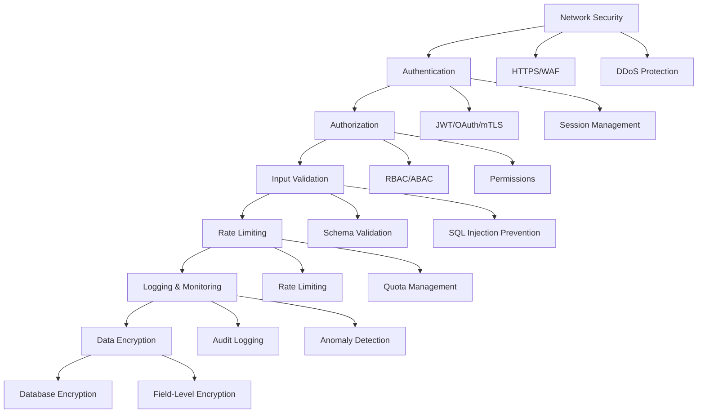
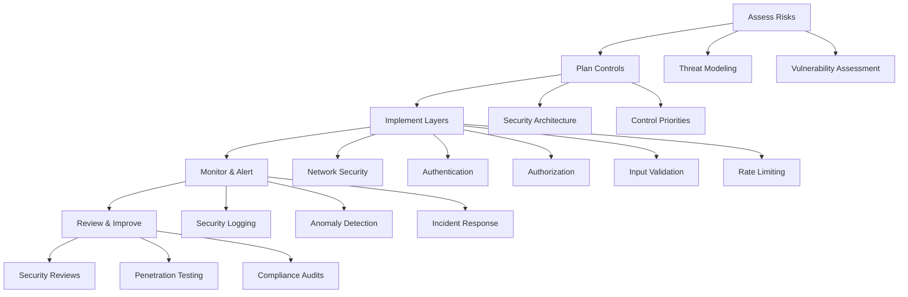

# Chapter 07: API Security

## Introduction

**📌 API Security**: The practice of protecting APIs from attacks and unauthorized access. Think of it like a security system for a digital vault - multiple layers of protection to keep your data safe.

**📌 Why Security Matters**: A single security breach can cost millions in damages, destroy customer trust, and bring down your entire business. API security is not optional - it's essential.

This chapter covers the most critical security threats and practical implementation strategies to protect your APIs.

---

## OWASP Top 10 API Security Risks

### What is OWASP?

**OWASP (Open Web Application Security Project)**: A nonprofit foundation that works to improve software security through community-led open-source software projects.

**📌 OWASP Top 10**: A regularly updated report outlining the most critical security risks to web applications.

### Current OWASP API Security Top 10 (2023)

| Rank | Risk | Description | Impact |
|------|------|-------------|--------|
| **1** | Broken Object Level Authorization | API endpoints fail to verify user has access to specific object | Data exposure |
| **2** | Broken User Authentication | Authentication mechanisms are weak or misconfigured | Account takeover |
| **3** | Broken Object Property Level Authorization | Similar to #1 but for specific object properties | Data exposure |
| **4** | Unrestricted Resource Consumption | No limits on API calls leading to exhaustion | Denial of Service |
| **5** | Broken Function Level Authorization | API functions lack proper permission checks | Data exposure |
| **6** | Unrestricted Access to Sensitive Business Flows | Sensitive operations lack proper restrictions | Business logic abuse |
| **7** | Server Side Request Forgery (SSRF)** | Server can be tricked into making requests to other systems | Data exfiltration |
| **8** | Security Misconfiguration | Security settings are missing or misconfigured | System compromise |
| **9** | Improper Inventory Management | APIs are not properly cataloged and managed | Unknown attack surface |
| **10** | Unsafe Consumption of APIs | Dependencies on insecure third-party APIs | Supply chain attacks |

### Understanding Each Risk

#### 1. Broken Object Level Authorization

**Problem**: `/users/123/profile` doesn't check if user has permission to access user 123's profile.

```javascript
// Vulnerable code
app.get('/users/:id/profile', (req, res) => {
  const user = await User.findById(req.params.id);
  // No authorization check - anyone can access any user's profile!
  res.json(user);
});

// Secure code
app.get('/users/:id/profile', authMiddleware, async (req, res) => {
  const requestedUserId = req.params.id;
  const authenticatedUserId = req.user.id;

  if (requestedUserId !== authenticatedUserId) {
    return res.status(403).json({ error: 'Access denied' });
  }

  const user = await User.findById(requestedUserId);
  res.json(user);
});
```

#### 2. Broken User Authentication

**Problem**: Weak authentication that can be easily bypassed.

```javascript
// Vulnerable: Predictable JWT secret
const JWT_SECRET = 'secret123'; // Should be complex and random

// Secure: Strong, randomly generated secret
const JWT_SECRET = process.env.JWT_SECRET; // Should be 256+ characters
```

---

## Defense in Depth Strategy

### What is Defense in Depth?

**Defense in Depth**: Multiple layers of security controls so that if one fails, others still protect the system.

**📌 Think of it like**: A medieval castle with moat, walls, guards, towers, and a treasure room with multiple locks - an attacker must breach multiple defenses.

### Security Layers Architecture



### Security Checklist

| Layer | Essential Controls | Implementation |
|-------|-------------------|----------------|
| **Network** | HTTPS, WAF, DDoS protection | Nginx, Cloudflare |
| **Authentication** | Strong passwords, MFA, JWT | bcrypt, Auth0, Okta |
| **Authorization** | Role-based access, permissions | Custom middleware |
| **Input Validation** | Schema validation, sanitization | Joi, express-validator |
| **Rate Limiting** | Token bucket, sliding window | rate-limiter-flexible |
| **Encryption** | TLS 1.3, database encryption | crypto module |
| **Logging** | Audit trails, monitoring | Winston, ELK stack |

---

## Common Security Vulnerabilities

### 1. SQL Injection

**What it is**: Attack that inserts malicious SQL code into database queries.

**📌 Think of it like**: Someone adding extra instructions to a questionnaire that changes how the system processes the data.

#### Prevention

```javascript
// Vulnerable: Direct string concatenation
const query = `SELECT * FROM users WHERE id = ${userId}`;

// Secure: Parameterized queries
const query = 'SELECT * FROM users WHERE id = ?';
const result = await db.query(query, [userId]);

// Using ORM with built-in protection
const user = await User.findById(userId);
```

### 2. Cross-Site Scripting (XSS)

**What it is**: Attack that injects malicious scripts into web pages viewed by other users.

**📌 Think of it like**: Someone slipping a note into a suggestion box that tells the system to display malicious code to other users.

#### Prevention

```javascript
// Vulnerable: Rendering user input directly
res.send(`<div>${userComment}</div>`);

// Secure: Sanitize input
const sanitizedComment = sanitizeHtml(userComment);
res.send(`<div>${sanitizedComment}</div>`);
```

### 3. Cross-Site Request Forgery (CSRF)

**What it is**: Attack that tricks authenticated users into performing actions they didn't intend to.

**📌 Think of it like**: Someone sending a fake email that looks like it's from your bank, asking you to click a link that transfers money.

#### Prevention

```javascript
// CSRF Token Implementation
app.use(csrf({ cookie: true }));

app.post('/api/transfer', (req, res) => {
  // CSRF token is automatically validated by middleware
  // Transfer logic here
});
```

### 4. Insecure Deserialization

**What it is**: Attack that manipulates serialized data to execute malicious code.

**📌 Think of it like**: Someone tampering with a shipping label to change the contents inside the package.

#### Prevention

```javascript
// Use signed and encrypted tokens
const sessionToken = jwt.sign(
  { userId, role: 'user' },
  process.env.JWT_SECRET,
  { expiresIn: '1h' }
);

// Verify token integrity
const decoded = jwt.verify(token, process.env.JWT_SECRET);
```

---

## Input Validation and Sanitization

### What is Input Validation?

**Input Validation**: The process of ensuring that user input meets specific criteria before processing it.

**📌 Think of it like**: A bouncer at a club checking IDs - if an ID is fake or doesn't meet requirements, entry is denied.

### Validation Best Practices

| Type | When to Use | Example |
|------|------------|--------|
| **Type Validation** | Basic data types | Age must be number |
| **Range Validation** | Min/max values | Age between 18-100 |
| **Format Validation** | Patterns like email, phone | Email format validation |
| **Whitelist Validation** | Allow only specific values | Status: active/inactive |
| **Length Validation** | String length constraints | Password 8-50 chars |

### Implementation Examples

```javascript
// Using Joi for validation
const Joi = require('joi');

const userSchema = Joi.object({
  name: Joi.string().min(2).max(50).required(),
  email: Joi.string().email().required(),
  age: Joi.number().integer().min(18).max(120).required(),
  role: Joi.string().valid('user', 'admin').default('user')
});

// Validation middleware
function validateRequest(schema) {
  return (req, res, next) => {
    const { error } = schema.validate(req.body);
    if (error) {
      return res.status(400).json({
        error: 'Validation failed',
        details: error.details.map(d => d.message)
      });
    }
    next();
  };
}

// Usage
app.post('/api/users',
  validateRequest(userSchema),
  async (req, res) => {
    // Process validated data
    const user = await User.create(req.body);
    res.status(201).json(user);
  }
);
```

### Input Sanitization

```javascript
// Remove potentially dangerous characters
function sanitizeInput(input) {
  if (typeof input !== 'string') return input;

  return input
    .replace(/<script\b[^<]*(?:(?!<\/script>)<[^<]*)*<\/script>/gi, '')
    .replace(/javascript:/gi, '')
    .replace(/on\w+\s*=/gi, '')
    .trim();
}

// SQL injection prevention
function escapeSql(input) {
  if (typeof input !== 'string') return input;

  return input
    .replace(/'/g, "''")
    .replace(/"/g, '\"')
    .replace(/\\/g, '\\')
    .replace(/%/g, '\\%');
}
```

---

## Authentication Security

### Secure Authentication Patterns

#### 1. Multi-Factor Authentication

```javascript
// MFA Implementation
async function authenticateWithMFA(username, password, mfaCode) {
  // Step 1: Verify username/password
  const user = await validateCredentials(username, password);
  if (!user) {
    throw new Error('Invalid credentials');
  }

  // Step 2: Verify MFA code if enabled
  if (user.mfaEnabled) {
    const isValidMFA = await verifyMFA(user.mfaSecret, mfaCode);
    if (!isValidMFA) {
      throw new Error('Invalid MFA code');
    }
  }

  // Step 3: Generate secure session token
  const sessionToken = generateSecureToken(user);
  return { user, sessionToken };
}
```

#### 2. Session Security

```javascript
// Secure session configuration
app.use(session({
  secret: process.env.SESSION_SECRET,
  resave: false,
  saveUninitialized: false,
  cookie: {
    secure: process.env.NODE_ENV === 'production', // HTTPS only
    httpOnly: true,                                     // Prevent XSS
    maxAge: 24 * 60 * 60 * 1000,                          // 1 day
    sameSite: 'strict'                                   // CSRF protection
  }
}));

// Session management
app.post('/api/logout', (req, res) => {
  req.session.destroy(err => {
    if (err) {
      return res.status(500).json({ error: 'Logout failed' });
    }
    res.clearCookie('connect.sid');
    res.json({ message: 'Logged out successfully' });
  });
});
```

---

## Authorization Security

### Secure Authorization Patterns

#### 1. Principle of Least Privilege

**📌 Think of it like**: A janitor only gets keys to the cleaning closet, not the CEO's office - users should have only the permissions they absolutely need.

```javascript
// Check minimum required permissions
function requireMinimumPermission(requiredLevel) {
  return (req, res, next) => {
    const userPermission = req.user.permissionLevel;

    if (userPermission < requiredLevel) {
      return res.status(403).json({
        error: 'Insufficient permissions',
        required: requiredLevel,
        current: userPermission
      });
    }

    next();
  };
}

// Usage
app.delete('/api/admin/users/:id',
  authMiddleware,
  requireMinimumPermission('admin'), // Only admins can delete users
  async (req, res) => {
    await User.findByIdAndDelete(req.params.id);
    res.json({ success: true });
  }
);
```

#### 2. Role-Based Access Control (RBAC)

```javascript
// RBAC Middleware
function checkRole(requiredRoles) {
  return async (req, res, next) => {
    const userRoles = await getUserRoles(req.user.id);
    const hasRole = requiredRoles.some(role => userRoles.includes(role));

    if (!hasRole) {
      return res.status(403).json({
        error: 'Access denied',
        required: requiredRoles,
        userRoles
      });
    }

    next();
  };
}

// Usage
app.get('/api/analytics',
  authMiddleware,
  checkRole(['admin', 'analyst']),
  async (req, res) => {
    const analytics = await getAnalyticsData();
    res.json(analytics);
  }
);
```

---

## Rate Limiting and Abuse Prevention

### Rate Limiting Strategies

#### 1. Token Bucket Algorithm

```javascript
// Token Bucket Implementation
class RateLimiter {
  constructor(options) {
    this.tokens = new Map();
    this.capacity = options.capacity || 100;
    this.refillRate = options.refillRate || 10;
    this.windowMs = options.windowMs || 60000; // 1 minute
  }

  consume(key, tokens = 1) {
    const now = Date.now();
    const bucket = this.tokens.get(key) || {
      tokens: this.capacity,
      lastRefill: now
    };

    // Refill tokens based on time elapsed
    const timePassed = now - bucket.lastRefill;
    const tokensToAdd = Math.floor((timePassed / this.windowMs) * this.refillRate);
    bucket.tokens = Math.min(this.capacity, bucket.tokens + tokensToAdd);
    bucket.lastRefill = now;

    if (bucket.tokens >= tokens) {
      bucket.tokens -= tokens;
      this.tokens.set(key, bucket);
      return true;
    }

    return false;
  }

  // Get rate limit status
  getStatus(key) {
    const bucket = this.tokens.get(key);
    if (!bucket) return { tokens: this.capacity };

    const now = Date.now();
    const timePassed = now - bucket.lastRefill;
    const tokensToAdd = Math.floor((timePassed / this.windowMs) * this.refillRate);
    const currentTokens = Math.min(this.capacity, bucket.tokens + tokensToAdd);

    return {
      tokens: currentTokens,
      capacity: this.capacity,
      refillRate: this.refillRate
    };
  }
}

// Rate limiting middleware
const rateLimiter = new RateLimiter({
  capacity: 100,
  refillRate: 10,
  windowMs: 60000
});

app.use('/api/*', (req, res, next) => {
  const clientId = req.ip; // Use IP as client identifier

  if (!rateLimiter.consume(clientId, 1)) {
    const status = rateLimiter.getStatus(clientId);

    return res.status(429).json({
      error: 'Rate limit exceeded',
      retryAfter: Math.ceil((this.capacity - status.tokens) / this.refillRate),
      limit: this.capacity,
      remaining: status.tokens
    });
  }

  next();
});
```

#### 2. Sliding Window Rate Limiting

```javascript
// Sliding Window Implementation
class SlidingWindowRateLimiter {
  constructor(options) {
    this.requests = new Map();
    this.windowMs = options.windowMs || 60000; // 1 minute
    this.maxRequests = options.maxRequests || 100;
  }

  isAllowed(clientId) {
    const now = Date.now();
    const windowStart = now - this.windowMs;
    const clientRequests = this.requests.get(clientId) || [];

    // Remove old requests outside the window
    const validRequests = clientRequests.filter(timestamp => timestamp > windowStart);

    // Check if under limit
    if (validRequests.length >= this.maxRequests) {
      return false;
    }

    // Add current request
    validRequests.push(now);
    this.requests.set(clientId, validRequests);

    return true;
  }

  // Clean up old entries periodically
  cleanup() {
    const now = Date.now();
    const cutoff = now - this.windowMs * 2; // Keep a bit longer than window

    for (const [clientId, requests] of this.requests.entries()) {
      const validRequests = requests.filter(timestamp => timestamp > cutoff);
      if (validRequests.length === 0) {
        this.requests.delete(clientId);
      } else {
        this.requests.set(clientId, validRequests);
      }
    }
  }
}

// Clean up every 5 minutes
setInterval(() => {
  rateLimiter.cleanup();
}, 5 * 60 * 1000);
```

---

## Data Encryption

### Encryption Best Practices

#### 1. Data in Transit (HTTPS)

```javascript
// Force HTTPS in production
app.use((req, res, next) => {
  if (process.env.NODE_ENV === 'production' && !req.secure) {
    return res.redirect(301, `https://${req.headers.host}${req.url}`);
  }
  next();
});

// Configure strong TLS
const httpsOptions = {
  key: fs.readFileSync('server.key'),
  cert: fs.readFileSync('server.crt'),
  ca: fs.readFileSync('ca.crt'),
  minVersion: 'TLSv1.2',
  ciphers: [
    'TLS_ECDHE_RSA_WITH_AES_256_GCM_SHA384',
    'TLS_ECDHE_RSA_WITH_AES_128_GCM_SHA256',
    'TLS_ECDHE_RSA_WITH_AES_256_CBC_SHA384',
    'TLS_ECDHE_RSA_WITH_AES_128_CBC_SHA256'
  ],
  honorCipherOrder: true
};

https.createServer(httpsOptions, app).listen(443);
```

#### 2. Data at Rest (Database Encryption)

```javascript
// Field-level encryption
const crypto = require('crypto');

class EncryptionService {
  constructor(secretKey) {
    this.algorithm = 'aes-256-gcm';
    this.secretKey = crypto.scryptSync(secretKey, 'salt', 64);
  }

  encrypt(text) {
    const iv = crypto.randomBytes(16);
    const cipher = crypto.createCipher(this.algorithm, this.secretKey, iv);
    let encrypted = cipher.update(text, 'utf8', 'hex');
    encrypted += cipher.final('hex');

    return {
      encrypted,
      iv: iv.toString('hex')
    };
  }

  decrypt(encryptedData) {
    const decipher = crypto.createDecipher(
      this.algorithm,
      this.secretKey,
      Buffer.from(encryptedData.iv, 'hex')
    );

    let decrypted = decipher.update(encryptedData.encrypted, 'hex', 'utf8');
    decrypted += decipher.final('utf8');

    return decrypted;
  }
}

// Usage in models
const encryption = new EncryptionService(process.env.ENCRYPTION_KEY);

// Encrypt sensitive fields before saving
user.email = encryption.encrypt(user.email);
user.ssn = encryption.encrypt(user.ssn);
```

---

## Logging and Monitoring

### Security Logging Best Practices

```javascript
const winston = require('winston');

// Security-focused logger
const securityLogger = winston.createLogger({
  level: 'info',
  format: winston.format.combine(
    winston.format.timestamp(),
    winston.format.errors({ stack: true }),
    winston.format.json()
  ),
  defaultMeta: { service: 'api-security' },
  transports: [
    new winston.transports.File({
      filename: 'security.log',
      level: 'warn'
    }),
    new winston.transports.Console({
      level: 'error'
    })
  ]
});

// Security event logging
function logSecurityEvent(event, req) {
  const logData = {
    event,
    timestamp: new Date().toISOString(),
    ip: req.ip,
    userAgent: req.get('User-Agent'),
    userId: req.user?.id,
    endpoint: req.path,
    method: req.method,
    statusCode: res.statusCode,
    headers: {
      'x-forwarded-for': req.get('X-Forwarded-For'),
      'x-real-ip': req.get('X-Real-IP')
    }
  };

  if (event.type === 'ERROR') {
    securityLogger.error('Security Event', logData);
  } else if (event.type === 'WARNING') {
    securityLogger.warn('Security Event', logData);
  } else {
    securityLogger.info('Security Event', logData);
  }
}

// Security monitoring middleware
function securityMonitoring(req, res, next) {
  const startTime = Date.now();

  // Log authentication events
  res.on('finish', () => {
    const duration = Date.now() - startTime;

    // Log suspicious activity
    if (res.statusCode === 401 || res.statusCode === 403) {
      logSecurityEvent({
        type: 'WARNING',
        message: 'Access Denied',
        reason: res.statusCode === 401 ? 'Authentication' : 'Authorization'
      }, req);
    }

    // Log rate limiting
    if (res.statusCode === 429) {
      logSecurityEvent({
        type: 'WARNING',
        message: 'Rate Limit Exceeded'
      }, req);
    }

    // Log long-running requests
    if (duration > 5000) {
      logSecurityEvent({
        type: 'INFO',
        message: 'Slow API Call',
        duration: duration
      }, req);
    }
  });

  next();
}
```

### Anomaly Detection

```javascript
// Anomaly Detection System
class AnomalyDetector {
  constructor() {
    this.baselineMetrics = {
      averageResponseTime: 500,
      errorRate: 0.01,
      requestFrequency: 100
    };
    this.anomalyThresholds = {
      responseTimeMultiplier: 5,
      errorRateMultiplier: 10,
      requestFrequencyMultiplier: 3
    };
  }

  detectAnomaly(metrics) {
    const anomalies = [];

    // Check response time anomalies
    const responseTimeRatio = metrics.averageResponseTime / this.baselineMetrics.averageResponseTime;
    if (responseTimeRatio > this.anomalyThresholds.responseTimeMultiplier) {
      anomalies.push({
        type: 'SLOW_RESPONSE_TIME',
        value: metrics.averageResponseTime,
        threshold: this.baselineMetrics.averageResponseTime * this.anomalyThresholds.responseTimeMultiplier
      });
    }

    // Check error rate anomalies
    const errorRateRatio = metrics.errorRate / this.baselineMetrics.errorRate;
    if (errorRateRatio > this.anomalyThresholds.errorRateMultiplier) {
      anomalies.push({
        type: 'HIGH_ERROR_RATE',
        value: metrics.errorRate,
        threshold: this.baselineMetrics.errorRate * this.anomalyThresholds.errorRateMultiplier
      });
    }

    // Check request frequency anomalies
    const frequencyRatio = metrics.requestFrequency / this.baselineMetrics.requestFrequency;
    if (frequencyRatio > this.anomalyThresholds.requestFrequencyMultiplier) {
      anomalies.push({
        type: 'HIGH_REQUEST_FREQUENCY',
        value: metrics.requestFrequency,
        threshold: this.baselineMetrics.requestFrequency * this.anomalyThresholds.requestFrequencyMultiplier
      });
    }

    return anomalies;
  }
}
```

---

## Security Headers

### Essential Security Headers

| Header | Purpose | Implementation |
|--------|---------|----------------|
| **Content-Security-Policy** | Prevent XSS attacks | `default-src 'self'` |
| **X-Frame-Options** | Prevent clickjacking | `DENY` |
| **X-XSS-Protection** | XSS protection mode | `1; mode=block` |
| **Strict-Transport-Security** | Force HTTPS | `max-age=31536000` |
| **X-Content-Type-Options** | MIME type sniffing | `nosniff` |
| **Referrer-Policy** | Referrer policy | `strict-origin-when-cross-origin` |

### Implementation

```javascript
// Security headers middleware
function securityHeaders(req, res, next) {
  // Content Security Policy
  res.setHeader(
    'Content-Security-Policy',
    "default-src 'self'; script-src 'self' 'unsafe-inline' 'unsafe-eval'; style-src 'self' 'unsafe-inline'; img-src 'self' data: https:; font-src 'self';"
  );

  // Clickjacking protection
  res.setHeader('X-Frame-Options', 'DENY');

  // XSS protection
  res.setHeader('X-XSS-Protection', '1; mode=block');

  // HSTS (only in production)
  if (process.env.NODE_ENV === 'production') {
    res.setHeader(
      'Strict-Transport-Security',
      'max-age=31536000; includeSubDomains; preload'
    );
  }

  // Prevent MIME type sniffing
  res.setHeader('X-Content-Type-Options', 'nosniff');

  // Referrer policy
  res.setHeader('Referrer-Policy', 'strict-origin-when-cross-origin');

  // Remove server information
  res.removeHeader('X-Powered-By');
  res.removeHeader('Server');

  next();
}

// Apply security headers to all routes
app.use(securityHeaders);
```

---

## API Key Security

### API Key Management

```javascript
// Secure API Key Generator
class APIKeyGenerator {
  generateKey() {
    const prefix = 'ak_';
    const randomPart = crypto.randomBytes(32).toString('hex');
    return prefix + randomPart;
  }

  generateSecret() {
    return crypto.randomBytes(64).toString('hex');
  }
}

// API Key Storage with Encryption
class APIKeyStore {
  constructor(encryptionKey) {
    this.cipher = crypto.createCipher('aes-256-gcm', encryptionKey);
    this.decipher = crypto.createDecipher('aes-256-gcm', encryptionKey);
  }

  async storeKey(keyData) {
    // Encrypt sensitive data
    const encryptedKey = this.cipher.update(JSON.stringify(keyData), 'utf8', 'hex');
    const encryptedSecret = this.cipher.update(keyData.secret, 'utf8', 'hex');

    // Store only encrypted version
    await db.query(
      'INSERT INTO api_keys (id, encrypted_key, encrypted_secret, created_at) VALUES (?, ?, ?, ?)',
      [keyData.id, encryptedKey, encryptedSecret, new Date()]
    );
  }

  async getKey(id) {
    // Retrieve and decrypt key
    const result = await db.query(
      'SELECT encrypted_key, encrypted_secret FROM api_keys WHERE id = ?',
      [id]
    );

    if (result.length === 0) {
      return null;
    }

    // Decrypt data
    const encryptedData = result[0];
    const decryptedKey = this.decipher.update(encryptedData.encrypted_key, 'hex', 'utf8');
    const decryptedSecret = this.decipher.update(encryptedData.encrypted_secret, 'hex', 'utf8');

    return {
      id: id,
      key: decryptedKey,
      secret: decryptedSecret
    };
  }
}
```

### API Key Usage

```javascript
// API Key Middleware
function apiKeyAuth(req, res, next) {
  const apiKey = req.headers['x-api-key'];

  if (!apiKey) {
    return res.status(401).json({
      error: 'API key required',
      message: 'Please provide a valid API key in X-API-Key header'
    });
  }

  // Validate and get API key details
  const keyData = await apiKeyStore.getKey(apiKey);
  if (!keyData) {
    return res.status(401).json({
      error: 'Invalid API key'
    });
  }

  // Add key info to request
  req.apiKey = keyData;
  next();
}

// Rate limiting per API key
app.use('/api/*', apiKeyAuth, (req, res, next) => {
  // Apply rate limiting based on API key
  const keyLimiter = rateLimiters.getOrCreate(req.apiKey.id, {
    windowMs: 60000,
    max: 1000
  });

  if (!keyLimiter.consume()) {
    return res.status(429).json({
      error: 'Rate limit exceeded for this API key'
    });
  }

  next();
});
```

---

## Security Testing

### Security Testing Strategies

#### 1. Penetration Testing Tools

| Tool | Purpose | Usage |
|------|---------|------|
| **OWASP ZAP** | Automated security scanning | `zap-baseline.py -t http://localhost:3000` |
| **Burp Suite** | Manual penetration testing | Manual testing suite |
| **SQLMap** | SQL injection testing | `sqlmap -u "http://target.com/api"` |
| **Nmap** | Port and service scanning | `nmap -sV target.com` |

#### 2. Security Test Cases

```javascript
// Security Test Examples
describe('API Security Tests', () => {
  describe('Authentication Tests', () => {
    test('should reject requests without authentication', async () => {
      const response = await request(app)
        .get('/api/users')
        .expect(401);
    });

    test('should reject requests with invalid tokens', async () => {
      const response = await request(app)
        .get('/api/users')
        .set('Authorization', 'Bearer invalid-token')
        .expect(401);
    });
  });

  describe('Authorization Tests', () => {
    test('should prevent user from accessing admin endpoints', async () => {
      const userToken = await generateToken('user');

      const response = await request(app)
        .delete('/api/admin/users/123')
        .set('Authorization', `Bearer ${userToken}`)
        .expect(403);
    });

    test('should allow admin to access admin endpoints', async () => {
      const adminToken = await generateToken('admin');

      const response = await request(app)
        .get('/api/admin/analytics')
        .set('Authorization', `Bearer ${adminToken}`)
        .expect(200);
    });
  });

  describe('Input Validation Tests', () => {
    test('should reject SQL injection attempts', async () => {
      const maliciousInput = "'; DROP TABLE users; --";

      const response = await request(app)
        .post('/api/users')
        .send({ email: maliciousInput })
        .expect(400);
    });

    test('should sanitize XSS attempts', async () => {
      const xssPayload = '<script>alert("XSS")</script>';

      const response = await request(app)
        .post('/api/comments')
        .send({ text: xssPayload })
        .expect(201);

      // Verify script was not executed
      expect(response.body.text).not.toContain('<script>');
    });
  });

  describe('Rate Limiting Tests', () => {
    test('should enforce rate limiting', async () => {
      const requests = Array(100).fill().map(() =>
        request(app).get('/api/users')
      );

      const responses = await Promise.allSettled(requests);

      const rateLimited = responses.filter(r =>
        r.status === 429
      );

      expect(rateLimited.length).toBeGreaterThan(0);
    });
  });
});
```

---

## Interview Questions

### Basic Questions

1. **What is the OWASP Top 10?**
   - A list of the most critical web application security risks
   - Updated regularly by the OWASP community
   - Provides prioritized guidance for securing applications

2. **What is the difference between authentication and authorization?**
   - Authentication: Verifying who you are (identity)
   - Authorization: Verifying what you're allowed to do (permissions)
   - Both are essential but serve different purposes

3. **What is defense in depth?**
   - Multiple layers of security controls
   - If one layer fails, others still protect the system
   - Includes network, authentication, authorization, encryption layers

### Intermediate Questions

4. **How do you prevent SQL injection?**
   - Use parameterized queries/ORMs
   - Never concatenate strings for SQL queries
   - Validate and sanitize all user inputs
   - Use least privilege database access

5. **What are CORS headers and why are they important?**
   - Control cross-origin requests
   - Prevent malicious cross-site requests
   - Specify which domains can access your API
   - Essential for web security

6. **How does JWT token security work?**
   - Cryptographically signed tokens
   - Include expiration and issuer information
   - Use strong secrets for signing
   - Verify token integrity on each request

### Advanced Questions

7. **How would you implement a zero-trust architecture for APIs?**
   - Verify all requests regardless of source
   - Implement strict authentication and authorization
   - Use mutual TLS for service-to-service communication
   - Apply principle of least privilege

8. **What are the best practices for securing microservices APIs?**
   - Service mesh for secure communication
   - Zero-trust network policies
   - Secure service discovery
   - End-to-end encryption
   - Centralized identity and access management

9. **How would you handle security vulnerabilities in a legacy API?**
   - Implement security middleware without breaking changes
   - Use API gateway for security controls
   - Gradually refactor to secure practices
   - Add monitoring and logging for security

---

## Summary

### Key Takeaways

1. **OWASP Top 10**: Understand the most critical API security risks
2. **Defense in Depth**: Multiple security layers for comprehensive protection
3. **Input Validation**: Prevent injection attacks through proper validation
4. **Authentication**: Secure user identity verification with MFA
5. **Authorization**: Control access with role-based permissions
6. **Rate Limiting**: Prevent abuse and denial of service attacks
7. **Encryption**: Protect data both in transit and at rest
8. **Logging**: Monitor and detect security events
9. **Security Headers**: Implement essential security headers
10. **Testing**: Regularly test for vulnerabilities

### Security Checklist

- [ ] Implement HTTPS everywhere
- [ ] Use strong authentication (MFA when possible)
- [ ] Validate all input data
- [ ] Implement proper authorization checks
- [ ] Add rate limiting to prevent abuse
- [ ] Encrypt sensitive data at rest and in transit
- [ ] Log security events and monitor for anomalies
- - ] Implement security headers
- [ ] Regular security testing and penetration testing
- [ ] Keep dependencies updated for security patches
- [ ] Use secure development practices

### Security Implementation Framework



**Next Up**: Chapter 08 explores API Performance, covering how to measure, monitor, and optimize your API for speed and efficiency.