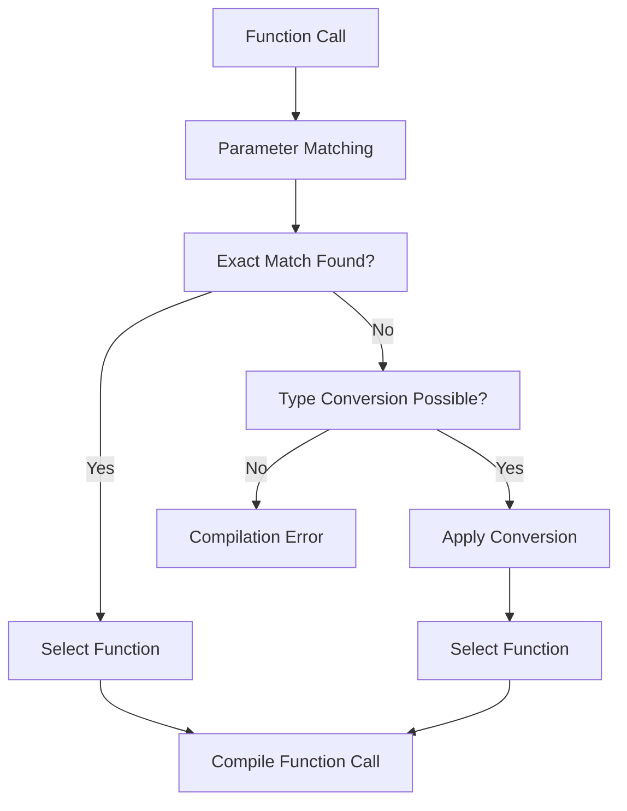
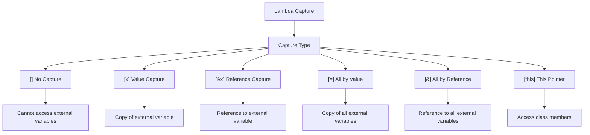
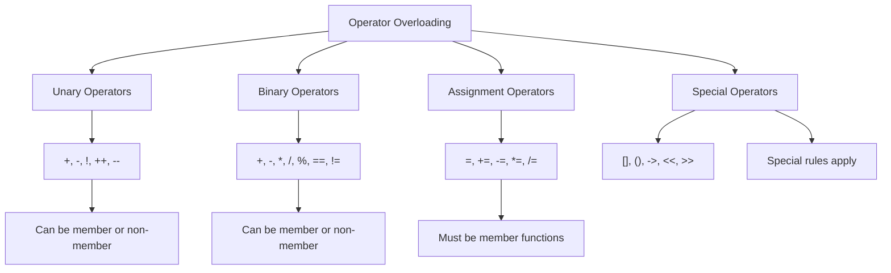

# Chapter 5: Functions (Interview Revision)

## Core Concepts

### Function Overloading
Same function name with different parameters (compile-time polymorphism)

```cpp
int add(int a, int b) {
    return a + b;
}

double add(double a, double b) {
    return a + b;
}

int add(int a, int b, int c) {
    return a + b + c;
}

// Ambiguous - won't compile
// float add(float a, float b) { }  // Similar to double
```

### Operator Overloading
Define custom behavior for operators with user-defined types

```cpp
class Complex {
private:
    double real, imag;
public:
    Complex(double r, double i) : real(r), imag(i) {}

    // Overload + operator
    Complex operator+(const Complex& other) {
        return Complex(real + other.real, imag + other.imag);
    }

    // Overload << operator for output
    friend ostream& operator<<(ostream& os, const Complex& c) {
        os << c.real << " + " << c.imag << "i";
        return os;
    }
};
```

### Lambda Functions (C++11)
Anonymous functions, useful for short operations

```cpp
// Basic lambda
auto add = [](int a, int b) { return a + b; };
int result = add(5, 3);  // result = 8

// Lambda with capture
int x = 10;
auto multiply = [x](int a) { return a * x; };
int result2 = multiply(3);  // result2 = 30

// Lambda with reference capture
int sum = 0;
std::vector<int> numbers = {1, 2, 3, 4, 5};
std::for_each(numbers.begin(), numbers.end(), [&sum](int n) {
    sum += n;
});
```

### Static Polymorphism (Compile-time)
Templates and function overloading enable static polymorphism

```cpp
template<typename T>
T max(T a, T b) {
    return (a > b) ? a : b;
}

// Compile-time resolution
int i = max(5, 3);        // Calls max<int>
double d = max(5.5, 3.2);  // Calls max<double>
```

## Function Concepts Visualization

### Function Overloading Resolution



### Lambda Capture Types



### Operator Overloading Categories



## Key Interview Points

### Function Overloading Rules
1. **Different parameter lists**: Different types or number of parameters
2. **Return type doesn't matter**: Can't overload based on return type only
3. **Default parameters**: Can cause ambiguity
4. **Const qualification**: Can overload based on const-ness

### Operator Overloading Rules
1. **Can't create new operators**: Only overload existing ones
2. **Can't change precedence**: Keep original operator precedence
3. **Arity must match**: Unary operators stay unary, binary stay binary
4. **Some operators must be members**: `=`, `()`, `[]`, `->`

### Lambda Features
- **Closure type**: Each lambda has unique type
- **Capture by value vs reference**: Performance implications
- **Mutable lambda**: Can modify captured values
- **Generic lambdas** (C++14): `auto` parameters

## Interview Questions

### Q1: What is the difference between function overloading and function overriding?
**Answer:**
- **Overloading**: Same name, different parameters, **compile-time** polymorphism
- **Overriding**: Same name, same parameters, **runtime** polymorphism (inheritance)

```cpp
// Function Overloading (Compile-time)
int add(int a, int b) { return a + b; }
double add(double a, double b) { return a + b; }

// Function Overriding (Runtime - Chapter 9)
class Base {
public:
    virtual void print() { cout << "Base"; }
};
class Derived : public Base {
public:
    void print() override { cout << "Derived"; }  // Overrides Base::print
};
```

### Q2: When should you use operator overloading?
**Answer:**
Use operator overloading when:
1. **Natural semantics**: `+` for addition, `==` for equality
2. **Domain-specific operations**: `+` for vector addition
3. **Making code intuitive**: `cout << object` instead of `object.print()`

**Avoid overloading when:**
- Operator meaning is unclear
- Operation is expensive but operator looks cheap
- Multiple meanings could cause confusion

```cpp
// Good: Natural meaning
Vector2D operator+(const Vector2D& a, const Vector2D& b);

// Bad: Unclear meaning
Matrix operator/(const Matrix& a, const Matrix& b);  // What does division mean?
```

### Q3: What are lambda captures and how do they work?
**Answer:**
Lambda captures allow lambdas to access variables from the surrounding scope:

```cpp
int x = 10, y = 20;

// Value capture - makes copy
auto lambda1 = [x](int a) { return a + x; };  // x = 10 even if original changes

// Reference capture - accesses original
auto lambda2 = [&y](int a) { y += a; };       // Modifies original y

// Mixed capture
auto lambda3 = [=, &y](int a) { return a + x + y; };  // x by value, y by reference

// Default capture
auto lambda4 = [=]() { return x + y; };        // All by value
auto lambda5 = [&]() { return x + y; };        // All by reference
```

### Q4: What is static polymorphism and how does it differ from dynamic polymorphism?
**Answer:**
**Static Polymorphism (Compile-time):**
- Achieved through templates and function overloading
- Resolved at compile time
- **No runtime overhead**
- **Type safety** - errors caught at compile time
- **Code bloat** - multiple copies generated

```cpp
template<typename T>
T add(T a, T b) { return a + b; }  // Static polymorphism
```

**Dynamic Polymorphism (Runtime):**
- Achieved through virtual functions and inheritance
- Resolved at runtime through vtable
- **Runtime overhead** (virtual function call)
- **Flexibility** - can add new types without recompilation
- **Single code path** - no template instantiation

```cpp
class Shape {
public:
    virtual double area() = 0;  // Dynamic polymorphism
};
```

## Practical Code Examples

### Complete Operator Overloading Example
```cpp
class Vector2D {
private:
    double x_, y_;
public:
    Vector2D(double x = 0, double y = 0) : x_(x), y_(y) {}

    // Arithmetic operators
    Vector2D operator+(const Vector2D& other) const {
        return Vector2D(x_ + other.x_, y_ + other.y_);
    }

    Vector2D operator-(const Vector2D& other) const {
        return Vector2D(x_ - other.x_, y_ - other.y_);
    }

    // Scalar multiplication
    Vector2D operator*(double scalar) const {
        return Vector2D(x_ * scalar, y_ * scalar);
    }

    // Comparison operators
    bool operator==(const Vector2D& other) const {
        return x_ == other.x_ && y_ == other.y_;
    }

    // Assignment operators
    Vector2D& operator+=(const Vector2D& other) {
        x_ += other.x_;
        y_ += other.y_;
        return *this;
    }

    // Subscript operator
    double& operator[](int index) {
        return (index == 0) ? x_ : y_;
    }

    const double& operator[](int index) const {
        return (index == 0) ? x_ : y_;
    }

    // Stream output operator (friend function)
    friend ostream& operator<<(ostream& os, const Vector2D& v) {
        os << "(" << v.x_ << ", " << v.y_ << ")";
        return os;
    }
};
```

### Advanced Lambda Examples
```cpp
// Generic lambda (C++14)
auto generic_add = [](auto a, auto b) { return a + b; };

// Mutable lambda - can modify captured values
int counter = 0;
auto increment = [counter]() mutable {
    return ++counter;  // Modifies local copy, not original
};

// Lambda as function parameter
void process_vector(const vector<int>& vec, function<bool(int)> predicate) {
    for (int val : vec) {
        if (predicate(val)) {
            cout << val << " ";
        }
    }
}

// Usage
vector<int> numbers = {1, 2, 3, 4, 5, 6};
process_vector(numbers, [](int n) { return n % 2 == 0; });  // Print even numbers
```

### Template Function Overloading
```cpp
// Template function
template<typename T>
void print(T value) {
    cout << "Generic: " << value << endl;
}

// Specialized overload for const char*
void print(const char* value) {
    cout << "String: " << value << endl;
}

// Overload for vectors
template<typename T>
void print(const vector<T>& vec) {
    cout << "Vector: [";
    for (const auto& item : vec) {
        cout << item << " ";
    }
    cout << "]" << endl;
}

// Usage
print(42);           // Generic: 42
print("Hello");      // String: Hello
print(vector<int>{1, 2, 3});  // Vector: [1 2 3 ]
```

## Common Mistakes & Solutions

### Mistake 1: Ambiguous function overloading
```cpp
// ❌ Problem: Ambiguous calls
void func(int) { }
void func(double) { }

func(3.14f);  // Error: ambiguous (float converts to int or double)

// ✅ Solution: Use explicit cast or overload for float
void func(float) { }  // Add float overload
func(3.14f);  // Now calls func(float)
```

### Mistake 2: Incorrect operator overloading
```cpp
// ❌ Problem: Wrong return type or signature
class Money {
public:
    int operator+(const Money& other) {  // Should return Money, not int
        return amount + other.amount;
    }
private:
    int amount;
};

// ✅ Solution: Correct operator overloading
class Money {
public:
    Money operator+(const Money& other) const {  // Return Money, const method
        return Money(amount + other.amount);
    }
private:
    int amount;
};
```

### Mistake 3: Lambda capture issues
```cpp
// ❌ Problem: Dangling reference
vector<function<int()>> functions;
for (int i = 0; i < 5; i++) {
    functions.push_back([&i]() { return i * 2; });  // Reference to i dies
}
// functions[0]() = undefined behavior

// ✅ Solution: Capture by value
vector<function<int()>> functions;
for (int i = 0; i < 5; i++) {
    functions.push_back([i]() { return i * 2; });  // Copy of i
}
```

### Mistake 4: Missing const in operator overloading
```cpp
// ❌ Problem: Can't use with const objects
class Point {
public:
    Point operator+(const Point& other) {  // Missing const
        return Point(x + other.x, y + other.y);
    }
};

void func(const Point& p1, const Point& p2) {
    Point p3 = p1 + p2;  // Error: p1 is const
}

// ✅ Solution: Add const
class Point {
public:
    Point operator+(const Point& other) const {  // const method
        return Point(x + other.x, y + other.y);
    }
};
```

## Performance Considerations

### Function Overloading vs Templates
```cpp
// Function Overloading - specific implementations
int max_int(int a, int b) { return (a > b) ? a : b; }
double max_double(double a, double b) { return (a > b) ? a : b; }

// Template - single implementation, multiple instantiations
template<typename T>
T max_template(T a, T b) { return (a > b) ? a : b; }

// Template has zero runtime overhead but can increase code size
```

### Lambda Performance
```cpp
// Lambda is essentially a functor with generated class
auto lambda = [](int x) { return x * 2; };
// Compiler generates something like:

class __lambda_123 {
public:
    int operator()(int x) const { return x * 2; }
};

// Performance: Same as regular function call (often inlined)
```

## Advanced Patterns

### Function Objects (Functors)
```cpp
class Multiply {
private:
    int factor_;
public:
    Multiply(int factor) : factor_(factor) {}

    int operator()(int x) const {
        return x * factor_;
    }
};

// Usage
Multiply multiply_by_3(3);
int result = multiply_by_3(5);  // result = 15

// Can be used with STL algorithms
vector<int> numbers = {1, 2, 3, 4, 5};
transform(numbers.begin(), numbers.end(), numbers.begin(), Multiply(2));
```

### Perfect Forwarding with Templates
```cpp
template<typename T>
void wrapper(T&& arg) {
    func(std::forward<T>(arg));  // Perfect forwarding
}

// Preserves value category (lvalue/rvalue) of arguments
int x = 10;
wrapper(x);      // Calls func(int&)
wrapper(10);     // Calls func(int&&)
```

## Quick Reference

### Function Overloading Rules
```cpp
// Valid overloads
void func(int);
void func(double);
void func(int, int);
void func(const string&);
void func(string&) const;  // Different const-ness

// Invalid overloads
// int func(int);  // Only return type different
```

### Operator Overloading Syntax
```cpp
// Member function
ReturnType operatorOp(const ParamType& param) const;

// Non-member function
ReturnType operatorOp(const Type1& lhs, const Type2& rhs);

// Friend function (for private access)
friend ReturnType operatorOp(const Type& lhs, const Type& rhs);
```

### Lambda Syntax Summary
```cpp
[captures](parameters) -> return_type {
    // body
}

// Examples:
[]() { }                    // No capture, no parameters
[x, y](int a) { return a + x + y; }  // Value capture
[&x, =y] { x = 5; }         // Mixed capture
[=]() { return x + y; }     // All by value
[&]() { return x + y; }     // All by reference
auto lambda = [](auto x) { return x * 2; };  // Generic lambda
```

## Final Interview Tips

1. **Know overloading vs overriding** - fundamental concept
2. **Understand operator overloading rules** - what can/can't be overloaded
3. **Master lambda captures** - value vs reference implications
4. **Explain static vs dynamic polymorphism** - compile-time vs runtime
5. **Remember const correctness** - essential for operator overloading
6. **Know template instantiation** - code generation vs runtime overhead

---

**Remember**: Functions are building blocks - understand how overloading, templates, and lambdas enable flexible, efficient code!