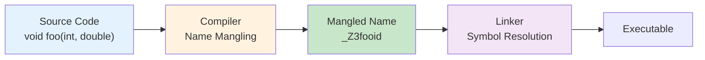

# Chapter 11: Language Concepts (Interview Revision)

## Core Concepts

### auto (Automatic Type Deduction)

#### Basic auto Usage
```cpp
// Simple type deduction
auto x = 42;        // int
auto y = 3.14;      // double
auto z = "hello";   // const char*

// With references
int value = 10;
auto& ref = value;  // int& (reference)
auto copy = value;  // int (copy)

// With pointers
int* ptr = &value;
auto ptr1 = ptr;      // int* (pointer)
auto* ptr2 = ptr;     // int* (explicit pointer)
auto& ptr3 = ptr;     // int*& (reference to pointer)
```

#### auto in Modern C++ (C++11/14/17/20)

| Feature | Version | Description | Example |
|---------|---------|-------------|---------|
| **auto variables** | C++11 | Type deduction for variables | `auto x = 42;` |
| **auto return type** | C++14 | Return type deduction | `auto add(int a, int b) { return a + b; }` |
| **auto parameters** | C++20 | Generic function parameters | `auto process(auto x) { return x * 2; }` |
| **structured bindings** | C++17 | Decompose structures | `auto [x, y] = getPoint();` |
| **const auto** | C++11 | Const deduced type | `const auto PI = 3.14;` |

#### auto Best Practices
```cpp
// ✅ Good: Clear benefits of auto
std::map<std::string, std::vector<int>> complexMap;
auto it = complexMap.find("key");  // Avoids typing long iterator type

// Lambda expressions
auto lambda = [](int x) { return x * 2; };

// Template programming
template<typename T, typename U>
auto add(T t, U u) -> decltype(t + u) {  // C++11 trailing return type
    return t + u;
}

// ❌ Avoid: auto reduces readability
auto x = getSomeValue();  // What type is x? Unclear

// ✅ Better: Be explicit when helpful
std::string result = processString();  // Clear type
```

### Type Casting

#### Cast Types Comparison

| Cast Type | Safety | Compile-time Check | Runtime Check | Use Case |
|-----------|--------|-------------------|---------------|----------|
| **static_cast** | Safe | Yes | No | Known type conversions |
| **dynamic_cast** | Safe | Yes | Yes | Polymorphic type casting |
| **const_cast** | Unsafe | Yes | No | Adding/removing const |
| **reinterpret_cast** | Unsafe | Yes | No | Bit-level reinterpretation |
| **C-style cast** | Unsafe | Limited | No | Avoid in modern C++ |

#### static_cast
```cpp
// Safe conversions between related types
double d = 3.14;
int i = static_cast<int>(d);  // i = 3, explicit conversion

// Class hierarchy casting
class Base {
public:
    virtual ~Base() = default;
};

class Derived : public Base {
public:
    void derivedMethod() {}
};

Base* base = new Derived();
Derived* derived = static_cast<Derived*>(base);  // Downcast (no runtime check)

// Enum conversions
enum Color { RED, GREEN, BLUE };
int colorValue = static_cast<int>(Color::RED);

// User-defined conversion operators
class Temperature {
private:
    double celsius;
public:
    explicit Temperature(double c) : celsius(c) {}

    operator double() const { return celsius; }  // Conversion to double
};

Temperature temp(25.0);
double celsius = static_cast<double>(temp);  // Explicit conversion
```

#### dynamic_cast
```cpp
// Safe polymorphic casting
class Animal {
public:
    virtual ~Animal() = default;
    virtual void makeSound() = 0;
};

class Dog : public Animal {
public:
    void makeSound() override { std::cout << "Woof!" << std::endl; }
    void wagTail() { std::cout << "Wagging tail" << std::endl; }
};

class Cat : public Animal {
public:
    void makeSound() override { std::cout << "Meow!" << std::endl; }
    void purr() { std::cout << "Purring" << std::endl; }
};

void processAnimal(Animal* animal) {
    // Safe downcasting with runtime check
    if (Dog* dog = dynamic_cast<Dog*>(animal)) {
        dog->wagTail();  // Safe: guaranteed to be Dog
    } else if (Cat* cat = dynamic_cast<Cat*>(animal)) {
        cat->purr();     // Safe: guaranteed to be Cat
    }

    // Reference version - throws std::bad_cast on failure
    try {
        Dog& dogRef = dynamic_cast<Dog&>(*animal);
        dogRef.wagTail();
    } catch (const std::bad_cast& e) {
        std::cout << "Not a Dog!" << std::endl;
    }
}
```

#### const_cast
```cpp
// Removing constness (use with caution)
void printString(const std::string& str) {
    // const_cast to call non-const method (last resort)
    const_cast<std::string&>(str).push_back('!');
    std::cout << str << std::endl;
}

// Adding constness (safer)
void processData(const char* data) {
    // Make data const for safety
    const char* constData = const_cast<const char*>(data);

    // Now can safely pass to functions expecting const
    safeFunction(constData);
}

class MutableData {
private:
    mutable int accessCount = 0;  // Can be modified in const methods

public:
    int getValue() const {
        ++accessCount;  // Allowed due to mutable
        return 42;
    }

    int getAccessCount() const { return accessCount; }
};
```

#### reinterpret_cast
```cpp
// Low-level bit reinterpretation (dangerous)
void demonstrateReinterpretCast() {
    int value = 0x12345678;

    // Reinterpret as bytes
    char* bytes = reinterpret_cast<char*>(&value);

    // Print individual bytes (endian-dependent)
    for (int i = 0; i < 4; i++) {
        std::cout << "Byte " << i << ": " << static_cast<int>(bytes[i]) << std::endl;
    }

    // Function pointer casting (very dangerous)
    using FuncType = void(*)();
    void someFunction() { std::cout << "Function called" << std::endl; }

    FuncType func = reinterpret_cast<FuncType>(someFunction);
    func();  // Dangerous but may work on some platforms
}

// Practical use: serialization
void serializeInt(int value, std::vector<char>& buffer) {
    char* bytes = reinterpret_cast<char*>(&value);
    buffer.insert(buffer.end(), bytes, bytes + sizeof(value));
}

int deserializeInt(const std::vector<char>& buffer, size_t offset) {
    int value;
    char* bytes = reinterpret_cast<char*>(&value);
    std::copy(buffer.begin() + offset, buffer.begin() + offset + sizeof(int), bytes);
    return value;
}
```

### Undefined Behavior (UB)

#### Common UB Scenarios

| Category | Example | Consequence |
|----------|---------|-------------|
| **Pointer Issues** | Dereferencing null pointer | Crash, undefined behavior |
| **Array Bounds** | Accessing out of bounds | Memory corruption, crash |
| **Uninitialized Variables** | Using uninitialized values | Garbage values, unpredictable behavior |
| **Data Races** | Concurrent access without synchronization | Race conditions, memory corruption |
| **Signed Overflow** | Integer overflow | Undefined results |
| **Strict Aliasing** | Incorrect pointer type access | Optimization issues |
| **Object Lifetime** | Use after free/return | Dangling references |

#### Undefined Behavior Examples
```cpp
// 1. Dereferencing null pointer
int* ptr = nullptr;
// *ptr = 42;  // ❌ UB - crash or undefined behavior

// 2. Array out of bounds
int arr[5];
// arr[10] = 42;  // ❌ UB - memory corruption

// 3. Uninitialized variables
int uninitialized;
// std::cout << uninitialized;  // ❌ UB - garbage value

// 4. Integer overflow (signed)
int max_int = INT_MAX;
// int overflow = max_int + 1;  // ❌ UB - signed overflow

// 5. Signed integer overflow in loops
int count = 0;
for (int i = 1000; i >= 0; i--) {
    count += i;  // ❌ UB when i becomes negative and overflows
}

// 6. Use after return
int* danglingFunction() {
    int local = 42;
    return &local;  // ❌ Returns address of local variable
}

int* dangling = danglingFunction();
// *dangling;  // ❌ UB - use after return

// 7. Strict aliasing violations
float f = 3.14f;
// int* ip = reinterpret_cast<int*>(&f);  // ❌ May break strict aliasing
// std::cout << *ip;  // ❌ UB

// ✅ Safe alternative for strict aliasing
std::memcpy(&f, &someInt, sizeof(f));  // OK - memcpy can alias anything
```

#### Preventing Undefined Behavior
```cpp
// Safe alternatives

// 1. Check pointers before dereferencing
void safePointerUse(int* ptr) {
    if (ptr != nullptr) {
        *ptr = 42;  // Safe
    }
}

// 2. Use std::array/std::vector with bounds checking
void safeArrayAccess() {
    std::vector<int> vec(5);

    // Safe access with bounds checking
    if (vec.size() > 10) {
        vec[10] = 42;  // Safe
    }

    // Or use at() which throws on out of bounds
    try {
        vec.at(10) = 42;  // Throws std::out_of_range
    }
    catch (const std::out_of_range& e) {
        std::cout << "Index out of range" << std::endl;
    }
}

// 3. Initialize variables
void safeInitialization() {
    int value = 0;  // Initialize to known value
    std::vector<int> vec(10, 0);  // Initialize with zeros

    std::cout << value;  // Safe - defined behavior
}

// 4. Use unsigned for modular arithmetic or check for overflow
void safeIntegerArithmetic() {
    unsigned int u = UINT_MAX;
    u++;  // OK - wraps to 0 (well-defined for unsigned)

    // For signed integers, check before operation
    int safe = INT_MAX;
    if (safe < INT_MAX - 1) {
        safe++;  // Safe - no overflow
    }
}

// 5. Use std::optional for values that may not exist
std::optional<int> divide(int a, int b) {
    if (b == 0) {
        return std::nullopt;  // No value
    }
    return a / b;  // Valid value
}

void safeDivision() {
    if (auto result = divide(10, 0)) {
        std::cout << "Result: " << *result << std::endl;
    } else {
        std::cout << "Cannot divide by zero" << std::endl;
    }
}
```

### Argument Dependent Lookup (ADL)

#### ADL Basics
```cpp
#include <iostream>
#include <string>

namespace MyNamespace {
    class MyClass {
    public:
        void print() { std::cout << "MyClass::print()" << std::endl; }
    };

    // Free function in same namespace
    void printFunction(const MyClass& obj) {
        std::cout << "MyNamespace::printFunction()" << std::endl;
    }
}

// Global function
void printFunction(int value) {
    std::cout << "Global::printFunction(" << value << ")" << std::endl;
}

void demonstrateADL() {
    MyNamespace::MyClass obj;
    int value = 42;

    // Explicit qualification
    MyNamespace::printFunction(obj);  // Calls MyNamespace::printFunction
    printFunction(value);              // Calls global printFunction

    // ADL - compiler finds function based on argument type
    printFunction(obj);  // ADL finds MyNamespace::printFunction
}

// ADL with operators
namespace Vector {
    struct Vec2D {
        double x, y;
    };

    // Operator defined in same namespace
    Vec2D operator+(const Vec2D& a, const Vec2D& b) {
        return {a.x + b.x, a.y + b.y};
    }

    std::ostream& operator<<(std::ostream& os, const Vec2D& v) {
        os << "(" << v.x << ", " << v.y << ")";
        return os;
    }
}

void demonstrateOperatorADL() {
    Vector::Vec2D v1 = {1.0, 2.0};
    Vector::Vec2D v2 = {3.0, 4.0};

    // ADL finds operators in Vector namespace
    Vector::Vec2D sum = v1 + v2;  // ADL finds Vector::operator+
    std::cout << sum << std::endl;  // ADL finds Vector::operator<<
}
```

#### ADL in Templates and Generic Code
```cpp
// Generic function using ADL
template<typename T>
void processGeneric(const T& obj) {
    // ADL will find begin/end based on argument type
    auto it = begin(obj);  // ADL finds custom begin() if it exists
    auto end_it = end(obj);  // ADL finds custom end() if it exists

    for (; it != end_it; ++it) {
        std::cout << *it << " ";
    }
    std::cout << std::endl;
}

// Custom container with custom begin/end
namespace MyContainer {
    struct MyArray {
        int data[5];

        int* begin() { return data; }
        int* end() { return data + 5; }
    };
}

void demonstrateGenericADL() {
    std::vector<int> vec = {1, 2, 3};
    MyContainer::MyArray arr = {{10, 20, 30, 40, 50}};

    processGeneric(vec);  // Uses std::begin/std::end
    processGeneric(arr);  // Uses MyContainer::begin/end via ADL
}

// ADL can sometimes cause unexpected behavior
namespace Problematic {
    struct MyType {};

    void swap(MyType& a, MyType& b) {
        std::cout << "Problematic::swap called" << std::endl;
    }
}

// Using std::swap can interfere with ADL
template<typename T>
void problematicSwap(T& a, T& b) {
    using std::swap;  // Bring std::swap into scope
    swap(a, b);  // Might call Problematic::swap via ADL or std::swap
}
```

### Naming Mangling

#### Name Mangling Process



#### Name Mangling Examples
```cpp
// Different function signatures produce different mangled names

extern "C" {
    // No name mangling - C linkage
    void c_function(int param);
}

// C++ name mangling
void foo();                          // _Z3foov
void foo(int);                       // _Z3fooi
void foo(double);                    // _Z3food
void foo(int, double);               // _Z3fooid

// Class member functions
class MyClass {
public:
    void method();                   // _ZN7MyClass6methodEv
    void method(int);                // _ZN7MyClass6methodEi
    static void staticMethod();      // _ZN7MyClass12staticMethodEv
};

// Templates
template<typename T>
void templateFunction(T param);      // _Z16templateFunctionIiEvT_

// Specializations
template<> void templateFunction<int>(int param);  // _Z16templateFunctionIiEv

// Namespaces
namespace MyNamespace {
    void function();                 // _ZN11MyNamespace8functionEv
}
```

#### Extern "C" and Name Mangling
```cpp
// C functions have no name mangling
extern "C" {
    int c_add(int a, int b);        // _c_add (simple name)
    void c_print(const char* msg);   // _c_print
}

// C++ functions are name-mangled
int cpp_add(int a, int b);          // _Z6cpp_addii

// Calling C from C++
extern "C" {
    int c_library_function(int param);
}

void callCFromCpp() {
    int result = c_library_function(42);  // No name mangling issues
}

// Calling C++ from C
extern "C" {
    // C callable wrapper for C++ function
    int cpp_wrapper_for_c(int param) {
        return cppFunction(param);  // Call actual C++ function
    }
}

// Name mangling and templates
template<typename T>
class TemplateClass {
public:
    T getValue();
    void setValue(T value);
};

// Different instantiations create different mangled names
TemplateClass<int> intObj;     // Uses _ZN13TemplateClassIiE8getValueEv
TemplateClass<double> doubleObj;  // Uses _ZN13TemplateClassIdE8getValueEv
```

### Macros

#### Macro Basics and Pitfalls
```cpp
// Simple macros
#define PI 3.14159
#define MAX(a, b) ((a) > (b) ? (a) : (b))

// Function-like macros
#define SQUARE(x) ((x) * (x))

// ❌ Macro pitfalls
#define BAD_MAX(a, b) a > b ? a : b  // Missing parentheses
int result = BAD_MAX(2 + 3, 4 + 5);  // Expands to: 2 + 3 > 4 + 5 ? 2 + 3 : 4 + 5
// Evaluates as: 5 > 9 ? 5 : 9 = 9 (wrong!)

// ✅ Correct macro
#define GOOD_MAX(a, b) ((a) > (b) ? (a) : (b))
int result2 = GOOD_MAX(2 + 3, 4 + 5);  // ((2 + 3) > (4 + 5) ? (2 + 3) : (4 + 5)) = 9 (correct!)

// ❌ Multiple evaluation danger
#define BAD_SQUARE(x) (x * x)
int result3 = BAD_SQUARE(++i);  // Expands to: (++i * ++i) - undefined behavior!

// ✅ Safe macro (but still prefer inline function)
#define SAFE_SQUARE(x) ({ \
    typeof(x) _x = (x); \
    _x * _x; \
})

// Better: Use inline function or template
template<typename T>
inline T safeSquare(T x) {
    return x * x;
}
```

#### Advanced Macro Techniques
```cpp
// Stringification
#define STRINGIFY(x) #x
#define TOSTRING(x) STRINGIFY(x)

std::string version = TOSTRING(VERSION_MAJOR.VERSION_MINOR);  // "1.2"

// Token pasting
#define CONCAT(a, b) a ## b
int CONCAT(var, 1) = 42;  // Creates int var1 = 42;

// Variadic macros (C++11)
#define LOG(fmt, ...) printf(fmt "\n", ##__VA_ARGS__)

LOG("Hello %s", "world");    // printf("Hello %s\n", "world")
LOG("Just a message");       // printf("Just a message\n")

// Conditional compilation
#ifdef DEBUG
    #define DBG_LOG(fmt, ...) printf("[DEBUG] " fmt "\n", ##__VA_ARGS__)
#else
    #define DBG_LOG(fmt, ...) // Does nothing
#endif

// Macro tricks for code generation
#define FOREACH_ITEM(item) \
    process(item);

#define PROCESS_LIST(list) \
    list(FOREACH_ITEM)

PROCESS_LIST(
    (item1) \
    (item2) \
    (item3)
)

// Expands to:
// process(item1);
// process(item2);
// process(item3);

// X-macros for maintaining lists
#define COLORS \
    X(RED, "#FF0000") \
    X(GREEN, "#00FF00") \
    X(BLUE, "#0000FF")

enum Color {
    #define X(name, hex) name,
    COLORS
    #undef X
    COLOR_COUNT
};

const char* colorNames[] = {
    #define X(name, hex) #name,
    COLORS
    #undef X
};

const char* colorHex[] = {
    #define X(name, hex) hex,
    COLORS
    #undef X
};
```

## Key Interview Points

### Modern C++ Type Deduction
```cpp
// auto type deduction rules
const int constVal = 42;
auto a1 = constVal;     // int (const is dropped)
auto& a2 = constVal;    // const int& (reference preserves const)
const auto a3 = constVal; // const int (explicit const)
auto* a4 = &constVal;   // const int* (pointer to const)

// decltype type deduction
int x = 5;
decltype(x) y = 10;      // int
decltype((x)) z = 15;    // int& (reference due to parentheses)

// C++14 return type deduction
auto add(int a, int b) {  // Return type deduced as int
    return a + b;
}

// C++20 concepts and auto parameters
template<typename T>
concept Numeric = std::is_arithmetic_v<T>;

auto multiply(Numeric auto a, Numeric auto b) {
    return a * b;
}
```

### Type Safety and Casting
- **Prefer static_cast** for known safe conversions
- **Use dynamic_cast** for polymorphic type checking
- **Avoid const_cast** unless absolutely necessary
- **Never use reinterpret_cast** unless you know exactly what you're doing
- **C-style casts** should be avoided in modern C++

### Undefined Behavior Prevention
- **Initialize variables** before use
- **Check array bounds** or use safe containers
- **Use smart pointers** to prevent dangling pointers
- **Be careful with signed integer arithmetic**
- **Understand object lifetime** rules

## Interview Questions

### Q1: What is the difference between auto and decltype?
**Answer:**
**auto type deduction:**
- **Drops const/volatile qualifiers** (unless using auto& or const auto)
- **Drops references** (unless using auto&)
- **Top-level const** is removed
- **Template-like deduction** rules

```cpp
const int const_val = 42;
const int& ref = const_val;

auto a1 = const_val;     // int (const dropped)
auto a2 = ref;          // int (reference and const dropped)
auto& a3 = const_val;    // const int& (reference preserves const)
const auto a4 = const_val; // const int (explicit const)
auto* a5 = &const_val;   // const int* (pointer preserves const)
```

**decltype type deduction:**
- **Preserves all qualifiers** exactly as the expression
- **Preserves references** when expression is an lvalue
- **Exact type replication**
- **Parentheses matter**: `decltype(var)` vs `decltype((var))`

```cpp
int x = 5;
const int& ref = x;

decltype(x) y1 = 10;       // int
decltype(ref) y2 = y1;     // const int&
decltype((x)) y3 = x;      // int& (expression is lvalue)
decltype((ref)) y4 = ref;  // const int& (expression is lvalue)

// Practical difference in function return types
auto autoFunc() { return 42; }     // Return type is int
decltype(auto) decltypeFunc() { return 42; }  // Return type is int

int& getRef() { static int x = 42; return x; }
auto autoFromRef() { return getRef(); }      // Returns int (copies)
decltype(auto) decltypeFromRef() { return getRef(); }  // Returns int& (reference)
```

### Q2: What is Argument Dependent Lookup (ADL) and why is it important?
**Answer:**
**Argument Dependent Lookup (ADL)**, also called Koenig lookup, is a C++ mechanism where function lookup considers the namespaces of function arguments in addition to the current scope.

**How ADL works:**
1. **Normal unqualified lookup** in current scope
2. **ADL lookup** in namespaces of function arguments
3. **Both sets of candidates** are considered for overload resolution

```cpp
namespace Graphics {
    struct Point {
        double x, y;
    };

    void draw(const Point& p) {  // Function in same namespace as Point
        std::cout << "Drawing point (" << p.x << ", " << p.y << ")" << std::endl;
    }
}

void demonstrateADL() {
    Graphics::Point p = {3.14, 2.71};

    // ADL finds Graphics::draw because argument is Graphics::Point
    draw(p);  // Calls Graphics::draw via ADL
}

// Critical for operator overloading
namespace Math {
    struct Vector {
        double x, y;
    };

    Vector operator+(const Vector& a, const Vector& b) {
        return {a.x + b.x, a.y + b.y};
    }
}

void demonstrateOperatorADL() {
    Math::Vector v1 = {1, 2};
    Math::Vector v2 = {3, 4};

    // ADL finds Math::operator+ for Vector arguments
    Math::Vector sum = v1 + v2;  // Works because of ADL
}
```

**Why ADL is important:**
1. **Operator overloading**: Makes `a + b` work for user-defined types
2. **Generic programming**: Enables `swap(a, b)` to find custom swap functions
3. **Range-based for loops**: Allows `begin(container)` to find custom begin functions
4. **STL algorithms**: Makes `std::sort(container.begin(), container.end())` work

```cpp
// ADL enables swap idiom
template<typename T>
void genericSwap(T& a, T& b) {
    using std::swap;  // Bring std::swap into scope
    swap(a, b);      // ADL finds best swap: custom swap or std::swap
}

// Custom container with custom begin/end for range-based for
namespace MyContainer {
    class MyRange {
        int* data;
        size_t size;
    public:
        int* begin() { return data; }    // Found by ADL
        int* end() { return data + size; }  // Found by ADL
    };
}

void useRangeBasedFor() {
    MyContainer::MyRange range;

    // Range-based for loop uses ADL to find begin/end
    for (int value : range) {  // ADL finds MyContainer::begin/end
        std::cout << value << " ";
    }
}
```

### Q3: What is undefined behavior and why is it dangerous?
**Answer:**
**Undefined Behavior (UB)** occurs when program executes code whose behavior is not defined by the C++ standard. The compiler is free to do anything: crash, work correctly, or appear to work but fail later.

**Why UB is dangerous:**
1. **No guarantees**: Compiler can assume UB never happens
2. **Optimization surprises**: Compiler may optimize based on UB-free assumption
3. **Security vulnerabilities**: UB can lead to exploits
4. **Hard to debug**: Behavior may change with different compilers/optimizations

```cpp
// Examples of dangerous undefined behavior

// 1. Signed integer overflow
int safe_multiply(int a, int b) {
    // ❌ UB if a * b overflows
    return a * b;
}

// ✅ Safe version
int safe_multiply_safe(int a, int b) {
    if (a > 0 && b > 0 && a > INT_MAX / b) {
        throw std::overflow_error("Integer overflow");
    }
    return a * b;
}

// 2. Uninitialized variables
void use_uninitialized() {
    int x;  // ❌ Uninitialized
    if (x > 0) {  // ❌ UB - reading uninitialized value
        std::cout << "Positive" << std::endl;
    }
}

// ✅ Always initialize
void always_initialize() {
    int x = 0;  // ✅ Initialized
    if (x > 0) {
        std::cout << "Positive" << std::endl;
    }
}

// 3. Out of bounds access
void buffer_overflow() {
    int arr[10];
    // ❌ UB - out of bounds access
    arr[15] = 42;
}

// ✅ Bounds checking
void safe_array_access() {
    std::vector<int> arr(10);

    if (arr.size() > 15) {  // ✅ Bounds check
        arr[15] = 42;
    }

    // Or use at() which throws
    try {
        arr.at(15) = 42;  // ✅ Throws if out of bounds
    } catch (const std::out_of_range&) {
        std::cout << "Index out of range" << std::endl;
    }
}

// 4. Dangling pointers
int* dangling_pointer() {
    int local = 42;
    return &local;  // ❌ Returns address of local variable
}

void use_dangling() {
    int* ptr = dangling_pointer();
    std::cout << *ptr << std::endl;  // ❌ UB - use after return
}

// ✅ Use static or dynamic allocation
int* safe_pointer() {
    static int persistent = 42;  // ✅ Static storage duration
    return &persistent;
}

// ✅ Or return by value, smart pointer
std::unique_ptr<int> modern_safe() {
    return std::make_unique<int>(42);  // ✅ RAII managed
}
```

**Compiler optimizations based on UB:**
```cpp
// This function can be optimized to always return true
bool checkNull(int* ptr) {
    if (ptr == nullptr) {
        return false;
    }
    *ptr = 42;  // If ptr is null, this is UB
    return true;  // Compiler assumes ptr is never null
}

// Compiler might optimize this to:
bool checkNull_optimized(int* ptr) {
    (void)ptr;  // Suppress unused parameter warning
    return true;  // Always returns true!
}
```

### Q4: What is name mangling and why is it necessary?
**Answer:**
**Name mangling** is a compiler technique that encodes function and variable names with additional information about their types, namespaces, and parameters to enable function overloading and prevent naming conflicts.

**Why name mangling is necessary:**
1. **Function overloading**: Distinguish between overloaded functions
2. **Namespace support**: Prevent conflicts between same names in different namespaces
3. **Template support**: Generate unique names for template instantiations
4. **Type safety**: Ensure correct linking based on exact types
5. **C++ features**: Support classes, namespaces, templates, etc.

```cpp
// Example of why mangling is needed
void foo();              // Function 1
void foo(int);           // Function 2
void foo(double);        // Function 3

class MyClass {
public:
    void foo();          // Member function
    static void foo();   // Static member function
};

namespace MyNamespace {
    void foo();          // Namespaced function
}

// Without mangling, all would have the same name "_foo"
// With mangling (simplified):
// foo() -> _Z3foov
// foo(int) -> _Z3fooi
// foo(double) -> _Z3food
// MyClass::foo() -> _ZN7MyClass3fooEv
// MyClass::static_foo() -> _ZN7MyClass10static_fooEv
// MyNamespace::foo() -> _ZN11MyNamespace3fooEv
```

**Practical examples:**
```cpp
// C linkage vs C++ linkage
extern "C" {
    // No name mangling - can be called from C
    int c_function(int param);  // Symbol: c_function
}

int cpp_function(int param);   // Symbol: _Z12cpp_functioni (mangled)

// Mixing C and C++ code
// C header (c_library.h)
#ifdef __cplusplus
extern "C" {
#endif
int c_api_function(int param);
#ifdef __cplusplus
}
#endif

// C++ source calling C function
extern "C" int c_api_function(int param);  // No mangling

void callCFromCpp() {
    int result = c_api_function(42);  // Works because no mangling
}

// Template mangling
template<typename T>
class TemplateClass {
public:
    T getValue();
};

// Different instantiations create different mangled names
TemplateClass<int> intObj;     // Uses symbols like _ZN13TemplateClassIiE8getValueEv
TemplateClass<double> doubleObj;  // Uses symbols like _ZN13TemplateClassIdE8getValueEv

// Name mangling and linking
// File1.cpp
void function(int x) {
    std::cout << "function(int): " << x << std::endl;
}

// File2.cpp
void function(double x) {
    std::cout << "function(double): " << x << std::endl;
}

// Both compile and link correctly because of different mangled names
```

**Viewing mangled names:**
```bash
# Use nm or objdump to see mangled names
nm object_file.o | c++filt  # Demangle names
nm -C object_file.o         # Demangle automatically

# Example output:
# 0000000000000000 T _Z8functioni  -> function(int)
# 0000000000000010 T _Z8functiond  -> function(double)
```

**Name mangling and templates:**
```cpp
// Template functions are mangled based on template arguments
template<typename T>
T max(T a, T b) {
    return (a > b) ? a : b;
}

// Different instantiations:
int i = max(3, 5);        // Uses _Z3maxIiET_S0_ (max<int>)
double d = max(3.14, 2.71); // Uses _Z3maxIdET_S0_ (max<double>)

// This allows linking different template instantiations without conflicts
```

## Practical Code Examples

### Complete Type Safety Demonstration
```cpp
#include <iostream>
#include <type_traits>
#include <memory>
#include <vector>

class TypeSafetyDemo {
public:
    // Demonstrate auto vs decltype differences
    static void autoVsDecltype() {
        const int const_val = 42;
        const int& ref = const_val;

        auto a1 = const_val;     // int (const dropped)
        auto& a2 = const_val;    // const int& (reference preserves const)
        const auto a3 = const_val; // const int (explicit const)

        decltype(const_val) d1 = 10;      // int (top-level const dropped)
        decltype(ref) d2 = d1;            // const int& (reference preserves const)
        decltype((const_val)) d3 = const_val; // const int& (parentheses add reference)

        std::cout << "auto vs decltype demonstration completed" << std::endl;
    }

    // Safe type casting
    static void safeCasting() {
        // Numeric types
        double pi = 3.14159;
        int int_pi = static_cast<int>(pi);  // Safe explicit conversion

        // Class hierarchy with runtime checking
        class Animal {
        public:
            virtual ~Animal() = default;
            virtual void speak() = 0;
        };

        class Dog : public Animal {
        public:
            void speak() override { std::cout << "Woof!" << std::endl; }
            void fetch() { std::cout << "Fetching!" << std::endl; }
        };

        std::unique_ptr<Animal> animal = std::make_unique<Dog>();

        // Safe downcasting with runtime check
        if (Dog* dog = dynamic_cast<Dog*>(animal.get())) {
            dog->fetch();  // Safe: guaranteed to be Dog
        }

        // Safe upcasting (implicit)
        Animal* animal_ptr = dog;  // Always safe
    }

    // Prevent undefined behavior
    static void preventUB() {
        // Always initialize
        int initialized = 0;

        // Safe array access
        std::vector<int> safe_vector(10);
        if (safe_vector.size() > 5) {
            safe_vector[5] = 42;  // Bounds checked
        }

        // Safe pointer usage
        auto safe_ptr = std::make_unique<int>(42);
        if (safe_ptr) {
            std::cout << *safe_ptr << std::endl;  // Safe dereference
        }

        // Safe integer arithmetic
        int a = 1000, b = 2000;
        if (a > 0 && b > 0 && a < INT_MAX / b) {
            int product = a * b;  // Safe from overflow
            std::cout << "Product: " << product << std::endl;
        }
    }
};

// ADL demonstration
namespace Geometry {
    struct Point {
        double x, y;

        Point(double x_val, double y_val) : x(x_val), y(y_val) {}
    };

    // Function found via ADL
    double distance(const Point& p1, const Point& p2) {
        double dx = p1.x - p2.x;
        double dy = p1.y - p2.y;
        return sqrt(dx * dx + dy * dy);
    }

    // Operator found via ADL
    Point operator+(const Point& p1, const Point& p2) {
        return Point(p1.x + p2.x, p1.y + p2.y);
    }

    std::ostream& operator<<(std::ostream& os, const Point& p) {
        os << "(" << p.x << ", " << p.y << ")";
        return os;
    }
}

void demonstrateADL() {
    using Geometry::Point;

    Point p1(1.0, 2.0);
    Point p2(4.0, 6.0);

    // ADL finds Geometry::distance
    double dist = distance(p1, p2);  // Found via ADL

    // ADL finds Geometry::operator+
    Point sum = p1 + p2;  // Found via ADL

    // ADL finds Geometry::operator<<
    std::cout << "Points: " << p1 << " + " << p2 << " = " << sum << std::endl;
    std::cout << "Distance: " << dist << std::endl;
}

// Macro demonstration with safety
#define SAFE_MAX(a, b) ((a) > (b) ? (a) : (b))
#define SQUARE(x) ({ \
    typeof(x) _x = (x); \
    _x * _x; \
})

#define LOG_INFO(fmt, ...) \
    std::cout << "[INFO] " << fmt << std::endl

void demonstrateMacros() {
    int x = 5, y = 10;

    // Safe macro usage
    int max_val = SAFE_MAX(x + 3, y * 2);  // (x + 3) > (y * 2) ? (x + 3) : (y * 2)
    std::cout << "Max value: " << max_val << std::endl;

    // Safe square macro (no multiple evaluation)
    int square_val = SQUARE(++x);  // Safe: ++x only evaluated once
    std::cout << "Square: " << square_val << std::endl;

    // Logging macro
    LOG_INFO("Program executed successfully");
}

int main() {
    TypeSafetyDemo::autoVsDecltype();
    TypeSafetyDemo::safeCasting();
    TypeSafetyDemo::preventUB();

    demonstrateADL();
    demonstrateMacros();

    return 0;
}
```

## Common Mistakes & Solutions

### Mistake 1: Auto type deduction issues
```cpp
// ❌ Problem: auto drops const and references
const std::string str = "hello";
auto s1 = str;  // s1 is std::string (copied)
auto& s2 = str; // s2 is const std::string& (reference to const)

// ✅ Solution: Use appropriate auto form
const auto& s3 = str;  // const std::string& (best for const objects)
auto& s4 = str;        // const std::string& (reference)
auto s5 = str;         // std::string (copy when modification is needed)
```

### Mistake 2: Unsafe casting
```cpp
// ❌ Problem: Using C-style casts
Base* base = new Base();
Derived* derived = (Derived*)base;  // Unsafe, no runtime check

// ✅ Solution: Use appropriate C++ cast
Derived* safe_derived = dynamic_cast<Derived*>(base);  // Safe with runtime check
if (safe_derived) {
    // Only use if cast succeeded
}
```

### Mistake 3: Undefined behavior with signed integers
```cpp
// ❌ Problem: Signed integer overflow
int result = INT_MAX + 1;  // UB!

// ✅ Solution: Check for overflow or use unsigned
if (INT_MAX > 0 && INT_MAX < INT_MAX - 1) {
    int result = INT_MAX + 1;  // Safe
}

// Or use unsigned for modular arithmetic
unsigned int u_result = UINT_MAX + 1;  // Well-defined: wraps to 0
```

### Mistake 4: Macro pitfalls
```cpp
// ❌ Problem: Multiple evaluation
#define BAD_SQUARE(x) (x * x)
int i = 5;
int result = BAD_SQUARE(++i);  // (++i * ++i) - UB!

// ✅ Solution: Use inline functions or templates
template<typename T>
inline T safeSquare(T x) {
    return x * x;
}

// Or safe macro with GNU extension
#define SAFE_SQUARE(x) ({ typeof(x) _x = (x); _x * _x; })
```

## Performance Considerations

### Type Deduction Performance
```cpp
// auto and template type deduction have zero runtime cost
// All work is done at compile time

template<typename T>
void process(T value) {
    // Type T is fixed at compile time based on argument
    // No runtime overhead for type deduction
}

// auto variables also have no runtime cost
auto x = some_function();  // Type determined at compile time
```

### Casting Performance
```cpp
// static_cast: Compile-time only (no runtime cost for most conversions)
int i = static_cast<int>(3.14);  // Zero runtime cost

// dynamic_cast: Runtime check (has overhead)
Base* base = new Derived();
Derived* derived = dynamic_cast<Derived*>(base);  // Runtime type check

// reinterpret_cast: Compile-time only (no runtime cost)
int* ptr = reinterpret_cast<int*>(some_address);  // Zero runtime cost

// const_cast: Compile-time only (no runtime cost)
const int* const_ptr = &value;
int* mutable_ptr = const_cast<int*>(const_ptr);  // Zero runtime cost
```

## Quick Reference

### Auto Type Deduction Rules
```cpp
const int const_val = 42;
const int& ref = const_val;

auto a1 = const_val;     // int (top-level const dropped)
auto& a2 = const_val;    // const int& (reference preserves const)
const auto a3 = const_val; // const int (explicit const)
auto* a4 = &const_val;   // const int* (pointer preserves const)
```

### Cast Type Selection Guide
```cpp
// Use static_cast for known safe conversions
double d = 3.14;
int i = static_cast<int>(d);

// Use dynamic_cast for polymorphic type checking
Base* base = getBase();
Derived* derived = dynamic_cast<Derived*>(base);

// Use const_cast only when necessary (last resort)
const std::string& str_ref = getString();
std::string& mutable_ref = const_cast<std::string&>(str_ref);

// Avoid reinterpret_cast unless absolutely necessary
// Avoid C-style casts in modern C++
```

### Undefined Behavior Prevention Checklist
```cpp
// ✅ Initialize all variables
int value = 0;

// ✅ Check array bounds
std::vector<int> vec;
if (index < vec.size()) {
    vec[index] = value;
}

// ✅ Check pointers before dereferencing
if (ptr != nullptr) {
    *ptr = value;
}

// ✅ Use unsigned for modular arithmetic or check for overflow
unsigned int u = UINT_MAX;
u++;  // Well-defined wraps to 0

// ✅ Use smart pointers for automatic memory management
std::unique_ptr<int> smart_ptr = std::make_unique<int>(42);
```

## Final Interview Tips

1. **auto vs decltype**: Understand the subtle differences in type deduction
2. **ADL importance**: Critical for operator overloading and generic programming
3. **UB awareness**: Know common UB scenarios and how to avoid them
4. **Modern casting**: Prefer C++ casts over C-style casts
5. **Name mangling**: Understand why it's necessary for C++ features
6. **Macro safety**: Know macro pitfalls and prefer modern alternatives
7. **Type safety**: Leverage C++ type system to prevent errors at compile time

---

**Remember: Understanding these language concepts is crucial for writing safe, efficient, and maintainable C++ code!