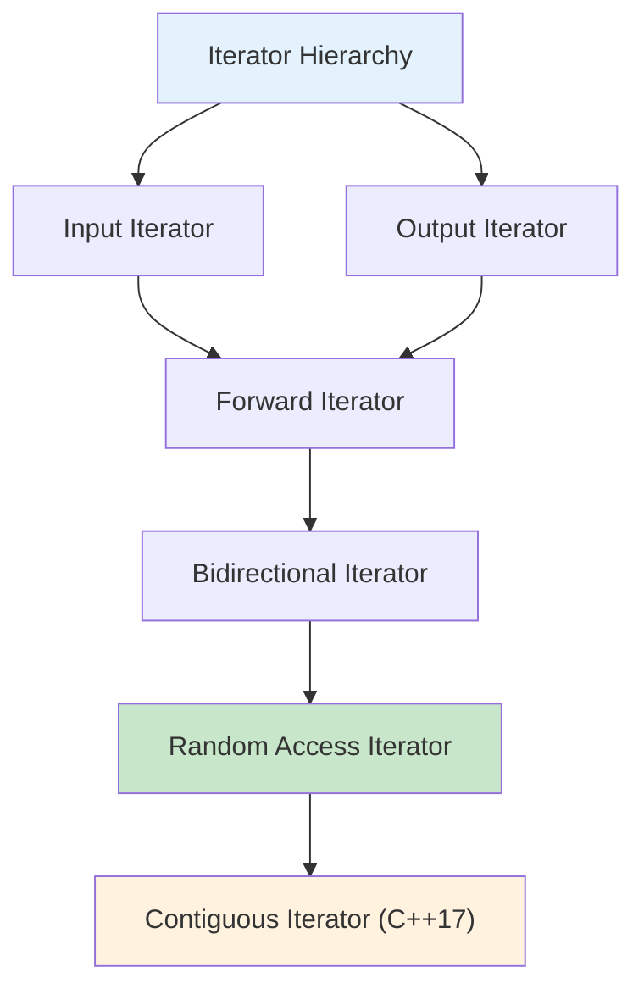

# Chapter 12: Standard Library + STL (Interview Revision)

## Core Concepts

### STL Container Overview

| Container Type | Category | Time Complexity | Memory Layout | Use Case |
|----------------|----------|-----------------|---------------|----------|
| **std::vector** | Sequence | Random: O(1)<br>Insert/End: O(1)<br>Insert/Mid: O(n) | Contiguous | General purpose, random access |
| **std::deque** | Sequence | Random: O(1)<br>Insert/End: O(1)<br>Insert/Mid: O(n) | Chunked | Fast insertion at both ends |
| **std::list** | Sequence | Random: O(n)<br>Insert/Any: O(1) | Doubly-linked | Frequent insertions/deletions |
| **std::forward_list** | Sequence | Random: O(n)<br>Insert/Any: O(1) | Singly-linked | Memory efficient list |
| **std::array** | Sequence | Fixed size | Contiguous | Fixed-size arrays |
| **std::string** | Sequence | Random: O(1)<br>Insert/End: O(1)<br>Insert/Mid: O(n) | Contiguous | Text manipulation |
| **std::map** | Associative | Random: O(log n)<br>Insert: O(log n) | Tree-based | Key-value pairs, sorted |
| **std::unordered_map** | Associative | Random: O(1) avg<br>Insert: O(1) avg | Hash table | Fast key-value lookup |
| **std::set** | Associative | Random: O(log n)<br>Insert: O(log n) | Tree-based | Unique elements, sorted |
| **std::unordered_set** | Associative | Random: O(1) avg<br>Insert: O(1) avg | Hash table | Fast unique elements |
| **std::priority_queue** | Container | Top: O(1)<br>Push: O(log n)<br>Pop: O(log n) | Heap-based | Priority ordering |
| **std::stack** | Container | Top: O(1)<br>Push: O(1)<br>Pop: O(1) | Adapter | LIFO operations |
| **std::queue** | Container | Front: O(1)<br>Push: O(1)<br>Pop: O(1) | Adapter | FIFO operations |

### Iterators

#### Iterator Categories



#### Iterator Examples
```cpp
#include <vector>
#include <list>
#include <map>
#include <iostream>

void demonstrateIterators() {
    // Vector iterators (Random Access)
    std::vector<int> vec = {1, 2, 3, 4, 5};

    // Iterator types
    std::vector<int>::iterator it = vec.begin();        // Mutable iterator
    std::vector<int>::const_iterator cit = vec.cbegin(); // Const iterator
    std::vector<int>::reverse_iterator rit = vec.rbegin(); // Reverse iterator

    // Random access operations
    std::cout << "Third element: " << it[2] << std::endl;  // Direct access
    std::cout << "Distance: " << (vec.end() - vec.begin()) << std::endl;

    // List iterators (Bidirectional)
    std::list<std::string> list = {"apple", "banana", "cherry"};
    auto list_it = list.begin();

    // Only bidirectional operations
    ++list_it;        // Forward
    --list_it;        // Backward
    // list_it[1];    // ❌ No random access

    // Map iterators (Bidirectional)
    std::map<std::string, int> ages = {
        {"Alice", 30},
        {"Bob", 25},
        {"Charlie", 35}
    };

    for (auto map_it = ages.begin(); map_it != ages.end(); ++map_it) {
        std::cout << map_it->first << ": " << map_it->second << std::endl;
    }
}

// Iterator invalidation examples
void demonstrateInvalidation() {
    std::vector<int> vec = {1, 2, 3, 4, 5};

    // Safe iteration
    for (auto it = vec.begin(); it != vec.end(); ++it) {
        if (*it == 3) {
            it = vec.insert(it, 99);  // Insert before current element
            ++it;  // Skip inserted element
        }
    }

    // Dangerous: modifying during range-based for
    // for (int val : vec) {
    //     if (val == 2) {
    //         vec.push_back(99);  // ❌ May invalidate iterators
    //     }
    // }

    // Safe: use index or while loop
    for (size_t i = 0; i < vec.size(); ++i) {
        if (vec[i] == 2) {
            vec.push_back(99);  // Safe
        }
    }
}
```

### iostream Library

#### Stream Classes

| Stream Class | Direction | Purpose | Default Buffer |
|--------------|-----------|---------|----------------|
| **std::istream** | Input | Read operations | Unbuffered |
| **std::ostream** | Output | Write operations | Unbuffered |
| **std::iostream** | Both | Input and output | Unbuffered |
| **std::ifstream** | Input | File input | File buffer |
| **std::ofstream** | Output | File output | File buffer |
| **std::fstream** | Both | File input/output | File buffer |
| **std::stringstream** | Both | String I/O | String buffer |

#### Stream Manipulation
```cpp
#include <iostream>
#include <fstream>
#include <sstream>
#include <iomanip>
#include <limits>

void demonstrateStreamBasics() {
    // Basic input/output
    std::string name;
    int age;

    std::cout << "Enter your name: ";
    std::getline(std::cin, name);

    std::cout << "Enter your age: ";
    std::cin >> age;

    // Clear input buffer
    std::cin.ignore(std::numeric_limits<std::streamsize>::max(), '\n');

    std::cout << "Hello " << name << ", you are " << age << " years old!" << std::endl;
}

void demonstrateStreamFormatting() {
    double pi = 3.14159265359;

    // Formatting options
    std::cout << std::fixed << std::setprecision(2);
    std::cout << "PI: " << pi << std::endl;  // PI: 3.14

    std::cout << std::scientific << std::setprecision(3);
    std::cout << "PI: " << pi << std::endl;  // PI: 3.142e+00

    // Width and fill
    std::cout << std::setw(10) << std::setfill('*') << 42 << std::endl;
    // Output: ********42

    // Boolean formatting
    std::cout << std::boolalpha;
    std::cout << "true: " << true << std::endl;  // true: true

    std::cout << std::noboolalpha;
    std::cout << "true: " << true << std::endl;  // true: 1
}

void demonstrateFileIO() {
    // Writing to file
    {
        std::ofstream outfile("data.txt");
        if (outfile.is_open()) {
            outfile << "Hello, World!" << std::endl;
            outfile << 42 << std::endl;
            outfile << 3.14 << std::endl;
        }
    } // File automatically closed

    // Reading from file
    {
        std::ifstream infile("data.txt");
        if (infile.is_open()) {
            std::string line1;
            int number;
            double pi;

            std::getline(infile, line1);  // Read first line
            infile >> number;             // Read integer
            infile >> pi;                 // Read double

            std::cout << "Line: " << line1 << std::endl;
            std::cout << "Number: " << number << std::endl;
            std::cout << "PI: " << pi << std::endl;
        }
    }

    // Binary file operations
    {
        std::ofstream binfile("data.bin", std::ios::binary);
        if (binfile.is_open()) {
            int values[] = {1, 2, 3, 4, 5};
            binfile.write(reinterpret_cast<char*>(values), sizeof(values));
        }
    }
}

void demonstrateStringStream() {
    std::string data = "John 25 3.8";
    std::stringstream ss(data);

    std::string name;
    int age;
    double gpa;

    ss >> name >> age >> gpa;

    std::cout << "Name: " << name << ", Age: " << age << ", GPA: " << gpa << std::endl;

    // Building strings
    std::stringstream builder;
    builder << "Student: " << name << "\n";
    builder << "Age: " << age << "\n";
    builder << "GPA: " << std::fixed << std::setprecision(1) << gpa;

    std::cout << builder.str() << std::endl;
}
```

### Algorithms

#### Algorithm Categories

| Category | Purpose | Common Algorithms |
|----------|---------|------------------|
| **Non-modifying** | Examine without changing | `find`, `count`, `equal`, `search` |
| **Modifying** | Change elements | `copy`, `fill`, `transform`, `replace` |
| **Partitioning** | Rearrange based on predicate | `partition`, `stable_partition` |
| **Sorting** | Order elements | `sort`, `stable_sort`, `partial_sort` |
| **Binary Search** | Search sorted ranges | `binary_search`, `lower_bound`, `upper_bound` |
| **Merge** | Combine sorted ranges | `merge`, `inplace_merge` |
| **Heap** | Heap operations | `make_heap`, `push_heap`, `pop_heap` |
| **Min/Max** | Find min/max elements | `min`, `max`, `min_element`, `max_element` |
| **Permutation** | Rearrange elements | `next_permutation`, `prev_permutation` |
| **Numeric** | Numeric operations | `accumulate`, `inner_product`, `partial_sum` |

#### Algorithm Examples
```cpp
#include <algorithm>
#include <vector>
#include <numeric>
#include <iostream>

void demonstrateNonModifyingAlgorithms() {
    std::vector<int> vec = {1, 2, 3, 4, 5, 2, 3, 4};

    // Find algorithms
    auto it = std::find(vec.begin(), vec.end(), 3);
    if (it != vec.end()) {
        std::cout << "Found 3 at position: " << std::distance(vec.begin(), it) << std::endl;
    }

    // Count algorithm
    int count_3 = std::count(vec.begin(), vec.end(), 3);
    std::cout << "Count of 3: " << count_3 << std::endl;

    // Count with predicate
    int even_count = std::count_if(vec.begin(), vec.end(), [](int x) { return x % 2 == 0; });
    std::cout << "Even numbers: " << even_count << std::endl;

    // Search algorithm
    std::vector<int> pattern = {2, 3};
    auto search_it = std::search(vec.begin(), vec.end(), pattern.begin(), pattern.end());
    if (search_it != vec.end()) {
        std::cout << "Pattern found at position: " << std::distance(vec.begin(), search_it) << std::endl;
    }
}

void demonstrateModifyingAlgorithms() {
    std::vector<int> vec = {1, 2, 3, 4, 5};

    // Copy algorithm
    std::vector<int> copy_vec;
    std::copy(vec.begin(), vec.end(), std::back_inserter(copy_vec));

    // Transform algorithm
    std::vector<int> squared;
    std::transform(vec.begin(), vec.end(), std::back_inserter(squared),
                   [](int x) { return x * x; });

    std::cout << "Squared: ";
    for (int val : squared) {
        std::cout << val << " ";
    }
    std::cout << std::endl;

    // Replace algorithm
    std::replace(vec.begin(), vec.end(), 3, 99);

    // Fill algorithm
    std::vector<int> filled(5);
    std::fill(filled.begin(), filled.end(), 42);

    // Remove algorithm (doesn't actually remove, just moves)
    auto new_end = std::remove(vec.begin(), vec.end(), 2);
    vec.erase(new_end, vec.end());  // Actually remove elements
}

void demonstrateSortingAlgorithms() {
    std::vector<int> vec = {5, 2, 8, 1, 9, 3};

    // Sort algorithm
    std::sort(vec.begin(), vec.end());

    // Sort with custom comparator
    std::sort(vec.begin(), vec.end(), std::greater<int>());

    // Stable sort (preserves relative order of equal elements)
    std::stable_sort(vec.begin(), vec.end());

    // Partial sort (only first n elements sorted)
    std::partial_sort(vec.begin(), vec.begin() + 3, vec.end());

    // Nth element (like quickselect)
    std::nth_element(vec.begin(), vec.begin() + 2, vec.end());
}

void demonstrateBinarySearch() {
    std::vector<int> sorted_vec = {1, 3, 5, 7, 9, 11, 13};

    // Binary search
    bool found = std::binary_search(sorted_vec.begin(), sorted_vec.end(), 7);
    std::cout << "Found 7: " << found << std::endl;

    // Lower bound (first element not less than value)
    auto lower = std::lower_bound(sorted_vec.begin(), sorted_vec.end(), 6);
    std::cout << "Lower bound of 6: " << *lower << std::endl;

    // Upper bound (first element greater than value)
    auto upper = std::upper_bound(sorted_vec.begin(), sorted_vec.end(), 7);
    std::cout << "Upper bound of 7: " << *upper << std::endl;

    // Equal range (both lower and upper bounds)
    auto range = std::equal_range(sorted_vec.begin(), sorted_vec.end(), 7);
    std::cout << "Elements equal to 7: " << std::distance(range.first, range.second) << std::endl;
}

void demonstrateNumericAlgorithms() {
    std::vector<int> vec = {1, 2, 3, 4, 5};

    // Accumulate (sum)
    int sum = std::accumulate(vec.begin(), vec.end(), 0);
    std::cout << "Sum: " << sum << std::endl;

    // Accumulate with custom operation
    int product = std::accumulate(vec.begin(), vec.end(), 1, std::multiplies<int>());
    std::cout << "Product: " << product << std::endl;

    // Inner product
    std::vector<int> vec2 = {2, 3, 4, 5, 6};
    int inner_product = std::inner_product(vec.begin(), vec.end(), vec2.begin(), 0);
    std::cout << "Inner product: " << inner_product << std::endl;

    // Partial sum
    std::vector<int> partial_sums;
    std::partial_sum(vec.begin(), vec.end(), std::back_inserter(partial_sums));

    std::cout << "Partial sums: ";
    for (int val : partial_sums) {
        std::cout << val << " ";
    }
    std::cout << std::endl;
}
```

### Date and Time (C++11+)

#### Chrono Library
```cpp
#include <chrono>
#include <iostream>
#include <thread>
#include <iomanip>
#include <sstream>

void demonstrateChrono() {
    using namespace std::chrono;

    // Time points
    system_clock::time_point now = system_clock::now();

    // Durations
    seconds sec(5);
    milliseconds ms(1500);

    // Duration arithmetic
    auto total = sec + ms;
    std::cout << "Total duration: " << total.count() << " milliseconds" << std::endl;

    // Converting between duration types
    auto sec_from_ms = duration_cast<seconds>(ms);
    std::cout << "1500ms = " << sec_from_ms.count() << " seconds" << std::endl;

    // High-resolution clock
    auto start = high_resolution_clock::now();

    // Simulate some work
    std::this_thread::sleep_for(milliseconds(100));

    auto end = high_resolution_clock::now();
    auto duration = duration_cast<microseconds>(end - start);
    std::cout << "Work took: " << duration.count() << " microseconds" << std::endl;

    // Converting time_point to time_t
    std::time_t now_time = system_clock::to_time_t(now);
    std::cout << "Current time: " << std::ctime(&now_time);

    // Formatting time
    auto now_tm = *std::localtime(&now_time);
    std::ostringstream oss;
    oss << std::put_time(&now_tm, "%Y-%m-%d %H:%M:%S");
    std::cout << "Formatted time: " << oss.str() << std::endl;
}

// Custom timer class
class Timer {
private:
    std::chrono::high_resolution_clock::time_point start_time;
    bool running;

public:
    Timer() : running(false) {}

    void start() {
        start_time = std::chrono::high_resolution_clock::now();
        running = true;
    }

    void stop() {
        running = false;
    }

    template<typename Duration = std::chrono::milliseconds>
    Duration elapsed() const {
        if (!running) return Duration(0);

        auto now = std::chrono::high_resolution_clock::now();
        return std::chrono::duration_cast<Duration>(now - start_time);
    }

    void printElapsed() const {
        std::cout << "Elapsed: " << elapsed().count() << " milliseconds" << std::endl;
    }
};
```

### Multithreading (C++11+)

#### Thread Basics
```cpp
#include <thread>
#include <mutex>
#include <condition_variable>
#include <future>
#include <atomic>
#include <iostream>

std::mutex g_mutex;
int shared_counter = 0;

void incrementCounter(int id, int increments) {
    for (int i = 0; i < increments; i++) {
        std::lock_guard<std::mutex> lock(g_mutex);
        shared_counter++;
        std::cout << "Thread " << id << " incremented counter to "
                  << shared_counter << std::endl;
    }
}

void demonstrateBasicThreading() {
    const int num_threads = 4;
    const int increments_per_thread = 1000;

    std::vector<std::thread> threads;

    // Create threads
    for (int i = 0; i < num_threads; i++) {
        threads.emplace_back(incrementCounter, i, increments_per_thread);
    }

    // Wait for all threads to complete
    for (auto& thread : threads) {
        thread.join();
    }

    std::cout << "Final counter value: " << shared_counter << std::endl;
}

// Producer-Consumer example
std::queue<int> g_queue;
std::mutex g_queue_mutex;
std::condition_variable g_cv;
bool g_finished = false;

void producer(int items) {
    for (int i = 0; i < items; i++) {
        {
            std::lock_guard<std::mutex> lock(g_queue_mutex);
            g_queue.push(i);
            std::cout << "Produced: " << i << std::endl;
        }
        g_cv.notify_one();  // Notify one consumer
        std::this_thread::sleep_for(std::chrono::milliseconds(10));
    }

    // Signal completion
    {
        std::lock_guard<std::mutex> lock(g_queue_mutex);
        g_finished = true;
    }
    g_cv.notify_all();  // Notify all consumers
}

void consumer(int id) {
    while (true) {
        std::unique_lock<std::mutex> lock(g_queue_mutex);

        // Wait until queue is not empty or finished
        g_cv.wait(lock, [] { return !g_queue.empty() || g_finished; });

        if (g_queue.empty() && g_finished) {
            break;
        }

        if (!g_queue.empty()) {
            int item = g_queue.front();
            g_queue.pop();
            lock.unlock();  // Unlock before processing

            std::cout << "Consumer " << id << " consumed: " << item << std::endl;

            // Simulate processing
            std::this_thread::sleep_for(std::chrono::milliseconds(20));
        }
    }
}

void demonstrateProducerConsumer() {
    const int num_consumers = 2;
    const int items_to_produce = 10;

    // Start consumers
    std::vector<std::thread> consumers;
    for (int i = 0; i < num_consumers; i++) {
        consumers.emplace_back(consumer, i);
    }

    // Start producer
    std::thread producer_thread(producer, items_to_produce);

    // Wait for completion
    producer_thread.join();
    for (auto& consumer_thread : consumers) {
        consumer_thread.join();
    }
}

// Using futures and promises
int calculateSquare(int x) {
    std::this_thread::sleep_for(std::chrono::milliseconds(100));
    return x * x;
}

void demonstrateFutures() {
    // Using std::async
    std::future<int> future1 = std::async(std::launch::async, calculateSquare, 5);
    std::future<int> future2 = std::async(std::launch::async, calculateSquare, 10);

    // Get results (blocks until ready)
    int result1 = future1.get();
    int result2 = future2.get();

    std::cout << "5 squared = " << result1 << std::endl;
    std::cout << "10 squared = " << result2 << std::endl;

    // Using std::promise
    std::promise<std::string> promise;
    std::future<std::string> future = promise.get_future();

    std::thread setter([&promise]() {
        std::this_thread::sleep_for(std::chrono::milliseconds(50));
        promise.set_value("Hello from thread!");
    });

    std::cout << "Waiting for promise..." << std::endl;
    std::string result = future.get();
    std::cout << "Promise delivered: " << result << std::endl;

    setter.join();
}

// Atomic operations
void demonstrateAtomics() {
    std::atomic<int> atomic_counter(0);

    auto increment_atomic = [&atomic_counter]() {
        for (int i = 0; i < 1000; i++) {
            atomic_counter.fetch_add(1, std::memory_order_relaxed);
        }
    };

    std::thread t1(increment_atomic);
    std::thread t2(increment_atomic);

    t1.join();
    t2.join();

    std::cout << "Atomic counter: " << atomic_counter.load() << std::endl;

    // Atomic flag for simple spinlock
    std::atomic_flag flag = ATOMIC_FLAG_INIT;

    auto spin_lock = [&flag]() {
        while (flag.test_and_set(std::memory_order_acquire)) {
            // Spin until we acquire the lock
        }
        std::cout << "Thread acquired lock" << std::endl;
        std::this_thread::sleep_for(std::chrono::milliseconds(100));
        flag.clear(std::memory_order_release);
        std::cout << "Thread released lock" << std::endl;
    };

    std::thread lock_thread1(spin_lock);
    std::thread lock_thread2(spin_lock);

    lock_thread1.join();
    lock_thread2.join();
}
```

## Key Interview Points

### Container Selection Guidelines
1. **std::vector**: Default choice for most use cases
2. **std::list**: When frequent insertions/deletions in middle
3. **std::deque**: When need fast insertion at both ends
4. **std::map**: When need sorted key-value pairs
5. **std::unordered_map**: When need fast key-value lookup
6. **std::set**: When need unique sorted elements

### Iterator Invalidation Rules
- **std::vector**: Reallocation invalidates all iterators
- **std::deque**: Insertion at ends invalidates no iterators, middle invalidates all
- **std::list**: Only iterators to erased elements are invalidated
- **std::map/set**: Only iterators to erased elements are invalidated

### Algorithm Complexity
- **Sorting**: O(n log n) average, O(n²) worst case
- **Binary search**: O(log n) on sorted ranges
- **Linear algorithms**: O(n) for find, count, etc.
- **Heap operations**: O(log n) for push/pop

## Interview Questions

### Q1: When should you use std::vector vs std::list vs std::deque?
**Answer:**
**std::vector (Default choice):**
- **Contiguous memory**: Better cache locality
- **Fast random access**: O(1) indexing
- **Fast push_back**: Amortized O(1)
- **Use when**: Random access needed, few insertions/deletions in middle

```cpp
// Good: Use vector for random access and end insertions
std::vector<int> scores;
scores.push_back(95);     // Fast
scores.push_back(87);     // Fast
int first_score = scores[0]; // O(1) access
```

**std::list:**
- **Node-based**: Each element allocated separately
- **Fast insertions/deletions**: O(1) anywhere
- **No random access**: Must iterate
- **Use when**: Frequent insertions/deletions in middle

```cpp
// Good: Use list for frequent middle insertions
std::list<int> playlist;
auto it = playlist.begin();
std::advance(it, 5);  // Move to middle
playlist.insert(it, new_song);  // O(1) insertion
```

**std::deque:**
- **Chunked allocation**: Multiple memory blocks
- **Fast insertions at both ends**: O(1)
- **Random access**: O(1) but slightly slower than vector
- **Use when**: Need fast insertion at both ends

```cpp
// Good: Use deque for queue-like operations
std::deque<int> processing_queue;
processing_queue.push_back(task);    // Fast
processing_queue.push_front(urgent_task); // Fast
int current_task = processing_queue.front(); // O(1)
```

### Q2: What is iterator invalidation and when does it occur?
**Answer:**
**Iterator invalidation** occurs when the internal structure of a container changes, making existing iterators invalid (unsafe to use).

**Common invalidation scenarios:**

```cpp
// Vector invalidation
std::vector<int> vec = {1, 2, 3, 4, 5};
auto it = vec.begin() + 2;  // Points to 3

vec.push_back(6);  // May reallocate and invalidate ALL iterators
// *it = 99;  // ❌ Undefined behavior!

// Safe approach: reserve capacity or check before use
vec.reserve(100);  // Prevent reallocation
auto safe_it = vec.begin() + 2;
vec.push_back(6);  // Safe - no reallocation
*safe_it = 99;    // ✅ Safe

// List invalidation (minimal)
std::list<int> lst = {1, 2, 3, 4, 5};
auto list_it = std::find(lst.begin(), lst.end(), 3);

auto erase_it = lst.erase(list_it);  // Only erased iterator is invalid
// *list_it = 99;  // ❌ Invalid iterator
*erase_it = 99;     // ✅ Valid iterator to next element

// Map invalidation (minimal)
std::map<int, std::string> m = {{1, "one"}, {2, "two"}, {3, "three"}};
auto map_it = m.find(2);

m.erase(map_it);  // Only erased iterator is invalid
// map_it->second = "new";  // ❌ Invalid iterator

// Safe: get return value from erase
auto next_it = m.erase(m.find(1));  // Returns iterator to next element
if (next_it != m.end()) {
    next_it->second = "new";  // ✅ Safe
}
```

**Invalidation rules by container:**
- **vector**: Reallocation invalidates all iterators
- **deque**: Insertion at ends is safe, middle invalidates all
- **list**: Only iterators to erased elements are invalidated
- **map/set**: Only iterators to erased elements are invalidated
- **unordered_map/set**: Rehashing may invalidate iterators

### Q3: Explain the difference between std::sort and std::stable_sort
**Answer:**
**std::sort:**
- **Algorithm**: Usually Introsort (quicksort + heapsort + insertion sort)
- **Complexity**: O(n log n) average
- **Stability**: Not stable (equal elements may be reordered)
- **Performance**: Generally faster than stable_sort

**std::stable_sort:**
- **Algorithm**: Usually mergesort
- **Complexity**: O(n log n) worst case
- **Stability**: Stable (preserves relative order of equal elements)
- **Performance**: Slightly slower due to stability requirement

```cpp
struct Employee {
    std::string name;
    int salary;
    int age;

    Employee(std::string n, int s, int a) : name(n), salary(s), age(a) {}
};

std::vector<Employee> employees = {
    {"Alice", 50000, 30},
    {"Bob", 50000, 25},
    {"Charlie", 60000, 35},
    {"David", 50000, 28}
};

// Sort by salary (unstable)
std::sort(employees.begin(), employees.end(),
    [](const Employee& a, const Employee& b) {
        return a.salary < b.salary;
    });

// Result with std::sort:
// Order of employees with same salary (50000) is not guaranteed
// Might be: Bob, David, Alice, Charlie (different from original)

// Stable sort by salary
std::stable_sort(employees.begin(), employees.end(),
    [](const Employee& a, const Employee& b) {
        return a.salary < b.salary;
    });

// Result with std::stable_sort:
// Order of employees with same salary (50000) is preserved
// Will be: Alice, Bob, David, Charlie (original order maintained)

// When to use which:
// - Use std::sort when you don't care about order of equal elements
// - Use std::stable_sort when relative order of equal elements matters
```

**Performance comparison:**
```cpp
// Benchmarking sort vs stable_sort
std::vector<int> data(1000000);
std::iota(data.begin(), data.end(), 0);
std::random_shuffle(data.begin(), data.end());

auto start = std::chrono::high_resolution_clock::now();
std::sort(data.begin(), data.end());
auto end = std::chrono::high_resolution_clock::now();
auto sort_duration = end - start;

std::random_shuffle(data.begin(), data.end());
start = std::chrono::high_resolution_clock::now();
std::stable_sort(data.begin(), data.end());
end = std::chrono::high_resolution_clock::now();
auto stable_sort_duration = end - start;

// std::sort is typically 10-20% faster than std::stable_sort
```

### Q4: How do you handle thread safety with STL containers?
**Answer:**
**STL containers are not thread-safe for concurrent modifications**. Different approaches for thread safety:

**1. External Synchronization (Most Common):**
```cpp
#include <mutex>
#include <vector>

class ThreadSafeVector {
private:
    std::vector<int> data;
    mutable std::mutex mutex;

public:
    void push_back(int value) {
        std::lock_guard<std::mutex> lock(mutex);
        data.push_back(value);
    }

    bool pop_back(int& value) {
        std::lock_guard<std::mutex> lock(mutex);
        if (data.empty()) return false;
        value = data.back();
        data.pop_back();
        return true;
    }

    size_t size() const {
        std::lock_guard<std::mutex> lock(mutex);
        return data.size();
    }
};
```

**2. Read-Write Locks for Multiple Readers:**
```cpp
#include <shared_mutex>

class ThreadSafeMap {
private:
    std::map<int, std::string> data;
    mutable std::shared_mutex mutex;

public:
    void insert(int key, const std::string& value) {
        std::unique_lock<std::shared_mutex> lock(mutex);  // Write lock
        data[key] = value;
    }

    bool find(int key, std::string& value) const {
        std::shared_lock<std::shared_mutex> lock(mutex);  // Read lock
        auto it = data.find(key);
        if (it != data.end()) {
            value = it->second;
            return true;
        }
        return false;
    }
};
```

**3. Lock-Free Data Structures (Advanced):**
```cpp
#include <atomic>

template<typename T>
class LockFreeQueue {
private:
    struct Node {
        std::shared_ptr<T> data;
        std::shared_ptr<Node> next;
    };

    std::shared_ptr<Node> head;
    std::shared_ptr<Node> tail;

public:
    LockFreeQueue() : head(std::make_shared<Node>()), tail(head) {}

    void push(T value) {
        auto new_node = std::make_shared<Node>();
        new_node->data = std::make_shared<T>(std::move(value));

        std::shared_ptr<Node> old_tail;
        do {
            old_tail = tail;
        } while (!tail.compare_exchange_weak(old_tail, new_node));
    }
};
```

**4. Thread-Local Storage:**
```cpp
thread_local std::vector<int> local_data;  // Each thread has its own copy

void threadFunction() {
    local_data.push_back(42);  // No synchronization needed
}
```

**Best Practices:**
- **Coarse-grained locking**: Protect entire container operations
- **Fine-grained locking**: Protect only critical sections (more complex)
- **Copy-on-write**: Copy container for reads, modify copy, swap atomically
- **Use concurrent containers**: From libraries like Intel TBB or Folly
- **Avoid false sharing**: Align data to cache lines

**Common Pitfalls:**
```cpp
// ❌ Race condition: separate calls not atomic
if (!queue.empty()) {  // Check
    int value = queue.front();  // Queue might be empty here!
    queue.pop();
}

// ✅ Atomic operation
bool try_pop(int& value) {
    std::lock_guard<std::mutex> lock(mutex);
    if (queue.empty()) return false;
    value = queue.front();
    queue.pop();
    return true;
}
```

## Practical Code Examples

### Complete STL Demonstration
```cpp
#include <iostream>
#include <vector>
#include <map>
#include <algorithm>
#include <numeric>
#include <chrono>
#include <thread>
#include <mutex>

class STLDemonstration {
public:
    // Container operations
    static void demonstrateContainers() {
        std::cout << "=== Container Demonstration ===" << std::endl;

        // Vector operations
        std::vector<int> vec = {1, 2, 3, 4, 5};
        vec.reserve(100);  // Pre-allocate memory

        vec.push_back(6);
        vec.insert(vec.begin() + 2, 99);

        std::cout << "Vector: ";
        for (int val : vec) {
            std::cout << val << " ";
        }
        std::cout << std::endl;

        // Map operations
        std::map<std::string, int> word_counts;
        word_counts["hello"] = 5;
        word_counts["world"] = 3;

        for (const auto& [word, count] : word_counts) {
            std::cout << word << ": " << count << std::endl;
        }
    }

    // Algorithm demonstration
    static void demonstrateAlgorithms() {
        std::cout << "\n=== Algorithm Demonstration ===" << std::endl;

        std::vector<int> numbers = {5, 2, 8, 1, 9, 3};

        // Sorting
        std::sort(numbers.begin(), numbers.end());

        std::cout << "Sorted: ";
        for (int num : numbers) {
            std::cout << num << " ";
        }
        std::cout << std::endl;

        // Binary search
        bool found = std::binary_search(numbers.begin(), numbers.end(), 5);
        std::cout << "Found 5: " << found << std::endl;

        // Transform
        std::vector<int> squared;
        std::transform(numbers.begin(), numbers.end(),
                      std::back_inserter(squared),
                      [](int x) { return x * x; });

        std::cout << "Squared: ";
        for (int num : squared) {
            std::cout << num << " ";
        }
        std::cout << std::endl;
    }

    // Iterator demonstration
    static void demonstrateIterators() {
        std::cout << "\n=== Iterator Demonstration ===" << std::endl;

        std::vector<std::string> words = {"apple", "banana", "cherry"};

        // Forward iterator
        std::cout << "Forward: ";
        for (auto it = words.begin(); it != words.end(); ++it) {
            std::cout << *it << " ";
        }
        std::cout << std::endl;

        // Reverse iterator
        std::cout << "Reverse: ";
        for (auto it = words.rbegin(); it != words.rend(); ++it) {
            std::cout << *it << " ";
        }
        std::cout << std::endl;

        // Const iterator
        std::cout << "Const: ";
        for (auto it = words.cbegin(); it != words.cend(); ++it) {
            std::cout << *it << " ";
        }
        std::cout << std::endl;
    }
};

int main() {
    STLDemonstration::demonstrateContainers();
    STLDemonstration::demonstrateAlgorithms();
    STLDemonstration::demonstrateIterators();

    return 0;
}
```

### Thread-Safe Container Implementation
```cpp
#include <vector>
#include <mutex>
#include <condition_variable>
#include <queue>

template<typename T>
class ThreadSafeQueue {
private:
    mutable std::mutex mutex;
    std::queue<T> data_queue;
    std::condition_variable condition;

public:
    void push(T value) {
        std::lock_guard<std::mutex> lock(mutex);
        data_queue.push(std::move(value));
        condition.notify_one();
    }

    bool try_pop(T& value) {
        std::lock_guard<std::mutex> lock(mutex);
        if (data_queue.empty()) {
            return false;
        }
        value = std::move(data_queue.front());
        data_queue.pop();
        return true;
    }

    void wait_and_pop(T& value) {
        std::unique_lock<std::mutex> lock(mutex);
        condition.wait(lock, [this] { return !data_queue.empty(); });
        value = std::move(data_queue.front());
        data_queue.pop();
    }

    bool empty() const {
        std::lock_guard<std::mutex> lock(mutex);
        return data_queue.empty();
    }

    size_t size() const {
        std::lock_guard<std::mutex> lock(mutex);
        return data_queue.size();
    }
};
```

## Common Mistakes & Solutions

### Mistake 1: Iterator Invalidation
```cpp
// ❌ Problem: Iterator invalidation
std::vector<int> vec = {1, 2, 3, 4, 5};
for (auto it = vec.begin(); it != vec.end(); ++it) {
    if (*it == 3) {
        vec.push_back(99);  // May invalidate all iterators
    }
    // *it = 10;  // ❌ Potential UB
}

// ✅ Solution: Check capacity or use indices
vec.reserve(100);  // Prevent reallocation
for (auto it = vec.begin(); it != vec.end(); ++it) {
    if (*it == 3) {
        vec.push_back(99);  // Safe
        *it = 10;  // ✅ Safe
    }
}
```

### Mistake 2: Wrong Container Choice
```cpp
// ❌ Problem: Using vector for frequent middle insertions
std::vector<int> vec;
for (int i = 0; i < 10000; i++) {
    vec.insert(vec.begin() + 5000, i);  // O(n) each time - very slow!
}

// ✅ Solution: Use appropriate container
std::list<int> lst;
for (int i = 0; i < 10000; i++) {
    auto it = lst.begin();
    std::advance(it, 5000);
    lst.insert(it, i);  // O(1) insertion
}
```

### Mistake 3: Unnecessary Copies
```cpp
// ❌ Problem: Unnecessary copies
std::vector<std::string> vec;
for (int i = 0; i < 1000; i++) {
    std::string temp = createLargeString();  // Copy into vector
    vec.push_back(temp);  // Another copy!
}

// ✅ Solution: Move semantics
std::vector<std::string> vec;
for (int i = 0; i < 1000; i++) {
    vec.push_back(createLargeString());  // Move construction
}

// Or even better with emplace_back
vec.emplace_back(createLargeString());  // Construct in place
```

### Mistake 4: Race Conditions with STL
```cpp
// ❌ Problem: Race condition
std::vector<int> shared_vec;

void threadFunction() {
    for (int i = 0; i < 1000; i++) {
        shared_vec.push_back(i);  // Not thread-safe!
    }
}

// ✅ Solution: Synchronization
std::vector<int> safe_vec;
std::mutex vec_mutex;

void safeThreadFunction() {
    for (int i = 0; i < 1000; i++) {
        std::lock_guard<std::mutex> lock(vec_mutex);
        safe_vec.push_back(i);
    }
}
```

## Performance Considerations

### Container Performance Comparison
```cpp
// Performance test for different containers
void benchmarkContainers() {
    const int operations = 1000000;

    // Vector performance
    {
        std::vector<int> vec;
        auto start = std::chrono::high_resolution_clock::now();

        for (int i = 0; i < operations; i++) {
            vec.push_back(i);
        }

        auto end = std::chrono::high_resolution_clock::now();
        auto duration = end - start;
        std::cout << "Vector push_back: " << duration.count() << " microseconds" << std::endl;
    }

    // List performance
    {
        std::list<int> lst;
        auto start = std::chrono::high_resolution_clock::now();

        for (int i = 0; i < operations; i++) {
            lst.push_back(i);
        }

        auto end = std::chrono::high_resolution_clock::now();
        auto duration = end - start;
        std::cout << "List push_back: " << duration.count() << " microseconds" << std::endl;
    }
}
```

### Memory Usage Optimization
```cpp
// Reserve memory to avoid reallocations
void optimizeVectorUsage() {
    std::vector<int> vec;
    vec.reserve(1000);  // Pre-allocate memory

    // Now push_back won't cause reallocations
    for (int i = 0; i < 1000; i++) {
        vec.push_back(i);
    }
}

// Use shrink_to_fit when memory is critical
void optimizeMemoryUsage() {
    std::vector<int> vec(1000000, 42);
    // ... use vector ...

    vec.clear();
    vec.shrink_to_fit();  // Release unused memory
}
```

## Quick Reference

### Common Algorithms
```cpp
// Non-modifying
std::find(begin, end, value);                    // Find element
std::count(begin, end, value);                    // Count occurrences
std::count_if(begin, end, predicate);            // Count with condition
std::binary_search(begin, end, value);            // Binary search

// Modifying
std::copy(source_begin, source_end, dest_begin);  // Copy range
std::fill(begin, end, value);                     // Fill with value
std::transform(begin, end, dest, op);             // Transform elements
std::replace(begin, end, old_val, new_val);      // Replace values

// Sorting
std::sort(begin, end);                            // Sort range
std::stable_sort(begin, end);                     // Stable sort
std::partial_sort(begin, middle, end);            // Partial sort
std::nth_element(begin, nth, end);               // Nth element

// Numeric
std::accumulate(begin, end, init);                 // Sum/accumulate
std::inner_product(begin1, end1, begin2, init);  // Inner product
std::partial_sum(begin, end, result_begin);       // Partial sums
```

### Iterator Types
```cpp
// Iterator declarations
std::vector<int>::iterator it;                    // Mutable iterator
std::vector<int>::const_iterator cit;             // Const iterator
std::vector<int>::reverse_iterator rit;           // Reverse iterator
std::vector<int>::const_reverse_iterator crit;    // Const reverse iterator

// Iterator operations
++it; it--;                                      // Increment/decrement
*it;                                            // Dereference
it->member;                                      // Member access
std::advance(it, n);                             // Advance by n
std::distance(begin, end);                       // Distance between iterators
```

### Thread Safety Patterns
```cpp
// Mutex protection
std::mutex mtx;
std::lock_guard<std::mutex> lock(mtx);           // RAII lock
std::unique_lock<std::mutex> ulock(mtx);         // Flexible lock

// Condition variables
std::condition_variable cv;
cv.wait(lock, []{ return condition; });          // Wait with predicate
cv.notify_one();                                 // Notify one thread
cv.notify_all();                                 // Notify all threads

// Atomic operations
std::atomic<int> counter(0);                     // Atomic integer
counter.fetch_add(1);                            // Atomic increment
counter.load();                                  // Atomic read
counter.store(42);                               // Atomic write
```

## Final Interview Tips

1. **Container selection**: Choose right container based on usage patterns
2. **Iterator safety**: Understand invalidation rules and avoid UB
3. **Algorithm complexity**: Know Big-O of common STL algorithms
4. **Thread safety**: STL containers need external synchronization
5. **Performance optimization**: Reserve memory, use move semantics
6. **Modern C++**: Use range-based for, auto, emplace operations
7. **Error handling**: Check bounds, handle exceptions appropriately

---

**Remember: STL is powerful but requires understanding of containers, algorithms, and iterator behavior to use effectively and safely!**