# Chapter 14: Idioms (Interview Revision)

## Core Concepts

### What are C++ Idioms?

**C++ Idioms** are established patterns and conventions for solving common programming problems in C++. They represent best practices that have evolved through the C++ community's collective experience.

| Idiom Category | Purpose | Examples |
|----------------|---------|----------|
| **Resource Management** | Automatic resource handling | RAII, Smart Pointers |
| **Design Patterns** | Object-oriented design | Factory, Observer, Strategy |
| **Performance** | Optimization techniques | Copy-on-Write, Move Semantics |
| **Safety** | Error prevention | Rule of Three/Five, Const correctness |
| **Generic Programming** | Type-safe operations | Type Erasure, CRTP |
| **Concurrency** | Thread-safe patterns | Double-Checked Locking |

### Idiom Categories Overview

```mermaid
graph TD
    A["C++ Idioms"] --> B["Resource Management"]
    A --> C["Design Patterns"]
    A --> D["Performance"]
    A --> E["Safety"]
    A --> F["Generic Programming"]
    A --> G["Concurrency"]

    B --> B1["RAII"]
    B --> B2["Smart Pointers"]
    B --> B3["Pimpl"]

    C --> C1["Factory"]
    C --> C2["Observer"]
    C --> C3["Strategy"]

    D --> D1["Move Semantics"]
    D --> D2["Copy-on-Write"]
    D --> D3["SBO"]

    E --> E1["Rule of Three/Five"]
    E --> E2["Const Correctness"]
    E --> E3["Type Safety"]

    F --> F1["Type Erasure"]
    F --> F2["CRTP"]
    F --> F3["Curiously Recurring Template"]

    G --> G1["Double-Checked Locking"]
    G --> G2["Monitor Object"]
    G --> G3["Active Object"]

    style A fill:#e3f2fd
    style B fill:#c8e6c9
    style C fill:#fff3e0
    style D fill:#f3e5f5
```



## Core C++ Idioms

### 1. RAII (Resource Acquisition Is Initialization)

**RAII** is the fundamental C++ idiom for resource management. Resources are acquired in constructors and released in destructors, ensuring automatic cleanup.

```cpp
// Basic RAII example
class FileHandler {
private:
    FILE* file;
public:
    FileHandler(const char* filename, const char* mode) {
        file = fopen(filename, mode);
        if (!file) {
            throw std::runtime_error("Cannot open file");
        }
    }

    ~FileHandler() {
        if (file) {
            fclose(file);  // Automatic cleanup
        }
    }

    // Copy operations (rule of three/five)
    FileHandler(const FileHandler&) = delete;
    FileHandler& operator=(const FileHandler&) = delete;

    FileHandler(FileHandler&& other) noexcept : file(other.file) {
        other.file = nullptr;
    }

    FileHandler& operator=(FileHandler&& other) noexcept {
        if (this != &other) {
            if (file) fclose(file);
            file = other.file;
            other.file = nullptr;
        }
        return *this;
    }

    FILE* get() const { return file; }
};

// RAII with smart pointers
class ResourceManager {
private:
    std::unique_ptr<int[]> data;
    std::shared_ptr<std::ofstream> logFile;
    std::mutex fileMutex;

public:
    ResourceManager(size_t size, const std::string& logPath)
        : data(std::make_unique<int[]>(size)),
          logFile(std::make_shared<std::ofstream>(logPath)) {

        if (!logFile->is_open()) {
            throw std::runtime_error("Cannot open log file");
        }
    }

    void processData(size_t index, int value) {
        if (!data) return;

        std::lock_guard<std::mutex> lock(fileMutex);
        data[index] = value;
        *logFile << "Processed index " << index << " with value " << value << std::endl;
    }

    // Resources automatically cleaned up when object is destroyed
};
```

### 2. Pimpl Idiom (Pointer to Implementation)

**Pimpl** hides implementation details and reduces compilation dependencies.

```cpp
// Header file - interface only
class Widget {
private:
    class Impl;  // Forward declaration
    std::unique_ptr<Impl> pImpl;  // Pointer to implementation

public:
    Widget();
    ~Widget();

    Widget(const Widget& other);
    Widget& operator=(const Widget& other);

    Widget(Widget&& other) noexcept;
    Widget& operator=(Widget&& other) noexcept;

    void doSomething();
    int getValue() const;
};

// Source file - implementation details
#include <string>
#include <vector>

class Widget::Impl {
private:
    std::string name;
    std::vector<int> data;
    int value;

public:
    Impl() : value(0) {}

    void doSomething() {
        data.push_back(value++);
        name = "Widget " + std::to_string(value);
    }

    int getValue() const {
        return value;
    }

    // Copy constructor for implementation
    Impl(const Impl& other) : name(other.name), data(other.data), value(other.value) {}
};

// Widget implementation
Widget::Widget() : pImpl(std::make_unique<Impl>()) {}

Widget::~Widget() = default;

Widget::Widget(const Widget& other) : pImpl(std::make_unique<Impl>(*other.pImpl)) {}

Widget& Widget::operator=(const Widget& other) {
    if (this != &other) {
        pImpl = std::make_unique<Impl>(*other.pImpl);
    }
    return *this;
}

Widget::Widget(Widget&& other) noexcept = default;
Widget& Widget::operator=(Widget&& other) noexcept = default;

void Widget::doSomething() {
    pImpl->doSomething();
}

int Widget::getValue() const {
    return pImpl->getValue();
}
```

### 3. Copy-on-Write (COW)

**Copy-on-Write** optimizes copy operations by sharing data until modification is needed.

```cpp
class String {
private:
    struct StringData {
        char* data;
        size_t size;
        size_t capacity;
        std::atomic<int> refCount;  // Thread-safe reference counting

        StringData(const char* str) : refCount(1) {
            size = strlen(str);
            capacity = size + 1;
            data = new char[capacity];
            strcpy(data, str);
        }

        ~StringData() {
            delete[] data;
        }

        StringData* clone() {
            return new StringData(data);
        }
    };

    StringData* stringData;

    void detach() {
        if (stringData && stringData->refCount > 1) {
            StringData* newData = stringData->clone();
            if (--stringData->refCount == 0) {
                delete stringData;
            }
            stringData = newData;
        }
    }

public:
    String(const char* str = "") : stringData(new StringData(str)) {}

    String(const String& other) : stringData(other.stringData) {
        if (stringData) {
            ++stringData->refCount;
        }
    }

    String& operator=(const String& other) {
        if (this != &other) {
            if (stringData && --stringData->refCount == 0) {
                delete stringData;
            }

            stringData = other.stringData;
            if (stringData) {
                ++stringData->refCount;
            }
        }
        return *this;
    }

    ~String() {
        if (stringData && --stringData->refCount == 0) {
            delete stringData;
        }
    }

    char& operator[](size_t index) {
        detach();  // Create copy for modification
        return stringData->data[index];
    }

    const char& operator[](size_t index) const {
        return stringData->data[index];
    }

    const char* c_str() const {
        return stringData ? stringData->data : "";
    }

    size_t size() const {
        return stringData ? stringData->size : 0;
    }
};
```

### 4. Small Buffer Optimization (SBO)

**SBO** allocates small objects inline to avoid heap allocation.

```cpp
template<typename T, size_t InlineSize = sizeof(T)>
class SmallOptimized {
private:
    alignas(T) char buffer[InlineSize];
    T* ptr;
    bool usesInline;

    void allocate() {
        if (!usesInline && ptr) {
            delete ptr;
        }
    }

public:
    SmallOptimized() : usesInline(true) {
        ptr = reinterpret_cast<T*>(buffer);
        new (ptr) T();
    }

    template<typename... Args>
    SmallOptimized(Args&&... args) : usesInline(true) {
        ptr = reinterpret_cast<T*>(buffer);
        new (ptr) T(std::forward<Args>(args)...);
    }

    ~SmallOptimized() {
        allocate();
    }

    // Copy constructor
    SmallOptimized(const SmallOptimized& other) : usesInline(other.usesInline) {
        if (usesInline) {
            ptr = reinterpret_cast<T*>(buffer);
            new (ptr) T(*other.ptr);
        } else {
            ptr = new T(*other.ptr);
        }
    }

    // Move constructor
    SmallOptimized(SmallOptimized&& other) noexcept : usesInline(other.usesInline) {
        if (usesInline) {
            ptr = reinterpret_cast<T*>(buffer);
            new (ptr) T(std::move(*other.ptr));
        } else {
            ptr = other.ptr;
            other.ptr = nullptr;
        }
        other.usesInline = true;
    }

    // Assignment operators
    SmallOptimized& operator=(const SmallOptimized& other) {
        if (this != &other) {
            allocate();
            usesInline = other.usesInline;

            if (usesInline) {
                ptr = reinterpret_cast<T*>(buffer);
                new (ptr) T(*other.ptr);
            } else {
                ptr = new T(*other.ptr);
            }
        }
        return *this;
    }

    SmallOptimized& operator=(SmallOptimized&& other) noexcept {
        if (this != &other) {
            allocate();
            usesInline = other.usesInline;

            if (usesInline) {
                ptr = reinterpret_cast<T*>(buffer);
                new (ptr) T(std::move(*other.ptr));
            } else {
                ptr = other.ptr;
                other.ptr = nullptr;
            }
            other.usesInline = true;
        }
        return *this;
    }

    T& get() {
        return *ptr;
    }

    const T& get() const {
        return *ptr;
    }

    T& operator*() { return get(); }
    const T& operator*() const { return get(); }

    T* operator->() { return ptr; }
    const T* operator->() const { return ptr; }
};
```

## Design Pattern Idioms

### 1. Factory Method

```cpp
// Abstract product
class Vehicle {
public:
    virtual ~Vehicle() = default;
    virtual void drive() = 0;
    virtual std::string getType() const = 0;
};

// Concrete products
class Car : public Vehicle {
public:
    void drive() override {
        std::cout << "Driving a car" << std::endl;
    }

    std::string getType() const override {
        return "Car";
    }
};

class Motorcycle : public Vehicle {
public:
    void drive() override {
        std::cout << "Riding a motorcycle" << std::endl;
    }

    std::string getType() const override {
        return "Motorcycle";
    }
};

// Abstract factory
class VehicleFactory {
public:
    virtual ~VehicleFactory() = default;
    virtual std::unique_ptr<Vehicle> createVehicle() = 0;
};

// Concrete factories
class CarFactory : public VehicleFactory {
public:
    std::unique_ptr<Vehicle> createVehicle() override {
        return std::make_unique<Car>();
    }
};

class MotorcycleFactory : public VehicleFactory {
public:
    std::unique_ptr<Vehicle> createVehicle() override {
        return std::make_unique<Motorcycle>();
    }
};

// Factory method with template
template<typename VehicleType>
class GenericVehicleFactory : public VehicleFactory {
public:
    std::unique_ptr<Vehicle> createVehicle() override {
        return std::make_unique<VehicleType>();
    }
};

// Usage
void demonstrateFactory() {
    // Traditional factory
    std::unique_ptr<VehicleFactory> carFactory = std::make_unique<CarFactory>();
    auto car = carFactory->createVehicle();
    car->drive();

    // Template-based factory
    GenericVehicleFactory<Motorcycle> bikeFactory;
    auto bike = bikeFactory.createVehicle();
    bike->drive();
}
```

### 2. Observer Pattern

```cpp
#include <vector>
#include <functional>
#include <algorithm>

class Subject;  // Forward declaration

// Observer interface
class Observer {
public:
    virtual ~Observer() = default;
    virtual void update(const Subject& subject) = 0;
};

// Subject
class Subject {
private:
    std::vector<std::reference_wrapper<Observer>> observers;

protected:
    void notifyObservers() const {
        for (auto observer : observers) {
            observer.get().update(*this);
        }
    }

public:
    virtual ~Subject() = default;

    void addObserver(Observer& observer) {
        observers.push_back(observer);
    }

    void removeObserver(Observer& observer) {
        observers.erase(
            std::remove_if(observers.begin(), observers.end(),
                [&](const std::reference_wrapper<Observer>& obs) {
                    return &obs.get() == &observer;
                }),
            observers.end()
        );
    }
};

// Concrete subject
class WeatherStation : public Subject {
private:
    double temperature;
    double humidity;

public:
    WeatherStation(double temp = 20.0, double hum = 50.0)
        : temperature(temp), humidity(hum) {}

    void setMeasurements(double temp, double hum) {
        temperature = temp;
        humidity = hum;
        notifyObservers();  // Notify all observers
    }

    double getTemperature() const { return temperature; }
    double getHumidity() const { return humidity; }
};

// Concrete observers
class TemperatureDisplay : public Observer {
public:
    void update(const Subject& subject) override {
        if (const auto* station = dynamic_cast<const WeatherStation*>(&subject)) {
            std::cout << "Temperature Display: " << station->getTemperature() << "°C" << std::endl;
        }
    }
};

class HumidityDisplay : public Observer {
public:
    void update(const Subject& subject) override {
        if (const auto* station = dynamic_cast<const WeatherStation*>(&subject)) {
            std::cout << "Humidity Display: " << station->getHumidity() << "%" << std::endl;
        }
    }
};

// Modern functional observer
class FunctionalObserver : public Observer {
private:
    std::function<void(const Subject&)> updateFunc;

public:
    FunctionalObserver(std::function<void(const Subject&)> func)
        : updateFunc(std::move(func)) {}

    void update(const Subject& subject) override {
        updateFunc(subject);
    }
};
```

### 3. Strategy Pattern

```cpp
#include <memory>
#include <functional>

// Strategy interface
class SortStrategy {
public:
    virtual ~SortStrategy() = default;
    virtual void sort(std::vector<int>& data) = 0;
    virtual std::string getName() const = 0;
};

// Concrete strategies
class BubbleSort : public SortStrategy {
public:
    void sort(std::vector<int>& data) override {
        bool swapped;
        do {
            swapped = false;
            for (size_t i = 0; i < data.size() - 1; ++i) {
                if (data[i] > data[i + 1]) {
                    std::swap(data[i], data[i + 1]);
                    swapped = true;
                }
            }
        } while (swapped);
    }

    std::string getName() const override {
        return "Bubble Sort";
    }
};

class QuickSort : public SortStrategy {
public:
    void sort(std::vector<int>& data) override {
        quickSort(data, 0, data.size() - 1);
    }

    std::string getName() const override {
        return "Quick Sort";
    }

private:
    void quickSort(std::vector<int>& data, int low, int high) {
        if (low < high) {
            int pi = partition(data, low, high);
            quickSort(data, low, pi - 1);
            quickSort(data, pi + 1, high);
        }
    }

    int partition(std::vector<int>& data, int low, int high) {
        int pivot = data[high];
        int i = low - 1;

        for (int j = low; j <= high - 1; j++) {
            if (data[j] < pivot) {
                i++;
                std::swap(data[i], data[j]);
            }
        }
        std::swap(data[i + 1], data[high]);
        return i + 1;
    }
};

// Context
class Sorter {
private:
    std::unique_ptr<SortStrategy> strategy;

public:
    Sorter(std::unique_ptr<SortStrategy> strat) : strategy(std::move(strat)) {}

    void setStrategy(std::unique_ptr<SortStrategy> strat) {
        strategy = std::move(strat);
    }

    void sort(std::vector<int>& data) {
        if (strategy) {
            std::cout << "Using " << strategy->getName() << std::endl;
            strategy->sort(data);
        }
    }
};

// Modern functional strategy
class FunctionalSorter {
private:
    std::function<void(std::vector<int>&)> sortFunc;
    std::string name;

public:
    template<typename SortFunc>
    FunctionalSorter(SortFunc func, const std::string& sortName)
        : sortFunc(func), name(sortName) {}

    void sort(std::vector<int>& data) {
        std::cout << "Using " << name << std::endl;
        sortFunc(data);
    }
};
```

## Advanced Idioms

### 1. CRTP (Curiously Recurring Template Pattern)

**CRTP** enables static polymorphism without virtual function overhead.

```cpp
#include <iostream>
#include <vector>
#include <chrono>

// CRTP base class
class Shape {
public:
    // CRTP method - calls derived implementation at compile time
    template<typename Derived>
    double perimeterImpl() const {
        return static_cast<const Derived*>(this)->perimeter();
    }

    template<typename Derived>
    double areaImpl() const {
        return static_cast<const Derived*>(this)->area();
    }

    template<typename Derived>
    void drawImpl() const {
        static_cast<const Derived*>(this)->draw();
    }

    // Interface methods
    double perimeter() const { return perimeterImpl<Shape>(); }
    double area() const { return areaImpl<Shape>(); }
    void draw() const { drawImpl<Shape>(); }

    // Static polymorphism without virtual functions
    template<typename Derived>
    static double getPerimeter(const Derived& shape) {
        return shape.perimeter();
    }

    template<typename Derived>
    static double getArea(const Derived& shape) {
        return shape.area();
    }
};

// Derived classes
class Circle : public Shape {
private:
    double radius;

public:
    Circle(double r) : radius(r) {}

    double perimeter() const {
        return 2 * 3.14159 * radius;
    }

    double area() const {
        return 3.14159 * radius * radius;
    }

    void draw() const {
        std::cout << "Drawing circle with radius " << radius << std::endl;
    }

    double getRadius() const { return radius; }
};

class Rectangle : public Shape {
private:
    double width, height;

public:
    Rectangle(double w, double h) : width(w), height(h) {}

    double perimeter() const {
        return 2 * (width + height);
    }

    double area() const {
        return width * height;
    }

    void draw() const {
        std::cout << "Drawing rectangle " << width << "x" << height << std::endl;
    }

    double getWidth() const { return width; }
    double getHeight() const { return height; }
};

// CRTP with mix-ins
template<typename Derived>
class Comparable {
public:
    bool operator<(const Comparable<Derived>& other) const {
        const Derived& thisDerived = static_cast<const Derived&>(*this);
        const Derived& otherDerived = static_cast<const Derived&>(other);
        return thisDerived.lessThan(otherDerived);
    }
};

class ComparableCircle : public Shape, public Comparable<ComparableCircle> {
private:
    double radius;

public:
    ComparableCircle(double r) : radius(r) {}

    double perimeter() const {
        return 2 * 3.14159 * radius;
    }

    double area() const {
        return 3.14159 * radius * radius;
    }

    void draw() const {
        std::cout << "Drawing comparable circle with radius " << radius << std::endl;
    }

    bool lessThan(const ComparableCircle& other) const {
        return radius < other.radius;
    }

    double getRadius() const { return radius; }
};

// Performance comparison
void demonstrateCRTP() {
    Circle circle(5.0);
    Rectangle rect(4.0, 3.0);

    std::cout << "Circle perimeter: " << circle.perimeter() << std::endl;
    std::cout << "Circle area: " << circle.area() << std::endl;
    circle.draw();

    std::cout << "Rectangle perimeter: " << rect.perimeter() << std::endl;
    std::cout << "Rectangle area: " << rect.area() << std::endl;
    rect.draw();

    // Static polymorphism
    std::cout << "Static perimeter: " << Shape::getPerimeter(circle) << std::endl;
    std::cout << "Static area: " << Shape::getArea(rect) << std::endl;
}
```

### 2. Type Erasure

**Type erasure** provides uniform interfaces for different types while maintaining type safety.

```cpp
#include <memory>
#include <functional>
#include <vector>
#include <iostream>

// Type-erased callable wrapper
class AnyCallable {
private:
    struct CallableBase {
        virtual ~CallableBase() = default;
        virtual void invoke() = 0;
        virtual std::unique_ptr<CallableBase> clone() const = 0;
    };

    template<typename F>
    struct CallableWrapper : CallableBase {
        F func;

        CallableWrapper(F f) : func(std::move(f)) {}

        void invoke() override {
            func();
        }

        std::unique_ptr<CallableBase> clone() const override {
            return std::make_unique<CallableWrapper<F>>(func);
        }
    };

    std::unique_ptr<CallableBase> callable;

public:
    AnyCallable() = default;

    template<typename F>
    AnyCallable(F f) : callable(std::make_unique<CallableWrapper<F>>(std::move(f))) {}

    AnyCallable(const AnyCallable& other)
        : callable(other.callable ? other.callable->clone() : nullptr) {}

    AnyCallable(AnyCallable&& other) noexcept = default;

    AnyCallable& operator=(AnyCallable other) {
        callable = std::move(other.callable);
        return *this;
    }

    void operator()() {
        if (callable) {
            callable->invoke();
        }
    }

    explicit operator bool() const {
        return callable != nullptr;
    }
};

// Type-erased container
class Drawable {
private:
    struct Concept {
        virtual ~Concept() = default;
        virtual void draw() const = 0;
        virtual std::unique_ptr<Concept> clone() const = 0;
    };

    template<typename T>
    struct Model : Concept {
        T object;

        Model(T obj) : object(std::move(obj)) {}

        void draw() const override {
            object.draw();
        }

        std::unique_ptr<Concept> clone() const override {
            return std::make_unique<Model<T>>(object);
        }
    };

    std::unique_ptr<Concept> concept;

public:
    template<typename T>
    Drawable(T obj) : concept(std::make_unique<Model<T>>(std::move(obj))) {}

    Drawable(const Drawable& other) : concept(other.concept->clone()) {}

    Drawable(Drawable&& other) noexcept = default;

    Drawable& operator=(Drawable other) {
        concept = std::move(other.concept);
        return *this;
    }

    void draw() const {
        if (concept) {
            concept->draw();
        }
    }
};

// Example shapes for type erasure
class Circle {
private:
    double radius;

public:
    Circle(double r) : radius(r) {}

    void draw() const {
        std::cout << "Drawing circle with radius " << radius << std::endl;
    }

    double getRadius() const { return radius; }
};

class Square {
private:
    double side;

public:
    Square(double s) : side(s) {}

    void draw() const {
        std::cout << "Drawing square with side " << side << std::endl;
    }

    double getSide() const { return side; }
};

// Type-erased function wrapper
class DrawFunction {
private:
    std::function<void()> func;

public:
    template<typename F>
    DrawFunction(F f) : func(std::move(f)) {}

    void operator()() const {
        func();
    }
};
```

### 3. Monitor Object Pattern

**Monitor Object** provides thread-safe access to shared resources.

```cpp
#include <mutex>
#include <condition_variable>
#include <queue>
#include <thread>
#include <atomic>

// Thread-safe counter
class ThreadSafeCounter {
private:
    mutable std::mutex mutex;
    int value;

public:
    ThreadSafeCounter(int initialValue = 0) : value(initialValue) {}

    int getValue() const {
        std::lock_guard<std::mutex> lock(mutex);
        return value;
    }

    void increment() {
        std::lock_guard<std::mutex> lock(mutex);
        ++value;
    }

    void decrement() {
        std::lock_guard<std::mutex> lock(mutex);
        --value;
    }

    void setValue(int newValue) {
        std::lock_guard<std::mutex> lock(mutex);
        value = newValue;
    }

    int incrementAndGetValue() {
        std::lock_guard<std::mutex> lock(mutex);
        return ++value;
    }
};

// Thread-safe queue
template<typename T>
class ThreadSafeQueue {
private:
    mutable std::mutex mutex;
    std::queue<T> queue;
    std::condition_variable condition;
    std::atomic<bool> done;

public:
    ThreadSafeQueue() : done(false) {}

    void push(T item) {
        {
            std::lock_guard<std::mutex> lock(mutex);
            queue.push(std::move(item));
        }
        condition.notify_one();
    }

    bool tryPop(T& item) {
        std::lock_guard<std::mutex> lock(mutex);
        if (queue.empty()) {
            return false;
        }

        item = std::move(queue.front());
        queue.pop();
        return true;
    }

    bool waitAndPop(T& item) {
        std::unique_lock<std::mutex> lock(mutex);
        condition.wait(lock, [this] { return !queue.empty() || done; });

        if (queue.empty() && done) {
            return false;
        }

        item = std::move(queue.front());
        queue.pop();
        return true;
    }

    void shutdown() {
        {
            std::lock_guard<std::mutex> lock(mutex);
            done = true;
        }
        condition.notify_all();
    }

    size_t size() const {
        std::lock_guard<std::mutex> lock(mutex);
        return queue.size();
    }

    bool empty() const {
        std::lock_guard<std::mutex> lock(mutex);
        return queue.empty();
    }
};

// Monitor object for complex operations
class BankAccount {
private:
    mutable std::mutex mutex;
    double balance;
    std::string accountNumber;

public:
    BankAccount(const std::string& number, double initialBalance)
        : balance(initialBalance), accountNumber(number) {}

    double getBalance() const {
        std::lock_guard<std::mutex> lock(mutex);
        return balance;
    }

    void deposit(double amount) {
        std::lock_guard<std::mutex> lock(mutex);
        if (amount > 0) {
            balance += amount;
        }
    }

    bool withdraw(double amount) {
        std::lock_guard<std::mutex> lock(mutex);
        if (amount > 0 && balance >= amount) {
            balance -= amount;
            return true;
        }
        return false;
    }

    bool transfer(BankAccount& to, double amount) {
        // Deadlock prevention using lock ordering
        std::unique_lock<std::mutex> lock1(mutex, std::defer_lock);
        std::unique_lock<std::mutex> lock2(to.mutex, std::defer_lock);

        // Always lock in consistent order (by account number)
        if (accountNumber < to.accountNumber) {
            lock1.lock();
            lock2.lock();
        } else {
            lock2.lock();
            lock1.lock();
        }

        if (balance >= amount && amount > 0) {
            balance -= amount;
            to.balance += amount;
            return true;
        }
        return false;
    }

    std::string getAccountNumber() const {
        std::lock_guard<std::mutex> lock(mutex);
        return accountNumber;
    }
};
```

## Key Interview Points

### Idiom Selection Guidelines
1. **RAII**: Always use for resource management
2. **Pimpl**: Use to reduce compilation dependencies
3. **Copy-on-Write**: Use for expensive-to-copy objects
4. **CRTP**: Use for static polymorphism without virtual overhead
5. **Factory**: Use for object creation abstraction
6. **Observer**: Use for event-driven systems

### Modern C++ Idioms
1. **Move semantics**: Perfect forwarding with std::move
2. **Smart pointers**: Prefer unique_ptr, shared_ptr over raw pointers
3. **Range-based for**: Use for iterating containers
4. **Auto and decltype**: Use for type deduction
5. **Lambda expressions**: Use for functional programming

### Performance Considerations
- **Zero-cost abstractions**: RAII, templates, move semantics
- **Cache locality**: SBO, data-oriented design
- **Branch prediction**: Polymorphism vs templates
- **Memory allocation**: Stack vs heap, pooling

## Interview Questions

### Q1: What is RAII and why is it fundamental to C++?
**Answer:**
**RAII (Resource Acquisition Is Initialization)** is a C++ programming idiom that binds the life cycle of a resource to the lifetime of an object.

**Key Principles:**
1. **Resource acquisition in constructor**
2. **Resource release in destructor**
3. **Automatic cleanup when object goes out of scope**
4. **Exception safety**: resources cleaned up even when exceptions occur

```cpp
// RAII Example
class FileHandler {
private:
    FILE* file;

public:
    FileHandler(const char* filename, const char* mode) {
        file = fopen(filename, mode);
        if (!file) {
            throw std::runtime_error("Cannot open file");
        }
        // Resource acquired successfully
    }

    ~FileHandler() {
        if (file) {
            fclose(file);  // Resource automatically released
        }
    }

    // Rule of Five for proper resource management
    FileHandler(const FileHandler&) = delete;
    FileHandler& operator=(const FileHandler&) = delete;

    FileHandler(FileHandler&& other) noexcept : file(other.file) {
        other.file = nullptr;
    }

    FileHandler& operator=(FileHandler&& other) noexcept {
        if (this != &other) {
            if (file) fclose(file);
            file = other.file;
            other.file = nullptr;
        }
        return *this;
    }
};
```

**Why RAII is fundamental:**

1. **Exception Safety**: Resources cleaned up automatically when stack unwinds
```cpp
void processFile() {
    FileHandler file("data.txt", "r");  // Resource acquired

    if (error_condition) {
        throw std::runtime_error("Error occurred");
        // FileHandler destructor called automatically
        // File is closed even with exception
    }

    // File closed automatically when leaving scope
}
```

2. **No Memory Leaks**: Automatic cleanup prevents resource leaks
```cpp
void useResources() {
    auto ptr1 = std::make_unique<Resource>();  // RAII pointer
    auto ptr2 = std::make_shared<Resource>();  // RAII shared pointer
    std::lock_guard<std::mutex> lock(mutex);   // RAII lock
    std::ifstream file("data.txt");           // RAII file handle

    // All resources automatically cleaned up
}
```

3. **Deterministic Cleanup**: Resources released at predictable times
```cpp
{
    DatabaseConnection conn;  // Constructor connects
    // Use connection...
} // Destructor disconnects immediately
```

4. **Clear Ownership**: Easy to understand who owns resources
```cpp
class Owner {
    std::unique_ptr<Resource> resource;  // Clear ownership
public:
    Owner() : resource(std::make_unique<Resource>()) {}
    // Owner is responsible for cleanup
};
```

**Real-world RAII Examples:**
- **Smart pointers**: `std::unique_ptr`, `std::shared_ptr`
- **Containers**: `std::vector`, `std::string`
- **Synchronization**: `std::lock_guard`, `std::unique_lock`
- **File handles**: `std::ifstream`, `std::ofstream`
- **Network sockets**: RAII wrapper classes

### Q2: Explain the Pimpl idiom and its benefits
**Answer:**
**Pimpl (Pointer to Implementation)** is a C++ idiom that hides implementation details behind a pointer, reducing compilation dependencies and improving encapsulation.

**Pimpl Structure:**
```cpp
// Header file - public interface
class Widget {
private:
    class Impl;                    // Forward declaration
    std::unique_ptr<Impl> pImpl;   // Pointer to implementation

public:
    Widget();
    ~Widget();

    // Copy and move operations
    Widget(const Widget& other);
    Widget& operator=(const Widget& other);
    Widget(Widget&& other) noexcept;
    Widget& operator=(Widget&& other) noexcept;

    // Public interface
    void doSomething();
    int getValue() const;
};

// Source file - implementation details
#include <vector>
#include <string>

class Widget::Impl {
private:
    std::string name;
    std::vector<int> data;
    int value;

public:
    Impl() : value(0) {}
    void doSomething() { /* implementation */ }
    int getValue() const { return value; }
};
```

**Benefits of Pimpl:**

1. **Reduced Compilation Time**: Changes to implementation don't require recompiling dependent files
```cpp
// header.h - rarely changes
class MyClass {
private:
    class Impl;
    std::unique_ptr<Impl> pImpl;
public:
    void method();
};

// source.cpp - can change without recompiling users
#include "heavy_library.h"  // Only included here
class MyClass::Impl {
    HeavyLibrary::ComplexObject obj;
    // ... complex implementation
};
```

2. **Information Hiding**: Complete encapsulation of implementation details
```cpp
// Users only see interface
class NetworkConnection {
private:
    class Impl;
    std::unique_ptr<Impl> pImpl;

public:
    void connect(const std::string& url);
    void sendData(const std::string& data);
    // No exposure of socket handles, protocols, etc.
};
```

3. **Stable Binary Interface**: Can change implementation without breaking ABI
```cpp
// Library can change implementation between versions
// Header remains the same
class API {
private:
    class Impl;
    std::unique_ptr<Impl> pImpl;
};

// Version 1.0 implementation
class API::Impl {
    OldDatabase db;
};

// Version 2.0 implementation
class API::Impl {
    NewDatabase db;
    CacheLayer cache;
};
```

4. **Faster Compilation**: Less header parsing for clients
```cpp
// Without Pimpl - includes heavy headers in every translation unit
#include <boost/asio.hpp>
#include <openssl/ssl.h>
#include <rapidjson/document.h>

// With Pimpl - lightweight header
class NetworkClient {
private:
    class Impl;
    std::unique_ptr<Impl> pImpl;
};
```

**Pimpl Trade-offs:**
- **Pros**: Faster compilation, better encapsulation, stable ABI
- **Cons**: Runtime overhead (extra allocation), indirection, more complex implementation

**Modern Pimpl with Move Semantics:**
```cpp
class ModernPimpl {
private:
    class Impl;
    std::unique_ptr<Impl> pImpl;

public:
    ModernPimpl();
    ~ModernPimpl();

    // Rule of Five with Pimpl
    ModernPimpl(const ModernPimpl& other);
    ModernPimpl& operator=(const ModernPimpl& other);
    ModernPimpl(ModernPimpl&& other) noexcept;
    ModernPimpl& operator=(ModernPimpl&& other) noexcept;
};
```

### Q3: What is CRTP and when would you use it instead of virtual functions?
**Answer:**
**CRTP (Curiously Recurring Template Pattern)** enables static polymorphism where a class derives from a template class that takes the derived class as a template parameter.

**CRTP Structure:**
```cpp
// CRTP base class
template<typename Derived>
class Shape {
public:
    // Static polymorphism - resolved at compile time
    double perimeter() const {
        return static_cast<const Derived*>(this)->perimeter();
    }

    double area() const {
        return static_cast<const Derived*>(this)->area();
    }

    void draw() const {
        static_cast<const Derived*>(this)->draw();
    }

    // Common functionality using CRTP
    void printInfo() const {
        std::cout << "Shape: " << static_cast<const Derived*>(this)->getName()
                  << ", Area: " << area()
                  << ", Perimeter: " << perimeter() << std::endl;
    }
};

// Derived classes
class Circle : public Shape<Circle> {
private:
    double radius;

public:
    Circle(double r) : radius(r) {}

    double perimeter() const { return 2 * 3.14159 * radius; }
    double area() const { return 3.14159 * radius * radius; }
    void draw() const { std::cout << "Drawing circle" << std::endl; }
    const char* getName() const { return "Circle"; }

    double getRadius() const { return radius; }
};

class Rectangle : public Shape<Rectangle> {
private:
    double width, height;

public:
    Rectangle(double w, double h) : width(w), height(h) {}

    double perimeter() const { return 2 * (width + height); }
    double area() const { return width * height; }
    void draw() const { std::cout << "Drawing rectangle" << std::endl; }
    const char* getName() const { return "Rectangle"; }
};
```

**CRTP vs Virtual Functions:**

| Aspect | CRTP | Virtual Functions |
|--------|-------|------------------|
| **Polymorphism Type** | Static (compile-time) | Dynamic (runtime) |
| **Performance** | Zero overhead | Virtual function call overhead |
| **Flexibility** | Requires compile-time type | Can switch types at runtime |
| **Binary Size** | Code per type | Single implementation |
| **Type Safety** | Compile-time checked | Runtime checked |

**When to use CRTP:**

1. **Performance-critical code**: No virtual function overhead
```cpp
template<typename Derived>
class Matrix {
public:
    // Fast multiplication - no virtual calls
    template<typename Other>
    auto multiply(const Other& other) const {
        const Derived& derived = static_cast<const Derived&>(*this);
        // Optimized multiplication logic
        return derived.multiplyImplementation(other);
    }
};
```

2. **Compile-time polymorphism**: Type-specific behavior determined at compile time
```cpp
template<typename Derived>
class Serialization {
public:
    void serialize(std::ostream& os) const {
        static_cast<const Derived*>(this)->serializeImpl(os);
    }

    void deserialize(std::istream& is) {
        static_cast<Derived*>(this)->deserializeImpl(is);
    }
};
```

3. **Mixin classes**: Add functionality to existing classes
```cpp
template<typename Derived>
class Comparable {
public:
    bool operator<(const Comparable<Derived>& other) const {
        const Derived& thisDerived = static_cast<const Derived&>(*this);
        const Derived& otherDerived = static_cast<const Derived&>(other);
        return thisDerived.lessThan(otherDerived);
    }
};

class Student : public Comparable<Student> {
    // Inherits comparison functionality
};
```

4. **Static interface enforcement**: Compile-time constraints
```cpp
template<typename Derived>
class DrawableInterface {
public:
    void draw() const {
        static_assert(requires { static_cast<const Derived*>(this)->draw(); },
                      "Derived class must implement draw() method");
        static_cast<const Derived*>(this)->draw();
    }
};
```

**CRTP Limitations:**
- **No runtime polymorphism**: Cannot store different types in same container
- **Longer compile times**: Template instantiation for each type
- **Code bloat**: Separate code generated for each derived type
- **Complex syntax**: Can be harder to understand than virtual functions

**Modern C++20 Concepts with CRTP:**
```cpp
template<typename Derived>
requires requires requires { static_cast<const Derived*>(this)->draw(); }
class ModernCRTP {
public:
    void draw() const {
        static_cast<const Derived*>(this)->draw();
    }
};
```

### Q4: Explain Copy-on-Write and when it provides performance benefits
**Answer:**
**Copy-on-Write (COW)** is an optimization strategy that shares data between objects until one needs to modify the data, at which point it creates a copy.

**COW Implementation:**
```cpp
class COWString {
private:
    struct StringData {
        char* data;
        size_t size;
        size_t capacity;
        std::atomic<int> refCount;  // Thread-safe reference counting

        StringData(const char* str) : refCount(1) {
            size = strlen(str);
            capacity = size + 1;
            data = new char[capacity];
            strcpy(data, str);
        }

        ~StringData() {
            delete[] data;
        }

        StringData* clone() const {
            return new StringData(data);  // Deep copy
        }

        bool isShared() const {
            return refCount > 1;
        }
    };

    StringData* stringData;

    void detach() {
        if (stringData && stringData->isShared()) {
            StringData* newData = stringData->clone();
            if (--stringData->refCount == 0) {
                delete stringData;
            }
            stringData = newData;
        }
    }

public:
    COWString(const char* str = "") : stringData(new StringData(str)) {}

    // Copy constructor - shares data
    COWString(const COWString& other) : stringData(other.stringData) {
        if (stringData) {
            ++stringData->refCount;
        }
    }

    // Copy assignment - shares data
    COWString& operator=(const COWString& other) {
        if (this != &other) {
            if (stringData && --stringData->refCount == 0) {
                delete stringData;
            }

            stringData = other.stringData;
            if (stringData) {
                ++stringData->refCount;
            }
        }
        return *this;
    }

    // Read-only access - no copy needed
    const char* c_str() const {
        return stringData ? stringData->data : "";
    }

    size_t size() const {
        return stringData ? stringData->size : 0;
    }

    // Write access - creates copy if shared
    char& operator[](size_t index) {
        detach();  // Create copy if data is shared
        return stringData->data[index];
    }

    // Read-only access - no copy needed
    const char& operator[](size_t index) const {
        return stringData->data[index];
    }
};
```

**Performance Benefits of COW:**

1. **Faster Copy Operations**: Sharing data instead of copying
```cpp
// Without COW - expensive copy
std::string str1 = "Hello World!";  // Copy large string
std::string str2 = str1;             // Copies all data - expensive!

// With COW - cheap copy
COWString str1("Hello World!");       // Allocate once
COWString str2 = str1;                // Share data - cheap!

str2[0] = 'J';  // Only now create copy because of modification
```

2. **Memory Efficiency**: Multiple objects share same data
```cpp
std::vector<COWString> strings;
strings.push_back("Common Prefix");
strings.push_back("Common Prefix");  // Shares data
strings.push_back("Common Prefix");  // Shares data

// Memory usage: 1 allocation instead of 3
```

3. **Optimized for Read-Heavy Workloads**: Excellent when objects are copied often but rarely modified
```cpp
// Read-heavy scenario
void processStrings(const std::vector<COWString>& strings) {
    for (const auto& str : strings) {
        std::cout << str.c_str() << std::endl;  // No copies
    }
}
```

**When COW Provides Benefits:**

1. **Frequent Copies, Rare Modifications**
```cpp
class Configuration {
    COWString data;
public:
    Configuration(const Configuration& other) = default;  // Cheap copy
    void setValue(const COWString& key, const COWString& value) {
        data = value;  // Copy data (may be shared)
    }
};
```

2. **Immutable-like Data**: Objects that behave like immutable values
```cpp
class ImmutableString {
    COWString content;
public:
    ImmutableString(const char* str) : content(str) {}
    // No modification methods - always shares
};
```

3. **Caching and Memoization**: Shared cache of computed results
```cpp
template<typename Key, typename Value>
class MemoizedFunction {
    mutable std::unordered_map<Key, COWString> cache;
public:
    Value operator()(const Key& key) const {
        // Look up cached result
        auto it = cache.find(key);
        if (it != cache.end()) {
            // Return shared data
            return parse(it->second);
        }
        // Compute and store
        COWString result = compute(key);
        cache[key] = result;
        return parse(result);
    }
};
```

**COW Drawbacks:**
1. **Modification Overhead**: Need to check reference count and potentially copy
2. **Thread Complexity**: Atomic operations for thread safety
3. **Memory Fragmentation**: Multiple small allocations for reference counting
4. **Complexity**: More complex implementation than simple copying

**Modern Alternatives:**
- **Move semantics**: For unique ownership
- **Copy-on-write with move**: Combine COW with move optimization
- **Immutable data structures**: Purely functional approach

**When to Use COW:**
✅ **Good:**
- Read-heavy workloads
- Frequently copied, rarely modified data
- Large objects with expensive copying
- Immutable-like behavior

❌ **Avoid:**
- Write-heavy workloads
- Small objects (overhead exceeds benefit)
- Frequently modified data
- Real-time constraints (copy cost uncertainty)

## Practical Code Examples

### Complete RAII Example
```cpp
#include <iostream>
#include <memory>
#include <fstream>
#include <mutex>
#include <thread>
#include <vector>

// Complete RAII demonstration
class RAIIExample {
public:
    // File RAII
    class FileHandler {
    private:
        FILE* file;
        std::string filename;

    public:
        FileHandler(const std::string& name, const char* mode)
            : filename(name) {
            file = fopen(name.c_str(), mode);
            if (!file) {
                throw std::runtime_error("Cannot open file: " + name);
            }
            std::cout << "Opened file: " << filename << std::endl;
        }

        ~FileHandler() {
            if (file) {
                fclose(file);
                std::cout << "Closed file: " << filename << std::endl;
            }
        }

        // Rule of Five
        FileHandler(const FileHandler&) = delete;
        FileHandler& operator=(const FileHandler&) = delete;

        FileHandler(FileHandler&& other) noexcept
            : file(other.file), filename(std::move(other.filename)) {
            other.file = nullptr;
        }

        FileHandler& operator=(FileHandler&& other) noexcept {
            if (this != &other) {
                if (file) fclose(file);
                file = other.file;
                filename = std::move(other.filename);
                other.file = nullptr;
            }
            return *this;
        }

        FILE* get() const { return file; }
        const std::string& getFilename() const { return filename; }
    };

    // Thread RAII
    class ThreadGuard {
    private:
        std::thread& thread;

    public:
        explicit ThreadGuard(std::thread& t) : thread(t) {}

        ~ThreadGuard() {
            if (thread.joinable()) {
                thread.join();
                std::cout << "Thread joined" << std::endl;
            }
        }

        ThreadGuard(const ThreadGuard&) = delete;
        ThreadGuard& operator=(const ThreadGuard&) = delete;
    };

    // Database Connection RAII
    class DatabaseConnection {
    private:
        std::string connectionString;
        bool connected;

    public:
        DatabaseConnection(const std::string& connStr)
            : connectionString(connStr), connected(false) {
            connect();
        }

        ~DatabaseConnection() {
            disconnect();
        }

        void connect() {
            // Simulate connection
            std::cout << "Connecting to database: " << connectionString << std::endl;
            connected = true;
        }

        void disconnect() {
            if (connected) {
                std::cout << "Disconnecting from database: " << connectionString << std::endl;
                connected = false;
            }
        }

        bool isConnected() const { return connected; }
    };

    static void demonstrateRAII() {
        std::cout << "=== RAII Demonstration ===" << std::endl;

        try {
            // File RAII
            {
                FileHandler file("test.txt", "w");
                fprintf(file.get(), "Hello RAII!");
                // File automatically closed when leaving scope
            }

            // Thread RAII
            {
                std::thread worker([]() {
                    std::cout << "Worker thread running" << std::endl;
                    std::this_thread::sleep_for(std::chrono::milliseconds(100));
                });

                ThreadGuard guard(worker);
                std::cout << "Main thread doing work" << std::endl;
                // Thread automatically joined when leaving scope
            }

            // Nested RAII
            {
                DatabaseConnection db("postgresql://localhost:5432/mydb");
                FileHandler log("db.log", "a");

                if (db.isConnected()) {
                    fprintf(log.get(), "Database connected\n");
                    std::cout << "Database operations performed" << std::endl;
                }
                // Resources cleaned up in reverse order: log file, then database
            }

        } catch (const std::exception& e) {
            std::cout << "Error: " << e.what() << std::endl;
        }
    }
};
```

### Complete CRTP Example
```cpp
template<typename Derived>
class Shape {
public:
    // CRTP methods
    double perimeter() const {
        return static_cast<const Derived*>(this)->perimeter();
    }

    double area() const {
        return static_cast<const Derived*>(this)->area();
    }

    void draw() const {
        static_cast<const Derived*>(this)->draw();
    }

    // Common functionality using CRTP
    void printInfo() const {
        const Derived* derived = static_cast<const Derived*>(this);
        std::cout << "Shape Type: " << derived->getTypeName()
                  << ", Area: " << area()
                  << ", Perimeter: " << perimeter() << std::endl;
    }

    // CRTP with template methods
    template<typename ScaleType>
    auto scale(ScaleType factor) const {
        return static_cast<const Derived*>(this)->scale(factor);
    }

    // Static polymorphism
    template<typename D>
    static double calculateArea(const D& shape) {
        return shape.area();
    }

    template<typename D>
    static double calculatePerimeter(const D& shape) {
        return shape.perimeter();
    }
};

class Circle : public Shape<Circle> {
private:
    double radius;

public:
    explicit Circle(double r) : radius(r) {}

    double perimeter() const {
        return 2 * 3.14159265359 * radius;
    }

    double area() const {
        return 3.14159265359 * radius * radius;
    }

    void draw() const {
        std::cout << "Drawing Circle (radius: " << radius << ")" << std::endl;
    }

    const char* getTypeName() const { return "Circle"; }

    double getRadius() const { return radius; }

    Circle scale(double factor) const {
        return Circle(radius * factor);
    }
};

class Rectangle : public Shape<Rectangle> {
private:
    double width, height;

public:
    Rectangle(double w, double h) : width(w), height(h) {}

    double perimeter() const {
        return 2 * (width + height);
    }

    double area() const {
        return width * height;
    }

    void draw() const {
        std::cout << "Drawing Rectangle (" << width << " x " << height << ")" << std::endl;
    }

    const char* getTypeName() const { return "Rectangle"; }

    double getWidth() const { return width; }
    double getHeight() const { return height; }

    Rectangle scale(double factor) const {
        return Rectangle(width * factor, height * factor);
    }
};

// CRTP Mixin
template<typename Derived>
class Comparable {
public:
    bool operator<(const Comparable<Derived>& other) const {
        const Derived& thisDerived = static_cast<const Derived&>(*this);
        const Derived& otherDerived = static_cast<const Derived&>(other);
        return thisDerived.compare(otherDerived);
    }

    bool operator==(const Comparable<Derived>& other) const {
        return !(*this < other) && !(other < *this);
    }
};

class ComparableCircle : public Shape<ComparableCircle>, public Comparable<ComparableCircle> {
private:
    double radius;

public:
    explicit ComparableCircle(double r) : radius(r) {}

    double perimeter() const { return 2 * 3.14159265359 * radius; }
    double area() const { return 3.14159265359 * radius * radius; }
    void draw() const { std::cout << "Drawing Comparable Circle" << std::endl; }
    const char* getTypeName() const { return "ComparableCircle"; }

    bool compare(const ComparableCircle& other) const {
        return radius < other.radius;
    }

    ComparableCircle scale(double factor) const {
        return ComparableCircle(radius * factor);
    }
};

void demonstrateCRTP() {
    std::cout << "=== CRTP Demonstration ===" << std::endl;

    Circle circle(5.0);
    Rectangle rect(4.0, 3.0);
    ComparableCircle compCircle(3.0);

    // Virtual-like behavior without virtual functions
    circle.printInfo();
    rect.printInfo();
    compCircle.printInfo();

    // Static polymorphism
    std::cout << "Static area calculation:" << std::endl;
    std::cout << "Circle area: " << Shape::calculateArea(circle) << std::endl;
    std::cout << "Rectangle area: " << Shape::calculateArea(rect) << std::endl;

    // Template method pattern
    std::cout << "Scaled shapes:" << std::endl;
    auto scaledCircle = circle.scale(2.0);
    auto scaledRect = rect.scale(1.5);

    scaledCircle.printInfo();
    scaledRect.printInfo();

    // Mixin functionality
    std::cout << "Comparison:" << std::endl;
    ComparableCircle smallCircle(1.0);
    ComparableCircle largeCircle(10.0);

    if (smallCircle < largeCircle) {
        std::cout << "Small circle is smaller than large circle" << std::endl;
    }

    // Performance comparison (theoretical)
    std::cout << "CRTP provides zero-cost polymorphism" << std::endl;
    std::cout << "No virtual function call overhead" << std::endl;
}
```

## Common Mistakes & Solutions

### Mistake 1: Breaking RAII principles
```cpp
// ❌ Problem: Manual resource management
void badResourceManagement() {
    int* ptr = new int[100];
    // ... some code ...
    if (error_condition) {
        return;  // Memory leak!
    }
    delete[] ptr;  // Might not be reached
}

// ✅ Solution: Use RAII
void goodResourceManagement() {
    std::vector<int> vec(100);  // RAII container
    // ... some code ...
    if (error_condition) {
        return;  // Vector automatically cleaned up
    }
    // Vector automatically cleaned up
}
```

### Mistake 2: Incorrect CRTP usage
```cpp
// ❌ Problem: Wrong static_cast usage
template<typename Derived>
class Base {
public:
    void wrongMethod() {
        // ❌ Wrong: casting to wrong type
        static_cast<Base*>(this)->method();
    }
};

// ✅ Solution: Correct CRTP casting
template<typename Derived>
class Base {
public:
    void correctMethod() {
        // ✅ Correct: cast to derived type
        static_cast<Derived*>(this)->method();
    }
};
```

### Mistake 3: COW implementation issues
```cpp
// ❌ Problem: Thread safety issues
class UnsafeCOW {
    int* data;
    int* refCount;  // Not atomic!

public:
    UnsafeCOW(const UnsafeCOW& other) {
        data = other.data;
        refCount = other.refCount;
        (*refCount)++;  // Race condition!
    }
};

// ✅ Solution: Thread-safe COW
class SafeCOW {
    struct Data {
        int* data;
        std::atomic<int> refCount;  // Atomic reference counting
    };

    std::shared_ptr<Data> data_ptr;
    // ... thread-safe implementation
};
```

### Mistake 4: Pimpl memory leaks
```cpp
// ❌ Problem: Pimpl memory leak
class BadPimpl {
    class Impl;
    Impl* pImpl;

public:
    BadPimpl() : pImpl(new Impl()) {}

    ~BadPimpl() {
        // ❌ Forgets to delete pImpl
    }
};

// ✅ Solution: Use smart pointer for Pimpl
class GoodPimpl {
    class Impl;
    std::unique_ptr<Impl> pImpl;

public:
    GoodPimpl() : pImpl(std::make_unique<Impl>()) {}

    ~GoodPimpl() = default;  // Smart pointer handles cleanup
};
```

## Performance Considerations

### Idiom Performance Comparison
```cpp
// Performance benchmark
void benchmarkIdioms() {
    const int iterations = 1000000;

    // RAII overhead
    {
        auto start = std::chrono::high_resolution_clock::now();
        for (int i = 0; i < iterations; i++) {
            std::vector<int> vec(100);  // RAII allocation
        }
        auto end = std::chrono::high_resolution_clock::now();
        std::cout << "RAII overhead: "
                  << std::chrono::duration_cast<std::chrono::microseconds>(end - start).count()
                  << " μs" << std::endl;
    }

    // CRTP vs Virtual Functions
    {
        Circle circle(5.0);
        auto start = std::chrono::high_resolution_clock::now();
        volatile double area = 0;
        for (int i = 0; i < iterations; i++) {
            area = circle.area();  // No virtual call overhead
        }
        auto end = std::chrono::high_resolution_clock::now();
        std::cout << "CRTP area calculation: "
                  << std::chrono::duration_cast<std::chrono::microseconds>(end - start).count()
                  << " μs" << std::endl;
    }

    // COW copy performance
    {
        COWString original("Hello World! This is a longer string for testing.");
        auto start = std::chrono::high_resolution_clock::now();
        for (int i = 0; i < iterations; i++) {
            COWString copy = original;  // Cheap copy (shared data)
        }
        auto end = std::chrono::high_resolution_clock::now();
        std::cout << "COW copy performance: "
                  << std::chrono::duration_cast<std::chrono::microseconds>(end - start).count()
                  << " μs" << std::endl;
    }
}
```

### Memory Usage Optimization
```cpp
// Small Buffer Optimization
template<typename T, size_t InlineSize = 32>
class OptimizedContainer {
    alignas(T) char inlineBuffer[InlineSize];
    T* heapPtr;
    bool usesInline;

public:
    template<typename... Args>
    OptimizedContainer(Args&&... args) {
        if (sizeof(T) <= InlineSize) {
            usesInline = true;
            heapPtr = reinterpret_cast<T*>(inlineBuffer);
        } else {
            usesInline = false;
            heapPtr = new T(std::forward<Args>(args)...);
        }
        new (heapPtr) T(std::forward<Args>(args)...);
    }

    ~OptimizedContainer() {
        get().~T();
        if (!usesInline) {
            delete heapPtr;
        }
    }

    T& get() { return *heapPtr; }
    const T& get() const { return *heapPtr; }
};
```

## Quick Reference

### Essential C++ Idioms
```cpp
// RAII - Resource management
class Resource {
public:
    Resource();    // Acquire resource
    ~Resource();   // Release resource
};

// Rule of Five
class RuleOfFive {
public:
    RuleOfFive();                    // Constructor
    ~RuleOfFive();                   // Destructor
    RuleOfFive(const RuleOfFive&);     // Copy constructor
    RuleOfFive& operator=(const RuleOfFive&);  // Copy assignment
    RuleOfFive(RuleOfFive&&) noexcept;    // Move constructor
    RuleOfFive& operator=(RuleOfFive&&) noexcept; // Move assignment
};

// Pimpl Idiom
class Pimpl {
private:
    class Impl;
    std::unique_ptr<Impl> pImpl;

public:
    Pimpl();
    ~Pimpl();
    // Copy/move operations
};

// CRTP
template<typename Derived>
class Base {
public:
    void method() {
        static_cast<Derived*>(this)->method();
    }
};

class Derived : public Base<Derived> {
public:
    void method() { /* implementation */ }
};
```

### Idiom Selection Guide
```cpp
// Resource Management -> RAII
{
    std::lock_guard<std::mutex> lock(mutex);
    std::unique_ptr<Resource> resource;
}

// Implementation Hiding -> Pimpl
class Interface {
private:
    class Impl;
    std::unique_ptr<Impl> pImpl;
};

// Static Polymorphism -> CRTP
template<typename Derived>
class Base {
public:
    void interface() {
        static_cast<Derived*>(this)->implementation();
    }
};

// Dynamic Polymorphism -> Virtual Functions
class Base {
public:
    virtual void interface() = 0;
};
```

## Final Interview Tips

1. **RAII is fundamental**: Understand resource management and exception safety
2. **Choose right idiom**: Consider performance, maintainability, and use case
3. **Modern C++**: Use smart pointers, move semantics, and concepts
4. **Trade-offs**: Understand when each idiom is appropriate
5. **Implementation details**: Know how each idiom works internally
6. **Performance**: Understand overhead and optimization opportunities
7. **Thread safety**: Consider concurrency implications of each idiom

---

**Remember: Idioms represent proven solutions to common problems - mastering them is essential for writing robust, efficient C++ code!**