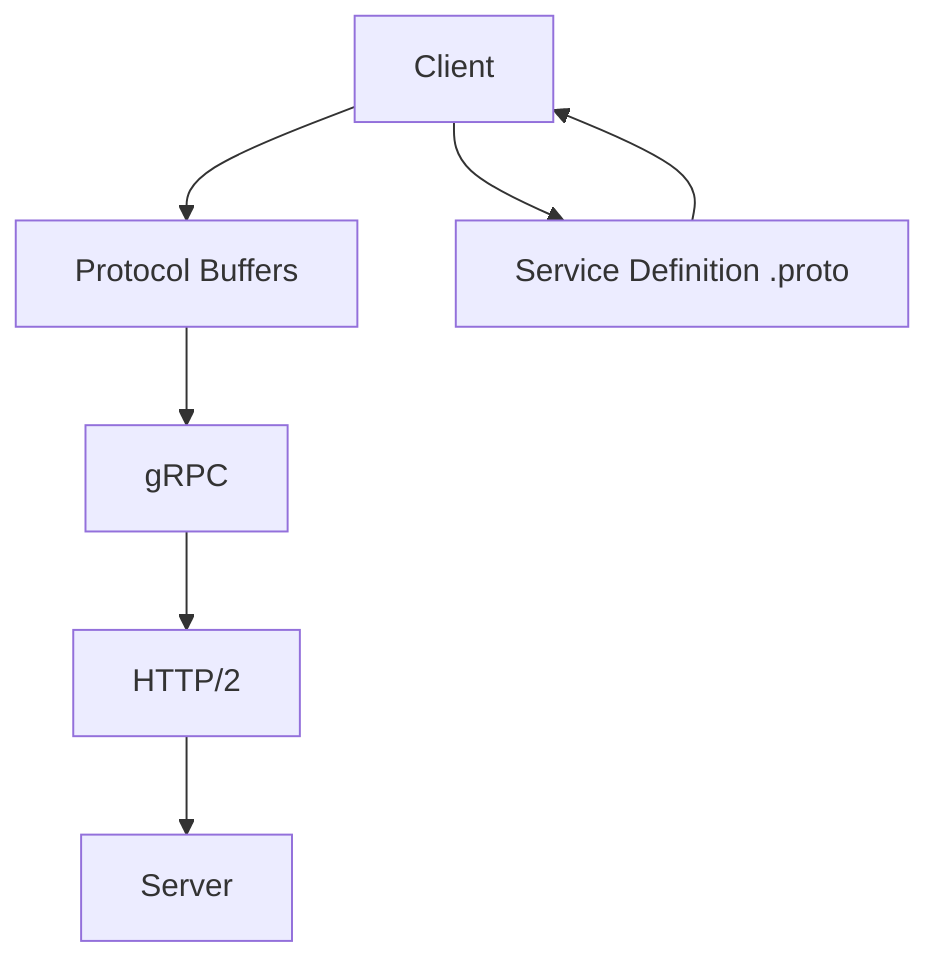
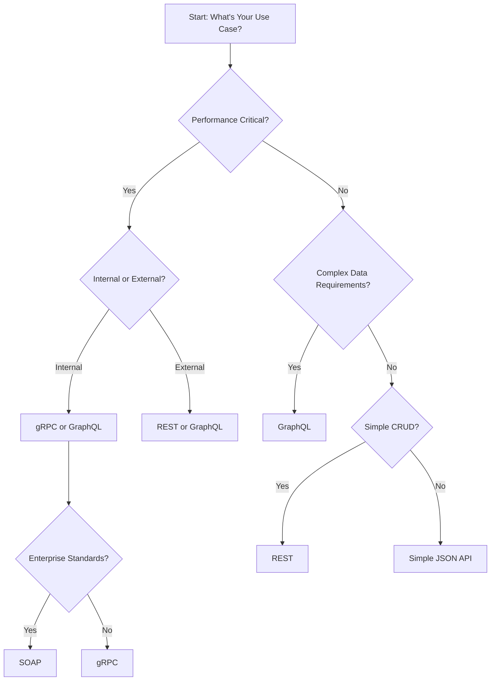
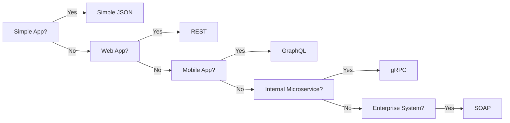

# Chapter 02: Different API Styles

## Introduction

**📌 API Style**: The architectural pattern and design philosophy that determines how an API is structured and how clients interact with it.

Choosing the right API style is crucial for:
- **Performance**: Speed and efficiency of data transfer
- **Developer Experience**: Ease of use and learning curve
- **Scalability**: How well it handles growth
- **Maintenance**: Long-term code sustainability

---

## RESTful APIs

### What is REST?

**REST (REpresentational State Transfer)**: An architectural style for designing networked applications using HTTP protocol. It's the most popular API style used today.

**📌 Simple Analogy**: REST is like ordering from a restaurant menu - you select items (resources) and specify actions (HTTP methods).

### Core REST Principles

| Principle | Description | Real-World Example |
|-----------|-------------|-------------------|
| **Stateless** | Each request is independent | Session tokens sent with every request |
| **Client-Server** | Clear separation of concerns | Mobile app ↔ Server |
| **Cacheable** | Responses can be cached | Browser caches user profile data |
| **Uniform Interface** | Consistent conventions | All endpoints follow same pattern |
| **Layered System** | Can have intermediate layers | API Gateway → Microservices |

### REST API Structure

```
https://api.example.com/v1/users/123?include=profile
│          │          │    │     │         │
│          │          │    │     │         └─ Query Parameters
│          │          │    │     └─ Resource Identifier
│          │          │    └─ Resource Collection
│          │          └─ API Version
│          └─ Domain
└─ Protocol
```

### HTTP Methods in REST

| Operation | HTTP Method | Endpoint | Idempotent? |
|-----------|-------------|----------|-------------|
| **Create** | POST | `/users` | No |
| **Read** | GET | `/users/{id}` | Yes |
| **Update (Full)** | PUT | `/users/{id}` | Yes |
| **Update (Partial)** | PATCH | `/users/{id}` | No |
| **Delete** | DELETE | `/users/{id}` | Yes |

**📌 Idempotent**: Same result no matter how many times you call it.

### REST Response Examples

```json
// Success Response
{
  "success": true,
  "data": {
    "id": 123,
    "name": "John Doe",
    "email": "john@example.com"
  },
  "timestamp": "2023-12-01T10:30:00Z"
}

// Error Response
{
  "success": false,
  "error": {
    "code": "USER_NOT_FOUND",
    "message": "User with ID 123 not found"
  }
}
```

### When to Use REST

✅ **Good for**:
- CRUD operations
- Standard web applications
- Public APIs
- Simple data management

❌ **Not ideal for**:
- Complex data queries
- Real-time applications
- Mobile apps with bandwidth constraints

---

## GraphQL

### What is GraphQL?

**GraphQL**: A query language and runtime for APIs that gives clients the power to ask for exactly what they need and nothing more.

**📌 Key Advantage**: Solve the problem of over-fetching (getting too much data) and under-fetching (needing multiple requests) in REST.

### GraphQL vs REST

| Feature | REST | GraphQL |
|---------|------|---------|
| **Data Fetching** | Fixed endpoints, may over/under fetch | Client specifies exact needs |
| **Requests** | Multiple endpoints for different data | Single endpoint with queries |
| **Versioning** | URL versioning needed | No versioning required |
| **Learning Curve** | Simple, well-known | Steeper learning curve |
| **Tooling** | Mature ecosystem | Growing ecosystem |

### GraphQL Query Example

```graphql
# REST would need 2 requests:
# GET /users/123
# GET /users/123/posts

# GraphQL gets everything in 1 request:
query GetUserWithPosts($userId: ID!) {
  user(id: $userId) {
    id
    name
    email
    posts {
      id
      title
      content
    }
  }
}
```

### GraphQL Response

```json
{
  "data": {
    "user": {
      "id": "123",
      "name": "John Doe",
      "email": "john@example.com",
      "posts": [
        {
          "id": "1",
          "title": "My First Post",
          "content": "Hello World!"
        }
      ]
    }
  }
}
```

### When to Use GraphQL

✅ **Good for**:
- Mobile applications (bandwidth efficient)
- Complex data requirements
- Microservices architecture
- Applications with frequent UI changes

❌ **Not ideal for**:
- Simple CRUD operations
- Caching-heavy applications
- File uploads
- Simple HTTP caching

---

## SOAP (Simple Object Access Protocol)

### What is SOAP?

**SOAP**: A protocol for exchanging structured information in web services using XML. It's more rigid than REST but very robust.

**📌 Key Characteristic**: Highly standardized with built-in error handling and security.

### SOAP Message Structure

```xml
<soap:Envelope xmlns:soap="http://www.w3.org/2003/05/soap-envelope">
  <soap:Header>
    <!-- Authentication, security tokens -->
  </soap:Header>
  <soap:Body>
    <!-- Actual data or fault message -->
  </soap:Body>
</soap:Envelope>
```

### SOAP vs REST Comparison

| Aspect | SOAP | REST |
|--------|------|------|
| **Format** | XML only | JSON, XML, HTML, text |
| **Protocol** | Has its own protocol | Uses HTTP |
| **State** | Can be stateful | Always stateless |
| **Complexity** | Complex, verbose | Simple, lightweight |
| **Security** | Built-in WS-Security | External (HTTPS, tokens) |
| **Caching** | Limited | Good HTTP caching |

### When to Use SOAP

✅ **Good for**:
- Enterprise applications
- Financial services
- Transactions requiring ACID compliance
- Official government APIs

❌ **Not ideal for**:
- Mobile applications
- Public APIs
- Real-time applications
- Simple CRUD operations

---

## gRPC (Google Remote Procedure Call)

### What is gRPC?

**gRPC**: A high-performance, open-source framework that uses HTTP/2 for transport and Protocol Buffers for serialization.

**📌 Key Innovation**: Extremely fast binary serialization perfect for microservices.

### gRPC Architecture



### Protocol Buffers Example

```protobuf
// User service definition
service UserService {
  rpc GetUser (GetUserRequest) returns (User) {}
  rpc CreateUser (CreateUserRequest) returns (User) {}
  rpc ListUsers (ListUsersRequest) returns (UserList) {}
}

message User {
  int32 id = 1;
  string name = 2;
  string email = 3;
}

message GetUserRequest {
  int32 user_id = 1;
}
```

### gRPC vs REST Performance

| Metric | gRPC | REST |
|--------|------|------|
| **Speed** | 10-50x faster | Standard HTTP speed |
| **Payload Size** | 30-50% smaller | Larger (JSON overhead) |
| **Compression** | Built-in | Manual implementation |
| **Streaming** | Bidirectional streaming | Limited |
| **Browser Support** | Requires proxy | Native support |

### When to Use gRPC

✅ **Good for**:
- Microservices communication
- High-performance systems
- Real-time data streaming
- Internal services

❌ **Not ideal for**:
- Browser-based clients
- Public APIs
- Simple applications
- Quick prototypes

---

## Simple JSON APIs

### What are Simple JSON APIs?

**Simple JSON APIs**: Basic API endpoints that return JSON data without strict adherence to REST principles. They focus on simplicity and speed of development.

### Characteristics

| Feature | Description |
|---------|-------------|
| **Simplicity** | Easy to understand and implement |
| **Flexibility** | No strict architectural constraints |
| **Speed** | Quick to develop and deploy |
| **Custom** | Tailored to specific needs |

### Example Structure

```json
// Simple user API endpoint
// GET /api/user?id=123
{
  "status": "ok",
  "user": {
    "id": 123,
    "name": "John Doe",
    "email": "john@example.com",
    "last_login": "2023-12-01T10:30:00Z"
  }
}
```

### When to Use Simple JSON APIs

✅ **Good for**:
- Internal tools
- Simple data services
- Prototypes and MVPs
- Small applications

❌ **Not ideal for**:
- Complex enterprise systems
- Public-facing APIs
- Large development teams
- Long-term projects

---

## Choosing the Right API Style

### Decision Framework



### Quick Comparison Table

| API Style | Performance | Complexity | Flexibility | Use Case |
|-----------|-------------|------------|-------------|----------|
| **REST** | Medium | Low | Medium | Web apps, public APIs |
| **GraphQL** | High | High | Very High | Mobile apps, complex queries |
| **SOAP** | Low | Very High | Low | Enterprise, financial |
| **gRPC** | Very High | Medium | Low | Microservices, internal |
| **Simple JSON** | Medium | Very Low | High | Prototypes, simple apps |

### Practical Recommendations

#### For Web Applications
**🎯 Choose REST** if:
- Standard CRUD operations
- Good caching needed
- Team is familiar with HTTP
- Public-facing API

#### For Mobile Applications
**🎯 Choose GraphQL** if:
- Limited bandwidth is critical
- Complex data relationships
- Frequently changing UI requirements
- Need flexible data fetching

#### For Microservices
**🎯 Choose gRPC** if:
- Maximum performance required
- Internal service communication
- Binary serialization benefits
- Streaming capabilities needed

#### For Enterprise Systems
**🎯 Choose SOAP** if:
- Compliance requirements (finance, healthcare)
- Need formal contracts
- Transaction security critical
- Legacy system integration

#### For Prototypes
**🎯 Choose Simple JSON** if:
- Quick development needed
- Simple data requirements
- Small team
- Internal tool

---

## Migration Strategies

### From REST to GraphQL

1. **Phase 1**: Add GraphQL alongside REST
2. **Phase 2**: Migrate one endpoint at a time
3. **Phase 3**: Deprecate REST endpoints
4. **Phase 4**: Remove REST entirely

### From SOAP to REST

1. **Analyze**: Document existing SOAP operations
2. **Design**: Create RESTful endpoint mapping
3. **Implement**: Build new REST API
4. **Migrate**: Gradually move clients to REST
5. **Decommission**: Retire SOAP endpoints

### From REST to gRPC

1. **Define**: Create Protocol Buffer definitions
2. **Implement**: Build gRPC services
3. **Gateway**: Add HTTP/gRPC gateway for web clients
4. **Migrate**: Move internal services to gRPC
5. **Optimize**: Take advantage of gRPC features

---

## Best Practices

### REST Best Practices

- **Use nouns for resources**: `/users` not `/getUsers`
- **HTTP status codes**: Use appropriate codes
- **Version your API**: `/api/v1/users`
- **Consistent naming**: Follow patterns
- **Error handling**: Standardized error responses

### GraphQL Best Practices

- **Schema-first design**: Define schema before implementation
- **Pagination**: Implement cursor-based pagination
- **Authentication**: Handle at resolver level
- **Rate limiting**: Implement query complexity limits
- **Caching**: Use DataLoader to prevent N+1 problems

### gRPC Best Practices

- **Version your proto files**: Use semantic versioning
- **Error handling**: Use gRPC status codes
- **Streaming**: Use streaming for large data sets
- **Interceptors**: Implement logging/metrics
- **Health checks**: Include health check services

---

## Interview Questions

### Basic Questions

1. **What's the difference between REST and GraphQL?**
   - REST: Fixed endpoints, may over/under fetch data
   - GraphQL: Client specifies exact data needs, single endpoint

2. **When would you use SOAP instead of REST?**
   - Enterprise applications requiring strict standards
   - Financial services with compliance requirements
   - Built-in security and transaction support needed

3. **What is gRPC and why is it fast?**
   - High-performance RPC framework using HTTP/2
   - Uses Protocol Buffers for binary serialization
   - HTTP/2 multiplexing reduces latency

### Intermediate Questions

4. **What is over-fetching and under-fetching?**
   - Over-fetching: Getting more data than needed
   - Under-fetching: Needing multiple requests to get required data
   - GraphQL solves both problems

5. **How do you version APIs in different styles?**
   - REST: URL versioning (`/v1/users`) or headers
   - GraphQL: Schema evolution, deprecation
   - gRPC: Protocol buffer versioning

6. **What is Protocol Buffers?**
   - Google's binary serialization format
   - Smaller and faster than JSON
   - Used by gRPC for data serialization

### Advanced Questions

7. **How does gRPC achieve better performance than REST?**
   - Binary serialization vs text-based JSON
   - HTTP/2 multiplexing vs HTTP/1.1
   - Persistent connections
   - Built-in compression

8. **What are the disadvantages of GraphQL?**
   - Steeper learning curve
   - Caching complexity
   - Query complexity attacks
   - File upload challenges

9. **How would you choose between REST and GraphQL for a new project?**
   - Consider team expertise
   - Data complexity requirements
   - Client types (web, mobile)
   - Caching requirements
   - Performance needs

---

## Summary

### Key Takeaways

1. **REST** is the default choice for most web applications
2. **GraphQL** excels with complex data and mobile apps
3. **gRPC** is best for high-performance microservices
4. **SOAP** remains relevant for enterprise systems
5. **Simple JSON APIs** work well for prototypes and simple apps

### Decision Framework



**Next Up**: Chapter 03 dives deep into building practical RESTful APIs with real implementation patterns and best practices.