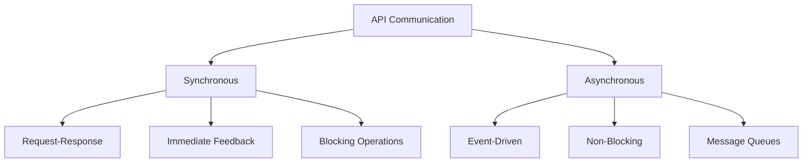
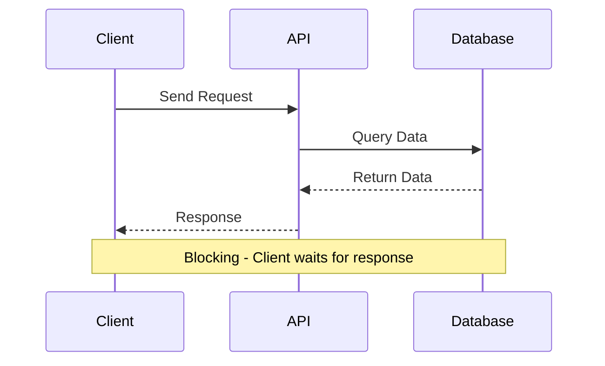
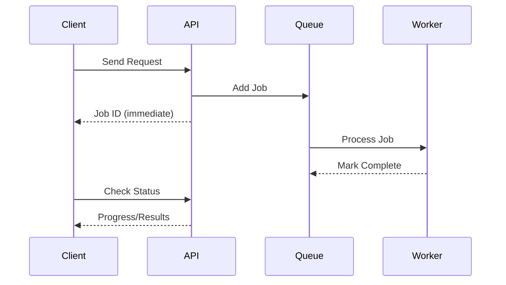
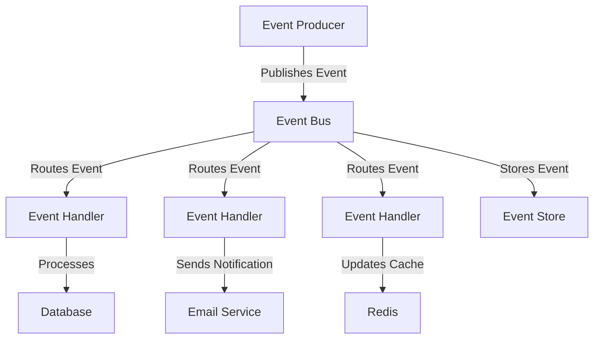
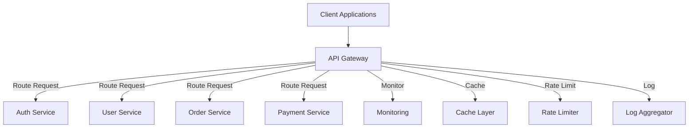
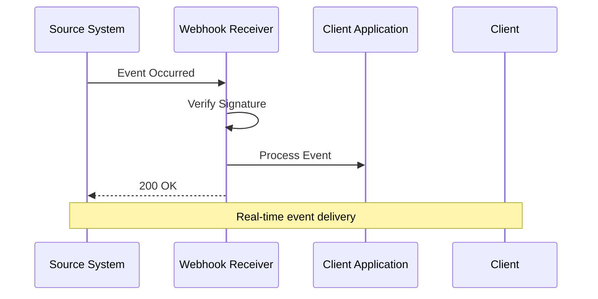
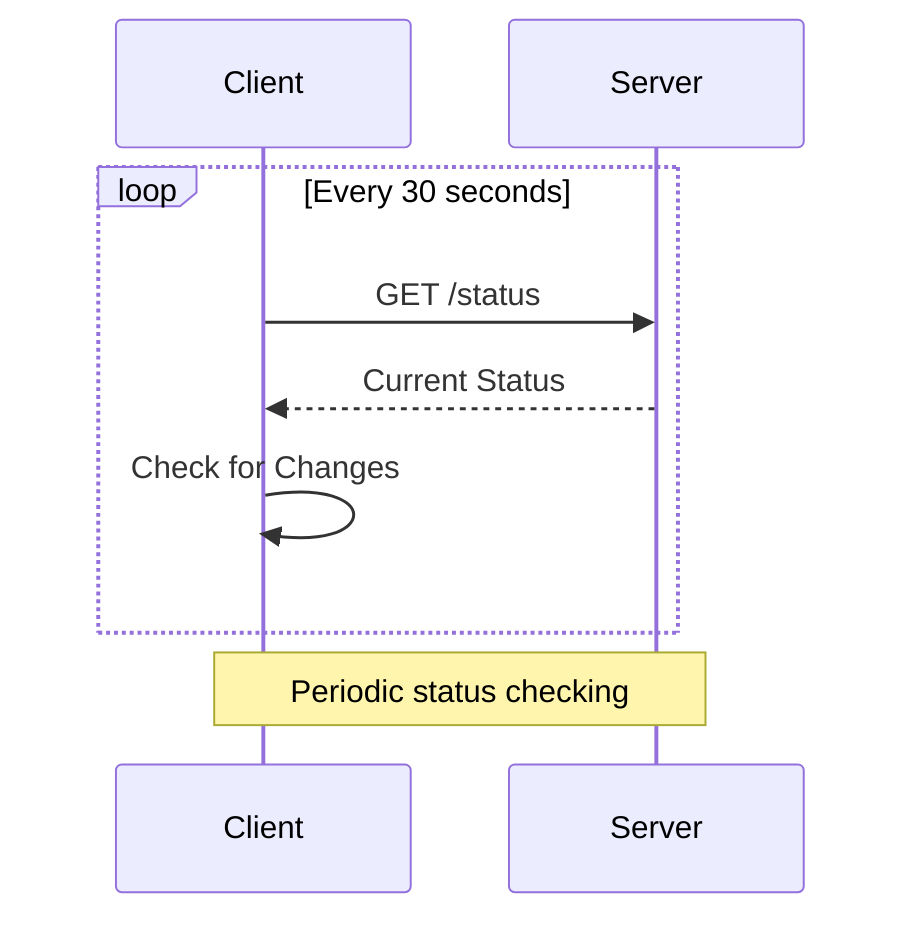
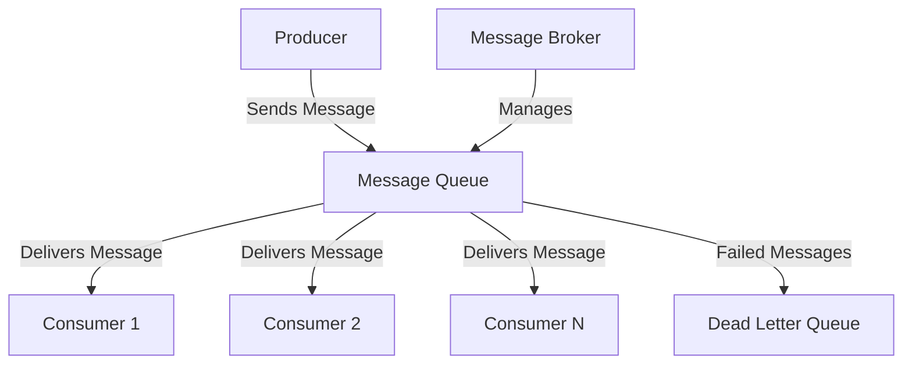
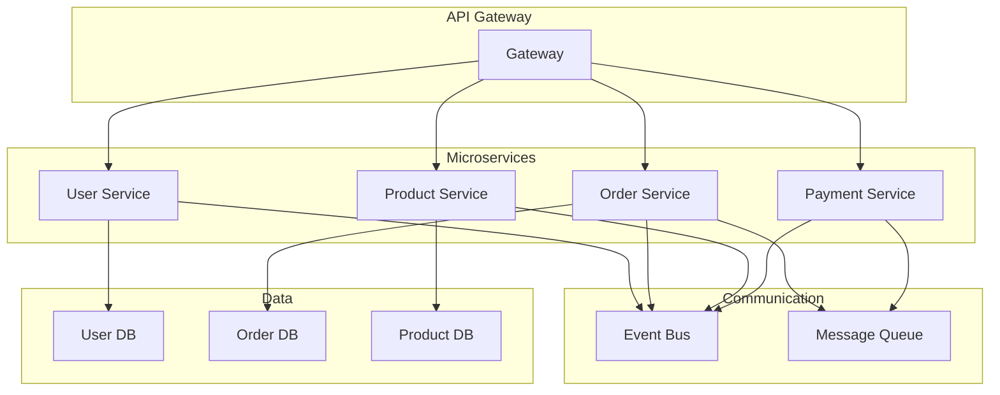

# Chapter 09: API Integration Patterns

## Introduction

**📌 API Integration Patterns**: Standardized approaches for connecting different systems and services through APIs.

Integration patterns define how APIs communicate with each other, handle data flow, manage reliability, and scale. Choosing the right pattern is crucial for building maintainable, scalable systems.

---

## Synchronous vs Asynchronous Communication

### Communication Patterns Overview



### Synchronous APIs

**📌 Synchronous API**: Client sends request and waits for immediate response before continuing.

**Characteristics:**
- **Request-Response**: Client waits for immediate response
- **Blocking**: Thread waits until operation completes
- **Real-time**: Immediate feedback
- **Simple**: Easy to understand and implement

#### When to Use Synchronous APIs

| Use Case | Reason | Example |
|----------|--------|---------|
| **User Authentication** | Immediate response needed | Login validation |
| **Data Validation** | User expects instant feedback | Form validation |
| **Configuration Lookup** | Small data, fast response | Get application settings |
| **Simple CRUD** | Quick database operations | Get user profile |

#### Synchronous Request Flow



### Asynchronous APIs

**📌 Asynchronous API**: Client sends request and receives immediate acknowledgment, processing happens in background.

**Characteristics:**
- **Event-driven**: Non-blocking operations
- **Scalable**: Better resource utilization
- **Complex**: Requires job tracking and status management
- **Reliable**: Better for long-running operations

#### When to Use Asynchronous APIs

| Use Case | Reason | Example |
|----------|--------|---------|
| **Report Generation** | Takes minutes/hours | Generate monthly reports |
| **Video Processing** | Resource intensive | Transcode videos |
| **Email Sending** | External dependency, can fail | Send welcome emails |
| **Batch Operations** | Process large datasets | Import 1000+ records |

#### Asynchronous Request Flow



### Comparison: Synchronous vs Asynchronous

| Aspect | Synchronous | Asynchronous |
|--------|-------------|--------------|
| **Response Time** | Immediate | Delayed (job processing) |
| **Complexity** | Simple | Complex (job tracking) |
| **Scalability** | Limited | High |
| **Resource Usage** | Blocking threads | Efficient |
| **User Experience** | Real-time feedback | Progress updates |
| **Reliability** | Single point of failure | Resilient |
| **Use Cases** | Quick operations | Long-running tasks |

---

## Event-Driven Architecture

### Event-Driven Components

**📌 Event-Driven Architecture**: Systems communicate through events, enabling loose coupling and real-time processing.



### Event Types and Patterns

| Event Type | Description | Example |
|------------|-------------|---------|
| **Domain Event** | Business state change | Order Placed, User Registered |
| **Integration Event** | System-to-system communication | Payment Completed |
| **Command Event** | Request to perform action | Process Refund |
| **Query Event** | Request for information | Get User Details |

### Event Sourcing Pattern

**📌 Event Sourcing**: Store all changes as immutable events instead of current state.

**Benefits:**
- **Complete Audit Trail**: Every change is recorded
- **Temporal Queries**: Query state at any point in time
- **Debugging**: Replay events to understand issues
- **Scalability**: Event streams can be partitioned

**Challenges:**
- **Event Versioning**: Schema evolution over time
- **Snapshot Management**: Rebuilding state from many events
- **Complexity**: More complex than traditional CRUD

### Event Bus Implementation

```javascript
// Simple event bus implementation
class EventBus {
  constructor() {
    this.events = new Map();
  }

  // Subscribe to events
  on(eventName, handler) {
    if (!this.events.has(eventName)) {
      this.events.set(eventName, []);
    }
    this.events.get(eventName).push(handler);
  }

  // Emit events
  async emit(eventName, data) {
    const handlers = this.events.get(eventName) || [];

    for (const handler of handlers) {
      try {
        await handler(data);
      } catch (error) {
        console.error(`Error in event handler for ${eventName}:`, error);
      }
    }
  }

  // Remove subscription
  off(eventName, handler) {
    const handlers = this.events.get(eventName) || [];
    const index = handlers.indexOf(handler);
    if (index > -1) {
      handlers.splice(index, 1);
    }
  }
}

// Usage example
const eventBus = new EventBus();

// Subscribe to user events
eventBus.on('user.created', async (userData) => {
  console.log('New user created:', userData);
  // Send welcome email
  await EmailService.sendWelcomeEmail(userData.email);
});

eventBus.on('order.placed', async (orderData) => {
  console.log('New order:', orderData);
  // Update inventory
  await InventoryService.reserveItems(orderData.items);
  // Send confirmation
  await NotificationService.sendOrderConfirmation(orderData);
});

// Emit events
eventBus.emit('user.created', {
  id: 123,
  email: 'user@example.com',
  name: 'John Doe'
});
```

---

## API Gateways

### API Gateway Architecture

**📌 API Gateway**: Single entry point for all client requests, handling routing, authentication, and cross-cutting concerns.



### Gateway Responsibilities

| Responsibility | Purpose | Implementation |
|----------------|---------|----------------|
| **Request Routing** | Direct to appropriate service | Path-based routing |
| **Authentication** | Verify user identity | JWT validation |
| **Authorization** | Check permissions | RBAC/ABAC |
| **Rate Limiting** | Prevent abuse | Token bucket algorithm |
| **Load Balancing** | Distribute traffic | Round robin, least connections |
| **Response Caching** | Improve performance | Redis cache |
| **Request/Response Transformation** | Protocol conversion | JSON↔XML, gRPC↔REST |
| **Monitoring & Logging** | Track usage | APM integration |

### Gateway Routing Example

```javascript
// Simple API Gateway routing
class APIGateway {
  constructor() {
    this.routes = new Map();
    this.middleware = [];
  }

  // Add route
  addRoute(path, serviceUrl) {
    this.routes.set(path, serviceUrl);
  }

  // Add middleware
  use(middleware) {
    this.middleware.push(middleware);
  }

  // Handle request
  async handleRequest(req, res) {
    // Apply middleware
    for (const middleware of this.middleware) {
      const result = await middleware(req, res);
      if (result === 'stop') {
        return;
      }
    }

    // Find matching route
    const serviceUrl = this.findMatchingRoute(req.path);
    if (!serviceUrl) {
      return res.status(404).json({ error: 'Service not found' });
    }

    // Proxy to service
    await this.proxyRequest(serviceUrl, req, res);
  }

  findMatchingRoute(path) {
    // Simple path matching
    for (const [routePath, serviceUrl] of this.routes) {
      if (path.startsWith(routePath)) {
        return serviceUrl;
      }
    }
    return null;
  }

  async proxyRequest(serviceUrl, req, res) {
    try {
      const targetUrl = serviceUrl + req.url;
      const response = await fetch(targetUrl, {
        method: req.method,
        headers: req.headers,
        body: req.body
      });

      const data = await response.json();
      res.status(response.status).json(data);
    } catch (error) {
      res.status(502).json({ error: 'Service unavailable' });
    }
  }
}

// Usage
const gateway = new APIGateway();

// Add routes
gateway.addRoute('/api/users', 'http://localhost:3001');
gateway.addRoute('/api/orders', 'http://localhost:3002');
gateway.addRoute('/api/products', 'http://localhost:3003');

// Add middleware
gateway.use(authenticationMiddleware);
gateway.use(rateLimitingMiddleware);
gateway.use(loggingMiddleware);
```

---

## Webhooks vs Polling

### Webhooks

**📌 Webhook**: HTTP callback that sends data to a specified URL when an event occurs.

#### How Webhooks Work



#### Webhook Benefits and Challenges

| Benefits | Challenges |
|----------|------------|
| **Real-time**: Immediate event delivery | **Security**: Need signature verification |
| **Efficient**: No continuous requests | **Reliability**: Need retry mechanisms |
| **Scalable**: Push-based architecture | **Complexity**: More implementation overhead |
| **Resource-friendly**: Less server load | **Debugging**: Harder to troubleshoot |

#### Webhook Implementation

```javascript
// Webhook manager
class WebhookManager {
  constructor() {
    this.webhooks = new Map();
  }

  // Register webhook
  register(eventType, url, secret) {
    if (!this.webhooks.has(eventType)) {
      this.webhooks.set(eventType, []);
    }

    this.webhooks.get(eventType).push({
      url,
      secret,
      retryCount: 0,
      lastAttempt: null
    });
  }

  // Trigger webhook
  async trigger(eventType, data) {
    const webhooks = this.webhooks.get(eventType) || [];

    for (const webhook of webhooks) {
      await this.sendWebhook(webhook, data);
    }
  }

  async sendWebhook(webhook, data) {
    try {
      const payload = {
        eventType,
        data,
        timestamp: new Date().toISOString()
      };

      const signature = this.generateSignature(
        JSON.stringify(payload),
        webhook.secret
      );

      const response = await fetch(webhook.url, {
        method: 'POST',
        headers: {
          'Content-Type': 'application/json',
          'X-Webhook-Signature': signature
        },
        body: JSON.stringify(payload)
      });

      if (response.ok) {
        webhook.retryCount = 0; // Reset on success
        console.log(`Webhook delivered to ${webhook.url}`);
      } else {
        throw new Error(`HTTP ${response.status}`);
      }
    } catch (error) {
      webhook.retryCount++;
      console.error(`Webhook delivery failed:`, error);

      // Implement retry logic
      if (webhook.retryCount < 3) {
        setTimeout(() => this.sendWebhook(webhook, data), 1000 * webhook.retryCount);
      }
    }
  }

  generateSignature(payload, secret) {
    const crypto = require('crypto');
    return crypto.createHmac('sha256', secret)
      .update(payload)
      .digest('hex');
  }
}
```

### Polling

**📌 Polling**: Client periodically requests data from server to check for updates.

#### How Polling Works



#### Polling Benefits and Challenges

| Benefits | Challenges |
|----------|------------|
| **Simple**: Easy to implement | **Delayed**: Not real-time |
| **Predictable**: Consistent server load | **Resource waste**: Unnecessary requests |
| **Reliable**: No complex retry logic | **Scalability issues**: With many clients |
| **Debugging**: Easy to troubleshoot | **Bandwidth**: Higher usage |

#### Polling Implementation

```javascript
// Polling manager
class PollingManager {
  constructor() {
    this.pollers = new Map();
  }

  // Start polling
  start(pollerId, config) {
    const poller = {
      id: pollerId,
      url: config.url,
      interval: config.interval || 30000,
      lastData: null,
      callbacks: config.callbacks || {},
      isActive: true
    };

    this.pollers.set(pollerId, poller);
    this.scheduleNextPoll(poller);
  }

  async scheduleNextPoll(poller) {
    if (!poller.isActive) return;

    setTimeout(async () => {
      await this.executePoll(poller);
      this.scheduleNextPoll(poller); // Schedule next
    }, poller.interval);
  }

  async executePoll(poller) {
    try {
      const response = await fetch(poller.url);
      const data = await response.json();

      // Check if data changed
      if (JSON.stringify(data) !== JSON.stringify(poller.lastData)) {
        if (poller.callbacks.onChange) {
          poller.callbacks.onChange(data, poller.lastData);
        }
        poller.lastData = data;
      }

      if (poller.callbacks.onSuccess) {
        poller.callbacks.onSuccess(data);
      }
    } catch (error) {
      if (poller.callbacks.onError) {
        poller.callbacks.onError(error);
      }
    }
  }

  stop(pollerId) {
    const poller = this.pollers.get(pollerId);
    if (poller) {
      poller.isActive = false;
      this.pollers.delete(pollerId);
    }
  }
}

// Usage
const pollingManager = new PollingManager();

pollingManager.start('order-status', {
  url: '/api/orders/123/status',
  interval: 10000, // 10 seconds
  callbacks: {
    onChange: (newStatus, oldStatus) => {
      console.log('Order status changed:', oldStatus, '→', newStatus);
      // Notify user
      NotificationService.showOrderUpdate(newStatus);
    },
    onSuccess: (data) => {
      console.log('Poll successful:', data);
    },
    onError: (error) => {
      console.error('Polling error:', error);
    }
  }
});
```

### Comparison: Webhooks vs Polling

| Factor | Webhooks | Polling |
|--------|----------|---------|
| **Latency** | Real-time (seconds) | Delayed (polling interval) |
| **Complexity** | High (signatures, retries) | Low (simple HTTP requests) |
| **Server Load** | Event-driven spikes | Consistent baseline |
| **Network Usage** | Efficient | Higher (unnecessary requests) |
| **Scalability** | Better with many clients | Limited by polling rate |
| **Reliability** | Needs retry mechanism | Simpler failure handling |
| **Implementation** | Server pushes data | Client pulls data |

---

## Message Queues

### Message Queue Architecture

**📌 Message Queue**: Asynchronous communication system that stores messages for later processing.



### Message Queue Benefits

| Benefit | Description | Use Case |
|---------|-------------|----------|
| **Decoupling** | Producers and consumers don't need to know about each other | Microservices communication |
| **Scalability** | Add consumers to handle increased load | Peak traffic handling |
| **Reliability** | Messages persist until processed | Critical operations |
| **Load Balancing** | Distribute work across consumers | Parallel processing |
| **Buffering** | Handle temporary mismatches in rates | Rate limiting |

### Common Message Queue Systems

| System | Type | Best For | Key Features |
|--------|------|----------|--------------|
| **RabbitMQ** | Message Broker | Complex routing, reliability | Exchanges, queues, acknowledgments |
| **Apache Kafka** | Streaming Platform | High-throughput data streams | Partitions, log retention, replay |
| **AWS SQS** | Cloud Queue Service | Simple cloud messaging | Auto-scaling, pay per use |
| **Redis Pub/Sub** | In-memory | Fast, simple messaging | Lightweight, low latency |

### Message Queue Implementation

```javascript
// Simple message queue using Redis
class MessageQueue {
  constructor(redisClient) {
    this.redis = redisClient;
    this.consumers = new Map();
    this.processing = false;
  }

  // Publish message
  async publish(queueName, message, priority = 'normal') {
    const messageData = {
      id: this.generateId(),
      data: message,
      timestamp: new Date().toISOString(),
      priority
    };

    // Add to queue (using Redis list)
    if (priority === 'high') {
      await this.redis.lpush(queueName, JSON.stringify(messageData));
    } else {
      await this.redis.rpush(queueName, JSON.stringify(messageData));
    }

    console.log(`Message published to ${queueName}:`, messageData.id);
  }

  // Subscribe to queue
  async subscribe(queueName, handler, options = {}) {
    const consumer = {
      queueName,
      handler,
      concurrency: options.concurrency || 1,
      processing: false,
      activeJobs: 0
    };

    this.consumers.set(queueName, consumer);

    if (!this.processing) {
      this.startProcessing();
    }
  }

  // Start processing messages
  async startProcessing() {
    this.processing = true;

    while (this.processing) {
      let hasWork = false;

      for (const [queueName, consumer] of this.consumers) {
        if (consumer.activeJobs < consumer.concurrency) {
          const message = await this.getNextMessage(queueName);
          if (message) {
            hasWork = true;
            consumer.activeJobs++;
            this.processMessage(consumer, message)
              .finally(() => {
                consumer.activeJobs--;
              });
          }
        }
      }

      // Small delay if no work
      if (!hasWork) {
        await this.sleep(100);
      }
    }
  }

  // Get next message from queue
  async getNextMessage(queueName) {
    // Use blocking pop for efficiency
    const result = await this.redis.brpop(queueName, 1); // 1 second timeout
    return result ? JSON.parse(result[1]) : null;
  }

  // Process single message
  async processMessage(consumer, message) {
    try {
      console.log(`Processing message ${message.id} from ${consumer.queueName}`);

      await consumer.handler(message.data);

      console.log(`Message ${message.id} processed successfully`);
    } catch (error) {
      console.error(`Message ${message.id} processing failed:`, error);

      // Add to dead letter queue after retries
      if (message.retries > 3) {
        await this.redis.lpush(
          `${consumer.queueName}:dlq`,
          JSON.stringify({ ...message, error: error.message })
        );
      } else {
        // Retry with backoff
        message.retries = (message.retries || 0) + 1;
        await this.sleep(1000 * message.retries);
        await this.redis.lpush(consumer.queueName, JSON.stringify(message));
      }
    }
  }

  generateId() {
    return `msg_${Date.now()}_${Math.random().toString(36).substr(2, 9)}`;
  }

  sleep(ms) {
    return new Promise(resolve => setTimeout(resolve, ms));
  }

  stop() {
    this.processing = false;
  }
}

// Usage example
const redis = require('redis');
const redisClient = redis.createClient();
const queue = new MessageQueue(redisClient);

// Producer
async function sendEmail(userData) {
  await queue.publish('email-queue', {
    type: 'welcome',
    to: userData.email,
    name: userData.name
  }, 'high');
}

// Consumer
await queue.subscribe('email-queue', async (message) => {
  if (message.type === 'welcome') {
    await EmailService.sendWelcomeEmail(message.to, message.name);
  }
}, { concurrency: 5 });
```

---

## Microservices Communication

### Microservices Patterns

**📌 Microservices**: Architectural style that structures an application as a collection of loosely coupled services.

| Pattern | Description | Use Case |
|---------|-------------|----------|
| **API Gateway** | Single entry point for all clients | Simplify client access |
| **Service Discovery** | Automatic service registration/lookup | Dynamic environments |
| **Circuit Breaker** | Prevent cascade failures | Fault tolerance |
| **Service Mesh** | Inter-service communication infrastructure | Complex microservices |
| **Saga Pattern** | Manage distributed transactions | Data consistency |

### Communication Between Services



### Service Communication Example

```javascript
// Service base class
class Microservice {
  constructor(name, port) {
    this.name = name;
    this.port = port;
    this.eventBus = new EventBus();
    this.healthStatus = 'healthy';
  }

  // Start service
  async start() {
    console.log(`${this.name} starting on port ${this.port}`);
    this.setupRoutes();
    this.setupEventHandlers();
    this.healthCheck();
  }

  // Health check endpoint
  setupHealthCheck() {
    // Simple health check
    return {
      service: this.name,
      status: this.healthStatus,
      timestamp: new Date().toISOString()
    };
  }

  // Publish event
  async publishEvent(eventType, data) {
    await this.eventBus.emit(eventType, {
      service: this.name,
      data,
      timestamp: new Date().toISOString()
    });
  }

  // Subscribe to events
  subscribeToEvent(eventType, handler) {
    this.eventBus.on(eventType, handler);
  }
}

// User Service
class UserService extends Microservice {
  constructor() {
    super('user-service', 3001);
    this.users = new Map();
  }

  setupRoutes() {
    // POST /users
    this.addRoute('POST', '/users', async (req, res) => {
      const user = await this.createUser(req.body);

      // Publish user created event
      await this.publishEvent('user.created', user);

      res.status(201).json(user);
    });

    // GET /users/:id
    this.addRoute('GET', '/users/:id', async (req, res) => {
      const user = this.users.get(req.params.id);
      if (!user) {
        return res.status(404).json({ error: 'User not found' });
      }
      res.json(user);
    });
  }

  setupEventHandlers() {
    // Listen for order events
    this.subscribeToEvent('order.completed', async (event) => {
      await this.updateUserOrderCount(event.data.userId);
    });
  }

  async createUser(userData) {
    const user = {
      id: this.generateId(),
      ...userData,
      createdAt: new Date().toISOString(),
      orderCount: 0
    };

    this.users.set(user.id, user);
    return user;
  }

  async updateUserOrderCount(userId) {
    const user = this.users.get(userId);
    if (user) {
      user.orderCount++;
      console.log(`Updated order count for user ${userId}: ${user.orderCount}`);
    }
  }

  generateId() {
    return Math.random().toString(36).substr(2, 9);
  }
}

// Order Service
class OrderService extends Microservice {
  constructor() {
    super('order-service', 3002);
    this.orders = new Map();
  }

  setupRoutes() {
    this.addRoute('POST', '/orders', async (req, res) => {
      const order = await this.createOrder(req.body);

      // Publish order created event
      await this.publishEvent('order.created', order);

      res.status(201).json(order);
    });
  }

  setupEventHandlers() {
    // Listen for user events
    this.subscribeToEvent('user.created', async (event) => {
      console.log(`New user registered: ${event.data.email}`);
      // Could send welcome offer, etc.
    });
  }

  async createOrder(orderData) {
    const order = {
      id: this.generateId(),
      ...orderData,
      status: 'pending',
      createdAt: new Date().toISOString()
    };

    this.orders.set(order.id, order);

    // Simulate order processing
    setTimeout(async () => {
      order.status = 'completed';
      await this.publishEvent('order.completed', order);
    }, 2000);

    return order;
  }

  generateId() {
    return Math.random().toString(36).substr(2, 9);
  }
}
```

---

## Batch Processing

### Batch Processing Patterns

**📌 Batch Processing**: Processing large volumes of data in groups or batches rather than individually.

| Pattern | Description | Use Case |
|---------|-------------|----------|
| **Queue-Based** | Process items from a queue in batches | Email campaigns, data import |
| **Scheduled** | Process at specific times | Daily reports, cleanup |
| **Event-Triggered** | Start batch when event occurs | Bulk updates after migration |
| **Stream Processing** | Process continuous data flow | Log analysis, real-time analytics |

### Batch Processing Implementation

```javascript
// Batch processor
class BatchProcessor {
  constructor(options = {}) {
    this.batchSize = options.batchSize || 100;
    this.concurrency = options.concurrency || 3;
    this.retryLimit = options.retryLimit || 3;
    this.queue = [];
    this.processing = false;
    this.stats = {
      total: 0,
      processed: 0,
      failed: 0
    };
  }

  // Add items to batch
  async add(items) {
    if (Array.isArray(items)) {
      this.queue.push(...items);
      this.stats.total += items.length;
    } else {
      this.queue.push(items);
      this.stats.total++;
    }

    if (!this.processing) {
      this.startProcessing();
    }
  }

  // Start batch processing
  async startProcessing() {
    this.processing = true;

    while (this.queue.length > 0) {
      // Get next batch
      const batch = this.queue.splice(0, this.batchSize);

      // Process batch with concurrency control
      const promises = batch.map(item => this.processItem(item));
      await Promise.allSettled(promises);
    }

    this.processing = false;
    console.log('Batch processing completed:', this.stats);
  }

  // Process single item
  async processItem(item, retryCount = 0) {
    try {
      await this.process(item);
      this.stats.processed++;
      console.log(`Item processed successfully`);
    } catch (error) {
      if (retryCount < this.retryLimit) {
        console.log(`Retrying item (${retryCount + 1}/${this.retryLimit})`);
        await this.sleep(1000 * (retryCount + 1)); // Exponential backoff
        await this.processItem(item, retryCount + 1);
      } else {
        this.stats.failed++;
        console.error(`Item failed after ${this.retryLimit} retries:`, error);
        // Could add to dead letter queue
      }
    }
  }

  // Override this method for specific processing logic
  async process(item) {
    throw new Error('Process method must be implemented');
  }

  sleep(ms) {
    return new Promise(resolve => setTimeout(resolve, ms));
  }

  getStats() {
    return {
      ...this.stats,
      remaining: this.queue.length,
      processing: this.processing
    };
  }
}

// Example: Email batch processor
class EmailBatchProcessor extends BatchProcessor {
  constructor() {
    super({ batchSize: 50, concurrency: 5 });
  }

  async process(item) {
    const { to, subject, template, data } = item;

    // Simulate email sending
    console.log(`Sending email to ${to}`);
    await this.sleep(100); // Simulate API call

    // In real implementation:
    // await EmailService.send({
    //   to,
    //   subject,
    //   html: this.renderTemplate(template, data)
    // });

    return { sent: true, to };
  }
}

// Usage
const emailProcessor = new EmailBatchProcessor();

// Add emails to process
const emails = [
  {
    to: 'user1@example.com',
    subject: 'Welcome!',
    template: 'welcome',
    data: { name: 'John' }
  },
  {
    to: 'user2@example.com',
    subject: 'Order Confirmation',
    template: 'order-confirmation',
    data: { orderId: '12345' }
  }
  // ... thousands more emails
];

await emailProcessor.add(emails);
```

---

## Integration Best Practices

### Integration Architecture Decision Matrix

| Requirement | Recommended Pattern | Reason |
|-------------|--------------------|--------|
| **Real-time Updates** | Webhooks | Immediate notification |
| **High Throughput** | Message Queues | Efficient processing |
| **Simple Integration** | REST APIs | Easy to implement |
| **Complex Workflows** | Event-Driven | Loose coupling |
| **Batch Processing** | Scheduled Jobs | Handle large datasets |
| **Mobile Apps** | REST + Polling | Battery efficiency |

### Integration Security Considerations

| Concern | Solution | Implementation |
|---------|----------|----------------|
| **Authentication** | API Keys, OAuth 2.0 | Validate all requests |
| **Authorization** | RBAC, ABAC | Check permissions |
| **Data Encryption** | HTTPS, TLS 1.3 | Encrypt in transit |
| **Message Security** | Message signing | Verify message integrity |
| **Rate Limiting** | Token bucket | Prevent abuse |
| **Input Validation** | Schema validation | Prevent injection attacks |

### Monitoring and Observability

| Metric | Why Important | Tools |
|--------|---------------|-------|
| **Request Latency** | Performance monitoring | APM tools, Prometheus |
| **Error Rates** | Reliability tracking | Error tracking services |
| **Queue Depth** | System health monitoring | Queue monitoring tools |
| **Throughput** | Capacity planning | Metrics collection |
| **Message Processing Time** | Performance optimization | Custom dashboards |
| **Service Dependencies** | Impact analysis | Service mapping |

---

## Interview Questions

### **Q1: When would you choose synchronous vs asynchronous APIs?**

**Answer:**
**Use Synchronous when:**
- **Immediate response required**: User authentication, data validation
- **Simple operations**: CRUD operations that complete quickly
- **Real-time interaction**: Chat applications, gaming
- **Low complexity**: Simple request-response patterns

**Use Asynchronous when:**
- **Long-running operations**: Report generation, video processing
- **Resource-intensive tasks**: File uploads, data imports
- **External dependencies**: Email sending, payment processing
- **High scalability needed**: Handle bursts of traffic

**Key considerations:**
- User experience expectations
- Operation completion time
- System complexity tolerance
- Resource utilization requirements

### **Q2: What is the role of an API Gateway in microservices architecture?**

**Answer:**
**Primary responsibilities:**
1. **Request Routing**: Direct requests to appropriate microservices
2. **Authentication/Authorization**: Centralized security enforcement
3. **Rate Limiting**: Protect services from abuse
4. **Load Balancing**: Distribute traffic across service instances
5. **Response Aggregation**: Combine responses from multiple services
6. **Protocol Translation**: Convert between different protocols
7. **Monitoring & Logging**: Centralized request tracking

**Benefits:**
- **Simplified clients**: Single endpoint for all services
- **Security**: Centralized authentication and authorization
- **Performance**: Caching, compression, connection pooling
- **Monitoring**: Unified visibility into all API calls
- **Scalability**: Easy to add/remove services without affecting clients

**Trade-offs:**
- **Single point of failure**: Must be highly available
- **Complexity**: Additional infrastructure component
- **Performance**: Potential bottleneck if not properly scaled

### **Q3: How do webhooks differ from polling, and when would you use each?**

**Answer:**
**Webhooks:**
- **Push-based**: Server sends data to client when events occur
- **Real-time**: Near-instantaneous event delivery
- **Efficient**: No unnecessary requests
- **Complex**: Requires signature verification, retry mechanisms
- **Scalable**: Better with many clients

**Polling:**
- **Pull-based**: Client requests data at intervals
- **Delayed**: Depends on polling frequency
- **Resource-intensive**: Continuous requests even when no data
- **Simple**: Easy to implement and debug
- **Predictable**: Consistent server load

**Use Webhooks for:**
- Payment notifications (Stripe, PayPal)
- Real-time updates (stock prices, chat messages)
- Event-driven workflows (CI/CD pipelines)

**Use Polling for:**
- Status checks (order processing, job completion)
- Simple integrations (low-frequency data sync)
- Systems with webhook limitations

### **Q4: What are the key considerations for implementing message queues?**

**Answer:**
**Technical considerations:**
1. **Message Ordering**: FIFO requirements, ordering guarantees
2. **Durability**: Persistent storage, message persistence
3. **Scalability**: Partitioning, consumer groups, horizontal scaling
4. **Reliability**: Acknowledgments, retry mechanisms, dead letter queues
5. **Performance**: Throughput, latency, batch processing

**Operational considerations:**
1. **Monitoring**: Queue depth, processing times, consumer lag
2. **Message Schema**: Versioning, backward compatibility
3. **Security**: Authentication, encryption, access control
4. **Maintenance**: Queue cleanup, message retention policies
5. **Testing**: Load testing, failure simulation

**Design patterns:**
- **Competing Consumers**: Multiple consumers processing from same queue
- **Publish-Subscribe**: Multiple subscribers receiving same messages
- **Request-Reply**: Correlation IDs for synchronous-like behavior
- **Routing**: Message filtering and selective delivery

### **Q5: How do you ensure message ordering in distributed systems?**

**Answer:**
**Strategies for message ordering:**

1. **Single Partition/Queue**: Messages with same key go to same partition
   ```javascript
   // Kafka example
   await producer.send({
     topic: 'user-events',
     messages: [{
       key: userId, // Ensures same user events go to same partition
       value: event
     }]
   });
   ```

2. **Sequence Numbers**: Include ordering information in messages
   ```javascript
   const message = {
     data: eventData,
     sequenceNumber: globalCounter++,
     timestamp: Date.now()
   };
   ```

3. **Timestamp Ordering**: Consumers sort by timestamp
   ```javascript
   const sortedMessages = messages.sort((a, b) => a.timestamp - b.timestamp);
   ```

4. **Ordering Guarantees**: Use systems with built-in ordering
   - **Kafka**: Ordering within partition
   - **RabbitMQ**: Single consumer per queue for FIFO
   - **AWS SQS FIFO**: FIFO queues

5. **Database Sequence**: Use database sequences for ordering
   ```sql
   CREATE TABLE events (
     id BIGSERIAL,
     event_type VARCHAR(50),
     data JSONB,
     created_at TIMESTAMP DEFAULT NOW()
   );
   ```

**Trade-offs:**
- **Performance vs Ordering**: More ordering = less parallelism
- **Scalability**: Single partition limits throughput
- **Complexity**: Requires careful implementation

### **Q6: What is event sourcing and what are its benefits?**

**Answer:**
**Event Sourcing**: Store all changes as immutable events instead of current state.

**How it works:**
- Every state change is stored as an event
- Current state is reconstructed by replaying events
- Events are immutable and append-only

**Benefits:**
1. **Complete Audit Trail**: Every change is recorded with timestamp and user
2. **Temporal Queries**: Query system state at any point in time
3. **Debugging**: Replay events to understand issues
4. **Recovery**: Rebuild state from events after failures
5. **Scalability**: Event streams can be partitioned and distributed

**Challenges:**
1. **Event Versioning**: Handle schema evolution over time
2. **Snapshot Management**: Rebuild state efficiently from many events
3. **Complexity**: More complex than traditional CRUD
4. **Storage Requirements**: Storing all events requires more space

**Example:**
```javascript
// Traditional approach - store current state
UPDATE users SET status = 'inactive' WHERE id = 123;

// Event sourcing approach - store events
INSERT INTO events (type, data, timestamp) VALUES
('user_deactivated', '{"userId": 123, "reason": "inactive"}', NOW());
```

### **Q7: How do you handle fault tolerance in distributed systems?**

**Answer:**
**Fault tolerance patterns:**

1. **Circuit Breakers**: Fail fast when services are down
   - **States**: Closed, Open, Half-Open
   - **Implementation**: Prevent cascade failures
   - **Recovery**: Automatic retry after timeout

2. **Retry with Backoff**: Handle transient failures
   ```javascript
   // Exponential backoff
   const delay = baseDelay * Math.pow(2, attempt) + jitter;
   ```

3. **Bulkheads**: Isolate failures to prevent system-wide impact
   - Separate thread pools for different operations
   - Resource allocation limits

4. **Timeouts**: Prevent hanging requests
   - Set appropriate timeouts for all external calls
   - Implement timeout propagation

5. **Fallbacks**: Alternative behavior when primary fails
   - Return cached data
   - Provide degraded functionality
   - Default responses

6. **Health Checks**: Monitor service health
   - Regular health endpoints
   - Automatic removal from load balancer

7. **Redundancy**: Multiple instances for high availability
   - Active-passive failover
   - Active-active load balancing

**Implementation example:**
```javascript
class ResilientService {
  async callExternalService(data) {
    return await circuitBreaker.execute(async () => {
      return await retryWithBackoff(async () => {
        return await externalAPI(data, { timeout: 5000 });
      }, 3);
    });
  }
}
```

---

## Quick Tips & Best Practices

### **Integration Architecture**
✅ Choose integration patterns based on specific requirements
✅ Design for loose coupling between services
✅ Implement proper error handling and retry mechanisms
✅ Use appropriate communication styles (sync/async)
✅ Plan for scalability from the start

### **Message Queues**
✅ Design message schemas for evolution and compatibility
✅ Implement dead letter queues for failed messages
✅ Monitor queue depth and processing times
✅ Use consumer groups for load balancing
✅ Set appropriate retention policies

### **API Gateways**
✅ Centralize cross-cutting concerns (auth, rate limiting)
✅ Implement proper caching strategies
✅ Monitor gateway performance and health
✅ Plan for high availability and failover
✅ Use proper request/response logging

### **Event-Driven Architecture**
✅ Design events as immutable facts with timestamps
✅ Include correlation IDs for distributed tracing
✅ Handle duplicate events gracefully
✅ Plan for event schema evolution
✅ Implement proper error handling and recovery

### **Microservices**
✅ Keep services small and focused on business domains
✅ Design for failure and implement fault tolerance
✅ Implement comprehensive monitoring and observability
✅ Use service discovery for dynamic environments
✅ Plan for data consistency across services

---

## Summary

### Key Takeaways

1. **Communication Patterns**: Choose synchronous for immediate responses, asynchronous for long-running tasks
2. **Event-Driven Architecture**: Enables loose coupling and real-time processing through events
3. **API Gateways**: Centralized management of routing, security, and cross-cutting concerns
4. **Webhooks vs Polling**: Webhooks for real-time efficiency, polling for simplicity
5. **Message Queues**: Reliable asynchronous communication with buffering and load balancing
6. **Microservices**: Decompose applications into focused, independently deployable services
7. **Batch Processing**: Efficient handling of large datasets and bulk operations

### Best Practices Checklist

- [ ] Choose appropriate communication pattern based on requirements
- [ ] Implement proper error handling and retry mechanisms
- [ ] Design for scalability and fault tolerance from the start
- [ ] Use API gateways for centralized management
- [ ] Implement comprehensive monitoring and logging
- [ ] Plan for message schema evolution and compatibility
- [ ] Use dead letter queues for failed message handling
- [ ] Design events as immutable facts with proper metadata
- [ ] Implement proper security for all integration points
- [ ] Test integration patterns under failure conditions

**Next Up**: Chapter 10 explores API Testing, covering how to ensure the quality, reliability, and performance of your APIs through comprehensive testing strategies.