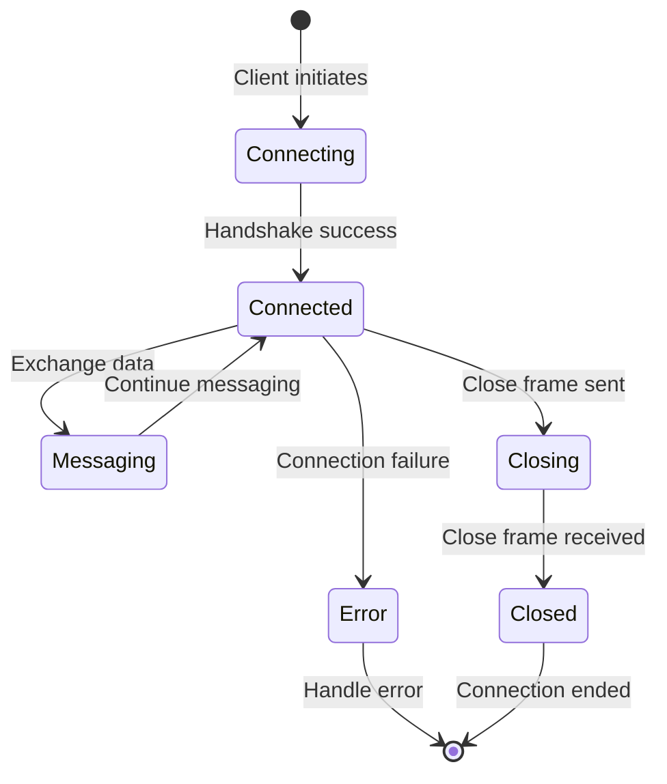
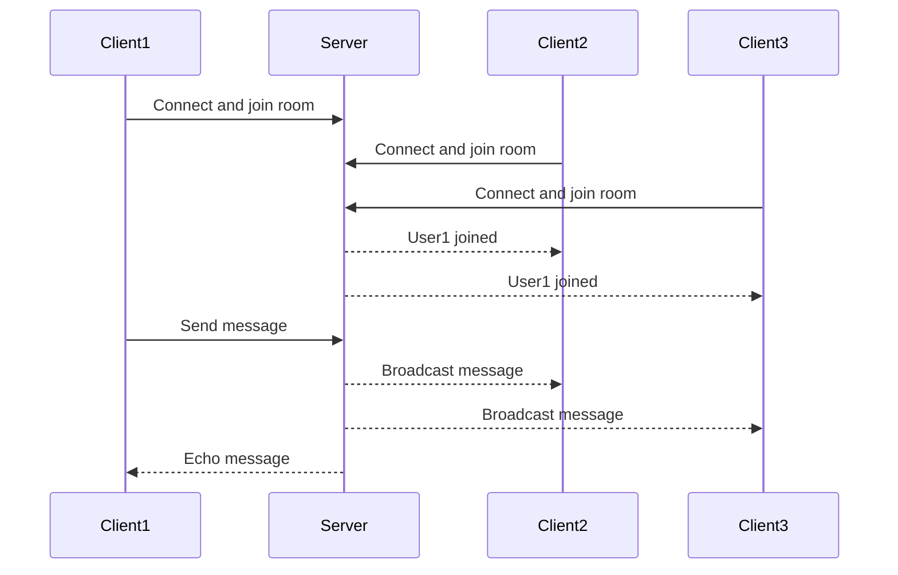
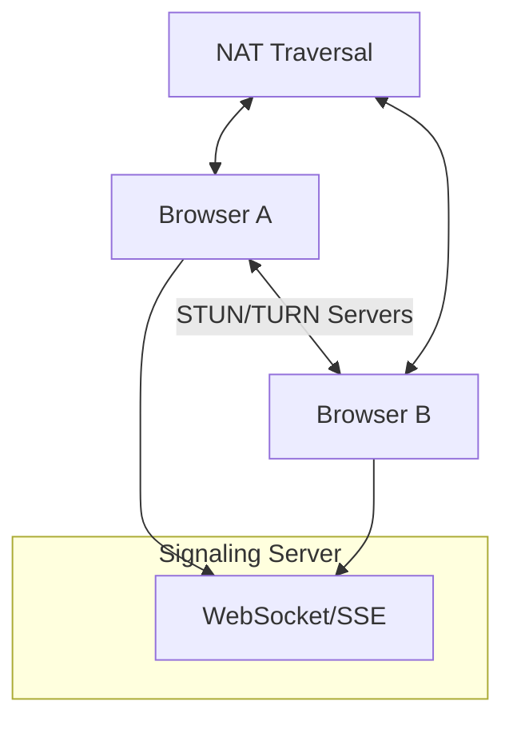
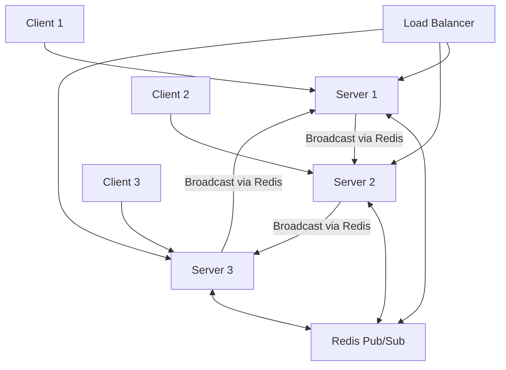

# Chapter 11: Real-time APIs

## Introduction

**📌 Real-time APIs**: Enable instantaneous communication between clients and servers, allowing data to be pushed from server to client as soon as it becomes available.

Real-time APIs eliminate the need for constant polling requests and provide better user experience with live data updates.

### Why Real-time APIs Matter

- **Instant Updates**: Users see changes immediately without refreshing
- **Better User Experience**: Responsive applications with live data
- **Reduced Server Load**: No need for constant polling requests
- **Modern Applications**: Essential for chat, notifications, live tracking, collaboration

### Real-time Communication Technologies

| Technology | Connection Type | Data Flow | Best Use Cases |
|------------|----------------|-----------|----------------|
| **WebSockets** | Persistent TCP | Bidirectional | Chat, gaming, collaborative editing |
| **Server-Sent Events** | HTTP streaming | Server-to-client only | Live updates, notifications |
| **Long Polling** | Extended HTTP | Request-response | Simple real-time needs |
| **WebRTC** | Peer-to-peer | Direct client-to-client | Video calls, file sharing |

---

## WebSockets

### WebSocket Fundamentals

**📌 WebSocket**: Persistent, bidirectional communication channel between client and server over a single TCP connection.

#### WebSocket vs HTTP

| Aspect | HTTP | WebSocket |
|--------|------|------------|
| **Connection** | Stateless, request-response | Persistent, stateful |
| **Data Flow** | Client initiates, server responds | Bidirectional |
| **Overhead** | Headers for each request | Minimal headers after handshake |
| **Latency** | Higher (new request each time) | Lower (persistent connection) |
| **Scalability** | Easier to scale horizontally | More complex scaling needs |

#### WebSocket Connection Lifecycle



### WebSocket Implementation

#### Client-Side WebSocket

```javascript
// WebSocket client implementation
class WebSocketClient {
  constructor(url) {
    this.url = url;
    this.ws = null;
    this.reconnectAttempts = 0;
    this.maxReconnectAttempts = 5;
    this.reconnectDelay = 1000;
  }

  connect() {
    try {
      this.ws = new WebSocket(this.url);
      this.setupEventHandlers();
    } catch (error) {
      console.error('WebSocket connection error:', error);
      this.scheduleReconnect();
    }
  }

  setupEventHandlers() {
    this.ws.onopen = (event) => {
      console.log('WebSocket connected');
      this.reconnectAttempts = 0;
      this.onConnect(event);
    };

    this.ws.onmessage = (event) => {
      const message = JSON.parse(event.data);
      this.onMessage(message);
    };

    this.ws.onclose = (event) => {
      console.log('WebSocket disconnected:', event.code, event.reason);
      this.onDisconnect(event);
      this.scheduleReconnect();
    };

    this.ws.onerror = (error) => {
      console.error('WebSocket error:', error);
      this.onError(error);
    };
  }

  send(message) {
    if (this.ws && this.ws.readyState === WebSocket.OPEN) {
      this.ws.send(JSON.stringify(message));
    } else {
      console.warn('WebSocket not ready, message queued');
      this.queueMessage(message);
    }
  }

  scheduleReconnect() {
    if (this.reconnectAttempts < this.maxReconnectAttempts) {
      const delay = this.reconnectDelay * Math.pow(2, this.reconnectAttempts);
      setTimeout(() => {
        this.reconnectAttempts++;
        this.connect();
      }, delay);
    }
  }

  // Override these methods in your implementation
  onConnect(event) { /* Implement */ }
  onMessage(message) { /* Implement */ }
  onDisconnect(event) { /* Implement */ }
  onError(error) { /* Implement */ }
}

// Usage example
const chatClient = new WebSocketClient('ws://localhost:3000/chat');

chatClient.onConnect = () => {
  chatClient.send({
    type: 'join',
    room: 'general',
    user: 'JohnDoe'
  });
};

chatClient.onMessage = (message) => {
  if (message.type === 'chat') {
    displayChatMessage(message.user, message.text);
  }
};
```

#### Server-Side WebSocket (Node.js)

```javascript
// WebSocket server with Socket.io
const express = require('express');
const http = require('http');
const socketIo = require('socket.io');

const app = express();
const server = http.createServer(app);
const io = socketIo(server, {
  cors: {
    origin: "*",
    methods: ["GET", "POST"]
  }
});

// Store connected users and rooms
const users = new Map();
const rooms = new Map();

io.on('connection', (socket) => {
  console.log('User connected:', socket.id);

  // Handle user joining a room
  socket.on('join', (data) => {
    const { room, user } = data;

    // Join room
    socket.join(room);

    // Store user info
    users.set(socket.id, { user, room });

    // Notify room about new user
    socket.to(room).emit('user_joined', {
      user,
      timestamp: new Date().toISOString()
    });

    console.log(`${user} joined room ${room}`);
  });

  // Handle chat messages
  socket.on('chat_message', (data) => {
    const userInfo = users.get(socket.id);
    if (userInfo) {
      const message = {
        user: userInfo.user,
        text: data.text,
        timestamp: new Date().toISOString()
      };

      // Send to all users in the room
      io.to(userInfo.room).emit('chat_message', message);
    }
  });

  // Handle typing indicators
  socket.on('typing', (data) => {
    const userInfo = users.get(socket.id);
    if (userInfo) {
      socket.to(userInfo.room).emit('user_typing', {
        user: userInfo.user,
        isTyping: data.isTyping
      });
    }
  });

  // Handle disconnection
  socket.on('disconnect', () => {
    const userInfo = users.get(socket.id);
    if (userInfo) {
      // Notify room about user leaving
      socket.to(userInfo.room).emit('user_left', {
        user: userInfo.user,
        timestamp: new Date().toISOString()
      });

      users.delete(socket.id);
      console.log(`${userInfo.user} disconnected`);
    }
  });
});

const PORT = process.env.PORT || 3000;
server.listen(PORT, () => {
  console.log(`WebSocket server running on port ${PORT}`);
});
```

### WebSocket Use Cases

#### Real-time Chat Application



#### Live Data Dashboard

| Feature | WebSocket Implementation | Traditional Polling |
|---------|-------------------------|-------------------|
| **Data Freshness** | Immediate (ms) | Delayed (seconds) |
| **Server Load** | Low (persistent connections) | High (continuous requests) |
| **Bandwidth** | Efficient (only changes) | Wasteful (full responses) |
| **Complexity** | Higher | Lower |
| **Scalability** | More challenging | Easier |

---

## Server-Sent Events (SSE)

### SSE Fundamentals

**📌 Server-Sent Events (SSE)**: Technology that enables servers to push data to clients over a single HTTP connection.

#### SSE vs WebSockets

| Feature | SSE | WebSockets |
|---------|-----|------------|
| **Direction** | Server-to-client only | Bidirectional |
| **Protocol** | HTTP | WebSocket protocol |
| **Reconnection** | Automatic | Manual implementation |
| **Data Format** | Text/event-stream | Any format |
| **Browser Support** | Native | Native |
| **Complexity** | Simple | More complex |

#### SSE Event Format

```
data: First event\n
\n
data: Second event\n
id: 42\n
retry: 5000\n
\n
event: custom-event\n
data: {"message": "Custom data"}\n
\n
```

### SSE Implementation

#### Server-Side SSE (Node.js)

```javascript
// SSE server implementation
class SSEServer {
  constructor() {
    this.clients = new Map();
  }

  // Add new client
  addClient(req, res) {
    const clientId = this.generateClientId();

    // Set SSE headers
    res.writeHead(200, {
      'Content-Type': 'text/event-stream',
      'Cache-Control': 'no-cache',
      'Connection': 'keep-alive',
      'Access-Control-Allow-Origin': '*',
      'Access-Control-Allow-Headers': 'Cache-Control'
    });

    // Send initial connection event
    this.sendEvent(res, 'connected', {
      clientId,
      timestamp: new Date().toISOString()
    });

    // Store client connection
    this.clients.set(clientId, {
      id: clientId,
      response: res,
      lastPing: Date.now()
    });

    // Handle client disconnection
    req.on('close', () => {
      this.removeClient(clientId);
    });

    // Send periodic keep-alive
    const heartbeat = setInterval(() => {
      this.sendEvent(res, 'ping', { timestamp: Date.now() });
    }, 30000);

    res.on('close', () => {
      clearInterval(heartbeat);
    });

    return clientId;
  }

  // Send event to specific client
  sendEvent(res, type, data, id = null) {
    let event = '';

    if (id) {
      event += `id: ${id}\n`;
    }

    event += `event: ${type}\n`;
    event += `data: ${JSON.stringify(data)}\n\n`;

    res.write(event);
  }

  // Broadcast to all clients
  broadcast(type, data) {
    for (const client of this.clients.values()) {
      this.sendEvent(client.response, type, data);
    }
  }

  // Send to specific client
  sendToClient(clientId, type, data) {
    const client = this.clients.get(clientId);
    if (client) {
      this.sendEvent(client.response, type, data);
    }
  }

  // Remove client
  removeClient(clientId) {
    this.clients.delete(clientId);
    console.log(`Client ${clientId} disconnected`);
  }

  generateClientId() {
    return Math.random().toString(36).substr(2, 9);
  }
}

// Express server with SSE
const express = require('express');
const app = express();
const sseServer = new SSEServer();

// SSE endpoint
app.get('/events', (req, res) => {
  sseServer.addClient(req, res);
});

// API endpoints that trigger events
app.post('/api/notifications', express.json(), (req, res) => {
  const { message, type = 'info' } = req.body;

  // Broadcast notification to all connected clients
  sseServer.broadcast('notification', {
    type,
    message,
    timestamp: new Date().toISOString()
  });

  res.json({ success: true, message: 'Notification sent' });
});

// Stock price updates
app.get('/api/stocks/:symbol/updates', (req, res) => {
  const { symbol } = req.params;
  const clientId = sseServer.addClient(req, res);

  // Simulate stock price updates
  const priceUpdate = setInterval(() => {
    const price = 100 + Math.random() * 20;
    sseServer.sendToClient(clientId, 'price_update', {
      symbol,
      price: price.toFixed(2),
      change: (Math.random() - 0.5).toFixed(2),
      timestamp: new Date().toISOString()
    });
  }, 2000);

  res.on('close', () => {
    clearInterval(priceUpdate);
  });
});
```

#### Client-Side SSE

```javascript
// SSE client implementation
class SSEClient {
  constructor(url) {
    this.url = url;
    this.eventSource = null;
    this.reconnectDelay = 1000;
    this.maxReconnectAttempts = 5;
    this.reconnectAttempts = 0;
  }

  connect() {
    try {
      this.eventSource = new EventSource(this.url);
      this.setupEventHandlers();
    } catch (error) {
      console.error('SSE connection error:', error);
      this.scheduleReconnect();
    }
  }

  setupEventHandlers() {
    this.eventSource.onopen = (event) => {
      console.log('SSE connected');
      this.reconnectAttempts = 0;
      this.onConnect(event);
    };

    this.eventSource.onmessage = (event) => {
      const data = JSON.parse(event.data);
      this.onMessage(data);
    };

    this.eventSource.onerror = (error) => {
      console.error('SSE error:', error);
      this.onError(error);

      if (this.eventSource.readyState === EventSource.CLOSED) {
        this.scheduleReconnect();
      }
    };

    // Handle custom event types
    this.eventSource.addEventListener('notification', (event) => {
      const data = JSON.parse(event.data);
      this.onNotification(data);
    });

    this.eventSource.addEventListener('price_update', (event) => {
      const data = JSON.parse(event.data);
      this.onPriceUpdate(data);
    });
  }

  scheduleReconnect() {
    if (this.reconnectAttempts < this.maxReconnectAttempts) {
      const delay = this.reconnectDelay * Math.pow(2, this.reconnectAttempts);
      setTimeout(() => {
        this.reconnectAttempts++;
        this.connect();
      }, delay);
    }
  }

  disconnect() {
    if (this.eventSource) {
      this.eventSource.close();
      this.eventSource = null;
    }
  }

  // Override these methods
  onConnect(event) { /* Implement */ }
  onMessage(data) { /* Implement */ }
  onError(error) { /* Implement */ }
  onNotification(data) { /* Implement */ }
  onPriceUpdate(data) { /* Implement */ }
}

// Usage example
const stockClient = new SSEClient('/api/stocks/AAPL/updates');

stockClient.onPriceUpdate = (data) => {
  updateStockDisplay(data.symbol, data.price, data.change);
};

stockClient.onNotification = (data) => {
  showNotification(data.type, data.message);
};
```

### SSE Use Cases

| Application | SSE Benefits | Implementation |
|-------------|--------------|----------------|
| **Live News Feeds** | Automatic updates, simple implementation | Push new articles as they publish |
| **Stock Tickers** | Real-time price updates, low bandwidth | Stream price changes |
| **Notification Systems** | Server-initiated alerts | Push notifications to users |
| **Progress Updates** | Real-time progress tracking | Update long-running task status |
| **Live Scores** | Sports scores, live events | Stream score changes |

---

## WebRTC

### WebRTC Fundamentals

**📌 WebRTC (Web Real-Time Communication)**: Technology that enables peer-to-peer audio, video, and data sharing directly between browsers without servers.

#### WebRTC Architecture



#### WebRTC Components

| Component | Purpose | Protocol |
|-----------|---------|----------|
| **RTCPeerConnection** | Establish peer-to-peer connection | SRTP, DTLS |
| **RTCDataChannel** | Bidirectional data exchange | SCTP |
| **MediaStream** | Audio/video streams | RTP |
| **Signaling** | Connection setup | WebSocket/SSE |
| **STUN/TURN** | NAT traversal, relay servers | STUN, TURN |

### WebRTC Implementation

#### Simple WebRTC Video Call

```javascript
// WebRTC video call implementation
class WebRTCCall {
  constructor(localVideo, remoteVideo) {
    this.localVideo = localVideo;
    this.remoteVideo = remoteVideo;
    this.peerConnection = null;
    this.localStream = null;
    this.ws = null;

    this.configuration = {
      iceServers: [
        { urls: 'stun:stun.l.google.com:19302' },
        { urls: 'stun:stun1.l.google.com:19302' }
      ]
    };
  }

  async initialize() {
    try {
      // Get local media stream
      this.localStream = await navigator.mediaDevices.getUserMedia({
        video: true,
        audio: true
      });

      // Display local video
      this.localVideo.srcObject = this.localStream;

      // Create peer connection
      this.peerConnection = new RTCPeerConnection(this.configuration);

      // Add local stream to peer connection
      this.localStream.getTracks().forEach(track => {
        this.peerConnection.addTrack(track, this.localStream);
      });

      // Setup event handlers
      this.setupPeerConnectionHandlers();

      // Connect to signaling server
      this.connectToSignalingServer();

    } catch (error) {
      console.error('Error initializing WebRTC:', error);
    }
  }

  setupPeerConnectionHandlers() {
    // Handle remote stream
    this.peerConnection.ontrack = (event) => {
      this.remoteVideo.srcObject = event.streams[0];
    };

    // Handle ICE candidates
    this.peerConnection.onicecandidate = (event) => {
      if (event.candidate) {
        this.sendToSignalingServer({
          type: 'ice-candidate',
          candidate: event.candidate
        });
      }
    };

    // Handle connection state changes
    this.peerConnection.onconnectionstatechange = () => {
      console.log('Connection state:', this.peerConnection.connectionState);
    };
  }

  async createOffer() {
    try {
      const offer = await this.peerConnection.createOffer();
      await this.peerConnection.setLocalDescription(offer);

      this.sendToSignalingServer({
        type: 'offer',
        offer: offer
      });
    } catch (error) {
      console.error('Error creating offer:', error);
    }
  }

  async handleOffer(offer) {
    try {
      await this.peerConnection.setRemoteDescription(offer);
      const answer = await this.peerConnection.createAnswer();
      await this.peerConnection.setLocalDescription(answer);

      this.sendToSignalingServer({
        type: 'answer',
        answer: answer
      });
    } catch (error) {
      console.error('Error handling offer:', error);
    }
  }

  async handleAnswer(answer) {
    try {
      await this.peerConnection.setRemoteDescription(answer);
    } catch (error) {
      console.error('Error handling answer:', error);
    }
  }

  async handleIceCandidate(candidate) {
    try {
      await this.peerConnection.addIceCandidate(candidate);
    } catch (error) {
      console.error('Error adding ICE candidate:', error);
    }
  }

  connectToSignalingServer() {
    this.ws = new WebSocket('ws://localhost:3000/signaling');

    this.ws.onmessage = async (event) => {
      const message = JSON.parse(event.data);

      switch (message.type) {
        case 'offer':
          await this.handleOffer(message.offer);
          break;
        case 'answer':
          await this.handleAnswer(message.answer);
          break;
        case 'ice-candidate':
          await this.handleIceCandidate(message.candidate);
          break;
      }
    };
  }

  sendToSignalingServer(message) {
    if (this.ws && this.ws.readyState === WebSocket.OPEN) {
      this.ws.send(JSON.stringify(message));
    }
  }

  endCall() {
    // Stop local stream
    if (this.localStream) {
      this.localStream.getTracks().forEach(track => track.stop());
    }

    // Close peer connection
    if (this.peerConnection) {
      this.peerConnection.close();
    }

    // Close WebSocket
    if (this.ws) {
      this.ws.close();
    }
  }
}

// Usage example
const localVideo = document.getElementById('localVideo');
const remoteVideo = document.getElementById('remoteVideo');
const call = new WebRTCCall(localVideo, remoteVideo);

// Initialize call
call.initialize();

// Start call (caller)
document.getElementById('startCall').addEventListener('click', () => {
  call.createOffer();
});

// End call
document.getElementById('endCall').addEventListener('click', () => {
  call.endCall();
});
```

### WebRTC Data Channels

```javascript
// WebRTC data channel for real-time data exchange
class WebRTCDataChannel {
  constructor() {
    this.peerConnection = null;
    this.dataChannel = null;
    this.initializeConnection();
  }

  initializeConnection() {
    this.peerConnection = new RTCPeerConnection({
      iceServers: [{ urls: 'stun:stun.l.google.com:19302' }]
    });

    // Setup data channel (initiator)
    this.setupDataChannel();

    // Handle incoming data channels (receiver)
    this.peerConnection.ondatachannel = (event) => {
      this.dataChannel = event.channel;
      this.setupDataChannelHandlers();
    };
  }

  setupDataChannel() {
    this.dataChannel = this.peerConnection.createDataChannel('chat', {
      ordered: true,
      maxRetransmits: 3
    });

    this.setupDataChannelHandlers();
  }

  setupDataChannelHandlers() {
    this.dataChannel.onopen = () => {
      console.log('Data channel opened');
      this.onDataChannelOpen();
    };

    this.dataChannel.onmessage = (event) => {
      const data = JSON.parse(event.data);
      this.onMessage(data);
    };

    this.dataChannel.onclose = () => {
      console.log('Data channel closed');
      this.onDataChannelClose();
    };

    this.dataChannel.onerror = (error) => {
      console.error('Data channel error:', error);
      this.onDataChannelError(error);
    };
  }

  sendMessage(type, data) {
    if (this.dataChannel && this.dataChannel.readyState === 'open') {
      this.dataChannel.send(JSON.stringify({
        type,
        data,
        timestamp: Date.now()
      }));
    }
  }

  sendFile(file) {
    if (this.dataChannel && this.dataChannel.readyState === 'open') {
      const chunkSize = 16384; // 16KB chunks
      let offset = 0;

      const sendChunk = () => {
        const reader = new FileReader();

        reader.onload = (event) => {
          this.dataChannel.send(event.target.result);
          offset += event.target.result.byteLength;

          if (offset < file.size) {
            sendChunk();
          } else {
            this.sendMessage('file_complete', {
              name: file.name,
              size: file.size
            });
          }
        };

        const chunk = file.slice(offset, offset + chunkSize);
        reader.readAsArrayBuffer(chunk);
      };

      this.sendMessage('file_start', {
        name: file.name,
        size: file.size,
        type: file.type
      });

      sendChunk();
    }
  }

  // Override these methods
  onDataChannelOpen() { /* Implement */ }
  onDataChannelClose() { /* Implement */ }
  onDataChannelError(error) { /* Implement */ }
  onMessage(data) { /* Implement */ }
}
```

---

## Long Polling

### Long Polling Implementation

**📌 Long Polling**: Extended HTTP requests where the server holds the connection open until new data is available.

```javascript
// Long polling implementation
class LongPollingClient {
  constructor(url) {
    this.url = url;
    this.isPolling = false;
    this.lastTimestamp = null;
  }

  async startPolling(callback) {
    this.isPolling = true;

    while (this.isPolling) {
      try {
        const response = await this.poll();

        if (response.messages && response.messages.length > 0) {
          this.lastTimestamp = response.timestamp;
          callback(response.messages);
        }

        // Small delay before next poll
        await this.sleep(100);

      } catch (error) {
        console.error('Polling error:', error);
        await this.sleep(5000); // Longer delay on error
      }
    }
  }

  async poll() {
    const params = new URLSearchParams();

    if (this.lastTimestamp) {
      params.append('since', this.lastTimestamp);
    }

    const response = await fetch(`${this.url}?${params}`, {
      method: 'GET',
      timeout: 30000 // 30 second timeout
    });

    if (!response.ok) {
      throw new Error(`HTTP ${response.status}: ${response.statusText}`);
    }

    return response.json();
  }

  stopPolling() {
    this.isPolling = false;
  }

  sleep(ms) {
    return new Promise(resolve => setTimeout(resolve, ms));
  }
}

// Server-side long polling endpoint (Express.js)
app.get('/api/messages', async (req, res) => {
  const since = req.query.since;
  const timeout = 30000; // 30 seconds
  const startTime = Date.now();

  // Check for existing messages
  const messages = getMessagesSince(since);

  if (messages.length > 0) {
    return res.json({
      messages,
      timestamp: Date.now()
    });
  }

  // Wait for new messages or timeout
  while (Date.now() - startTime < timeout && res.socket.writable) {
    await new Promise(resolve => setTimeout(resolve, 1000));

    const newMessages = getMessagesSince(since);

    if (newMessages.length > 0) {
      return res.json({
        messages: newMessages,
        timestamp: Date.now()
      });
    }
  }

  // Timeout reached, return empty response
  res.json({
    messages: [],
    timestamp: Date.now()
  });
});
```

### Long Polling vs WebSockets

| Factor | Long Polling | WebSockets |
|--------|-------------|------------|
| **Complexity** | Low (HTTP) | Higher (WebSocket protocol) |
| **Overhead** | Higher (new connections) | Lower (persistent connection) |
| **Latency** | Higher (reconnect delay) | Lower (instant) |
| **Scalability** | Easier (HTTP infrastructure) | More complex |
| **Browser Support** | Universal | Modern browsers |
| **Use Case** | Simple updates | Real-time collaboration |

---

## Real-time API Architecture Patterns

### Scaling Real-time Applications

#### Horizontal Scaling with Redis Pub/Sub



#### Redis-based Scaling Implementation

```javascript
// Scaling WebSockets with Redis
const express = require('express');
const http = require('http');
const socketIo = require('socket.io');
const redis = require('redis');

const app = express();
const server = http.createServer(app);
const io = socketIo(server);

// Redis clients
const redisClient = redis.createClient();
const redisPublisher = redisClient.duplicate();
const redisSubscriber = redisClient.duplicate();

// Server ID for this instance
const serverId = process.env.SERVER_ID || `server_${Math.random()}`;

// Handle WebSocket connections
io.on('connection', (socket) => {
  console.log(`Client connected to ${serverId}:`, socket.id);

  socket.on('join_room', (data) => {
    const { room, user } = data;

    // Join room locally
    socket.join(room);

    // Store user info in Redis
    redisClient.hset(`room:${room}`, socket.id, JSON.stringify({
      user,
      serverId,
      connectedAt: new Date().toISOString()
    }));

    // Notify other servers about new user
    redisPublisher.publish('room_events', JSON.stringify({
      type: 'user_joined',
      room,
      user,
      serverId,
      socketId: socket.id
    }));

    console.log(`${user} joined room ${room} on ${serverId}`);
  });

  socket.on('chat_message', (data) => {
    const { room, message } = data;

    // Publish message to Redis for all servers
    redisPublisher.publish('room_events', JSON.stringify({
      type: 'chat_message',
      room,
      message,
      user: data.user,
      serverId,
      timestamp: new Date().toISOString()
    }));
  });

  socket.on('disconnect', () => {
    console.log(`Client disconnected from ${serverId}:`, socket.id);

    // Find user's rooms and clean up
    redisClient.keys('room:*', (err, keys) => {
      keys.forEach(roomKey => {
        redisClient.hget(roomKey, socket.id, (err, userData) => {
          if (userData) {
            const userInfo = JSON.parse(userData);
            const room = roomKey.replace('room:', '');

            // Remove user from room
            redisClient.hdel(roomKey, socket.id);

            // Notify other servers about user leaving
            redisPublisher.publish('room_events', JSON.stringify({
              type: 'user_left',
              room,
              user: userInfo.user,
              serverId,
              timestamp: new Date().toISOString()
            }));
          }
        });
      });
    });
  });
});

// Subscribe to Redis for cross-server events
redisSubscriber.subscribe('room_events');

redisSubscriber.on('message', (channel, message) => {
  const event = JSON.parse(message);

  // Only process events from other servers
  if (event.serverId === serverId) return;

  switch (event.type) {
    case 'user_joined':
      io.to(event.room).emit('user_joined', {
        user: event.user,
        timestamp: event.timestamp
      });
      break;

    case 'user_left':
      io.to(event.room).emit('user_left', {
        user: event.user,
        timestamp: event.timestamp
      });
      break;

    case 'chat_message':
      io.to(event.room).emit('chat_message', {
        user: event.user,
        message: event.message,
        timestamp: event.timestamp
      });
      break;
  }
});

const PORT = process.env.PORT || 3000;
server.listen(PORT, () => {
  console.log(`Real-time server ${serverId} running on port ${PORT}`);
});
```

### Load Balancing Real-time Connections

#### Session Affinity (Sticky Sessions)

```nginx
# Nginx configuration for WebSocket load balancing
upstream websocket_servers {
    ip_hash; # Sticky sessions based on client IP

    server localhost:3000;
    server localhost:3001;
    server localhost:3002;
}

server {
    listen 80;
    server_name api.example.com;

    # WebSocket upgrade handling
    location /socket.io/ {
        proxy_pass http://websocket_servers;
        proxy_http_version 1.1;
        proxy_set_header Upgrade $http_upgrade;
        proxy_set_header Connection "upgrade";
        proxy_set_header Host $host;
        proxy_set_header X-Real-IP $remote_addr;
        proxy_set_header X-Forwarded-For $proxy_add_x_forwarded_for;
        proxy_set_header X-Forwarded-Proto $scheme;
        proxy_read_timeout 86400;
        proxy_send_timeout 86400;
    }

    # Regular API routes
    location /api/ {
        proxy_pass http://websocket_servers;
        proxy_set_header Host $host;
        proxy_set_header X-Real-IP $remote_addr;
        proxy_set_header X-Forwarded-For $proxy_add_x_forwarded_for;
        proxy_set_header X-Forwarded-Proto $scheme;
    }
}
```

---

## Performance and Optimization

### Real-time API Performance Metrics

| Metric | Target | Monitoring |
|--------|--------|------------|
| **Connection Time** | < 1 second | WebSocket handshake duration |
| **Message Latency** | < 100ms | Time from send to receive |
| **Message Throughput** | > 1000 msg/sec | Messages per second |
| **Connection Success Rate** | > 99.5% | Failed connections |
| **Memory Usage** | < 512MB per server | Connection memory footprint |
| **CPU Usage** | < 70% | Server processing load |

### Optimization Techniques

#### Message Compression

```javascript
// WebSocket message compression
const zlib = require('zlib');

class CompressedWebSocket {
  constructor(ws) {
    this.ws = ws;
  }

  async sendCompressed(data) {
    const jsonString = JSON.stringify(data);

    // Only compress if message is larger than 1KB
    if (jsonString.length > 1024) {
      const compressed = await this.compress(jsonString);
      this.ws.send(JSON.stringify({
        compressed: true,
        data: compressed.toString('base64')
      }));
    } else {
      this.ws.send(JSON.stringify({
        compressed: false,
        data: jsonString
      }));
    }
  }

  async decompressMessage(message) {
    try {
      const parsed = JSON.parse(message);

      if (parsed.compressed) {
        const buffer = Buffer.from(parsed.data, 'base64');
        return JSON.parse(await this.decompress(buffer));
      } else {
        return JSON.parse(parsed.data);
      }
    } catch (error) {
      console.error('Error decompressing message:', error);
      return null;
    }
  }

  compress(data) {
    return new Promise((resolve, reject) => {
      zlib.gzip(data, { level: 6 }, (err, result) => {
        if (err) reject(err);
        else resolve(result);
      });
    });
  }

  decompress(buffer) {
    return new Promise((resolve, reject) => {
      zlib.gunzip(buffer, (err, result) => {
        if (err) reject(err);
        else resolve(result.toString());
      });
    });
  }
}
```

#### Connection Pooling and Management

```javascript
// Connection pool management
class ConnectionPool {
  constructor(maxConnections = 10000) {
    this.connections = new Map();
    this.maxConnections = maxConnections;
    this.stats = {
      total: 0,
      active: 0,
      rejected: 0
    };
  }

  addConnection(socketId, connection) {
    if (this.stats.active >= this.maxConnections) {
      this.stats.rejected++;
      connection.close(1013, 'Server overloaded');
      return false;
    }

    this.connections.set(socketId, {
      connection,
      connectedAt: Date.now(),
      lastActivity: Date.now(),
      messagesSent: 0,
      messagesReceived: 0
    });

    this.stats.total++;
    this.stats.active++;

    return true;
  }

  removeConnection(socketId) {
    const connection = this.connections.get(socketId);
    if (connection) {
      connection.connection.close();
      this.connections.delete(socketId);
      this.stats.active--;
      return true;
    }
    return false;
  }

  getConnection(socketId) {
    return this.connections.get(socketId);
  }

  updateActivity(socketId) {
    const connection = this.connections.get(socketId);
    if (connection) {
      connection.lastActivity = Date.now();
    }
  }

  // Clean up inactive connections
  cleanupInactive(maxInactiveTime = 300000) { // 5 minutes
    const now = Date.now();
    let cleaned = 0;

    for (const [socketId, conn] of this.connections) {
      if (now - conn.lastActivity > maxInactiveTime) {
        this.removeConnection(socketId);
        cleaned++;
      }
    }

    return cleaned;
  }

  getStats() {
    return {
      ...this.stats,
      averageConnectionAge: this.getAverageConnectionAge(),
      topActiveConnections: this.getTopActiveConnections()
    };
  }

  getAverageConnectionAge() {
    if (this.stats.active === 0) return 0;

    const now = Date.now();
    let totalAge = 0;

    for (const conn of this.connections.values()) {
      totalAge += now - conn.connectedAt;
    }

    return Math.floor(totalAge / this.stats.active / 1000); // seconds
  }

  getTopActiveConnections(limit = 10) {
    const connections = Array.from(this.connections.values())
      .sort((a, b) => b.messagesSent - a.messagesSent)
      .slice(0, limit)
      .map(conn => ({
        duration: Math.floor((Date.now() - conn.connectedAt) / 1000),
        messagesSent: conn.messagesSent,
        messagesReceived: conn.messagesReceived
      }));

    return connections;
  }
}
```

---

## Interview Questions

### **Q1: When would you choose WebSockets vs Server-Sent Events?**

**Answer:**
**WebSockets when you need:**
- **Bidirectional communication**: Both client and server send messages
- **Low latency**: Real-time gaming, chat applications
- **Complex data exchange**: File sharing, collaborative editing
- **Custom protocols**: Binary data, specific messaging patterns

**Server-Sent Events when you need:**
- **Unidirectional updates**: Server pushes updates to client
- **Simple implementation**: Easy to set up and maintain
- **Automatic reconnection**: Built-in reconnection handling
- **Text-based data**: Notifications, news feeds, stock prices
- **Better browser support**: Works in older browsers

**Decision matrix:**
```
if (bidirectional_communication_needed) {
  use WebSockets;
} else if (simple_server_updates_needed) {
  use Server-Sent Events;
} else if (browser_compatibility_critical) {
  use Server-Sent Events;
} else {
  use WebSockets for flexibility;
}
```

**Example scenarios:**
- **Chat app**: WebSockets (bidirectional messaging)
- **Live scores**: SSE (score updates from server)
- **Collaborative document**: WebSockets (real-time editing)
- **Notification system**: SSE (push notifications)

### **Q2: How do you scale WebSocket applications across multiple servers?**

**Answer:**
**Scaling Strategies:**

1. **Redis Pub/Sub Pattern**:
   - Each server subscribes to Redis channels
   - Messages published to Redis are broadcast to all servers
   - Maintains state synchronization across instances

2. **Sticky Sessions with Load Balancer**:
   - Route users from same IP to same server
   - Simple but creates single point of failure
   - Good for small to medium applications

3. **Database-based State Management**:
   - Store connection state in shared database
   - All servers query database for room information
   - Higher latency but more reliable

**Implementation example with Redis:**
```javascript
// Cross-server message broadcasting
const redis = require('redis');
const publisher = redis.createClient();
const subscriber = redis.createClient();

// On new message
socket.on('message', (data) => {
  publisher.publish('room:' + data.room, JSON.stringify({
    type: 'message',
    data: data,
    serverId: process.env.SERVER_ID
  }));
});

// Listen for messages from other servers
subscriber.subscribe('room:*');
subscriber.on('message', (channel, message) => {
  if (message.serverId !== process.env.SERVER_ID) {
    io.to(channel.replace('room:', '')).emit('message', message.data);
  }
});
```

**Challenges:**
- **Connection state management**: Track which server handles which client
- **Message ordering**: Ensure message consistency across servers
- **Failover handling**: Migrate connections when server fails
- **Load distribution**: Balance connections efficiently

### **Q3: What are the main security concerns with real-time APIs?**

**Answer:**
**Critical Security Issues:**

1. **Authentication and Authorization**:
   - Verify WebSocket connections during handshake
   - Validate tokens before allowing real-time features
   - Implement per-room/permission-based access

2. **Message Validation and Sanitization**:
   - Validate all incoming messages
   - Sanitize data to prevent XSS attacks
   - Limit message size to prevent DoS attacks

3. **Rate Limiting**:
   - Limit messages per connection
   - Implement connection rate limits
   - Prevent message flooding attacks

4. **CORS and Origin Validation**:
   - Validate WebSocket origins
   - Implement proper CORS headers
   - Prevent cross-site WebSocket hijacking

**Security implementation:**
```javascript
// Secure WebSocket server
io.on('connection', async (socket, next) => {
  try {
    // Authenticate connection
    const token = socket.handshake.auth.token;
    const user = await validateToken(token);

    if (!user) {
      return next(new Error('Authentication failed'));
    }

    // Rate limiting
    const connectionCount = await redis.incr(`conn:${user.id}`);
    if (connectionCount > 5) {
      return next(new Error('Too many connections'));
    }

    socket.user = user;
    next();

  } catch (error) {
    next(new Error('Authentication error'));
  }
});

// Message validation
socket.on('message', async (data) => {
  try {
    // Validate message structure
    if (!isValidMessage(data)) {
      socket.emit('error', { message: 'Invalid message format' });
      return;
    }

    // Sanitize content
    const sanitized = sanitizeHtml(data.text);

    // Check rate limit
    const messageCount = await redis.incr(`msg:${socket.user.id}`);
    if (messageCount > 100) {
      socket.emit('error', { message: 'Rate limit exceeded' });
      return;
    }

    // Process message
    await processMessage(socket.user, sanitized);

  } catch (error) {
    socket.emit('error', { message: 'Message processing failed' });
  }
});
```

### **Q4: How do you handle connection failures and reconnection logic?**

**Answer:**
**Reconnection Strategy:**

1. **Exponential Backoff**:
   - Start with short delays (1s, 2s, 4s, 8s...)
   - Prevent server overload during outages
   - Maximum retry limits to prevent infinite loops

2. **Connection State Management**:
   - Track connection state (connecting, connected, disconnected)
   - Queue messages while disconnected
   - Replay missed messages on reconnection

3. **Graceful Degradation**:
   - Fall back to polling for non-critical features
   - Show connection status to users
   - Cache recent data locally

**Implementation:**
```javascript
class ReconnectingWebSocket {
  constructor(url, options = {}) {
    this.url = url;
    this.options = {
      maxReconnectAttempts: 10,
      reconnectInterval: 1000,
      maxReconnectInterval: 30000,
      ...options
    };

    this.reconnectAttempts = 0;
    this.messageQueue = [];
    this.state = 'disconnected';
  }

  connect() {
    this.setState('connecting');

    this.ws = new WebSocket(this.url);

    this.ws.onopen = () => {
      console.log('WebSocket connected');
      this.setState('connected');
      this.reconnectAttempts = 0;
      this.flushMessageQueue();
    };

    this.ws.onclose = (event) => {
      console.log('WebSocket disconnected:', event.code);
      this.setState('disconnected');
      this.scheduleReconnect();
    };

    this.ws.onerror = (error) => {
      console.error('WebSocket error:', error);
    };
  }

  scheduleReconnect() {
    if (this.reconnectAttempts >= this.options.maxReconnectAttempts) {
      console.log('Max reconnection attempts reached');
      return;
    }

    const delay = Math.min(
      this.options.reconnectInterval * Math.pow(2, this.reconnectAttempts),
      this.options.maxReconnectInterval
    );

    setTimeout(() => {
      this.reconnectAttempts++;
      console.log(`Reconnection attempt ${this.reconnectAttempts}`);
      this.connect();
    }, delay);
  }

  send(message) {
    if (this.state === 'connected') {
      this.ws.send(JSON.stringify(message));
    } else {
      this.messageQueue.push(message);
    }
  }

  flushMessageQueue() {
    while (this.messageQueue.length > 0) {
      const message = this.messageQueue.shift();
      this.send(message);
    }
  }

  setState(newState) {
    this.state = newState;
    this.onStateChange(newState);
  }

  onStateChange(state) {
    // Override to handle state changes
    console.log('Connection state:', state);
  }
}
```

### **Q5: What monitoring and metrics should you track for real-time APIs?**

**Answer:**
**Essential Metrics:**

**Connection Metrics:**
- **Active Connections**: Current connected clients
- **Connection Rate**: New connections per second
- **Disconnection Rate**: Connections lost per second
- **Connection Duration**: Average session length
- **Concurrent Users**: Peak simultaneous connections

**Performance Metrics:**
- **Message Latency**: Time from send to receive
- **Message Rate**: Messages per second per connection
- **Server Response Time**: WebSocket event processing time
- **Memory Usage**: Memory per connection
- **CPU Usage**: Server processing load

**Business Metrics:**
- **User Engagement**: Messages per user session
- **Feature Usage**: Real-time feature adoption
- **Error Rates**: Failed connections, dropped messages
- **Geographic Distribution**: User locations

**Monitoring Implementation:**
```javascript
// Real-time metrics collection
class RealTimeMetrics {
  constructor() {
    this.metrics = {
      connections: {
        total: 0,
        active: 0,
        failed: 0
      },
      messages: {
        sent: 0,
        received: 0,
        failed: 0
      },
      performance: {
        avgLatency: 0,
        maxLatency: 0,
        messagesPerSecond: 0
      }
    };

    this.latencyMeasurements = [];
  }

  recordConnection(type) {
    this.metrics.connections[type]++;
  }

  recordMessage(type, latency = null) {
    this.metrics.messages[type]++;

    if (latency !== null) {
      this.latencyMeasurements.push(latency);
      this.updateLatencyMetrics();
    }
  }

  updateLatencyMetrics() {
    if (this.latencyMeasurements.length === 0) return;

    const sum = this.latencyMeasurements.reduce((a, b) => a + b, 0);
    this.metrics.performance.avgLatency = sum / this.latencyMeasurements.length;
    this.metrics.performance.maxLatency = Math.max(...this.latencyMeasurements);

    // Keep only last 1000 measurements
    if (this.latencyMeasurements.length > 1000) {
      this.latencyMeasurements = this.latencyMeasurements.slice(-1000);
    }
  }

  getMetrics() {
    return {
      ...this.metrics,
      timestamp: new Date().toISOString(),
      uptime: process.uptime()
    };
  }
}

// Integration with monitoring systems
const metrics = new RealTimeMetrics();

// Send metrics to monitoring service
setInterval(() => {
  const data = metrics.getMetrics();

  // Send to Prometheus, DataDog, etc.
  sendToMonitoring('realtime_metrics', data);

  // Log for debugging
  console.log('Real-time metrics:', JSON.stringify(data, null, 2));
}, 60000); // Every minute
```

### **Q6: How do you optimize performance for high-frequency real-time data?**

**Answer:**
**Performance Optimization Techniques:**

1. **Message Batching**:
   - Combine multiple small messages into larger packets
   - Reduce network overhead and processing time
   - Buffer messages for short periods (10-100ms)

2. **Message Compression**:
   - Compress messages larger than 1KB
   - Use gzip or compression algorithms
   - Balance compression ratio vs CPU overhead

3. **Binary Protocols**:
   - Use Protocol Buffers or MessagePack instead of JSON
   - Reduce message size and parsing time
   - Schema evolution support

4. **Selective Updates**:
   - Only send changed data, not full state
   - Implement delta updates
   - Client-side state synchronization

**Implementation examples:**

**Message Batching:**
```javascript
class MessageBatcher {
  constructor(socket, batchSize = 10, batchTimeout = 50) {
    this.socket = socket;
    this.batchSize = batchSize;
    this.batchTimeout = batchTimeout;
    this.messageBuffer = [];
    this.batchTimer = null;
  }

  addMessage(message) {
    this.messageBuffer.push(message);

    if (this.messageBuffer.length >= this.batchSize) {
      this.flushBatch();
    } else if (!this.batchTimer) {
      this.batchTimer = setTimeout(() => {
        this.flushBatch();
      }, this.batchTimeout);
    }
  }

  flushBatch() {
    if (this.messageBuffer.length > 0) {
      this.socket.send(JSON.stringify({
        type: 'batch',
        messages: this.messageBuffer,
        timestamp: Date.now()
      }));

      this.messageBuffer = [];
    }

    if (this.batchTimer) {
      clearTimeout(this.batchTimer);
      this.batchTimer = null;
    }
  }
}
```

**Delta Updates:**
```javascript
class StateSynchronizer {
  constructor() {
    this.serverState = {};
    this.clientStates = new Map();
  }

  updateState(key, value) {
    const oldValue = this.serverState[key];
    this.serverState[key] = value;

    if (JSON.stringify(oldValue) !== JSON.stringify(value)) {
      this.broadcastDelta(key, value);
    }
  }

  broadcastDelta(key, value) {
    const delta = {
      type: 'delta',
      key,
      value,
      timestamp: Date.now()
    };

    // Send only to clients that need this update
    for (const [clientId, clientState] of this.clientStates) {
      if (this.needsUpdate(clientState, key, value)) {
        clientState[key] = value;
        sendToClient(clientId, delta);
      }
    }
  }

  needsUpdate(clientState, key, newValue) {
    const clientValue = clientState[key];
    return JSON.stringify(clientValue) !== JSON.stringify(newValue);
  }
}
```

### **Q7: What are the differences between WebRTC and WebSockets for real-time communication?**

**Answer:**
**Technology Comparison:**

**WebSockets:**
- **Architecture**: Client-server communication via web server
- **Connection**: TCP-based, reliable delivery
- **Latency**: 50-100ms (varies with network)
- **Data Types**: Text, binary, JSON
- **Use Cases**: Chat, notifications, real-time dashboards
- **Scalability**: Server-dependent, requires scaling infrastructure

**WebRTC:**
- **Architecture**: Peer-to-peer communication
- **Connection**: UDP-based for media, DTLS for data
- **Latency**: < 50ms (direct connection)
- **Data Types**: Audio, video, data channels
- **Use Cases**: Video calls, file sharing, gaming
- **Scalability**: Peer-to-peer, minimal server load

**Key Differences:**

| Aspect | WebSockets | WebRTC |
|--------|------------|---------|
| **Connection** | Client-Server | Peer-to-Peer |
| **Server Load** | High (relays all data) | Low (signaling only) |
| **Media Support** | Limited (via data channels) | Native audio/video |
| **NAT Traversal** | Not needed | STUN/TURN required |
| **Firewall Issues** | Minimal (HTTP port) | Complex (UDP ports) |
| **Browser Support** | Universal | Modern browsers |

**When to use each:**

**WebSockets for:**
- Text-based communication (chat, notifications)
- Server-managed applications
- Simple implementation requirements
- Legacy browser support needed

**WebRTC for:**
- Audio/video communication
- Low-latency gaming
- File sharing
- Peer-to-peer applications

**Hybrid approach:**
```javascript
// Use WebSockets for signaling, WebRTC for media
class HybridRealTimeApp {
  constructor() {
    this.signalingSocket = new WebSocket('ws://localhost:3000');
    this.peerConnection = new RTCPeerConnection();
  }

  async startVideoCall(remoteUserId) {
    // Use WebSocket for call setup
    this.signalingSocket.send(JSON.stringify({
      type: 'call_request',
      target: remoteUserId
    }));

    // Use WebRTC for actual video/audio
    const stream = await navigator.mediaDevices.getUserMedia({
      video: true,
      audio: true
    });

    stream.getTracks().forEach(track => {
      this.peerConnection.addTrack(track, stream);
    });
  }
}
```

---

## Quick Tips & Best Practices

### **WebSocket Implementation**
✅ Use proper connection management and cleanup
✅ Implement reconnection logic with exponential backoff
✅ Add authentication during WebSocket handshake
✅ Validate and sanitize all incoming messages
✅ Use message batching for high-frequency updates
✅ Implement rate limiting to prevent abuse

### **Server-Sent Events**
✅ Use for server-to-client only communication
✅ Implement automatic reconnection handling
✅ Add proper CORS headers for cross-origin requests
✅ Use appropriate retry intervals and timeouts
✅ Include connection metadata in events
✅ Handle connection lifecycle properly

### **WebRTC Applications**
✅ Implement proper STUN/TURN server configuration
✅ Add signaling server for connection establishment
✅ Handle ICE candidates and connection state changes
✅ Implement proper error handling and fallbacks
✅ Test across different network conditions
✅ Consider bandwidth limitations and adapt quality

### **Performance Optimization**
✅ Monitor key metrics (latency, throughput, connections)
✅ Implement message compression for large payloads
✅ Use connection pooling and efficient resource management
✅ Scale horizontally with Redis Pub/Sub or similar
✅ Optimize database queries for real-time features
✅ Use CDN for static assets and media streaming

### **Security Considerations**
✅ Implement proper authentication and authorization
✅ Validate all input data and message formats
✅ Use rate limiting and connection limits
✅ Implement proper CORS and origin validation
✅ Secure WebSocket connections with WSS
✅ Monitor for abuse and unusual patterns

### **Monitoring and Debugging**
✅ Track connection metrics and performance indicators
✅ Implement comprehensive logging with correlation IDs
✅ Set up alerts for connection failures and high latency
✅ Use distributed tracing for complex systems
✅ Monitor resource usage and scaling needs
✅ Implement health checks and automated recovery

---

## Summary

### Key Takeaways

1. **Technology Selection**: Choose WebSockets for bidirectional communication, SSE for server-to-client updates, WebRTC for peer-to-peer media
2. **Connection Management**: Implement proper connection lifecycle, reconnection logic, and cleanup procedures
3. **Scaling Strategies**: Use Redis Pub/Sub, load balancing, and session affinity for horizontal scaling
4. **Performance Optimization**: Implement message batching, compression, and selective updates for high-frequency data
5. **Security**: Add authentication, input validation, rate limiting, and proper CORS handling
6. **Monitoring**: Track connection metrics, latency, throughput, and business KPIs
7. **Error Handling**: Implement graceful degradation, retry logic, and comprehensive error handling

### Best Practices Checklist

- [ ] Choose appropriate real-time technology based on requirements
- [ ] Implement proper connection management and cleanup
- [ ] Add authentication and authorization mechanisms
- [ ] Validate and sanitize all incoming data
- [ ] Implement reconnection logic with exponential backoff
- [ ] Use message batching and compression for performance
- [ ] Set up proper monitoring and alerting
- [ ] Implement rate limiting and abuse prevention
- [ ] Test scaling strategies and load balancing
- [ ] Use security best practices (HTTPS/WSS, CORS, etc.)

**Next Up**: Chapter 12 explores Standards and Compliance, covering industry standards, regulations, and best practices for API development and deployment.