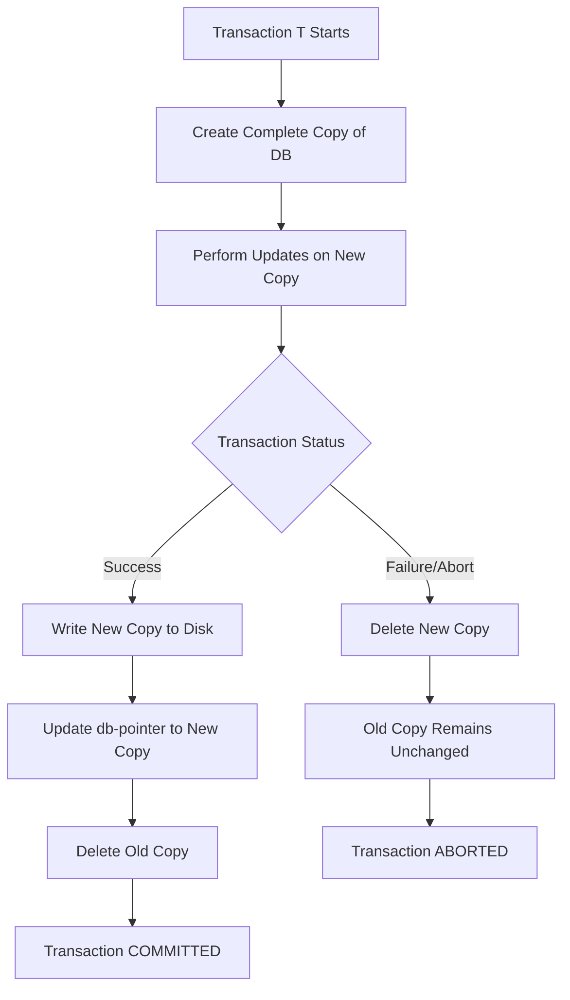
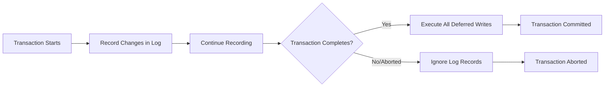
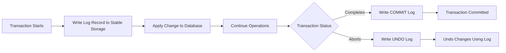
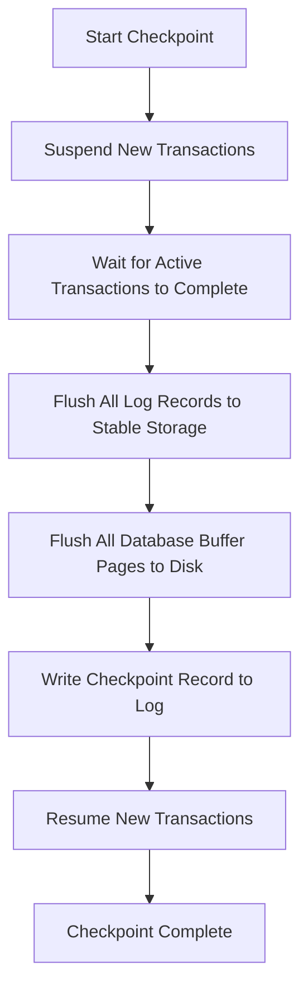
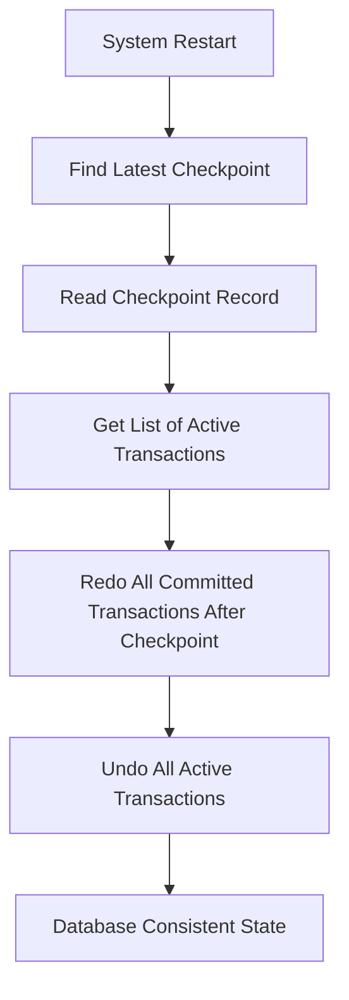
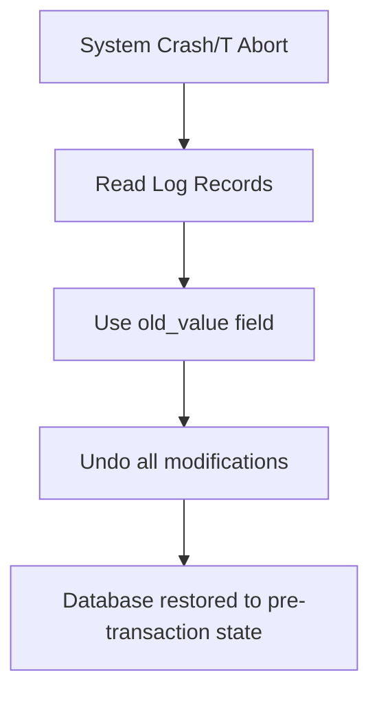
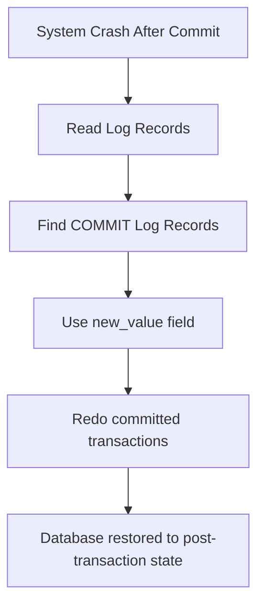
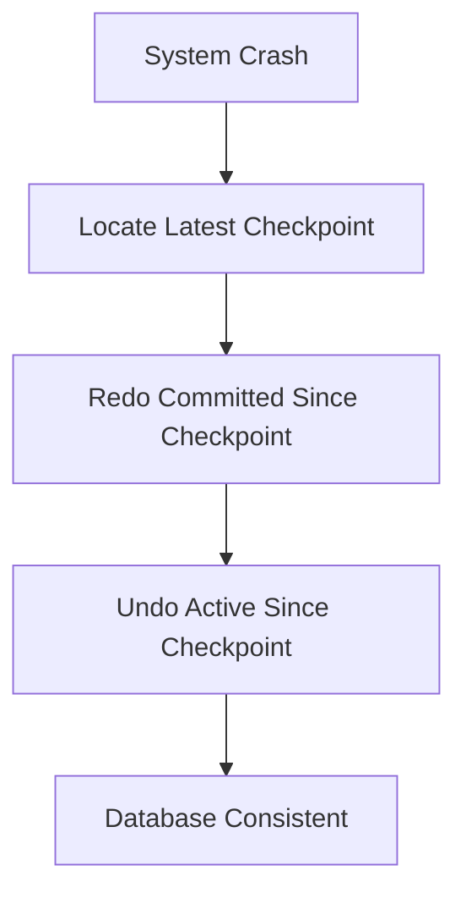

# Chapter 12: Atomicity and Durability Implementation 🔧

## Recovery Mechanism Overview 🛠️

**Recovery Mechanism Component of DBMS supports atomicity and durability.**

The DBMS must ensure that:
- **Atomicity**: Either all operations of a transaction are reflected properly in the DB, or none are
- **Durability**: Once a transaction completes successfully, the changes persist even if there are system failures

---

## Shadow-Copy Scheme 📋

### Basic Concept
**Based on making copies of DB (aka, shadow copies).**

### How It Works 🔄

#### **Assumption**: Only one Transaction (T) is active at a time.

#### **Key Components**:
1. **db-pointer**: A pointer maintained on the disk that points to the current copy of DB
2. **Shadow Copy**: The original copy of database that remains untouched

#### **Process Flow**:



#### **Step-by-Step Process**:

1. **Transaction T wants to update DB** → First creates a complete copy of DB
2. **All further updates** are done on new DB copy leaving the original copy (shadow copy) untouched
3. **If T has to be aborted** → System deletes the new copy, old copy is not affected
4. **If T succeeds** → Committed as follows:
   - OS makes sure all pages of new copy written on disk
   - DB system updates db-pointer to point to new copy
   - New copy becomes current copy of DB
   - Old copy is deleted
   - **T is COMMITTED at the point where updated db-pointer is written to disk**

### Atomicity in Shadow-Copy ⚛️
**If T fails at any time before db-pointer is updated, the old content of DB are not affected.**

- **T abort** can be done by just deleting the new copy of DB
- **Hence, either all updates are reflected or none**

### Durability in Shadow-Copy 💪

#### **System Failure Before db-pointer Update**:
- System fails before updated db-pointer is written to disk
- When system restarts, it reads db-pointer and sees original content
- **None of T's effects are visible**

#### **System Failure After db-pointer Update**:
- All pages of new copy were written to disk before db-pointer update
- When system restarts, it reads new DB copy
- **All of T's effects are visible**

**T is assumed successful only when db-pointer is updated.**

### Critical Implementation Detail 🔑
**The implementation is dependent on write to the db-pointer being atomic.**

- **Disk systems provide atomic updates to entire block or at least a disk sector**
- **We ensure db-pointer lies entirely in a single sector**
- **By storing db-pointer at the beginning of a block**

### Limitation ⚠️
**Inefficient, as entire DB is copied for every Transaction.**

---

## Log-Based Recovery Methods 📝

### Basic Concept
**The log is a sequence of records. Log of each transaction is maintained in some stable storage so that if any failure occurs, then it can be recovered from there.**

### Key Principles 📋

1. **Logging Before Execution**: Process of storing logs should be done before actual transaction is applied to database
2. **Stable Storage**: Classification of computer data storage technology that guarantees atomicity for write operations and allows software to be robust against hardware and power failures
3. **Record Everything**: If any operation is performed on database, it will be recorded in the log

### Types of Log-Based Recovery 🔍

#### 1. Deferred DB Modifications ⏳
**Ensuring atomicity by recording all DB modifications in the log but deferring the execution of all write operations until the final action of the T has been executed.**

**How It Works**:


**Key Points**:
- Log information is used to execute deferred writes when T is completed
- If system crashes before T completes, or if T is aborted, information in logs is ignored
- If T completes, records associated with it in log file are used to execute deferred writes
- If failure occurs while updating, we perform **redo**

#### 2. Immediate DB Modifications ⚡
**DB modifications to be output to the DB while the T is still in active state.**

**How It Works**:


**Key Points**:
- DB modifications written by active T are called **uncommitted modifications**
- In event of crash or T failure, system uses old value field of log records to restore modified values
- Update takes place only after log records are in stable storage

### 3. Checkpoint-Based Recovery 🎯

### What are Checkpoints?
**Checkpoints are points in the execution sequence where the database state is made consistent and all log records up to that point are no longer needed for recovery.**

### Why Checkpoints are Needed? 🤔
- **Log files can grow very large** over time
- **Recovery from very beginning** is time-consuming
- **Regular checkpoints limit recovery time**
- **Improve overall system performance**

### Checkpoint Process 📋

#### **Checkpoint Creation**:


#### **Checkpoint Record Contains**:
- **List of Active Transactions** (transactions that started but not committed at checkpoint time)
- **Position of Log** where checkpoint record is written
- **Timestamp** of checkpoint creation

### Recovery with Checkpoints 🔄

#### **Recovery Process Flow**:


#### **Recovery Steps**:

1. **Find Most Recent Checkpoint**
   - Read log backward to find latest checkpoint record
   - Get list of active transactions at checkpoint time

2. **Redo Phase** (Forward Scan)
   - Start from checkpoint position
   - Redo all transactions that have COMMIT records
   - Apply all changes from committed transactions

3. **Undo Phase** (Backward Scan)
   - Go through log backward
   - Undo all active transactions (those without COMMIT records)
   - Restore database to consistent state

### Example: Checkpoint Recovery 📊

#### **Scenario**:
```
Log Sequence (Time →):
T1 START
T2 START
T3 START
[CHECKPOINT] - Active: T1, T2, T3
T1 COMMIT
T4 START
T2 COMMIT
[SYSTEM CRASH]
```

#### **Recovery Process**:
1. **Find Checkpoint**: Active transactions were T1, T2, T3
2. **Redo Phase**:
   - T1 has COMMIT → Redo T1 changes
   - T2 has COMMIT → Redo T2 changes
   - T3 has NO COMMIT → Ignore T3
   - T4 has NO COMMIT → Ignore T4
3. **Undo Phase**:
   - T3 was active at checkpoint but no COMMIT → Undo T3
   - T4 started after checkpoint but no COMMIT → Undo T4

#### **Result**:
- **T1, T2**: Changes applied (committed)
- **T3, T4**: Changes undone (not committed)

### Checkpoint Benefits ⚡

#### **Advantages**:
- **Faster Recovery**: Only need to process log since last checkpoint
- **Smaller Log Size**: Can delete log records before checkpoint
- **Regular Maintenance**: Can schedule checkpoints during low activity
- **Predictable Recovery Time**: Recovery time bounded by checkpoint frequency

#### **Trade-offs**:
- **System Pause**: Brief pause during checkpoint creation
- **Resource Usage**: Requires disk I/O for flushing buffers
- **Frequency Balance**: Too frequent → performance impact; too rare → long recovery

### Checkpoint vs No Checkpoint 📈

| Aspect | Without Checkpoints | With Checkpoints |
|--------|---------------------|------------------|
| **Recovery Time** | O(Entire Log) | O(Since Last Checkpoint) |
| **Log Size** | Continuously Growing | Bounded |
| **System Overhead** | Low | Periodic During Checkpoints |
| **Recovery Complexity** | Simple | More Complex |
| **Performance** | Consistent | Variable During Checkpoints |

### Failure Handling 🚨

#### **Deferred Modifications - Failure Scenarios**:
- **System failure before T completes** → Log records ignored
- **T aborted** → Log records ignored
- **T completes but system crashes during deferred writes** → **Redo** operation

#### **Immediate Modifications - Failure Scenarios**:

##### **System Failure Before T Completes / T Aborted**:


##### **T Completes but System Crashes**:


#### **Checkpoint Recovery - Failure Scenarios**:

##### **System Crash After Checkpoint**:


##### **System Crash During Checkpoint**:
- **Checkpoint incomplete** → Use previous checkpoint
- **Log consistent** → Recovery from previous checkpoint
- **No data loss** → Previous checkpoint ensures safety

---

## Comparison of Methods ⚖️

### Shadow-Copy vs Log-Based Recovery

| Aspect | Shadow-Copy | Log-Based Recovery |
|--------|-------------|-------------------|
| **Space Usage** | High (entire DB copy) | Low (only log records) |
| **Performance** | Slow (full DB copy) | Fast (incremental logs) |
| **Concurrency** | Single transaction only | Multiple transactions |
| **Complexity** | Simple | Complex |
| **Recovery Time** | Fast (pointer change) | Slower (log processing) |
| **Use Case** | Small databases | Large production systems |

### Deferred vs Immediate Modifications

| Aspect | Deferred | Immediate |
|--------|----------|-----------|
| **Write Timing** | After commit | During transaction |
| **Risk** | Lower (no uncommitted changes) | Higher (uncommitted changes) |
| **Recovery** | Redo only | Redo + Undo |
| **Performance** | Better during transaction | Better after commit |
| **Complexity** | Simpler | More complex |

### Checkpoint vs No Checkpoint

| Aspect | Without Checkpoints | With Checkpoints |
|--------|---------------------|------------------|
| **Recovery Time** | O(Entire Log) | O(Since Last Checkpoint) |
| **Log Size** | Continuously Growing | Bounded |
| **System Overhead** | Low | Periodic During Checkpoints |
| **Recovery Complexity** | Simple | More Complex |
| **Performance** | Consistent | Variable During Checkpoints |

---

## Practical Examples 💼

### Example 1: Bank Transfer Using Shadow-Copy
```
Initial State:
- Account A: ₹1000
- Account B: ₹500
- db-pointer points to DB_v1

Transaction: Transfer ₹200 from A to B

Shadow-Copy Process:
1. Create DB_v2 copy of entire database
2. In DB_v2: Account A = ₹800, Account B = ₹700
3. Write DB_v2 to disk
4. Update db-pointer to point to DB_v2
5. Delete DB_v1

If crash at step 3: db-pointer still points to DB_v1 (no changes visible)
If crash at step 4: System restarts, reads db-pointer → DB_v2 (changes visible)
```

### Example 2: Inventory Update Using Immediate Modifications
```
Transaction: Reduce product quantity by 10

Log Record Format:
<transaction_id, item_id, old_quantity, new_quantity>

Process:
1. Write log: <T101, P123, 50, 40>
2. Update database: Product P123 quantity = 40
3. Continue other operations...
4. Write COMMIT log for T101

Failure Scenarios:
- Crash after step 2, before commit: Use old_quantity=50 to undo
- Crash after commit: Use new_quantity=40 to redo
```

---

## Interview Questions 🎯

### Q1: Explain shadow-copy scheme and its limitations
**Answer**:
- Shadow-copy creates complete copy of database for each transaction
- Uses db-pointer to switch between old and new copies
- Ensures atomicity by deleting new copy if transaction fails
- Ensures durability by updating pointer only after all changes are written
- **Limitation**: Inefficient for large databases due to full copying

### Q2: What is the role of stable storage in log-based recovery?
**Answer**:
- Stable storage guarantees atomicity for write operations
- Protects against hardware and power failures
- Log records must be written to stable storage before database changes
- Ensures recovery information survives system crashes

### Q3: Differentiate between deferred and immediate database modifications
**Answer**:
- **Deferred**: Record all changes in log first, execute writes after commit
- **Immediate**: Apply changes to database during transaction, log before each change
- **Deferred**: Only redo operation needed for recovery
- **Immediate**: Both undo and redo operations needed
- **Deferred**: Safer (no uncommitted changes on disk)
- **Immediate**: Better performance after commit

### Q4: How does log-based recovery handle system failures?
**Answer**:
- **Before commit**: Use old values in log to undo all changes
- **After commit**: Use new values in log to redo all changes
- Log records contain transaction_id, item_id, old_value, new_value
- System reads log during restart to determine recovery actions

### Q5: Why is db-pointer update critical in shadow-copy scheme?
**Answer**:
- db-pointer update is the **commit point**
- Must be atomic operation
- Determines which database copy is current
- If update fails, old database remains active
- System provides atomic block/sector updates for this purpose

### Q6: Explain checkpoint-based recovery with an example
**Answer**:
- Checkpoints mark consistent database states
- Log contains active transactions at checkpoint time
- **Example**: If checkpoint with active transactions T1,T2, and later T1 commits but T3 starts and doesn't commit
- **Recovery**: Redo T1 (committed), Undo T2,T3 (not committed)
- **Benefit**: Only process log since checkpoint, not entire log

### Q7: When are checkpoints typically taken in database systems?
**Answer**:
- During low system activity periods
- When log reaches certain size threshold
- At regular time intervals (e.g., every hour)
- Before system maintenance or shutdown
- Based on transaction count thresholds
- Balance between performance impact and recovery speed

### Q8: What happens if system crashes during checkpoint creation?
**Answer**:
- Use previous checkpoint for recovery
- No data loss as previous checkpoint ensured consistency
- Checkpoint record not written → previous checkpoint remains valid
- Recovery proceeds from last successful checkpoint

---

## Quick Reference Table 📋

| Recovery Method | Atomicity Mechanism | Durability Mechanism | Best For |
|-----------------|---------------------|---------------------|----------|
| **Shadow-Copy** | Delete new copy if fail | db-pointer update | Small databases |
| **Deferred Log** | Ignore log if fail | Redo from log after commit | Batch processing |
| **Immediate Log** | Undo from old values | Redo from new values | OLTP systems |
| **Checkpoint** | Undo active transactions | Redo committed since checkpoint | Large production systems |

| Failure Type | Deferred Recovery | Immediate Recovery | Checkpoint Recovery |
|---------------|-------------------|-------------------|-------------------|
| **Before Commit** | Ignore log records | Undo using old values | Undo active transactions |
| **After Commit** | Redo using log records | Redo using new values | Redo since checkpoint |
| **During Update** | Redo interrupted | Undo interrupted | Use previous checkpoint |

---

## Key Takeaways 💡

1. **Shadow-Copy**: Simple but inefficient, uses complete database copies
2. **Log-Based Recovery**: Efficient, uses incremental logging, supports multiple transactions
3. **Deferred Modifications**: Safer, only redo operations needed
4. **Immediate Modifications**: More complex, both undo and redo needed
5. **Checkpoints**: Limit recovery time and log size, essential for large systems
6. **Stable Storage**: Critical for ensuring log records survive failures
7. **Atomic db-pointer**: Key to shadow-copy durability
8. **Write-Ahead Logging**: Log must be written before database changes
9. **Checkpoint Frequency**: Balance between performance impact and recovery speed
10. **Recovery Strategy**: Different approaches based on when failure occurs

**Remember**: Recovery mechanisms are essential for database reliability - they ensure your data remains consistent and available even when systems fail! 🔧