# Chapter 2: System Design Fundamentals

## System Design Basics for Freshers

### What is System Design?
- **Definition**: Process of defining architecture, components, and relationships of a system
- **Purpose**: Create scalable, maintainable, and efficient systems
- **Fresher Focus**: Low-Level Design (LLD) rather than High-Level Design (HLD)

### Key System Design Concepts

#### 1. Scalability
**Definition**: System's ability to handle growth in users, data, and requests

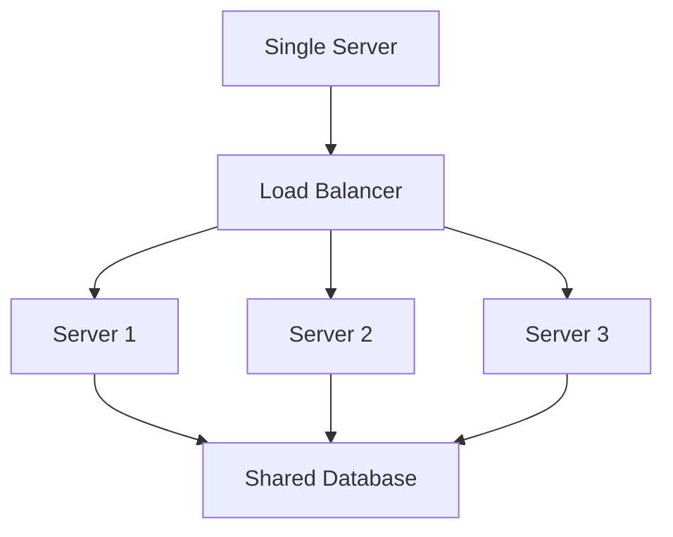

**Types of Scaling**:
- **Vertical Scaling**: Add more resources to single server
  - Pros: Simple to implement
  - Cons: Limited by hardware capacity
- **Horizontal Scaling**: Add more servers
  - Pros: Unlimited growth, better fault tolerance
  - Cons: Complex coordination, higher costs

#### 2. Load Balancing
**Purpose**: Distribute incoming requests across multiple servers

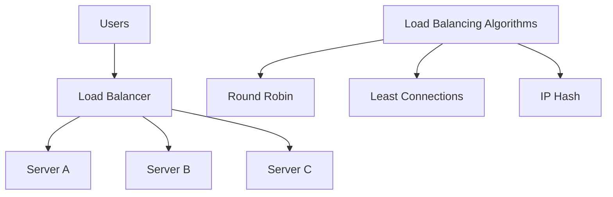

**Common Algorithms**:
- **Round Robin**: Requests distributed evenly
- **Least Connections**: Send to least busy server
- **IP Hash**: Same user always goes to same server

#### 3. Caching
**Purpose**: Store frequently accessed data to improve performance

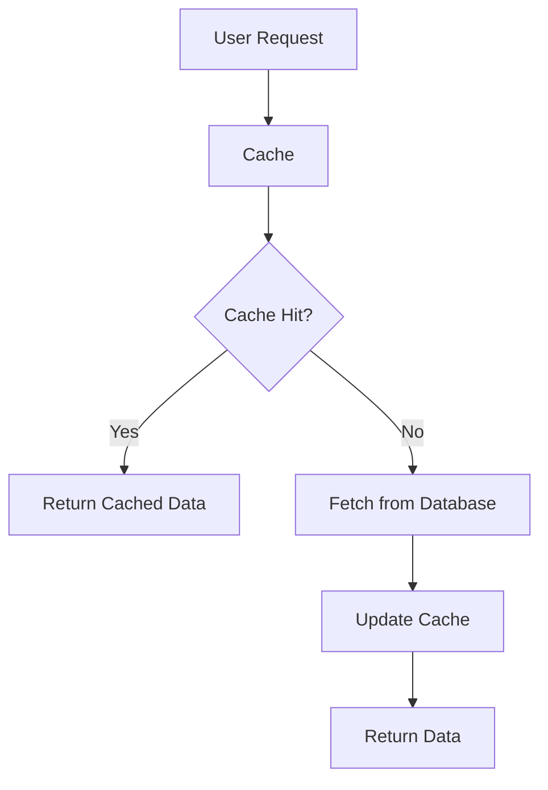

**Cache Types**:
- **Client-Side**: Browser cache, CDN
- **Server-Side**: Redis, Memcached
- **Database**: Query caching

#### 4. Database Design Choices
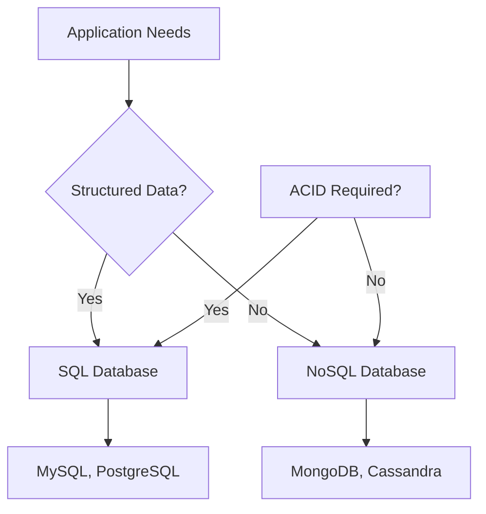

| Database Type | When to Use | Examples |
|-------------|-------------|---------|
| **SQL** | Structured data, relationships, transactions | Banking, e-commerce |
| **NoSQL** | Unstructured data, high scalability | Social media, IoT |

## Basic Architecture Patterns

### 1. Monolithic Architecture
**Definition**: Single, unified application with all functionality

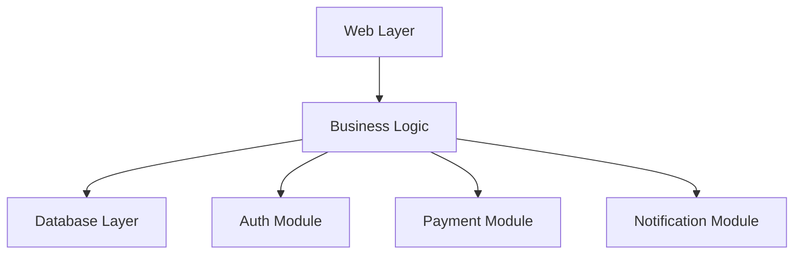

**Pros**: Simple to develop, test, and deploy
**Cons**: Difficult to scale, technology limitations

### 2. Microservices Architecture
**Definition**: Collection of loosely coupled, independently deployable services

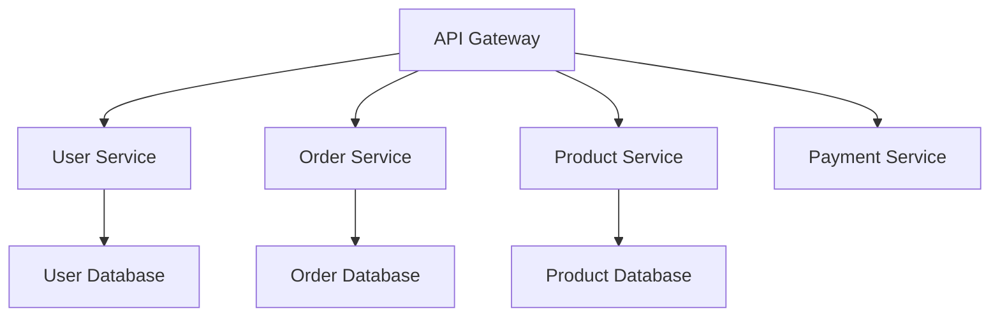

**Pros**: Independent scaling, technology flexibility
**Cons**: Complex coordination, network latency

### 3. Client-Server Architecture
**Definition**: Clients request services, servers provide them

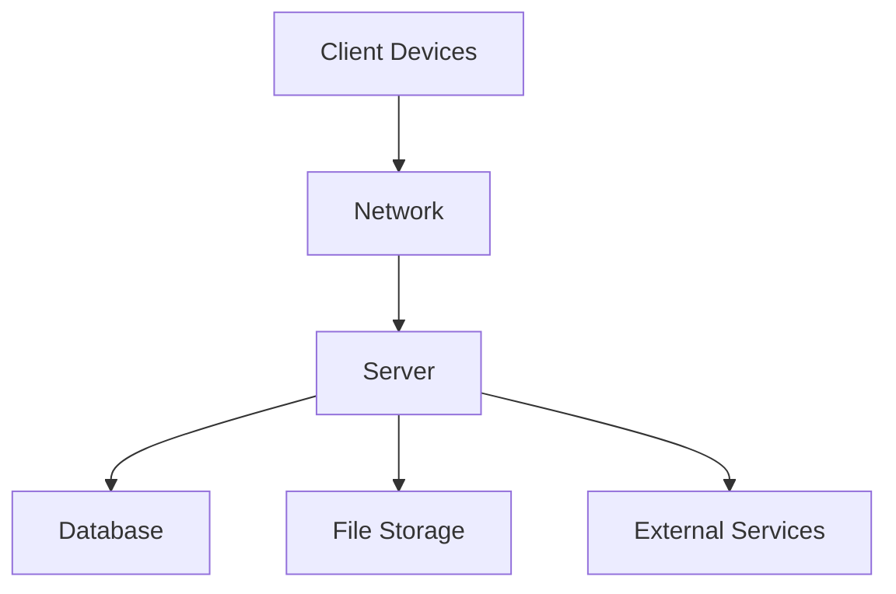

**Components**:
- **Client**: User interface, application logic
- **Server**: Business logic, data processing
- **Database**: Data storage and retrieval

## Common Fresher System Design Questions

### 1. Design a URL Shortener

#### Requirements
- Convert long URLs to short URLs
- Redirect short URLs to original URLs
- Handle high traffic efficiently
- Track click statistics

#### System Components
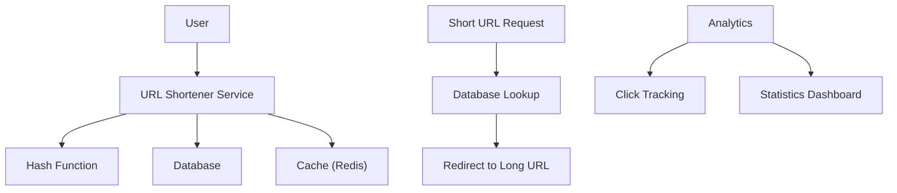

#### Key Design Decisions

**URL Generation**:
- **Base 62 Encoding**: Uses 0-9, a-z, A-Z (62 characters)
- **Hash Function**: Converts long URL to unique short code
- **Collision Handling**: Regenerate if code already exists

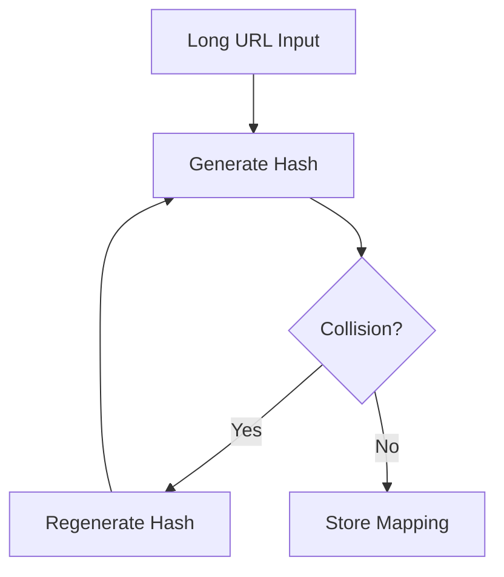

**Database Schema**:
```sql
CREATE TABLE url_mappings (
    short_code VARCHAR(10) PRIMARY KEY,
    long_url TEXT NOT NULL,
    created_at TIMESTAMP DEFAULT CURRENT_TIMESTAMP,
    click_count INT DEFAULT 0
);

CREATE TABLE analytics (
    id INT PRIMARY KEY AUTO_INCREMENT,
    short_code VARCHAR(10),
    ip_address VARCHAR(45),
    user_agent TEXT,
    timestamp TIMESTAMP DEFAULT CURRENT_TIMESTAMP,
    FOREIGN KEY (short_code) REFERENCES url_mappings(short_code)
);
```

**API Design**:
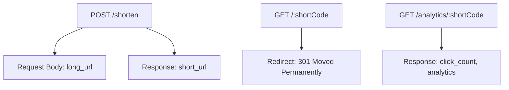

### 2. Design a Parking Lot System

#### Requirements
- Multiple vehicle types (Car, Motorcycle, Truck)
- Different parking spot sizes
- Entry/exit management
- Payment calculation

#### System Architecture
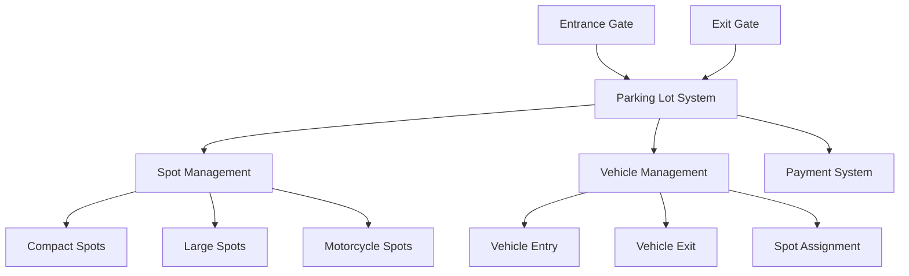

#### Key Components

**Vehicle Types and Spot Matching**:
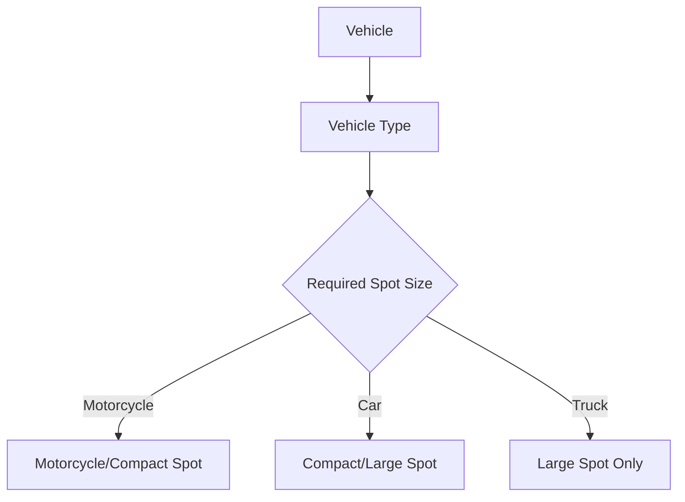

**Entry/Exit Flow**:
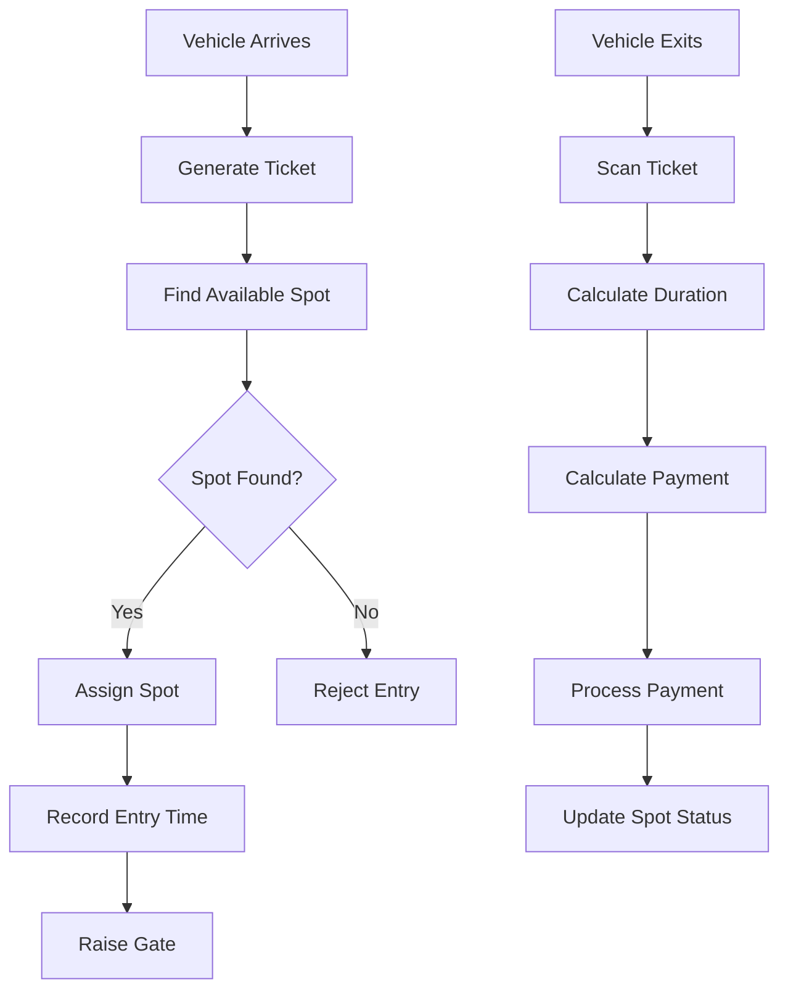

**Core Classes** (Interview Focus):
- `Vehicle`: License plate, type, entry time
- `ParkingSpot`: Spot ID, type, availability
- `ParkingLot`: Collection of spots, assignment logic
- `Ticket`: Vehicle info, spot assignment, entry/exit times

### 3. Design a Chat Application

#### Requirements
- Real-time messaging
- Multiple chat rooms
- User online/offline status
- Message history

#### System Architecture
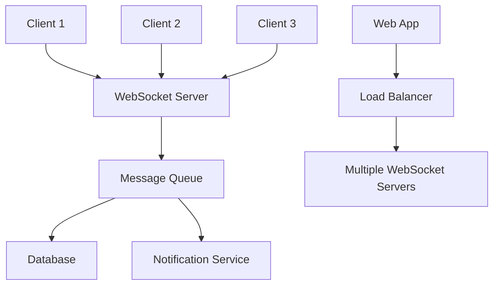

#### Key Design Components

**Real-time Communication**:
- **WebSocket**: Bidirectional communication
- **Message Queue**: Handle high message volume
- **Database**: Store message history
- **Load Balancer**: Distribute connections

**Message Flow**:
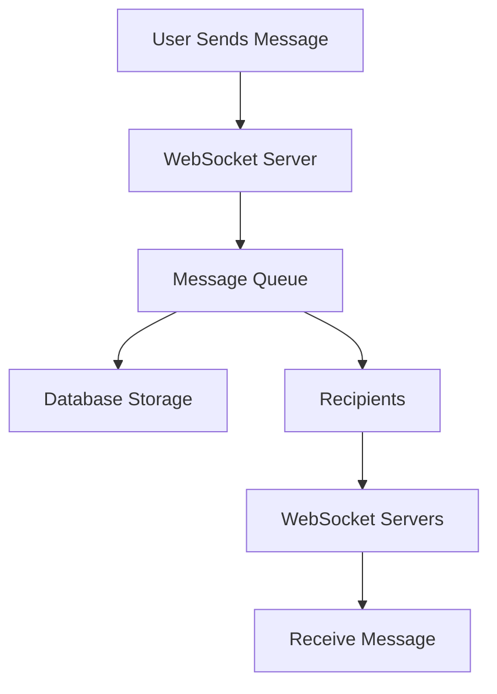

**Room Management**:
- Users can create/join rooms
- Messages delivered to room participants
- Online status tracking per room

### 4. Design a Library Management System

#### Requirements
- Book catalog management
- Member registration
- Book issue/return
- Fine calculation

#### System Components
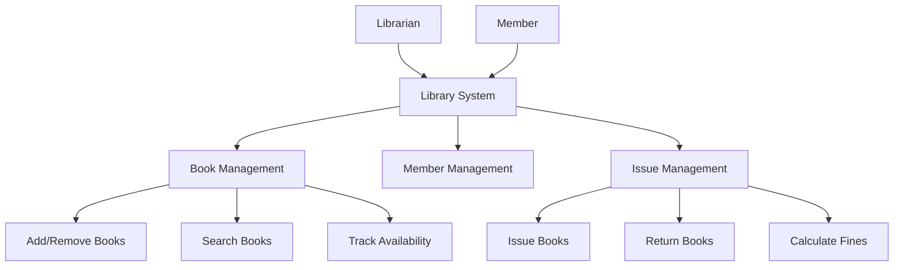

#### Key Entities
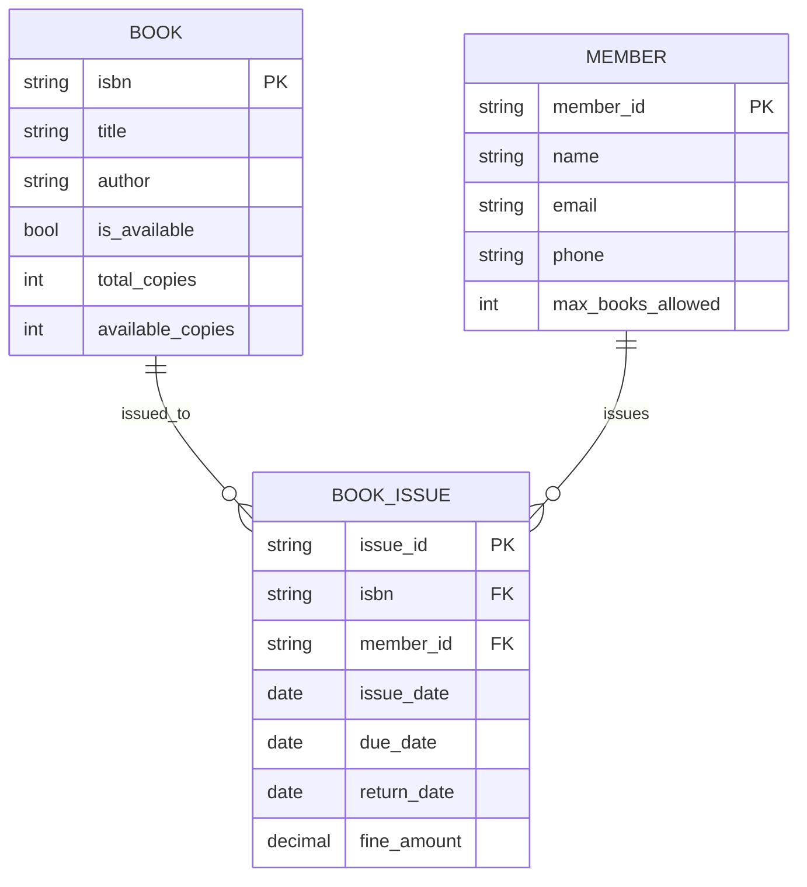

## Design Principles for Interviews

### 1. Single Responsibility Principle
**Definition**: Each class should have one reason to change

**Example**: Separate user authentication from user profile management

### 2. Open/Closed Principle
**Definition**: Open for extension, closed for modification

**Example**: Use interfaces/abstract classes instead of modifying existing code

### 3. Dependency Inversion
**Definition**: Depend on abstractions, not concretions

**Example**: Program to interfaces, not implementations

## Interview Approach for System Design

### Step-by-Step Method

#### 1. Clarify Requirements
- Ask about functional requirements
- Understand scale (users, requests per second)
- Identify constraints (budget, timeline, technology)

#### 2. High-Level Design
- Identify major components
- Define data flow between components
- Choose appropriate architecture pattern

#### 3. Deep Dive
- Design each component in detail
- Consider data structures
- Handle edge cases

#### 4. Discuss Trade-offs
- Performance vs Complexity
- Consistency vs Availability (CAP theorem)
- Cost vs Scalability

### Common Interview Questions

#### Basic Questions
- "What is the difference between SQL and NoSQL databases?"
- "Why would you use caching?"
- "What is a load balancer and why is it important?"

#### Intermediate Questions
- "How would you handle database failover?"
- "What are the pros and cons of microservices?"
- "How would you design for 1 million concurrent users?"

#### Advanced Questions
- "How would you implement real-time features?"
- "What are the security considerations?"
- "How would you monitor system health?"

## Quick Reference

### Key Concepts Summary
| Concept | Definition | Interview Focus |
|---------|-------------|-----------------|
| **Scalability** | Handle growth | Vertical vs Horizontal scaling |
| **Load Balancing** | Distribute traffic | Algorithms and benefits |
| **Caching** | Store frequently accessed data | Cache strategies |
| **Database Design** | Data storage and retrieval | SQL vs NoSQL choices |

### Architecture Patterns
| Pattern | When to Use | Key Characteristics |
|---------|-------------|-------------------|
| **Monolithic** | Simple applications, small teams | Single codebase, easier deployment |
| **Microservices** | Large scale, independent teams | Service independence, scalability |
| **Client-Server** | Distributed systems | Clear separation of concerns |

### Interview Tips

1. **Start with requirements clarification**
2. **Draw diagrams** to communicate design
3. **Explain trade-offs** (pros/cons)
4. **Consider edge cases** and error handling
5. **Think about scalability** from the beginning

### Common Mistakes to Avoid

1. **Jumping to code** without understanding requirements
2. **Ignoring scalability** and performance concerns
3. **Not considering** different failure scenarios
4. **Over-engineering** simple solutions
5. **Forgetting to discuss** trade-offs and alternatives

---

**Important Note**: System design interviews focus on your thought process and problem-solving approach. Practice explaining your design decisions clearly and considering multiple perspectives. Always ask clarifying questions before starting the design.