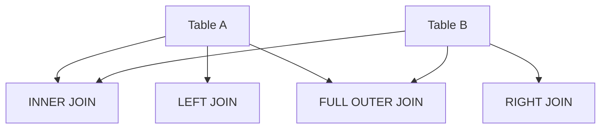
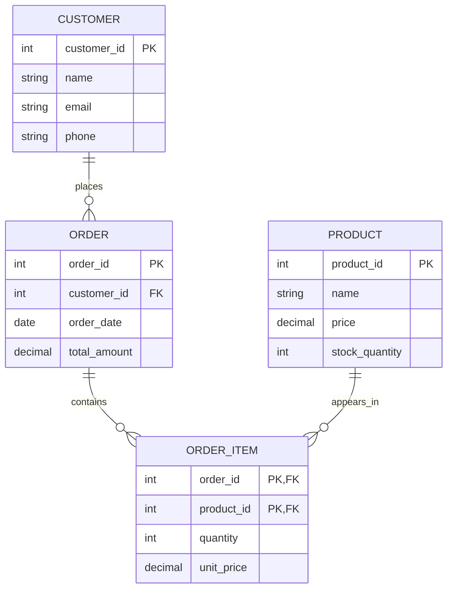

# SQL Interview Preparation

## SQL Fundamentals

### Database Basics
- **Database**: Organized collection of structured data
- **Table**: Collection of rows and columns
- **Primary Key**: Unique identifier for each row
- **Foreign Key**: References primary key of another table

### Basic SQL Commands

| Category | Commands | Purpose |
|----------|----------|---------|
| **DDL** | CREATE, ALTER, DROP | Define structure |
| **DML** | INSERT, UPDATE, DELETE | Manipulate data |
| **DQL** | SELECT | Retrieve data |
| **DCL** | GRANT, REVOKE | Control permissions |
| **TCL** | COMMIT, ROLLBACK | Transaction control |

## SELECT Queries

### Basic SELECT
```sql
-- Select all columns
SELECT * FROM employees;

-- Select specific columns
SELECT name, salary FROM employees;

-- Select with condition
SELECT * FROM employees WHERE department = 'IT';
```

### WHERE Clause Conditions
```sql
-- Multiple conditions
SELECT * FROM employees
WHERE department = 'IT' AND salary > 50000;

-- Range condition
SELECT * FROM employees
WHERE salary BETWEEN 40000 AND 80000;

-- List condition
SELECT * FROM employees
WHERE department IN ('IT', 'HR', 'Finance');

-- Pattern matching
SELECT * FROM employees
WHERE name LIKE 'A%'; -- Starts with A

SELECT * FROM employees
WHERE email LIKE '%@company.com'; -- Ends with domain
```

### ORDER BY
```sql
-- Ascending order (default)
SELECT * FROM employees ORDER BY salary;

-- Descending order
SELECT * FROM employees ORDER BY salary DESC;

-- Multiple columns
SELECT * FROM employees
ORDER BY department ASC, salary DESC;
```

## Aggregation Functions

### Common Aggregate Functions
```sql
-- Count rows
SELECT COUNT(*) FROM employees;
SELECT COUNT(DISTINCT department) FROM employees;

-- Sum
SELECT SUM(salary) FROM employees;

-- Average
SELECT AVG(salary) FROM employees;

-- Min/Max
SELECT MIN(salary), MAX(salary) FROM employees;
```

### GROUP BY
```sql
-- Group by department
SELECT department, COUNT(*), AVG(salary)
FROM employees
GROUP BY department;

-- Group with HAVING (filter groups)
SELECT department, AVG(salary)
FROM employees
GROUP BY department
HAVING AVG(salary) > 60000;
```

## JOIN Operations

### Types of JOINs


### INNER JOIN
```sql
-- Employees with their departments
SELECT e.name, d.department_name
FROM employees e
INNER JOIN departments d ON e.department_id = d.id;
```

### LEFT JOIN
```sql
-- All employees, even those without departments
SELECT e.name, d.department_name
FROM employees e
LEFT JOIN departments d ON e.department_id = d.id;
```

### RIGHT JOIN
```sql
-- All departments, even those without employees
SELECT e.name, d.department_name
FROM employees e
RIGHT JOIN departments d ON e.department_id = d.id;
```

### SELF JOIN
```sql
-- Find employees and their managers
SELECT
    e.name AS employee,
    m.name AS manager
FROM employees e
LEFT JOIN employees m ON e.manager_id = m.id;
```

## Subqueries

### Subquery in WHERE Clause
```sql
-- Employees earning more than average salary
SELECT * FROM employees
WHERE salary > (SELECT AVG(salary) FROM employees);

-- Employees in IT department
SELECT * FROM employees
WHERE department_id = (SELECT id FROM departments WHERE name = 'IT');
```

### Subquery in FROM Clause
```sql
-- Department with highest average salary
SELECT department_name FROM (
    SELECT
        d.name AS department_name,
        AVG(e.salary) AS avg_salary
    FROM employees e
    JOIN departments d ON e.department_id = d.id
    GROUP BY d.name
) AS dept_avg
ORDER BY avg_salary DESC
LIMIT 1;
```

### Correlated Subquery
```sql
-- Employees earning more than department average
SELECT * FROM employees e1
WHERE salary > (
    SELECT AVG(salary)
    FROM employees e2
    WHERE e2.department_id = e1.department_id
);
```

## Complex SQL Queries

### Window Functions
```sql
-- Rank employees by salary within department
SELECT
    name,
    department,
    salary,
    RANK() OVER (PARTITION BY department ORDER BY salary DESC) AS rank_in_dept
FROM employees;

-- Running total of sales
SELECT
    sale_date,
    amount,
    SUM(amount) OVER (ORDER BY sale_date) AS running_total
FROM sales;
```

### Common Table Expressions (CTE)
```sql
-- CTE for department statistics
WITH dept_stats AS (
    SELECT
        department_id,
        COUNT(*) AS employee_count,
        AVG(salary) AS avg_salary
    FROM employees
    GROUP BY department_id
)
SELECT
    d.name,
    ds.employee_count,
    ds.avg_salary
FROM dept_stats ds
JOIN departments d ON ds.department_id = d.id;
```

## Database Design

### Normalization

#### First Normal Form (1NF)
- Atomic values (no repeating groups)
- Each cell contains single value

```sql
-- Before 1NF
CREATE TABLE orders_bad (
    order_id INT,
    customer_name VARCHAR(100),
    products VARCHAR(500) -- "Laptop, Mouse, Keyboard"
);

-- After 1NF
CREATE TABLE orders_good (
    order_id INT,
    customer_name VARCHAR(100)
);

CREATE TABLE order_items (
    order_id INT,
    product_name VARCHAR(100),
    quantity INT
);
```

#### Second Normal Form (2NF)
- In 1NF + No partial dependencies
- All non-key attributes depend on entire primary key

#### Third Normal Form (3NF)
- In 2NF + No transitive dependencies
- Non-key attributes depend only on primary key

### ER Design Example


## Indexes

### Types of Indexes
```sql
-- Create index on frequently queried column
CREATE INDEX idx_employee_name ON employees(name);

-- Composite index (multiple columns)
CREATE INDEX idx_dept_salary ON employees(department, salary);

-- Unique index
CREATE UNIQUE INDEX idx_email ON employees(email);
```

### When to Use Indexes
- Columns in WHERE clause
- Columns in JOIN conditions
- Columns in ORDER BY
- Columns with high cardinality (many unique values)

### Index Trade-offs
- **Pros**: Faster SELECT queries
- **Cons**: Slower INSERT/UPDATE/DELETE, more storage

## Transactions

### ACID Properties
- **Atomicity**: All or nothing execution
- **Consistency**: Database remains valid
- **Isolation**: Transactions don't interfere
- **Durability**: Changes persist after commit

### Transaction Commands
```sql
-- Start transaction
BEGIN TRANSACTION;

-- Multiple operations
UPDATE accounts SET balance = balance - 1000 WHERE id = 1;
UPDATE accounts SET balance = balance + 1000 WHERE id = 2;

-- Commit or rollback
COMMIT; -- or ROLLBACK;
```

## Interview Questions

### Basic Questions

**Q1: What is the difference between WHERE and HAVING?**
- **WHERE**: Filters rows before grouping
- **HAVING**: Filters groups after aggregation
- **Example**:
```sql
-- WHERE (filters rows)
SELECT department, AVG(salary)
FROM employees
WHERE salary > 30000
GROUP BY department;

-- HAVING (filters groups)
SELECT department, AVG(salary)
FROM employees
GROUP BY department
HAVING AVG(salary) > 50000;
```

**Q2: What is the difference between DELETE and TRUNCATE?**
| Feature | DELETE | TRUNCATE |
|---------|--------|----------|
| WHERE clause | Supported | Not supported |
| Speed | Slower (row by row) | Faster (all at once) |
| Transaction | Can be rolled back | Cannot be rolled back |
| Triggers | Fired | Not fired |

**Q3: What are types of JOINs?**
- **INNER JOIN**: Only matching rows
- **LEFT JOIN**: All from left, matching from right
- **RIGHT JOIN**: All from right, matching from left
- **FULL OUTER JOIN**: All rows from both tables

### Intermediate Questions

**Q4: Find the nth highest salary**
```sql
-- Method 1: LIMIT and OFFSET
SELECT DISTINCT salary FROM employees
ORDER BY salary DESC
LIMIT 1 OFFSET 2; -- 3rd highest

-- Method 2: Subquery
SELECT MAX(salary) FROM employees
WHERE salary < (SELECT MAX(salary) FROM employees
               WHERE salary < (SELECT MAX(salary) FROM employees));

-- Method 3: Window function
SELECT DISTINCT salary
FROM (
    SELECT salary,
           DENSE_RANK() OVER (ORDER BY salary DESC) as rank
    FROM employees
) ranked
WHERE rank = 3;
```

**Q5: Find duplicate records**
```sql
-- Find duplicate emails
SELECT email, COUNT(*) as count
FROM employees
GROUP BY email
HAVING COUNT(*) > 1;

-- Find complete duplicate rows
SELECT name, email, department, COUNT(*) as count
FROM employees
GROUP BY name, email, department
HAVING COUNT(*) > 1;
```

**Q6: Department with most employees**
```sql
-- Method 1: JOIN and COUNT
SELECT d.name, COUNT(e.id) as employee_count
FROM departments d
LEFT JOIN employees e ON d.id = e.department_id
GROUP BY d.id, d.name
ORDER BY employee_count DESC
LIMIT 1;

-- Method 2: Subquery
SELECT name FROM departments
WHERE id = (
    SELECT department_id
    FROM employees
    GROUP BY department_id
    ORDER BY COUNT(*) DESC
    LIMIT 1
);
```

### Advanced Questions

**Q7: Find employees who joined in last 6 months**
```sql
-- MySQL
SELECT * FROM employees
WHERE hire_date >= DATE_SUB(CURRENT_DATE(), INTERVAL 6 MONTH);

-- PostgreSQL
SELECT * FROM employees
WHERE hire_date >= CURRENT_DATE - INTERVAL '6 months';

-- SQL Server
SELECT * FROM employees
WHERE hire_date >= DATEADD(MONTH, -6, GETDATE());
```

**Q8: Pivot table - rows to columns**
```sql
-- Traditional pivot (MySQL)
SELECT
    employee_name,
    SUM(CASE WHEN subject = 'Math' THEN marks ELSE 0 END) AS Math,
    SUM(CASE WHEN subject = 'Science' THEN marks ELSE 0 END) AS Science,
    SUM(CASE WHEN subject = 'English' THEN marks ELSE 0 END) AS English
FROM student_marks
GROUP BY employee_name;

-- Using PIVOT (SQL Server)
SELECT *
FROM (
    SELECT employee_name, subject, marks
    FROM student_marks
) AS source_table
PIVOT (
    SUM(marks)
    FOR subject IN ([Math], [Science], [English])
) AS pivot_table;
```

## Performance Optimization

### Query Optimization Tips
1. **Use appropriate indexes**
2. **Avoid SELECT \*** (select only needed columns)
3. **Use LIMIT for large result sets**
4. **Optimize JOIN order** (small table first)
5. **Use EXISTS instead of IN for subqueries**

### EXPLAIN Plan
```sql
-- Analyze query execution
EXPLAIN SELECT * FROM employees WHERE department = 'IT';

-- Detailed execution plan
EXPLAIN ANALYZE SELECT * FROM employees WHERE department = 'IT';
```

## Database Constraints

### Types of Constraints
```sql
-- NOT NULL
CREATE TABLE employees (
    id INT NOT NULL,
    name VARCHAR(100) NOT NULL
);

-- UNIQUE
CREATE TABLE employees (
    email VARCHAR(100) UNIQUE
);

-- PRIMARY KEY
CREATE TABLE employees (
    id INT PRIMARY KEY
);

-- FOREIGN KEY
CREATE TABLE orders (
    id INT PRIMARY KEY,
    customer_id INT,
    FOREIGN KEY (customer_id) REFERENCES customers(id)
);

-- CHECK
CREATE TABLE employees (
    salary INT CHECK (salary > 0)
);
```

## NoSQL vs SQL

| Aspect | SQL | NoSQL |
|--------|-----|-------|
| **Schema** | Fixed | Flexible |
| **Data Model** | Relational | Document/Key-Value/Graph |
| **Scalability** | Vertical | Horizontal |
| **Consistency** | ACID | Eventual |
| **Examples** | MySQL, PostgreSQL | MongoDB, Cassandra |

## Quick Reference

### SQL Commands Cheat Sheet
```sql
-- Create table
CREATE TABLE table_name (
    column1 datatype,
    column2 datatype,
    PRIMARY KEY (column1)
);

-- Insert data
INSERT INTO table_name VALUES (value1, value2);

-- Update data
UPDATE table_name SET column1 = value1 WHERE condition;

-- Delete data
DELETE FROM table_name WHERE condition;

-- Drop table
DROP TABLE table_name;
```

### Common SQL Functions
| Function | Purpose | Example |
|----------|---------|---------|
| `COUNT()` | Count rows | `SELECT COUNT(*) FROM table` |
| `SUM()` | Sum values | `SELECT SUM(price) FROM products` |
| `AVG()` | Average | `SELECT AVG(salary) FROM employees` |
| `MAX()` | Maximum | `SELECT MAX(price) FROM products` |
| `MIN()` | Minimum | `SELECT MIN(price) FROM products` |
| `CONCAT()` | String concat | `SELECT CONCAT(first, ' ', last)` |
| `UPPER()` | Uppercase | `SELECT UPPER(name) FROM users` |
| `DATE_FORMAT()` | Format date | `SELECT DATE_FORMAT(date, '%Y-%m-%d')` |

### Practice Problems

1. **Find second highest salary in each department**
2. **Delete duplicate records keeping one**
3. **Find employees who earn more than their manager**
4. **Calculate running total of sales**
5. **Find customers who bought all products**

### Interview Tips

1. **Clarify requirements** before writing queries
2. **Write clean, readable SQL** with proper formatting
3. **Consider performance** implications
4. **Test edge cases** (NULL values, empty tables)
5. **Explain your thought process** while writing queries

Remember: SQL interviews test both syntax knowledge and problem-solving ability. Focus on understanding the data relationships and thinking systematically about query construction.