# Chapter 3: SQL and Database Management

## SQL Fundamentals

### What is SQL?
- **SQL (Structured Query Language)**: Standard language for managing relational databases
- **Purpose**: Create, read, update, and delete data
- **Importance**: Essential for almost every software development role

### Database Basics
- **Database**: Organized collection of structured data
- **Table**: Collection of rows and columns with specific data
- **Schema**: Structure of database (tables, relationships, constraints)

### SQL Command Categories

| Category | Purpose | Key Commands |
|----------|---------|--------------|
| **DDL** | Define structure | CREATE, ALTER, DROP, TRUNCATE |
| **DML** | Manipulate data | INSERT, UPDATE, DELETE |
| **DQL** | Query data | SELECT |
| **DCL** | Control access | GRANT, REVOKE |
| **TCL** | Transaction control | COMMIT, ROLLBACK, SAVEPOINT |

## Core SQL Concepts

### 1. Data Types
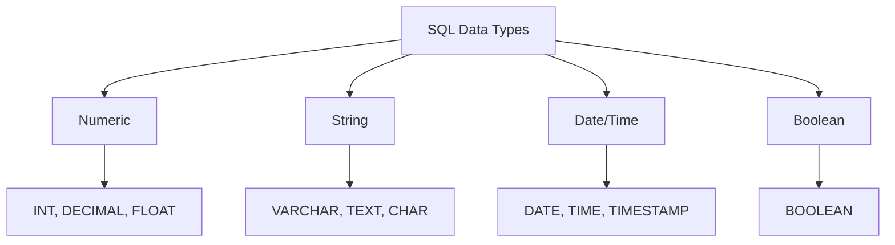

**Common Data Types**:
- **INT**: Whole numbers
- **VARCHAR(n)**: Variable-length string (max n characters)
- **TEXT**: Long text without specified length
- **DATE**: Date values (YYYY-MM-DD)
- **BOOLEAN**: True/False values

### 2. Primary and Foreign Keys
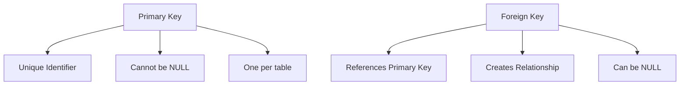

**Key Concepts**:
- **Primary Key**: Uniquely identifies each record in a table
- **Foreign Key**: Links tables together by referencing primary key
- **Composite Key**: Primary key made of multiple columns

### 3. Constraints
- **NOT NULL**: Column must have a value
- **UNIQUE**: All values in column must be unique
- **CHECK**: Validates data before insertion
- **DEFAULT**: Sets default value if none provided

## Basic SQL Operations

### 1. CREATE TABLE
```sql
CREATE TABLE employees (
    id INT PRIMARY KEY AUTO_INCREMENT,
    name VARCHAR(100) NOT NULL,
    email VARCHAR(100) UNIQUE NOT NULL,
    department VARCHAR(50),
    salary DECIMAL(10, 2) CHECK (salary > 0),
    hire_date DATE DEFAULT CURRENT_DATE
);
```

### 2. INSERT (Create)
```sql
-- Insert single record
INSERT INTO employees (name, email, department, salary)
VALUES ('John Doe', 'john@company.com', 'IT', 75000.00);

-- Insert multiple records
INSERT INTO employees (name, email, department, salary) VALUES
('Jane Smith', 'jane@company.com', 'HR', 65000.00),
('Bob Johnson', 'bob@company.com', 'Finance', 80000.00);
```

### 3. SELECT (Read)
```sql
-- Select all columns
SELECT * FROM employees;

-- Select specific columns
SELECT name, department, salary FROM employees;

-- Select with condition
SELECT * FROM employees WHERE department = 'IT';

-- Select with multiple conditions
SELECT * FROM employees
WHERE department = 'IT' AND salary > 70000;

-- Select with range
SELECT * FROM employees
WHERE salary BETWEEN 60000 AND 80000;

-- Select with list
SELECT * FROM employees
WHERE department IN ('IT', 'HR', 'Finance');

-- Pattern matching
SELECT * FROM employees
WHERE name LIKE 'J%'; -- Names starting with 'J'
```

### 4. UPDATE (Update)
```sql
-- Update single record
UPDATE employees
SET salary = 80000
WHERE id = 1;

-- Update multiple records
UPDATE employees
SET salary = salary * 1.10
WHERE department = 'IT';
```

### 5. DELETE (Delete)
```sql
-- Delete specific record
DELETE FROM employees WHERE id = 3;

-- Delete with condition
DELETE FROM employees WHERE department = 'Finance';
```

## Advanced SQL Queries

### 1. Joins
**Purpose**: Combine rows from multiple tables based on related columns

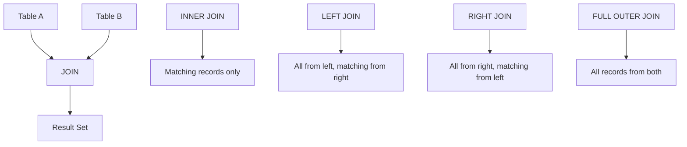

#### INNER JOIN
```sql
-- Employees and their departments
SELECT e.name, d.department_name, d.location
FROM employees e
INNER JOIN departments d ON e.department_id = d.id;
```

#### LEFT JOIN
```sql
-- All employees and their departments (even if no department assigned)
SELECT e.name, d.department_name
FROM employees e
LEFT JOIN departments d ON e.department_id = d.id;
```

#### SELF JOIN
```sql
-- Find employees and their managers
SELECT
    e1.name AS employee,
    e2.name AS manager
FROM employees e1
LEFT JOIN employees e2 ON e1.manager_id = e2.id;
```

### 2. Aggregate Functions
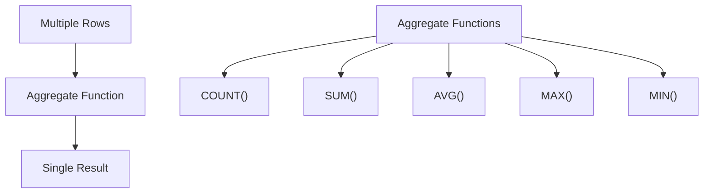

#### Basic Aggregates
```sql
-- Count total employees
SELECT COUNT(*) FROM employees;

-- Count employees by department
SELECT department, COUNT(*) as employee_count
FROM employees
GROUP BY department;

-- Average salary by department
SELECT
    department,
    AVG(salary) as avg_salary,
    MAX(salary) as max_salary,
    MIN(salary) as min_salary
FROM employees
GROUP BY department;

-- Total salary budget by department
SELECT
    department,
    SUM(salary) as total_salary_budget
FROM employees
GROUP BY department;
```

#### GROUP BY with HAVING
```sql
-- Departments with more than 5 employees
SELECT
    department,
    COUNT(*) as employee_count
FROM employees
GROUP BY department
HAVING COUNT(*) > 5;

-- Departments with average salary > 70000
SELECT
    department,
    AVG(salary) as avg_salary
FROM employees
GROUP BY department
HAVING AVG(salary) > 70000;
```

### 3. Subqueries
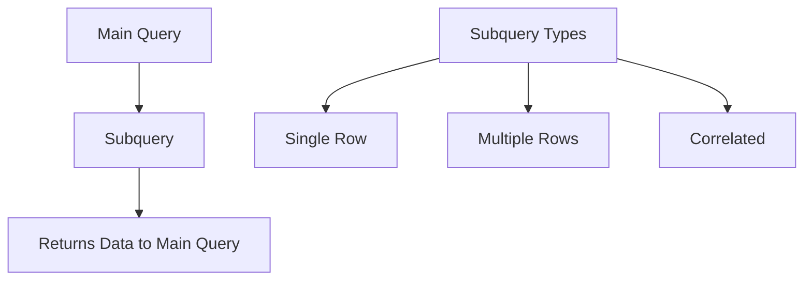

#### Subquery in WHERE Clause
```sql
-- Employees earning above average salary
SELECT name, salary
FROM employees
WHERE salary > (SELECT AVG(salary) FROM employees);

-- Employees in IT department
SELECT * FROM employees
WHERE department_id = (
    SELECT id FROM departments
    WHERE name = 'IT'
);
```

#### Subquery in FROM Clause
```sql
-- Find department with highest average salary
SELECT department_name, avg_salary
FROM (
    SELECT
        d.name as department_name,
        AVG(e.salary) as avg_salary,
        ROW_NUMBER() OVER (ORDER BY AVG(e.salary) DESC) as rank
    FROM employees e
    JOIN departments d ON e.department_id = d.id
    GROUP BY d.name
) ranked
WHERE rank = 1;
```

#### Correlated Subquery
```sql
-- Employees earning more than department average
SELECT name, department, salary
FROM employees e1
WHERE salary > (
    SELECT AVG(salary)
    FROM employees e2
    WHERE e2.department = e1.department
);
```

### 4. Window Functions
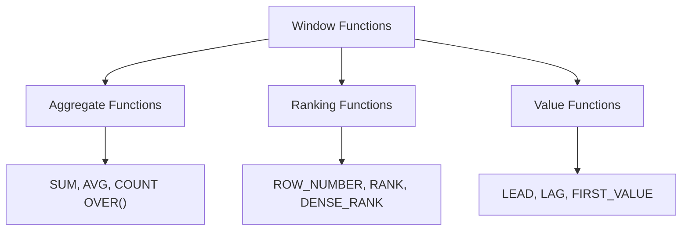

#### Ranking Functions
```sql
-- Rank employees by salary within department
SELECT
    name,
    department,
    salary,
    RANK() OVER (PARTITION BY department ORDER BY salary DESC) as rank_in_dept,
    DENSE_RANK() OVER (PARTITION BY department ORDER BY salary DESC) as dense_rank,
    ROW_NUMBER() OVER (PARTITION BY department ORDER BY salary DESC) as row_num
FROM employees;
```

#### Aggregate Window Functions
```sql
-- Running total of salaries
SELECT
    name,
    salary,
    SUM(salary) OVER (ORDER BY salary) as running_total,
    AVG(salary) OVER (ORDER BY salary ROWS BETWEEN 2 PRECEDING AND 2 FOLLOWING) as moving_avg
FROM employees;
```

## Database Design

### Normalization
**Purpose**: Organize data to reduce redundancy and improve data integrity

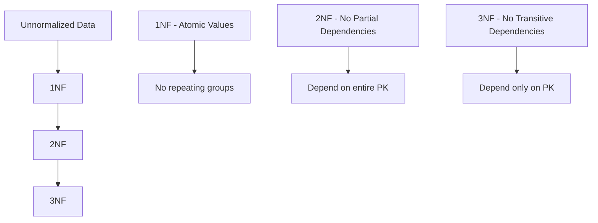

#### First Normal Form (1NF)
- **Rule**: Each cell contains atomic values
- **Example**: Instead of "Skills: Java, Python, SQL", create separate skill records

#### Second Normal Form (2NF)
- **Rule**: No partial dependencies on composite primary key
- **Example**: If PK is (order_id, item_id), then item_description should depend only on item_id

#### Third Normal Form (3NF)
- **Rule**: No transitive dependencies
- **Example**: If A → B and B → C, then A → C is transitive dependency

### ER Diagram Basics
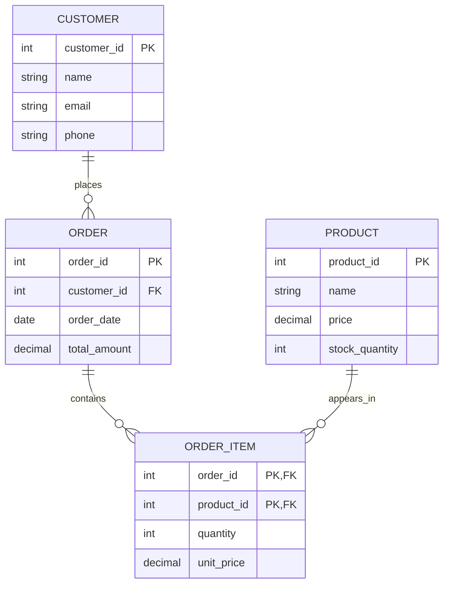

## Common Interview Questions

### 1. Find Nth Highest Salary
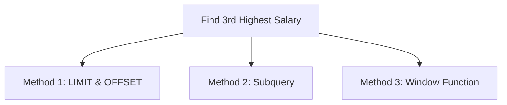

#### Solution 1: LIMIT and OFFSET
```sql
SELECT DISTINCT salary
FROM employees
ORDER BY salary DESC
LIMIT 1 OFFSET 2; -- 3rd highest (0-indexed)
```

#### Solution 2: Subquery
```sql
SELECT MAX(salary)
FROM employees
WHERE salary < (
    SELECT MAX(salary)
    FROM employees
    WHERE salary < (
        SELECT MAX(salary) FROM employees
    )
);
```

#### Solution 3: Window Function
```sql
SELECT DISTINCT salary
FROM (
    SELECT
        salary,
        DENSE_RANK() OVER (ORDER BY salary DESC) as rank
    FROM employees
) ranked
WHERE rank = 3;
```

### 2. Find Duplicate Records
```sql
-- Find duplicate emails
SELECT email, COUNT(*) as count
FROM employees
GROUP BY email
HAVING COUNT(*) > 1;

-- Find complete duplicate rows
SELECT name, email, department, COUNT(*) as count
FROM employees
GROUP BY name, email, department
HAVING COUNT(*) > 1;

-- Show all duplicate records
SELECT * FROM employees
WHERE (name, email, department) IN (
    SELECT name, email, department
    FROM employees
    GROUP BY name, email, department
    HAVING COUNT(*) > 1
);
```

### 3. Department with Most Employees
```sql
-- Method 1: JOIN and ORDER BY
SELECT
    d.name,
    COUNT(e.id) as employee_count
FROM departments d
LEFT JOIN employees e ON d.id = e.department_id
GROUP BY d.id, d.name
ORDER BY employee_count DESC
LIMIT 1;

-- Method 2: Subquery
SELECT name
FROM departments
WHERE id = (
    SELECT department_id
    FROM employees
    GROUP BY department_id
    ORDER BY COUNT(*) DESC
    LIMIT 1
);
```

### 4. Pivot Table (Rows to Columns)
```sql
-- Transform student marks from rows to columns
SELECT
    student_name,
    SUM(CASE WHEN subject = 'Math' THEN marks ELSE 0 END) AS Math,
    SUM(CASE WHEN subject = 'Science' THEN marks ELSE 0 END) AS Science,
    SUM(CASE WHEN subject = 'English' THEN marks ELSE 0 END) AS English
FROM student_marks
GROUP BY student_name;
```

### 5. Find Employees Who Never Took Leave
```sql
-- Employees with no leave records
SELECT e.name, e.department
FROM employees e
LEFT JOIN leave_requests l ON e.id = l.employee_id
WHERE l.employee_id IS NULL;

-- Alternative using NOT EXISTS
SELECT name, department
FROM employees e
WHERE NOT EXISTS (
    SELECT 1
    FROM leave_requests l
    WHERE l.employee_id = e.id
);
```

## Performance Optimization

### Indexes
**Purpose**: Speed up data retrieval operations

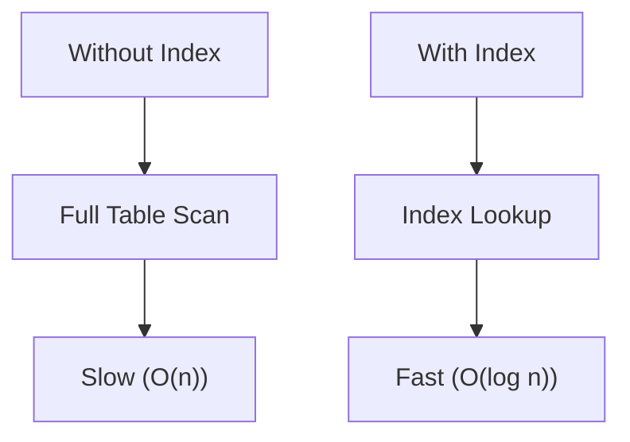

#### When to Use Indexes
- Columns in WHERE clause
- Columns in JOIN conditions
- Columns in ORDER BY
- Columns with high cardinality (many unique values)

#### Creating Indexes
```sql
-- Single column index
CREATE INDEX idx_employee_name ON employees(name);

-- Composite index (multiple columns)
CREATE INDEX idx_dept_salary ON employees(department, salary);

-- Unique index
CREATE UNIQUE INDEX idx_employee_email ON employees(email);
```

### Query Optimization Tips
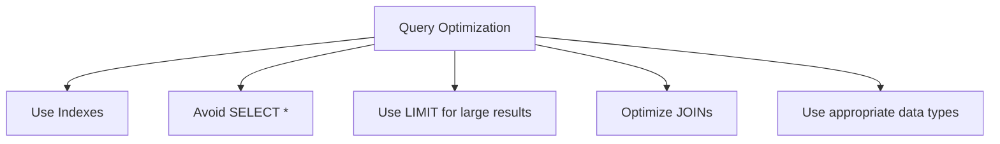

1. **Use appropriate indexes**
2. **Avoid SELECT \*** - select only needed columns
3. **Use LIMIT** for large result sets
4. **Optimize JOIN order** - small tables first
5. **Use EXISTS instead of IN** for subqueries

### EXPLAIN Plan
```sql
-- Analyze query execution
EXPLAIN SELECT * FROM employees WHERE department = 'IT';

-- Detailed execution plan
EXPLAIN ANALYZE SELECT * FROM employees WHERE department = 'IT';
```

## Transactions and ACID

### ACID Properties
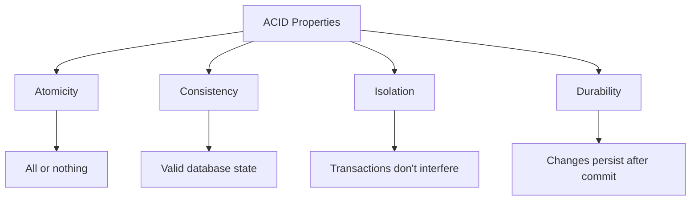

#### Transaction Examples
```sql
-- Bank transfer transaction
BEGIN TRANSACTION;

-- Deduct from account A
UPDATE accounts SET balance = balance - 1000
WHERE id = 1;

-- Add to account B
UPDATE accounts SET balance = balance + 1000
WHERE id = 2;

-- Commit if both successful
COMMIT; -- or ROLLBACK if error
```

## Database Security

### SQL Injection Prevention
```sql
-- Vulnerable (Never do this!)
String query = "SELECT * FROM users WHERE username = '" + username + "'";

-- Safe (Use parameterized queries)
PreparedStatement stmt = conn.prepareStatement(
    "SELECT * FROM users WHERE username = ?"
);
stmt.setString(1, username);
```

### Access Control
```sql
-- Grant read-only access
GRANT SELECT ON employees TO 'readonly_user';

-- Grant full access
GRANT ALL PRIVILEGES ON employees TO 'admin_user';

-- Revoke access
REVOKE INSERT ON employees FROM 'limited_user';
```

## Quick Reference

### SQL Commands Summary
| Operation | Command | Example |
|-----------|---------|---------|
| **Create** | CREATE TABLE | `CREATE TABLE users(...)` |
| **Read** | SELECT | `SELECT * FROM users` |
| **Update** | UPDATE | `UPDATE users SET name='John'` |
| **Delete** | DELETE | `DELETE FROM users WHERE id=1` |
| **Join** | INNER/LEFT/RIGHT | `SELECT * FROM a JOIN b ON a.id=b.id` |

### Common Functions
| Function | Purpose | Example |
|----------|---------|---------|
| `COUNT()` | Count rows | `SELECT COUNT(*) FROM table` |
| `SUM()` | Sum values | `SELECT SUM(price) FROM products` |
| `AVG()` | Average | `SELECT AVG(salary) FROM employees` |
| `MAX()/MIN()` | Max/Min values | `SELECT MAX(salary) FROM employees` |
| `UPPER()` | Uppercase | `SELECT UPPER(name) FROM users` |
| `DATE_FORMAT()` | Format date | `SELECT DATE_FORMAT(date, '%Y-%m-%d')` |

### Interview Preparation Tips

1. **Understand fundamentals** before memorizing syntax
2. **Practice common patterns** (joins, aggregations, subqueries)
3. **Know when to use** different join types
4. **Understand performance** implications
5. **Practice writing queries** for common scenarios

### Common Mistakes to Avoid

1. **Forgetting NULL values** in conditions
2. **Mixing up JOIN types** and their results
3. **Not using indexes** properly
4. **SQL injection vulnerabilities**
5. **Ignoring performance** in large datasets

---

**Important Note**: SQL is tested in almost every technical interview. Focus on understanding concepts rather than memorizing syntax. Practice writing queries for different scenarios and understand the performance implications of your queries.