# Chapter 4: Computer Networks

## Network Fundamentals

### What is a Computer Network?
- **Definition**: Collection of interconnected computers that share resources
- **Purpose**: Communication, resource sharing, information exchange
- **Importance**: Foundation of internet, cloud computing, distributed systems

### Network Types
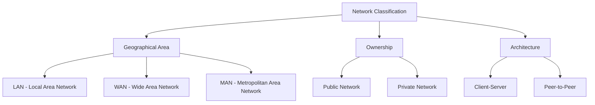

**Network Types Comparison**:
| Type | Area Coverage | Speed | Examples |
|------|---------------|-------|----------|
| **LAN** | Building, Campus | High (100Mbps-1Gbps) | Office network, Home network |
| **MAN** | City | Medium (10Mbps-100Mbps) | Cable TV network |
| **WAN** | Country, Global | Low (1Mbps-100Mbps) | Internet |

## OSI Model

### 7-Layer OSI Reference Model
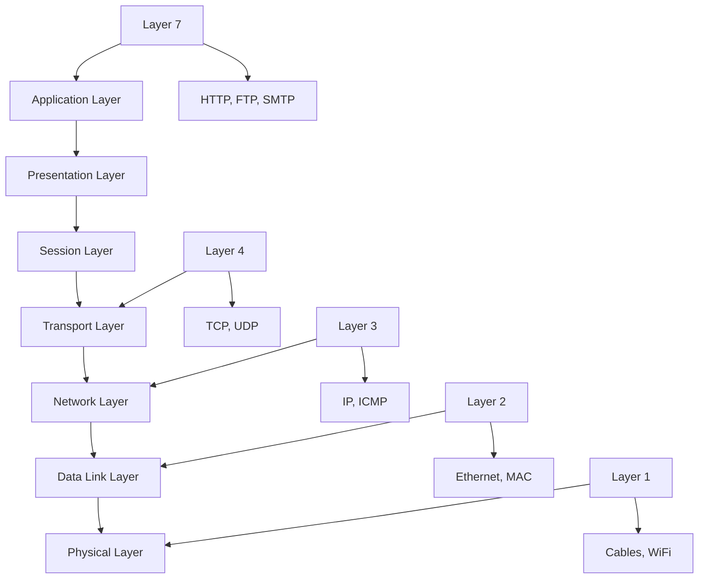

### Layer Functions

#### Layer 7: Application Layer
- **Purpose**: Interface for user applications
- **Protocols**: HTTP, FTP, SMTP, DNS, POP3, IMAP
- **Examples**: Web browsing, email, file transfer

#### Layer 6: Presentation Layer
- **Purpose**: Data translation, encryption, compression
- **Functions**: Character encoding, data formatting
- **Examples**: ASCII to EBCDIC conversion, SSL/TLS encryption

#### Layer 5: Session Layer
- **Purpose**: Manage sessions between applications
- **Functions**: Session establishment, maintenance, termination
- **Examples**: Login sessions, authentication

#### Layer 4: Transport Layer
- **Purpose**: End-to-end communication, reliability
- **Protocols**: TCP, UDP
- **Functions**: Port addressing, flow control, error detection

#### Layer 3: Network Layer
- **Purpose**: Path determination and routing
- **Protocols**: IP, ICMP, OSPF, BGP
- **Functions**: Logical addressing, routing

#### Layer 2: Data Link Layer
- **Purpose**: Reliable data transfer between nodes
- **Protocols**: Ethernet, PPP, HDLC
- **Functions**: Physical addressing (MAC), error detection

#### Layer 1: Physical Layer
- **Purpose**: Transmit raw bits over physical medium
- **Examples**: Ethernet cables, WiFi signals, fiber optics
- **Functions**: Bit transmission, signal encoding

## TCP/IP Protocol Suite

### TCP/IP Model Layers
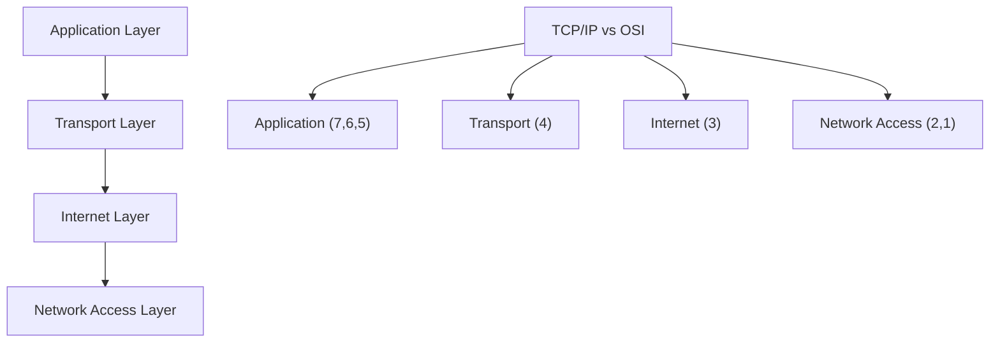

### Key Protocols

#### IP (Internet Protocol)
- **Purpose**: Logical addressing, packet routing
- **Versions**: IPv4 (32-bit), IPv6 (128-bit)
- **Features**: Connectionless, best-effort delivery

#### TCP (Transmission Control Protocol)
- **Purpose**: Reliable, connection-oriented communication
- **Features**: Three-way handshake, flow control, error recovery
- **Use Cases**: Web browsing, email, file transfer

#### UDP (User Datagram Protocol)
- **Purpose**: Fast, connectionless communication
- **Features**: No handshaking, no error recovery
- **Use Cases**: Video streaming, gaming, DNS

## IP Addressing

### IPv4 Address Structure
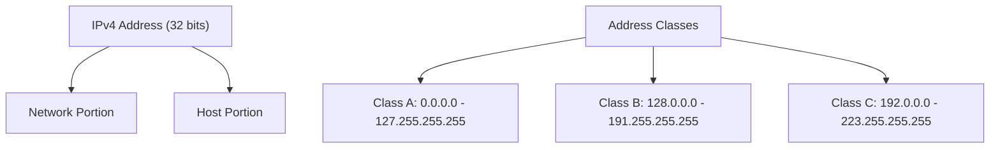

### IPv4 Address Classes
| Class | Range | Network Bits | Host Bits | Use |
|-------|-------|--------------|-----------|-----|
| **A** | 1-126.x.x.x | 8 | 24 | Large networks |
| **B** | 128-191.x.x | 16 | 16 | Medium networks |
| **C** | 192-223.x.x | 24 | 8 | Small networks |
| **D** | 224-239.x.x | - | - | Multicast |
| **E** | 240-255.x.x | - | - | Experimental |

### Special IPv4 Addresses
- **127.0.0.1**: Loopback address (localhost)
- **0.0.0.0**: Default route
- **255.255.255.255**: Broadcast address
- **169.254.x.x**: Link-local addresses

### IPv6 Address Structure
- **Format**: 128-bit address written in hexadecimal
- **Example**: 2001:0db8:85a3:0000:0000:8a2e:0370:7334
- **Abbreviation**: :: can replace consecutive zeros
- **Benefits**: Larger address space, autoconfiguration, security

## Subnetting

### What is Subnetting?
- **Definition**: Dividing a network into smaller sub-networks
- **Purpose**: Better organization, improved security, reduced broadcast traffic
- **Process**: Borrowing host bits for network portion

### Subnetting Example
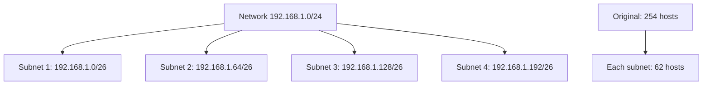

**Subnet Mask**: 255.255.255.192 (/26)
- **Binary**: 11111111.11111111.11111111.11000000
- **Network bits**: 26, Host bits: 6
- **Subnets**: 4, Hosts per subnet: 62 (2^6 - 2)

## DNS (Domain Name System)

### DNS Hierarchy
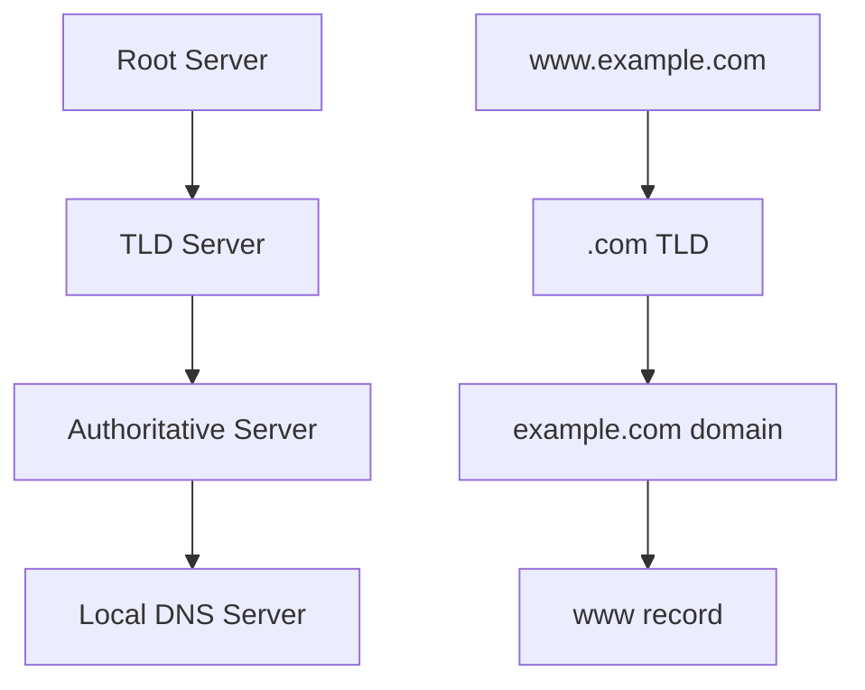

### DNS Resolution Process
1. **User types URL**: www.example.com
2. **Query Local DNS**: Check cache first
3. **Query Root Server**: Get TLD server address
4. **Query TLD Server**: Get domain server address
5. **Query Domain Server**: Get IP address
6. **Return to User**: IP address resolved

### DNS Record Types
| Type | Purpose | Example |
|------|---------|---------|
| **A** | IPv4 address | example.com → 192.168.1.1 |
| **AAAA** | IPv6 address | example.com → 2001:db8::1 |
| **CNAME** | Alias name | www.example.com → example.com |
| **MX** | Mail server | example.com → mail.example.com |
| **NS** | Name server | example.com → ns1.example.com |

## HTTP and Web Protocols

### HTTP (Hypertext Transfer Protocol)
- **Purpose**: Foundation of data communication for web
- **Stateless**: Each request is independent
- **Port**: 80 (HTTP), 443 (HTTPS)

### HTTP Methods
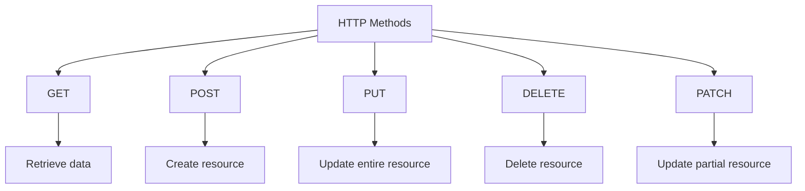

| Method | Purpose | Idempotent | Safe |
|--------|---------|------------|------|
| **GET** | Retrieve data | Yes | Yes |
| **POST** | Create data | No | No |
| **PUT** | Update data | Yes | No |
| **DELETE** | Remove data | Yes | No |
| **PATCH** | Partial update | No | No |

### HTTP Status Codes
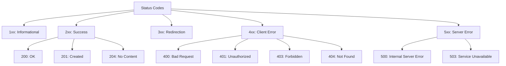

### HTTPS (HTTP Secure)
- **Purpose**: Secure HTTP communication
- **Port**: 443
- **Encryption**: SSL/TLS protocols
- **Certificate**: Server identity verification

## Transport Layer Protocols

### TCP vs UDP Comparison
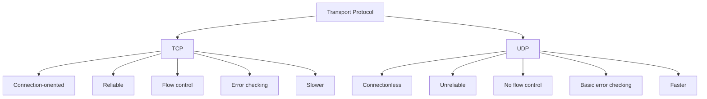

| Feature | TCP | UDP |
|---------|-----|-----|
| **Connection** | Connection-oriented | Connectionless |
| **Reliability** | Reliable | Unreliable |
| **Speed** | Slower | Faster |
| **Header Size** | 20 bytes | 8 bytes |
| **Use Cases** | Web, Email, FTP | Streaming, Gaming, DNS |

### Three-Way Handshake (TCP)
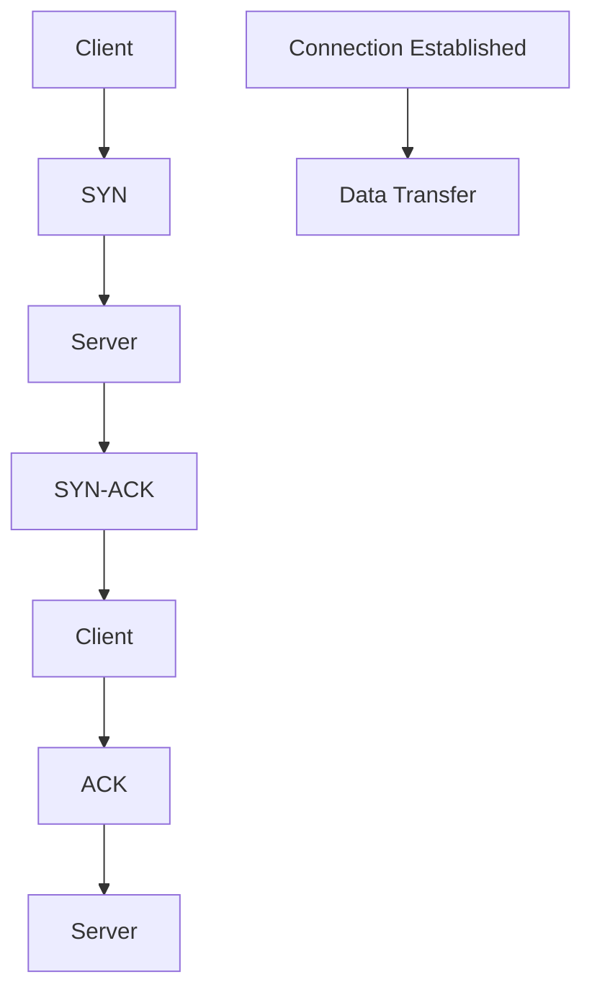

1. **SYN**: Client requests connection
2. **SYN-ACK**: Server acknowledges and requests
3. **ACK**: Client acknowledges connection

## Network Security

### SSL/TLS Handshake
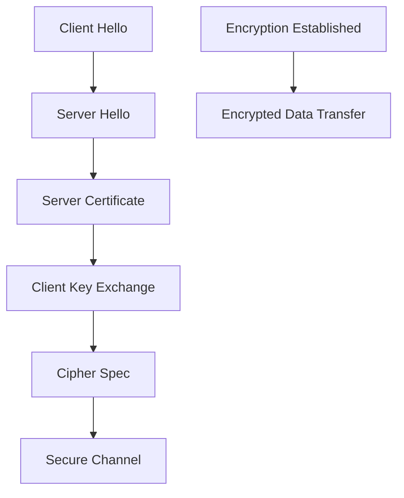

### Common Security Threats
| Threat | Description | Prevention |
|--------|-------------|-------------|
| **Phishing** | Fake websites for data theft | User education, HTTPS |
| **DDoS Attack** | Overwhelm server with requests | Firewalls, rate limiting |
| **Man-in-Middle** | Intercept communication | Encryption, certificates |
| **SQL Injection** | Malicious SQL queries | Input validation |

### Firewalls
- **Purpose**: Filter network traffic
- **Types**: Hardware, Software, Cloud
- **Rules**: Allow/deny based on IP, port, protocol
- **Network Segments**: DMZ, trusted zones

## Common Interview Questions

### Basic Questions

**Q1: What is the difference between TCP and UDP?**
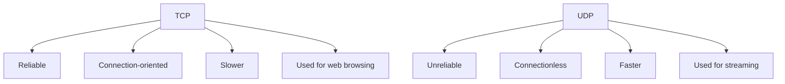

**Q2: What happens when you type www.google.com in browser?**
1. **DNS Resolution**: www.google.com → IP address
2. **TCP Connection**: Three-way handshake with server
3. **HTTP Request**: GET request to server
4. **Server Response**: HTML content
5. **Rendering**: Browser displays the page

**Q3: What is OSI model and why is it important?**
- **Importance**: Standardization, troubleshooting, protocol development
- **Each layer**: Specific responsibilities
- **Benefits**: Modular design, independent development

### Intermediate Questions

**Q4: What is subnetting and why do we need it?**
- **Purpose**: Better IP address utilization, security, organization
- **Process**: Borrow host bits for network identification
- **Benefits**: Reduced broadcast traffic, improved network management

**Q5: Explain DNS resolution process**
1. **Browser cache**: Check local cache
2. **OS cache**: Check system cache
3. **Router cache**: Check router cache
4. **ISP DNS**: Query ISP DNS server
5. **Root server**: Get TLD server
6. **TLD server**: Get authoritative server
7. **Authoritative server**: Get final IP address

### Advanced Questions

**Q6: What happens in TCP connection termination?**
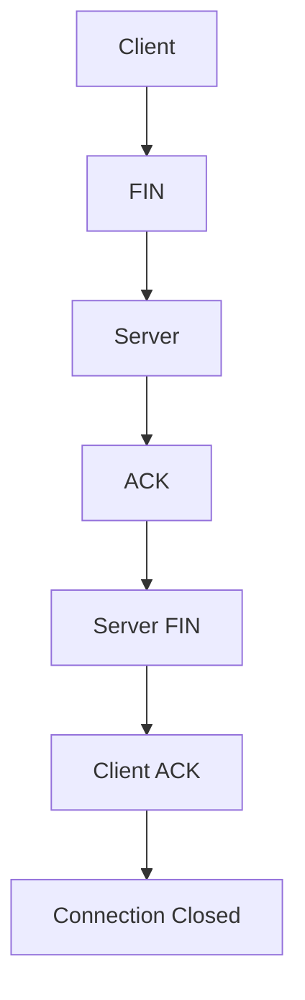

1. **FIN**: Client requests to close
2. **ACK**: Server acknowledges
3. **FIN**: Server requests to close
4. **ACK**: Client acknowledges

**Q7: What is a MAC address and how is it different from IP address?**
| Feature | MAC Address | IP Address |
|---------|-------------|------------|
| **Purpose** | Hardware identification | Network location |
| **Length** | 48 bits | 32/128 bits |
| **Changeable** | No (burned in) | Yes (configurable) |
| **Layer** | Data Link (Layer 2) | Network (Layer 3) |
| **Scope** | Local network | Global network |

## Network Performance

### Bandwidth vs Throughput vs Latency
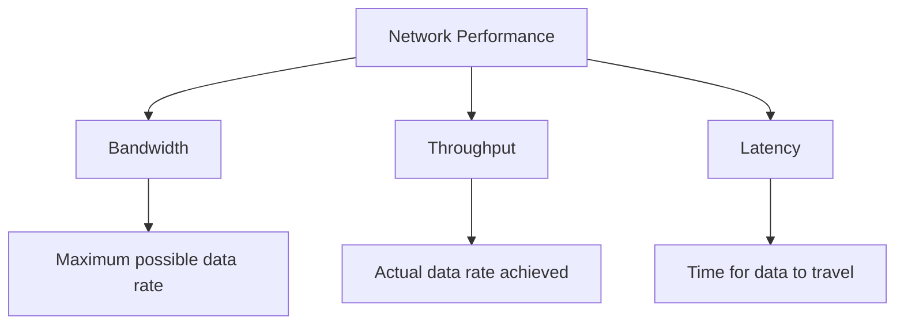

- **Bandwidth**: Maximum capacity (theoretical limit)
- **Throughput**: Actual performance (real-world)
- **Latency**: Delay in data transmission

### Network Optimization Tips
1. **Use CDNs**: Content Delivery Networks for static content
2. **Enable compression**: Reduce data size
3. **Optimize images**: Use appropriate formats and sizes
4. **Minimize HTTP requests**: Reduce round trips
5. **Use caching**: Store frequently accessed data

## Quick Reference

### Common Ports
| Port | Protocol | Service |
|------|----------|---------|
| **20/21** | FTP | File Transfer |
| **22** | SSH | Secure Shell |
| **23** | Telnet | Remote Terminal |
| **25** | SMTP | Email Sending |
| **53** | DNS | Domain Resolution |
| **80** | HTTP | Web Traffic |
| **110** | POP3 | Email Receiving |
| **443** | HTTPS | Secure Web Traffic |

### Network Commands
| Command | Purpose | Example |
|---------|---------|---------|
| **ping** | Test connectivity | `ping google.com` |
| **traceroute** | Trace path | `traceroute google.com` |
| **nslookup** | DNS query | `nslookup google.com` |
| **netstat** | Network stats | `netstat -an` |
| **ipconfig/ifconfig** | IP config | `ipconfig /all` |

### OSI Layer Mnemonic
**Please Do Not Throw Sausage Pizza Away**
- **P**resentation, **D**ata Link, **N**etwork, **T**ransport, **S**ession, **P**hysical, **A**pplication

---

**Important Note**: Computer networks are fundamental to understanding how modern applications work. Focus on understanding concepts rather than memorizing details. Practice troubleshooting network issues and understand how different protocols work together.