# Chapter 5: Operating Systems

## Operating System Fundamentals

### What is an Operating System?
- **Definition**: System software that manages computer hardware and software resources
- **Purpose**: Provide platform for application execution, resource management
- **Importance**: Foundation for all software development and system operations

### OS Functions
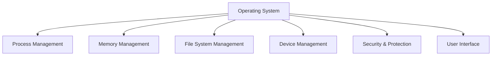

### OS Components
| Component | Purpose | Examples |
|-----------|---------|----------|
| **Kernel** | Core functionality, resource management | Windows NT, Linux Kernel |
| **Shell** | User interface, command interpreter | Bash, PowerShell |
| **File System** | Data organization and storage | NTFS, ext4 |
| **Device Drivers** | Hardware communication | Printer drivers, GPU drivers |

## Process Management

### Process vs Program
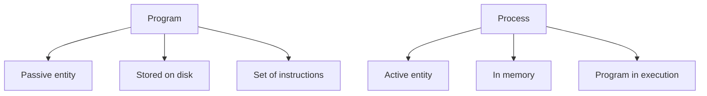

| Aspect | Program | Process |
|--------|---------|---------|
| **State** | Static | Dynamic |
| **Location** | Disk | Memory |
| **Resources** | None | CPU, Memory, Files |
| **Lifecycle** | Permanent | Temporary |

### Process States
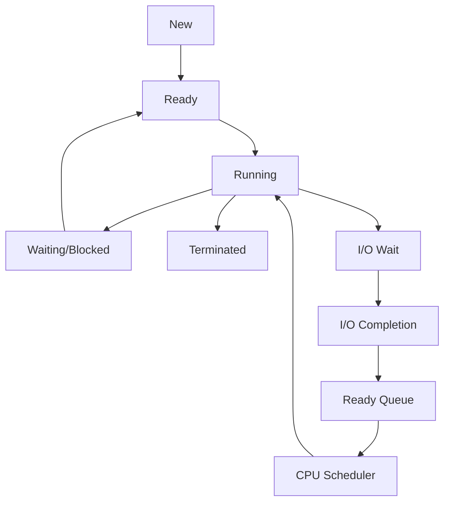

**Process States**:
- **New**: Process being created
- **Ready**: Waiting for CPU time
- **Running**: Currently executing
- **Waiting**: Waiting for I/O or event
- **Terminated**: Process finished execution

### Process Scheduling Algorithms

#### 1. First Come, First Served (FCFS)
- **Principle**: Execute processes in order of arrival
- **Pros**: Simple, fair
- **Cons**: Poor average waiting time, convoy effect

#### 2. Shortest Job First (SJF)
- **Principle**: Execute shortest job first
- **Types**: Preemptive, Non-preemptive
- **Pros**: Minimum average waiting time
- **Cons**: Starvation for long jobs, difficult to predict

#### 3. Round Robin (RR)
- **Principle**: Each process gets time slice in rotation
- **Time Quantum**: Fixed time for each process
- **Pros**: Fair, good for time-sharing
- **Cons**: Higher average turnaround, context switching overhead

#### 4. Priority Scheduling
- **Principle**: Higher priority processes execute first
- **Types**: Preemptive, Non-preemptive
- **Pros**: Important processes get priority
- **Cons**: Starvation for low priority processes

**Algorithm Comparison**:
| Algorithm | Time Complexity | Preemptive | Starvation | Best For |
|-----------|-----------------|------------|------------|-----------|
| **FCFS** | O(1) | No | No | Simple systems |
| **SJF** | O(n log n) | Sometimes | Yes | Batch processing |
| **RR** | O(1) | Yes | No | Time-sharing |
| **Priority** | O(n log n) | Sometimes | Yes | Real-time systems |

## Thread Management

### Thread vs Process
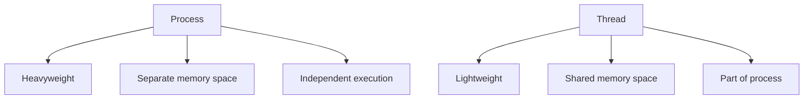

| Characteristic | Process | Thread |
|----------------|---------|--------|
| **Memory** | Separate | Shared |
| **Creation** | Expensive | Cheap |
| **Communication** | Complex | Simple |
| **Context Switch** | Slow | Fast |

### Thread Types

#### User-Level Threads
- **Managed by**: User-level library
- **Kernel unaware**: Treats as single-threaded process
- **Pros**: Fast context switch, portable
- **Cons**: Cannot utilize multiple CPUs, blocking system calls

#### Kernel-Level Threads
- **Managed by**: Operating system
- **Kernel aware**: Schedules each thread separately
- **Pros**: Utilize multiple CPUs, true parallelism
- **Cons**: Slower context switch, OS overhead

### Thread Synchronization
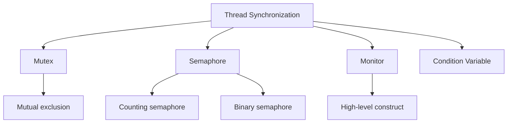

#### Mutex (Mutual Exclusion)
- **Purpose**: Ensure only one thread accesses critical section
- **Operations**: Lock, Unlock
- **Properties**: Binary semaphore, ownership

#### Semaphore
- **Purpose**: Control access to resources with limited capacity
- **Types**: Counting semaphore, Binary semaphore
- **Operations**: Wait (P), Signal (V)

#### Monitor
- **Purpose**: High-level synchronization construct
- **Components**: Shared data, procedures, condition variables
- **Properties**: Automatic mutual exclusion

## Memory Management

### Memory Layout
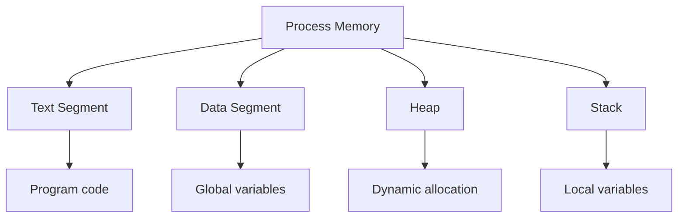

**Memory Segments**:
- **Text**: Program code, read-only
- **Data**: Global and static variables
- **Heap**: Dynamic memory allocation
- **Stack**: Local variables, function calls

### Virtual Memory
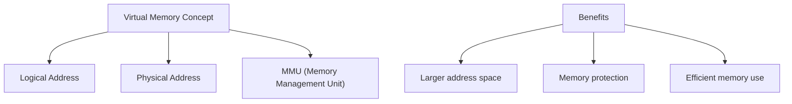

#### Paging
- **Concept**: Divide memory into fixed-size pages
- **Page Size**: Typically 4KB
- **Page Table**: Maps virtual to physical addresses
- **TLB**: Translation Lookaside Buffer for fast lookup

**Paging Process**:
1. **Virtual address** generated by CPU
2. **Page number** extracted
3. **Page table lookup** for frame number
4. **Physical address** constructed
5. **TLB cache** speeds up future lookups

#### Segmentation
- **Concept**: Divide memory into logical segments
- **Segment Types**: Code, data, stack
- **Benefits**: Logical organization, sharing, protection

### Page Replacement Algorithms

#### 1. FIFO (First In, First Out)
- **Principle**: Replace page that was loaded first
- **Pros**: Simple to implement
- **Cons**: Belady's anomaly (more frames = more faults)

#### 2. LRU (Least Recently Used)
- **Principle**: Replace page not used for longest time
- **Pros**: Good performance
- **Cons**: Requires hardware support

#### 3. LFU (Least Frequently Used)
- **Principle**: Replace page used least frequently
- **Pros**: Considers usage pattern
- **Cons**: Complex implementation

**Algorithm Comparison**:
| Algorithm | Implementation | Performance | Overhead |
|-----------|----------------|-------------|----------|
| **FIFO** | Simple | Average | Low |
| **LRU** | Complex | Good | High |
| **LFU** | Very Complex | Very Good | Very High |

## Process Synchronization

### Race Conditions
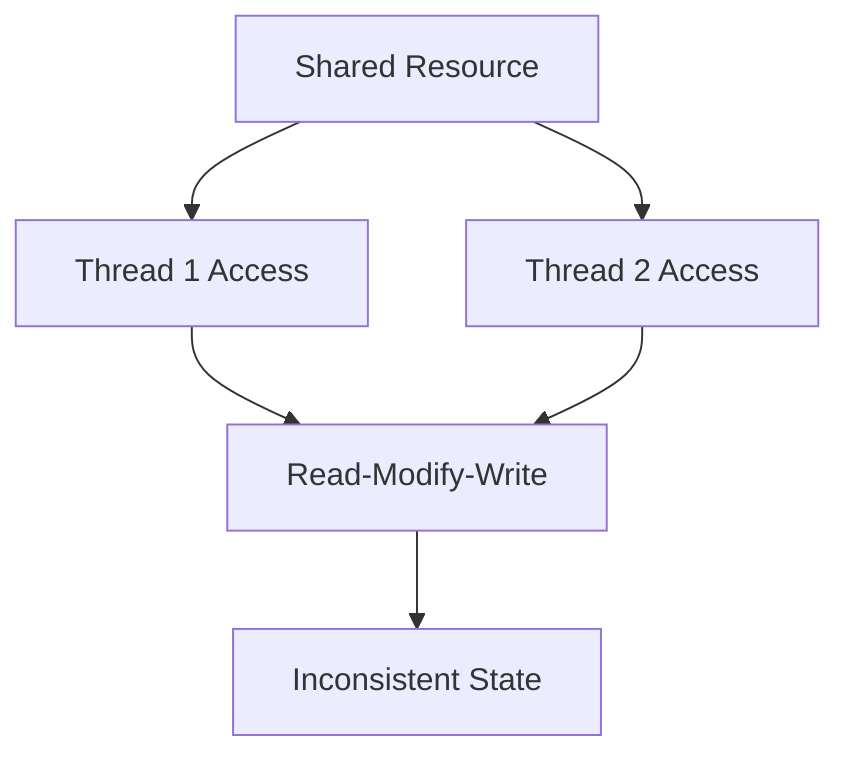

**Race Condition**: Multiple threads accessing shared data simultaneously without proper synchronization

### Critical Section
- **Definition**: Code segment accessing shared resources
- **Requirements**: Mutual exclusion, progress, bounded waiting
- **Solutions**: Mutexes, semaphores, monitors

### Deadlocks
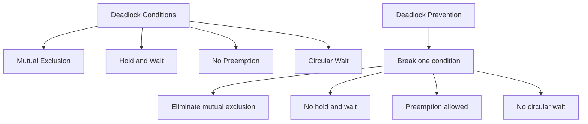

#### Deadlock Conditions (Coffman Conditions)
1. **Mutual Exclusion**: Only one process can use resource
2. **Hold and Wait**: Process holds resource while waiting for another
3. **No Preemption**: Resources cannot be forcibly taken
4. **Circular Wait**: Circular chain of waiting processes

#### Deadlock Prevention Strategies
- **Eliminate Mutual Exclusion**: Allow resource sharing
- **No Hold and Wait**: Request all resources at once
- **Preemption**: Allow resource preemption
- **No Circular Wait**: Impose ordering on resource requests

#### Deadlock Detection and Recovery
- **Detection**: Resource allocation graph, wait-for graph
- **Recovery**: Process termination, resource preemption

## File System Management

### File System Structure
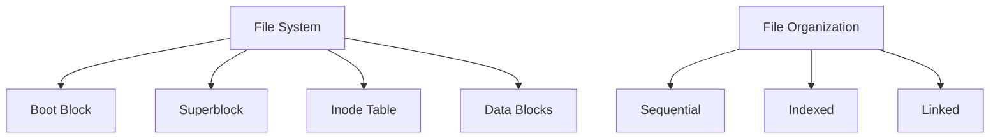

### File Allocation Methods
| Method | Description | Pros | Cons |
|--------|-------------|------|------|
| **Contiguous** | Adjacent blocks | Fast access | External fragmentation |
| **Linked** | Pointer chain | No fragmentation | Random access slow |
| **Indexed** | Index block | Direct access | Index size overhead |

### Directory Structure
- **Single-Level**: Simple, flat structure
- **Two-Level**: Master directory + user directories
- **Tree-Structured**: Hierarchical organization
- **Acyclic Graph**: Shared files/subdirectories
- **General Graph**: Cycles allowed

### File System Operations
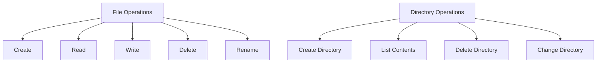

## I/O Management

### I/O Devices Classification
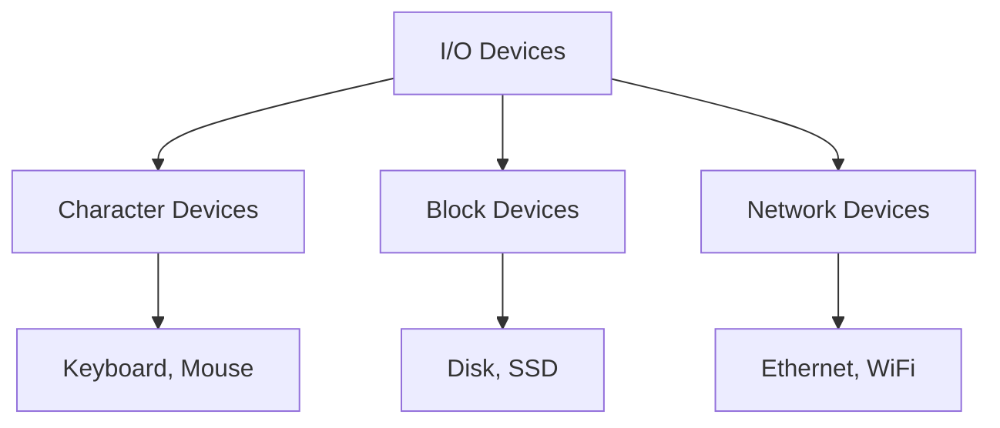

### I/O Scheduling
- **Purpose**: Optimize disk access patterns
- **Algorithms**: FCFS, SSTF, SCAN, C-SCAN, LOOK, C-LOOK
- **Goals**: Minimize seek time, improve throughput

### Buffering
- **Single Buffer**: One buffer per device
- **Double Buffer**: Two buffers alternate
- **Circular Buffer**: Multiple buffers in circle

## Common Interview Questions

### Basic Questions

**Q1: What is the difference between process and thread?**
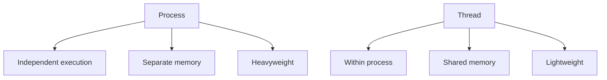

**Q2: What is virtual memory and why is it important?**
- **Definition**: Extension of physical memory using disk
- **Benefits**: Larger address space, memory protection, efficient memory use
- **Implementation**: Paging, segmentation, demand paging

**Q3: Explain the process states in OS**
1. **New**: Process creation
2. **Ready**: Waiting for CPU
3. **Running**: Executing
4. **Waiting**: I/O or event wait
5. **Terminated**: Execution complete

### Intermediate Questions

**Q4: What is deadlock and how can it be prevented?**
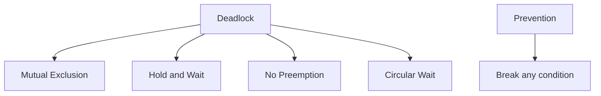

**Prevention Strategies**:
- **Break mutual exclusion**: Allow resource sharing
- **Break hold and wait**: Request all at once
- **Break no preemption**: Allow taking resources
- **Break circular wait**: Resource ordering

**Q5: What is the difference between paging and segmentation?**
| Aspect | Paging | Segmentation |
|--------|--------|--------------|
| **Division** | Fixed-size pages | Variable-size segments |
| **Visibility** | Invisible to programmer | Visible to programmer |
| **Fragmentation** | Internal fragmentation | External fragmentation |
| **Sharing** | Page-level sharing | Segment-level sharing |

### Advanced Questions

**Q6: What is context switching and how does it work?**
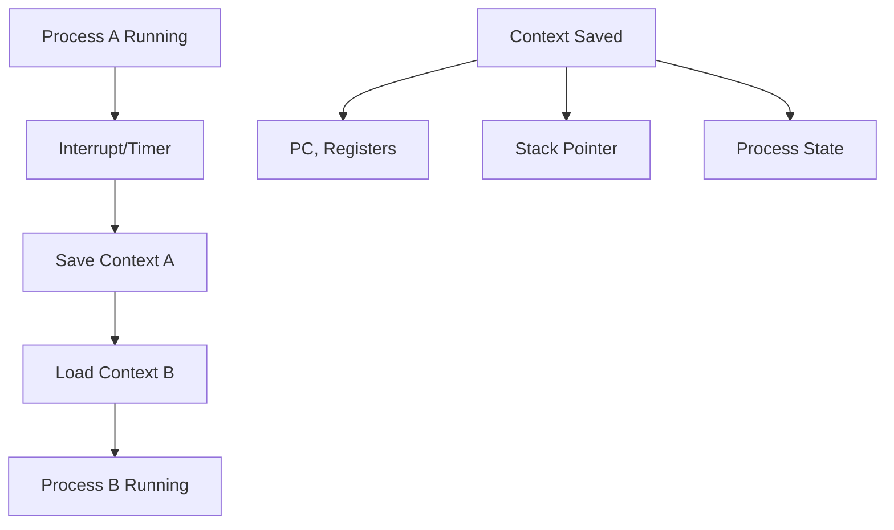

**Context Switching**: Saving state of current process and loading state of new process

**Q7: Explain different scheduling algorithms with examples**
- **FCFS**: First come, first served
  - Example: Queue at bank
- **SJF**: Shortest job first
  - Example: Emergency room prioritization
- **Round Robin**: Time sharing
  - Example: CPU time sharing among processes

## OS Commands and Tools

### Linux/Unix Commands
| Command | Purpose | Example |
|---------|---------|---------|
| **ps** | Show processes | `ps aux` |
| **top** | Monitor processes | `top` |
| **kill** | Terminate process | `kill -9 1234` |
| **free** | Memory usage | `free -h` |
| **df** | Disk usage | `df -h` |
| **du** | Directory size | `du -sh /home` |

### Windows Commands
| Command | Purpose | Example |
|---------|---------|---------|
| **tasklist** | Show processes | `tasklist` |
| **taskkill** | Kill process | `taskkill /PID 1234` |
| **wmic** | System info | `wmic cpu get name` |
| **systeminfo** | System details | `systeminfo` |

## Quick Reference

### OS Comparison
| Feature | Windows | Linux | macOS |
|---------|---------|-------|-------|
| **Kernel** | Hybrid | Monolithic | Hybrid |
| **File System** | NTFS, FAT32 | ext4, XFS | APFS, HFS+ |
| **Shell** | PowerShell | Bash | Zsh |
| **Source** | Proprietary | Open Source | Proprietary |
| **Cost** | Paid | Free | Paid |

### Key Concepts Summary
| Concept | Definition | Importance |
|---------|------------|-----------|
| **Process** | Program in execution | Task management |
| **Thread** | Lightweight process | Parallel execution |
| **Virtual Memory** | Memory extension technique | Large address space |
| **Deadlock** | Process blocking situation | System reliability |
| **File System** | Data organization | Data management |

### Interview Preparation Tips

1. **Understand fundamentals** before memorizing details
2. **Draw diagrams** to explain concepts
3. **Compare and contrast** different approaches
4. **Think about trade-offs** in design decisions
5. **Practice explaining** concepts clearly

### Common Mistakes to Avoid

1. **Confusing processes and threads**
2. **Forgetting deadlock conditions**
3. **Not understanding virtual memory benefits**
4. **Mixing up scheduling algorithms**
5. **Ignoring practical examples**

---

**Important Note**: Operating systems are the foundation of all software development. Understanding OS concepts is crucial for writing efficient, reliable applications. Focus on understanding the why behind each concept, not just the what.