# Chapter 6: Database Management Systems

## DBMS Fundamentals

### What is DBMS?
- **Database Management System**: Software for creating and managing databases
- **Purpose**: Efficient data storage, retrieval, and management
- **Importance**: Foundation for data-driven applications, business intelligence

### Database Architecture
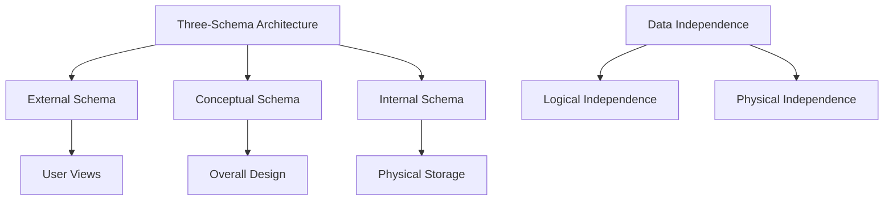

**Three-Schema Architecture**:
- **External Schema**: User's view of data
- **Conceptual Schema**: Overall database design
- **Internal Schema**: Physical storage structure

### Database Users
| User Type | Role | Examples |
|-----------|------|----------|
| **Application Programmer** | Writes application code | Developers |
| **Database Administrator** | Manages database | DBA |
| **Sophisticated User** | Complex queries | Data analysts |
| **Naive User** | Simple interface interaction | End users |

## Data Models

### Evolution of Data Models
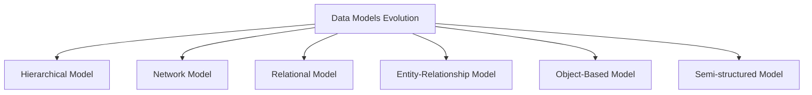

### Relational Model
- **Foundation**: Based on mathematical relations (sets)
- **Structure**: Tables with rows and columns
- **Keys**: Primary keys, foreign keys, candidate keys
- **Integrity**: Entity integrity, referential integrity

### Entity-Relationship (ER) Model
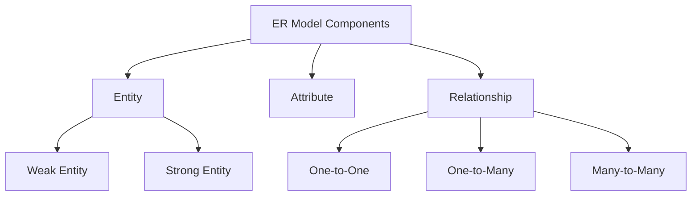

**Entity Types**:
- **Strong Entity**: Independent existence
- **Weak Entity**: Depends on strong entity

**Relationship Types**:
- **One-to-One (1:1)**: One entity relates to one entity
- **One-to-Many (1:N)**: One entity relates to many entities
- **Many-to-Many (M:N)**: Many entities relate to many entities

## Database Design

### ER Diagram Components
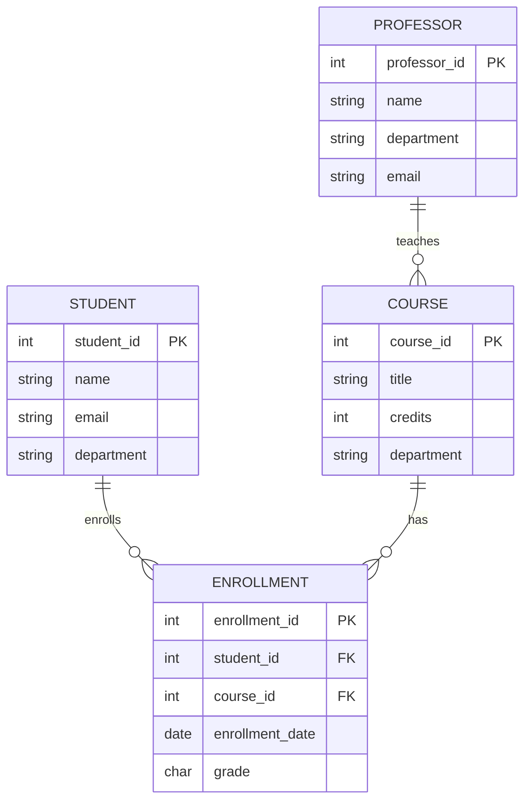

### Normalization Process

#### First Normal Form (1NF)
- **Rule**: Each cell contains atomic values
- **Purpose**: Eliminate repeating groups
- **Example**: Split multi-valued attributes

#### Second Normal Form (2NF)
- **Rule**: No partial dependencies on composite primary key
- **Purpose**: Eliminate partial dependencies
- **Example**: Separate non-key attributes dependent on part of key

#### Third Normal Form (3NF)
- **Rule**: No transitive dependencies
- **Purpose**: Eliminate transitive dependencies
- **Example**: Remove attributes dependent on other non-key attributes

**Normalization Benefits**:
- **Data Integrity**: Reduces redundancy and inconsistencies
- **Update Efficiency**: Easier to maintain data
- **Storage Efficiency**: Reduces storage requirements

## Transaction Management

### ACID Properties
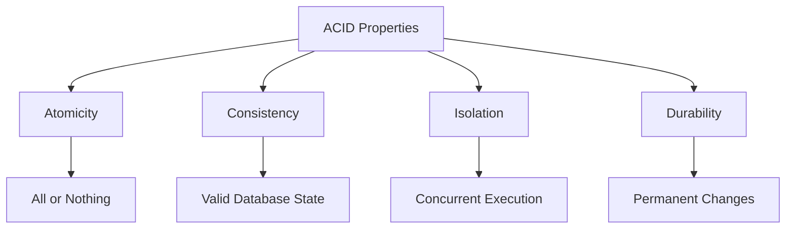

#### Atomicity
- **Definition**: All operations in transaction complete or none
- **Implementation**: Commit/Rollback mechanisms
- **Example**: Bank transfer (debit + credit)

#### Consistency
- **Definition**: Database remains in valid state after transaction
- **Implementation**: Constraints, triggers
- **Example**: Account balances never negative

#### Isolation
- **Definition**: Concurrent transactions don't interfere
- **Implementation**: Locking mechanisms
- **Example**: Users see consistent data

#### Durability
- **Definition**: Committed changes persist after system failure
- **Implementation**: Logging, redundancy
- **Example**: Power outage doesn't lose committed data

### Transaction States
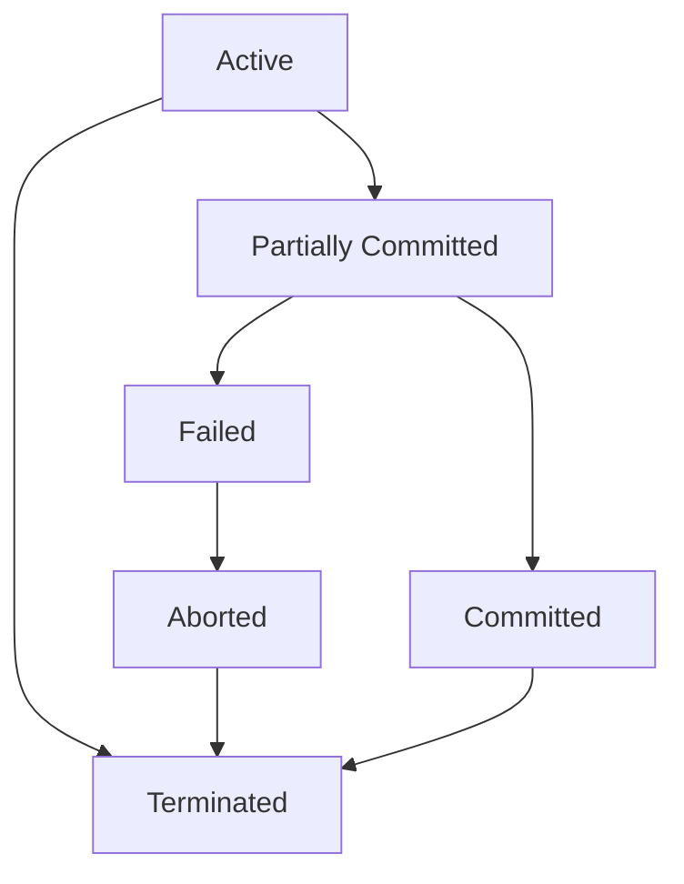

**Transaction States**:
- **Active**: Transaction executing
- **Partially Committed**: Final operation completed
- **Committed**: Transaction successful
- **Failed**: Error occurred
- **Aborted**: Transaction rolled back
- **Terminated**: Transaction ended

## Concurrency Control

### Concurrency Problems
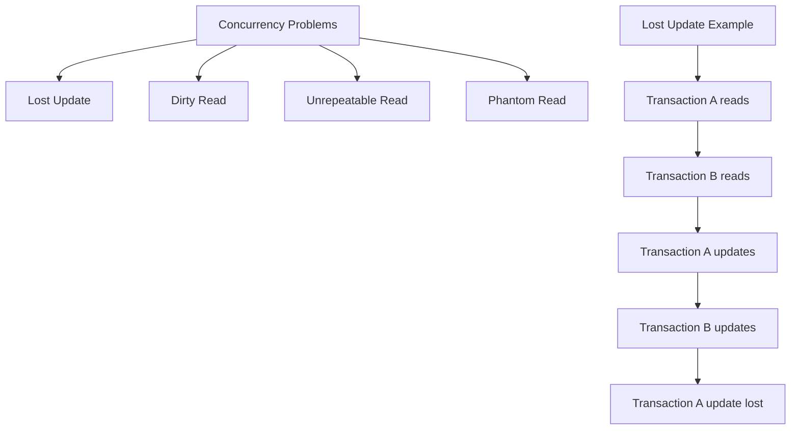

**Concurrency Issues**:
- **Lost Update**: One transaction's update overwritten
- **Dirty Read**: Reading uncommitted data
- **Unrepeatable Read**: Same query returns different results
- **Phantom Read**: New rows appear in query results

### Lock-Based Protocols

#### Types of Locks
| Lock Type | Description | Compatibility |
|-----------|-------------|---------------|
| **Shared Lock (S)** | Read-only access | Compatible with S locks |
| **Exclusive Lock (X)** | Read-write access | Incompatible with all locks |
| **Intention Lock (IS/IX)** | Multi-level locking | Hierarchical locking |

#### Two-Phase Locking (2PL)
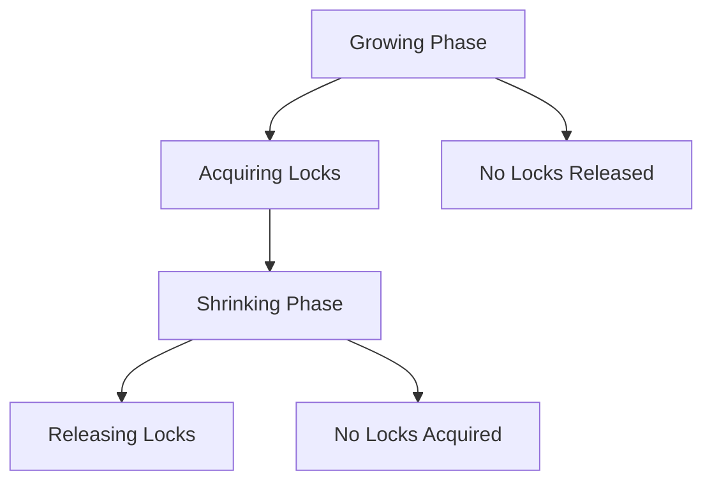

**Two-Phase Locking Rules**:
1. **Growing Phase**: Acquire locks, no releases
2. **Shrinking Phase**: Release locks, no acquisitions
3. **Guarantee**: Serializability

### Timestamp-Based Protocols
- **Basic Timestamp Ordering**: Younger transactions wait
- **Thomas Write Rule**: Ignore outdated writes
- **Advantages**: No deadlocks, better concurrency

## Recovery Management

### Recovery Techniques
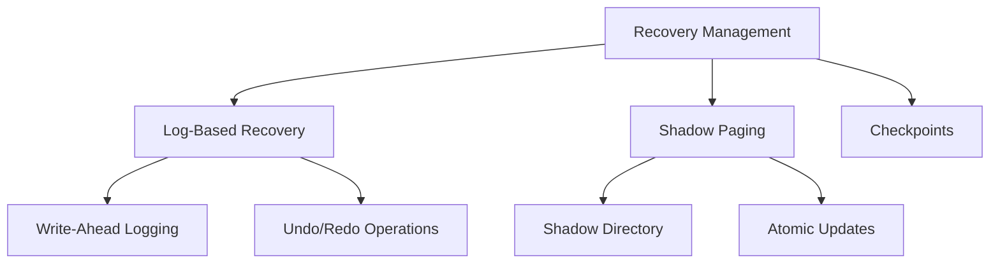

### Log-Based Recovery
- **Write-Ahead Logging**: Log records before database update
- **Log Records**: Transaction ID, operation, old value, new value
- **Recovery Process**: Analyze log, undo incomplete, redo complete

#### Log Types
| Log Type | Purpose | Information |
|----------|---------|-------------|
| **Start** | Transaction start | Transaction ID |
| **Update** | Database change | Item, old value, new value |
| **Commit** | Transaction complete | Transaction ID |
| **Abort** | Transaction failure | Transaction ID |

### Checkpointing
- **Purpose**: Reduce recovery time
- **Process**: Save database state at intervals
- **Types**: Static checkpoint, fuzzy checkpoint

**Checkpoint Benefits**:
- **Faster Recovery**: Start from last checkpoint
- **Reduced Log Size**: Older log records can be deleted
- **Performance**: Regular maintenance windows

## Database Security

### Security Levels
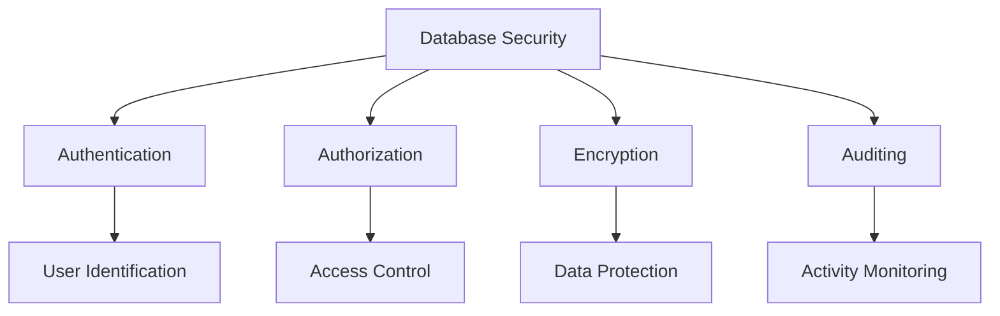

### Access Control
- **Discretionary Access Control (DAC)**: User-defined permissions
- **Mandatory Access Control (MAC)**: System-enforced permissions
- **Role-Based Access Control (RBAC)**: Permissions based on roles

### SQL Security Commands
```sql
-- Create user
CREATE USER john@localhost IDENTIFIED BY 'password';

-- Grant permissions
GRANT SELECT, INSERT ON employees TO john@localhost;

-- Grant with grant option
GRANT ALL ON database.* TO admin@localhost WITH GRANT OPTION;

-- Revoke permissions
REVOKE INSERT ON employees FROM john@localhost;
```

### Security Threats and Prevention
| Threat | Description | Prevention |
|--------|-------------|------------|
| **SQL Injection** | Malicious SQL code | Input validation, prepared statements |
| **Unauthorized Access** | Access without permission | Strong authentication, RBAC |
| **Data Theft** | Stealing sensitive data | Encryption, access controls |
| **Denial of Service** | Overwhelming database | Rate limiting, monitoring |

## Distributed Databases

### Distributed Database Architecture
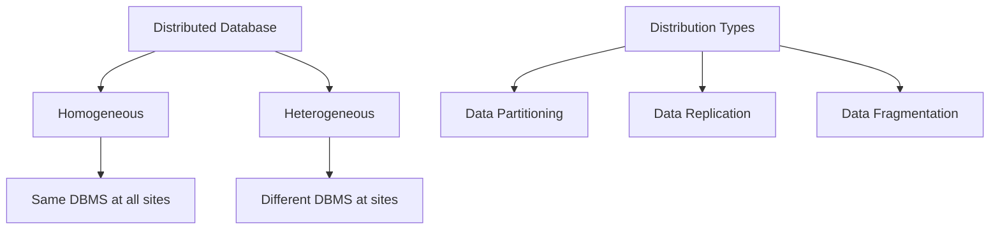

### Data Distribution Strategies

#### Horizontal Partitioning
- **Definition**: Split table rows across sites
- **Example**: Customers by geographic region
- **Benefits**: Load distribution, faster queries

#### Vertical Partitioning
- **Definition**: Split table columns across sites
- **Example**: Frequently accessed columns together
- **Benefits**: Reduced data transfer, improved performance

#### Replication
- **Definition**: Copy data across multiple sites
- **Types**: Full replication, partial replication
- **Benefits**: Availability, performance, fault tolerance

## NoSQL Databases

### NoSQL vs SQL Comparison
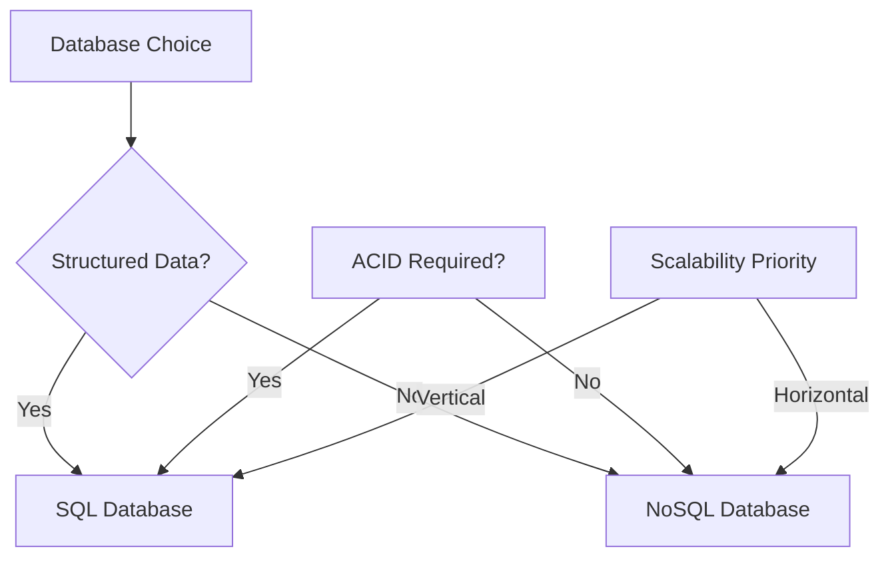

| Aspect | SQL Databases | NoSQL Databases |
|--------|---------------|-----------------|
| **Schema** | Fixed schema | Flexible schema |
| **Scalability** | Vertical scaling | Horizontal scaling |
| **Consistency** | Strong consistency | Eventual consistency |
| **Query Language** | SQL | Various (MongoDB, Cassandra) |
| **Use Cases** | Financial systems, e-commerce | Social media, IoT, big data |

### NoSQL Database Types
| Type | Description | Examples |
|------|-------------|----------|
| **Document** | JSON-like documents | MongoDB, CouchDB |
| **Key-Value** | Simple key-value pairs | Redis, DynamoDB |
| **Column-Family** | Wide column storage | Cassandra, HBase |
| **Graph** | Node-relationship model | Neo4j, Amazon Neptune |

## Common Interview Questions

### Basic Questions

**Q1: What is the difference between DBMS and RDBMS?**
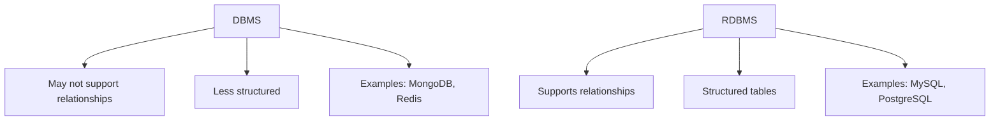

**Q2: Explain ACID properties with example**
- **Atomicity**: Bank transfer (both debit and credit succeed or fail)
- **Consistency**: Account balance always positive
- **Isolation**: Concurrent users see consistent data
- **Durability**: System crash doesn't lose committed transactions

**Q3: What is normalization and why is it important?**
- **Purpose**: Eliminate redundancy, ensure data integrity
- **Process**: 1NF → 2NF → 3NF → BCNF
- **Benefits**: Efficient storage, easier maintenance

### Intermediate Questions

**Q4: What is the difference between primary key and unique key?**
| Feature | Primary Key | Unique Key |
|---------|-------------|------------|
| **Null Values** | Not allowed | One null allowed |
| **Number** | Only one per table | Multiple per table |
| **Foreign Key Reference** | Can be referenced | Can be referenced |
| **Index Creation** | Automatic clustering | May need explicit index |

**Q5: What is a transaction and how does it work?**
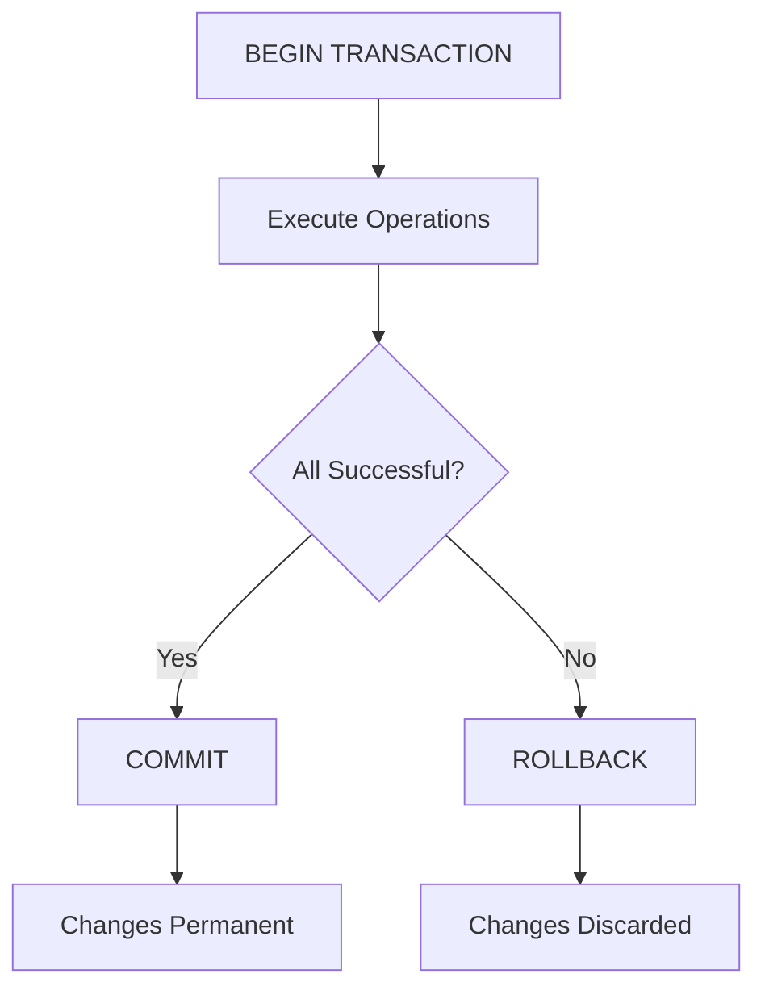

### Advanced Questions

**Q6: What is deadlock and how can it be prevented?**
- **Deadlock**: Process waiting for resources held by other processes
- **Prevention**: Break one of four conditions
- **Detection**: Wait-for graph analysis
- **Recovery**: Process termination or resource preemption

**Q7: Explain different types of joins in SQL**
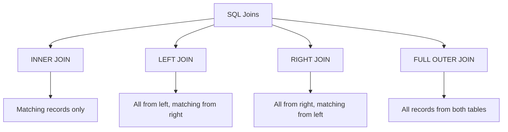

## Database Performance Optimization

### Indexing Strategies
- **Clustered Index**: Physical data order
- **Non-clustered Index**: Separate index structure
- **Composite Index**: Multiple columns
- **Covering Index**: Includes all query columns

### Query Optimization
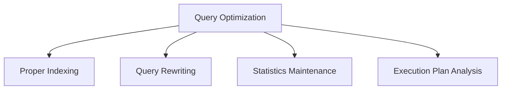

**Optimization Tips**:
1. **Use appropriate indexes** for frequent queries
2. **Avoid SELECT \*** - select only needed columns
3. **Use EXISTS instead of IN** for subqueries
4. **Optimize JOIN order** - small tables first
5. **Regular maintenance** - update statistics, rebuild indexes

## Quick Reference

### Database Commands Summary
| Operation | SQL Command | Example |
|-----------|-------------|---------|
| **Create Database** | CREATE DATABASE | `CREATE DATABASE mydb;` |
| **Create Table** | CREATE TABLE | `CREATE TABLE users(...);` |
| **Insert Data** | INSERT INTO | `INSERT INTO users VALUES(...);` |
| **Update Data** | UPDATE | `UPDATE users SET name='John';` |
| **Delete Data** | DELETE FROM | `DELETE FROM users WHERE id=1;` |
| **Create Index** | CREATE INDEX | `CREATE INDEX idx_name ON users(name);` |

### DBMS Components Summary
| Component | Purpose | Example |
|-----------|---------|---------|
| **Query Processor** | Process SQL queries | Parser, optimizer |
| **Storage Manager** | Manage data storage | File manager, buffer manager |
| **Transaction Manager** | Handle transactions | Concurrency control, recovery |
| **Security Manager** | Control access | Authentication, authorization |

### Interview Preparation Tips

1. **Understand fundamentals** of database theory
2. **Practice SQL queries** for different scenarios
3. **Design ER diagrams** for given requirements
4. **Understand trade-offs** in database design
5. **Know performance optimization** techniques

### Common Mistakes to Avoid

1. **Confusing DBMS and RDBMS**
2. **Forgetting ACID properties**
3. **Not understanding joins properly**
4. **Ignoring database security**
5. **Missing performance considerations**

---

**Important Note**: DBMS knowledge is crucial for software development roles. Focus on understanding concepts behind database operations, not just memorizing SQL syntax. Practice designing databases for different scenarios and understand the trade-offs involved in design decisions.