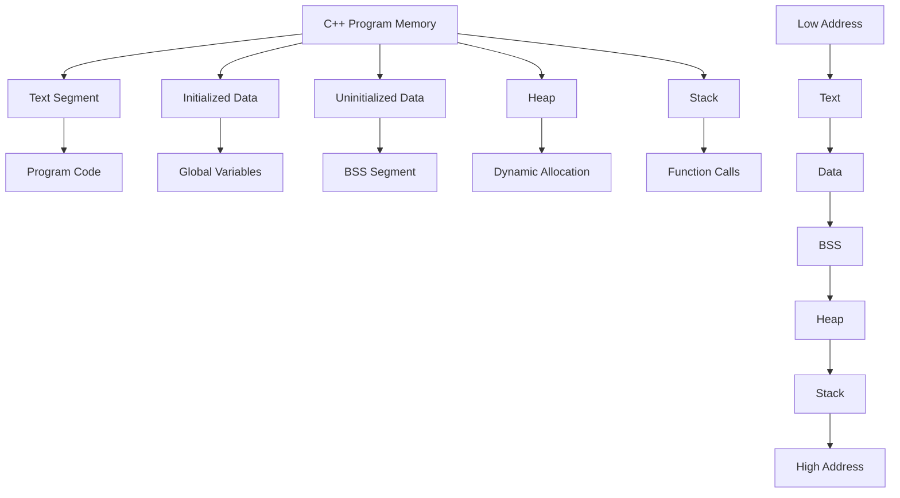
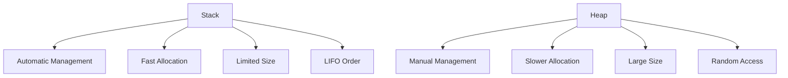
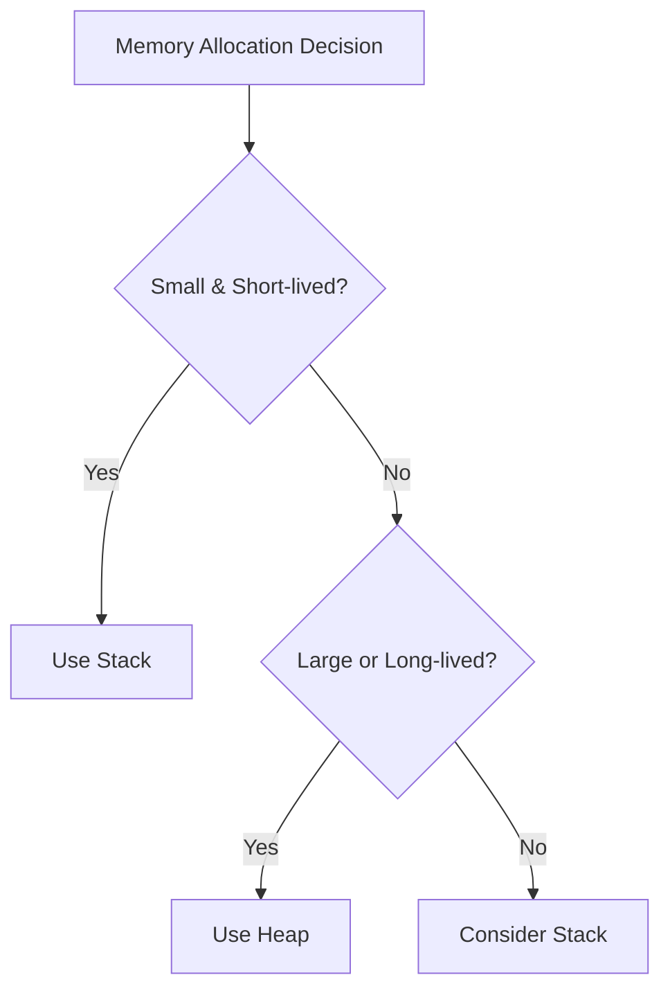
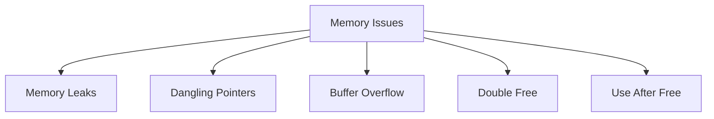
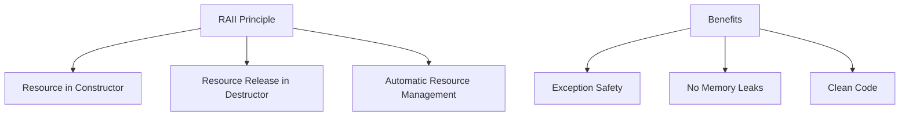
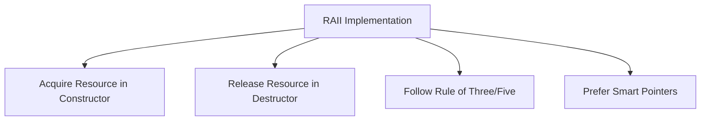
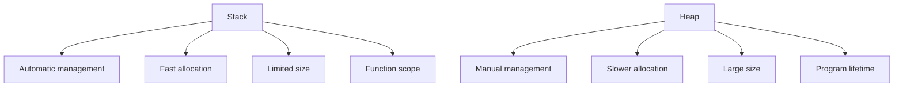
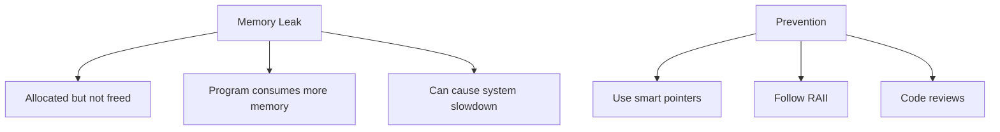
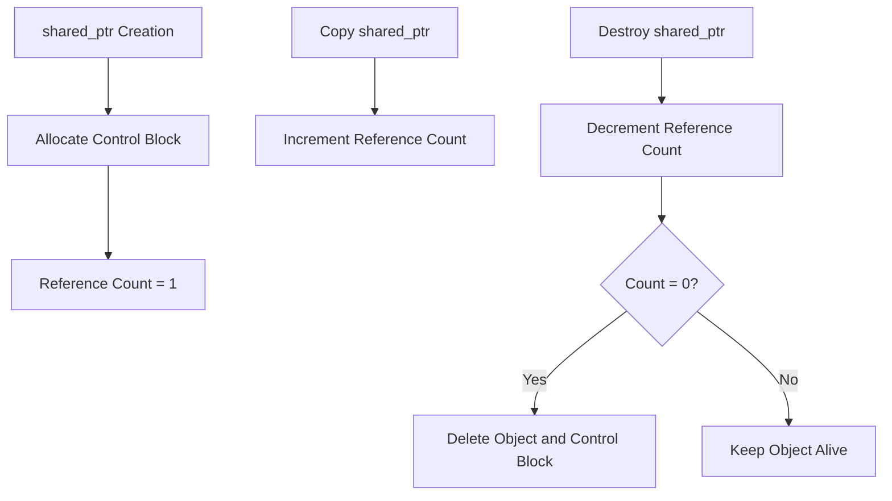
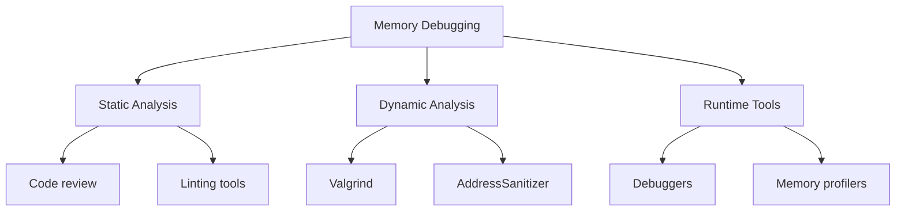

# Chapter 7: Memory Management in C++

## Memory Layout of a C++ Program

### Program Memory Segments


### Memory Segment Details

#### Text Segment (Code Segment)
- **Purpose**: Stores compiled program code
- **Properties**: Read-only, shared among processes
- **Size**: Determined at compile time
- **Example**: Machine instructions, string literals

#### Data Segment
- **Initialized Data**: Global/static variables with initial values
- **BSS (Block Started by Symbol)**: Uninitialized global/static variables
- **Properties**: Fixed size, program lifetime

#### Heap
- **Purpose**: Dynamic memory allocation
- **Management**: Programmer-controlled (new/delete, malloc/free)
- **Growth**: Grows upward (toward higher addresses)
- **Fragmentation**: Can become fragmented over time

#### Stack
- **Purpose**: Function calls, local variables, return addresses
- **Management**: Automatic (compiler-managed)
- **Growth**: Grows downward (toward lower addresses)
- **Size**: Limited, determined by system

## Stack vs Heap Comparison

### Key Differences


| Characteristic | Stack | Heap |
|----------------|-------|------|
| **Allocation** | Automatic (compiler) | Manual (programmer) |
| **Deallocation** | Automatic (function return) | Manual (delete/free) |
| **Speed** | Fast (just pointer adjustment) | Slower (search for suitable block) |
| **Size** | Limited (few MB) | Large (system memory) |
| **Fragmentation** | No fragmentation | Can become fragmented |
| **Lifetime** | Function scope | Until explicitly freed |
| **Access Pattern** | LIFO (Last In, First Out) | Random access |

### When to Use Stack vs Heap


**Use Stack When**:
- Object size is small (few KB)
- Lifetime is limited to function scope
- No need for memory sharing between functions
- Performance is critical

**Use Heap When**:
- Object size is large or variable
- Lifetime must exceed function scope
- Need to share memory between functions
- Need dynamic array resizing

## Dynamic Memory Management

### Memory Allocation Functions

#### C++ Operators: new and delete
```cpp
// Single object allocation
int* ptr = new int;          // Allocate memory
*ptr = 42;                   // Use memory
delete ptr;                  // Free memory

// Array allocation
int* arr = new int[10];      // Allocate array
for(int i = 0; i < 10; i++) {
    arr[i] = i;              // Use array
}
delete[] arr;                // Free array
```

#### C Functions: malloc and free
```cpp
// Single object allocation
int* ptr = (int*)malloc(sizeof(int));
if(ptr != nullptr) {
    *ptr = 42;
    free(ptr);
}

// Array allocation
int* arr = (int*)malloc(10 * sizeof(int));
if(arr != nullptr) {
    for(int i = 0; i < 10; i++) {
        arr[i] = i;
    }
    free(arr);
}
```

### new/delete vs malloc/free
| Feature | new/delete | malloc/free |
|---------|------------|-------------|
| **Type Safety** | Type-safe | Not type-safe |
| **Constructor** | Calls constructor | No constructor |
| **Destructor** | Calls destructor | No destructor |
| **Size Calculation** | Automatic | Manual (sizeof) |
| **Overhead** | Minimal | System-dependent |
| **Language** | C++ specific | C compatible |

## Memory Management Issues

### Common Memory Problems


#### 1. Memory Leaks
**Definition**: Allocated memory not freed
**Causes**: Forget to delete, exception before delete, lost pointer

```cpp
// Memory leak example
void leakExample() {
    int* ptr = new int(42);
    // Forgot to delete ptr - memory leak!

    // Exception before delete
    int* ptr2 = new int(100);
    throw std::runtime_error("Error"); // Memory leak!
    delete ptr2; // Never reached
}
```

**Prevention**:
- Always delete what you new
- Use smart pointers
- Follow RAII principles

#### 2. Dangling Pointers
**Definition**: Pointer pointing to freed memory
**Causes**: Delete but keep pointer, return local variable address

```cpp
// Dangling pointer example
int* createDangling() {
    int x = 42;
    return &x; // x goes out of scope - dangling!
}

void danglingExample() {
    int* ptr = new int(42);
    delete ptr;
    // ptr is now dangling
    *ptr = 100; // Undefined behavior!
}
```

**Prevention**:
- Set pointer to nullptr after delete
- Don't return addresses of local variables
- Use smart pointers

#### 3. Buffer Overflow
**Definition**: Writing beyond allocated memory bounds
**Causes**: Array index out of bounds, incorrect size calculation

```cpp
// Buffer overflow example
void overflowExample() {
    int arr[5];
    for(int i = 0; i <= 5; i++) { // Bug: should be < 5
        arr[i] = i; // Writes beyond array bounds
    }

    char* buffer = new char[10];
    strcpy(buffer, "This is too long"); // Buffer overflow!
    delete[] buffer;
}
```

**Prevention**:
- Use bounds checking
- Use safe string functions (strncpy, snprintf)
- Use containers (std::vector, std::string)

## Smart Pointers (C++11+)

### RAII (Resource Acquisition Is Initialization)


### unique_ptr
**Purpose**: Exclusive ownership, non-copyable
**Use Case**: Single owner of resource

```cpp
#include <memory>

void uniquePtrExample() {
    // Create unique_ptr
    std::unique_ptr<int> ptr = std::make_unique<int>(42);

    // Access value
    std::cout << *ptr << std::endl;

    // Transfer ownership
    std::unique_ptr<int> ptr2 = std::move(ptr);
    // ptr is now nullptr

    // Cannot copy (compile error)
    // std::unique_ptr<int> ptr3 = ptr2; // ERROR!

    // Automatic cleanup when goes out of scope
}
```

### shared_ptr
**Purpose**: Shared ownership with reference counting
**Use Case**: Multiple owners of same resource

```cpp
#include <memory>

void sharedPtrExample() {
    // Create shared_ptr
    std::shared_ptr<int> ptr1 = std::make_shared<int>(42);

    {
        // Create another shared_ptr pointing to same object
        std::shared_ptr<int> ptr2 = ptr1;
        std::cout << "Reference count: " << ptr1.use_count() << std::endl; // 2

        // Both pointers can access the same object
        std::cout << *ptr1 << ", " << *ptr2 << std::endl; // 42, 42
    } // ptr2 goes out of scope, reference count decreases

    std::cout << "Reference count: " << ptr1.use_count() << std::endl; // 1
} // ptr1 goes out of scope, object is deleted
```

### weak_ptr
**Purpose**: Non-owning observer, prevents circular references
**Use Case**: Break circular references in shared_ptr

```cpp
#include <memory>

struct Node {
    std::shared_ptr<Node> next;
    std::weak_ptr<Node> prev; // Use weak_ptr to avoid circular reference

    ~Node() { std::cout << "Node destroyed" << std::endl; }
};

void weakPtrExample() {
    auto node1 = std::make_shared<Node>();
    auto node2 = std::make_shared<Node>();

    node1->next = node2;
    node2->prev = node1; // weak_ptr doesn't increase reference count

    std::cout << "node1 use_count: " << node1.use_count() << std::endl; // 1
    std::cout << "node2 use_count: " << node2.use_count() << std::endl; // 2
} // Both nodes are properly destroyed
```

### Smart Pointer Comparison
| Pointer | Ownership | Copy | Reference Counting | Use Case |
|---------|-----------|------|-------------------|----------|
| **unique_ptr** | Exclusive | No (move only) | No | Single owner |
| **shared_ptr** | Shared | Yes | Yes | Multiple owners |
| **weak_ptr** | Non-owning | Yes | No | Break cycles, observer |

## Memory Management Best Practices

### RAII Guidelines


### Best Practices

#### 1. Use Smart Pointers
```cpp
// Bad: Raw pointers
class BadExample {
    int* data;
public:
    BadExample(int size) : data(new int[size]) {}
    ~BadExample() { delete[] data; } // Need Rule of Three
};

// Good: Smart pointers
class GoodExample {
    std::unique_ptr<int[]> data;
public:
    GoodExample(int size) : data(std::make_unique<int[]>(size)) {}
    // Destructor automatically handled
};
```

#### 2. Follow Rule of Three/Five
```cpp
class Resource {
    int* data;
    size_t size;

public:
    // Constructor
    Resource(size_t s) : size(s), data(new int[s]) {}

    // Destructor
    ~Resource() { delete[] data; }

    // Copy constructor
    Resource(const Resource& other) : size(other.size), data(new int[other.size]) {
        std::copy(other.data, other.data + size, data);
    }

    // Copy assignment
    Resource& operator=(const Resource& other) {
        if (this != &other) {
            delete[] data;
            size = other.size;
            data = new int[other.size];
            std::copy(other.data, other.data + size, data);
        }
        return *this;
    }

    // Move constructor
    Resource(Resource&& other) noexcept : data(other.data), size(other.size) {
        other.data = nullptr;
        other.size = 0;
    }

    // Move assignment
    Resource& operator=(Resource&& other) noexcept {
        if (this != &other) {
            delete[] data;
            data = other.data;
            size = other.size;
            other.data = nullptr;
            other.size = 0;
        }
        return *this;
    }
};
```

#### 3. Avoid Raw New/Delete
```cpp
// Bad: Manual memory management
void badExample() {
    int* ptr = new int(42);
    // ... complex logic ...
    delete ptr; // Easy to forget or miss due to exceptions
}

// Good: RAII
void goodExample() {
    auto ptr = std::make_unique<int>(42);
    // ... complex logic ...
    // Automatic cleanup
}
```

#### 4. Use Containers Instead of Raw Arrays
```cpp
// Bad: Raw arrays
void badArrayExample(int size) {
    int* arr = new int[size];
    // Must remember to delete[]
    delete[] arr;
}

// Good: Containers
void goodArrayExample(int size) {
    std::vector<int> arr(size);
    // Automatic cleanup
}
```

## Common Interview Questions

### Basic Questions

**Q1: What is the difference between stack and heap?**


**Q2: What is RAII and why is it important?**
- **RAII**: Resource Acquisition Is Initialization
- **Importance**: Exception safety, automatic cleanup, no resource leaks
- **Implementation**: Resources acquired in constructor, released in destructor

**Q3: What are smart pointers and when should you use them?**
- **unique_ptr**: Single ownership, exclusive access
- **shared_ptr**: Multiple ownership, reference counting
- **weak_ptr**: Non-owning reference, break circular references

### Intermediate Questions

**Q4: What is memory leak and how can you prevent it?**


**Q5: Explain dangling pointers with examples**
- **Definition**: Pointer pointing to invalid memory
- **Causes**: Delete and keep pointer, return local variable address
- **Prevention**: Set to nullptr after delete, don't return locals

### Advanced Questions

**Q6: What is the Rule of Three/Five?**
- **Rule of Three**: If you need destructor, copy constructor, or copy assignment, you need all three
- **Rule of Five**: Add move constructor and move assignment (C++11+)
- **Rule of Zero**: Prefer default implementations when possible

**Q7: How does shared_ptr implement reference counting?**


## Memory Debugging Tools

### Common Tools
| Tool | Platform | Features |
|------|----------|----------|
| **Valgrind** | Linux | Memory leak detection, profiling |
| **AddressSanitizer** | GCC/Clang | Runtime error detection |
| **Visual Studio Debugger** | Windows | Memory debugging, leak detection |
| **Dr. Memory** | Windows | Memory error detection |

### Debugging Techniques


## Quick Reference

### Memory Management Summary
| Concept | Purpose | Best Practice |
|---------|---------|----------------|
| **Stack** | Local variables, function calls | Use for small, short-lived objects |
| **Heap** | Dynamic allocation | Use smart pointers, RAII |
| **Smart Pointers** | Automatic memory management | Prefer over raw pointers |
| **RAII** | Resource management | Tie resource lifetime to object scope |

### Common Memory Operations
| Operation | C++ | C |
|-----------|-----|---|
| **Allocate** | `new` | `malloc` |
| **Deallocate** | `delete` | `free` |
| **Allocate Array** | `new[]` | `malloc` |
| **Deallocate Array** | `delete[]` | `free` |
| **Smart Pointer** | `make_unique`, `make_shared` | N/A |

### Interview Preparation Tips

1. **Understand memory layout** of C++ programs
2. **Master RAII** and smart pointers
3. **Practice identifying** memory issues in code
4. **Know the differences** between allocation methods
5. **Be ready to write** memory-safe code

### Common Mistakes to Avoid

1. **Forgetting to delete** allocated memory
2. **Using dangling pointers** after deletion
3. **Buffer overflows** in array operations
4. **Mixing new/delete** with malloc/free
5. **Not following RAII** principles

---

**Important Note**: Memory management is crucial for writing efficient and reliable C++ code. Modern C++ provides smart pointers to help avoid memory issues. Focus on understanding RAII principles and prefer smart pointers over raw pointers in modern C++ development.