# Chapter 8: Git and GitHub

## Version Control Fundamentals

### What is Version Control?
- **Definition**: System that tracks changes to files over time
- **Purpose**: Collaboration, history tracking, backup and recovery
- **Importance**: Essential for team development, code management

### Types of Version Control
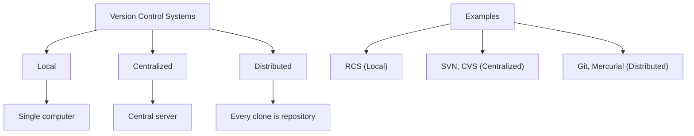

## Git Fundamentals

### Git Architecture
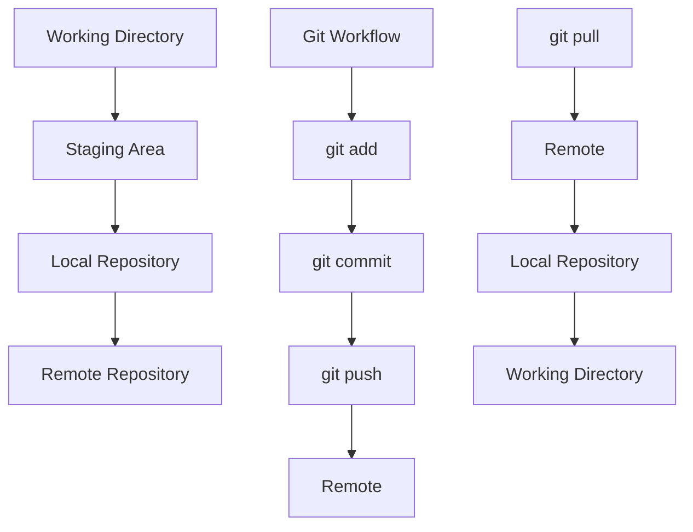

### Git Components
| Component | Purpose | Command |
|-----------|---------|---------|
| **Working Directory** | Current files you're working on | Files on your computer |
| **Staging Area** | Files ready to commit | `git add` |
| **Local Repository** | Local commit history | `git commit` |
| **Remote Repository** | Shared repository | `git push/pull` |

### Git States
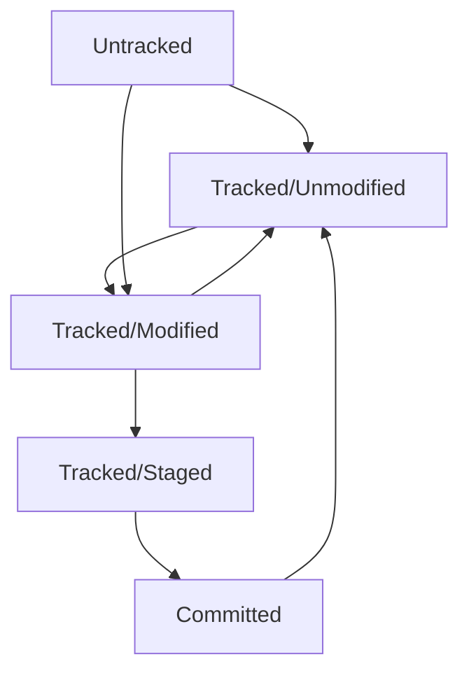

**File States**:
- **Untracked**: New file not tracked by Git
- **Unmodified**: File unchanged since last commit
- **Modified**: File changed but not staged
- **Staged**: File ready to commit
- **Committed**: File saved in repository

## Basic Git Commands

### Repository Operations
```bash
# Initialize new repository
git init

# Clone existing repository
git clone <repository-url>

# Check repository status
git status

# Show configuration
git config --list
```

### Basic Workflow
```bash
# Add files to staging area
git add <filename>
git add .  # Add all files
git add *.cpp  # Add all .cpp files

# Commit changes
git commit -m "Descriptive commit message"
git commit -am "Add and commit in one step" (only for tracked files)

# View commit history
git log
git log --oneline
git log --graph --oneline --all

# Show file differences
git diff
git diff --staged
git diff HEAD~1 HEAD
```

### Branching and Merging
```bash
# Create new branch
git branch <branch-name>

# Switch to branch
git checkout <branch-name>
git switch <branch-name>  # Modern Git

# Create and switch branch
git checkout -b <branch-name>
git switch -c <branch-name>  # Modern Git

# Merge branches
git merge <branch-name>

# Delete branch
git branch -d <branch-name>  # Only if merged
git branch -D <branch-name>  # Force delete
```

### Remote Operations
```bash
# Add remote repository
git remote add origin <repository-url>

# View remotes
git remote -v

# Push to remote
git push origin master
git push -u origin master  # Set upstream

# Pull from remote
git pull origin master
git fetch origin  # Fetch without merging

# View remote branches
git branch -r
git branch -a  # All branches
```

## Branching Strategies

### Git Flow
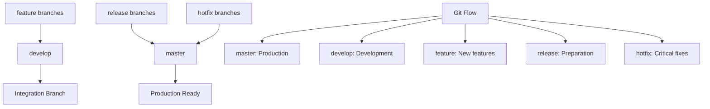

**Git Flow Branches**:
- **master**: Production-ready code
- **develop**: Integration branch for features
- **feature**: New feature development
- **release**: Prepare for release
- **hotfix**: Critical production fixes

### GitHub Flow
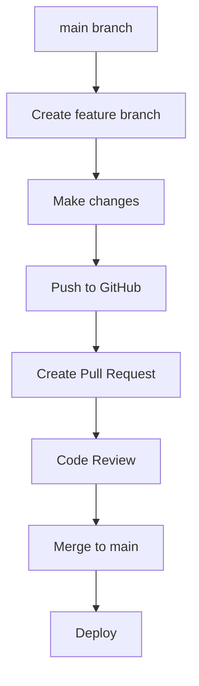

**GitHub Flow Steps**:
1. Create branch from main
2. Make changes and commit
3. Push to GitHub
4. Create pull request
5. Code review and discussion
6. Merge to main branch
7. Deploy immediately

### Trunk-Based Development
- **Main branch**: Always deployable
- **Short-lived branches**: Features merged quickly
- **Continuous integration**: Automated testing
- **Frequent merges**: Reduce integration issues

## GitHub Features

### Pull Requests
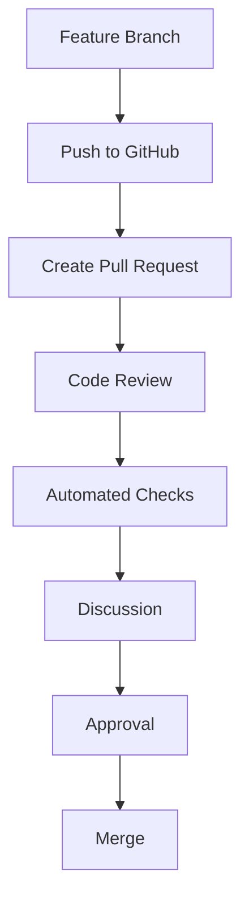

**Pull Request Process**:
1. **Create PR**: Propose changes to main branch
2. **Code Review**: Team reviews changes
3. **Automated Checks**: CI/CD pipeline tests
4. **Discussion**: Comments and suggestions
5. **Approval**: Required approvals obtained
6. **Merge**: Changes integrated into main branch

### Issues and Project Management
- **Issues**: Track bugs, features, tasks
- **Labels**: Categorize issues (bug, enhancement, help wanted)
- **Milestones**: Group issues for releases
- **Projects**: Kanban boards for task management

### GitHub Actions
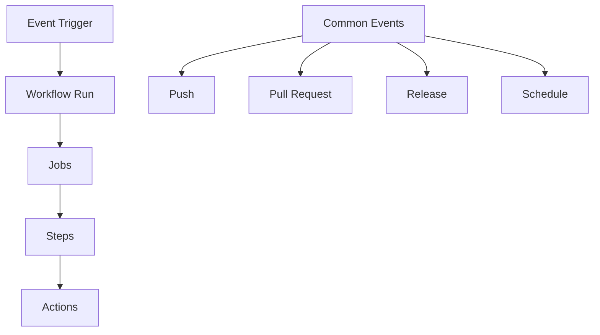

**Workflow Example**:
```yaml
name: CI/CD Pipeline

on: [push, pull_request]

jobs:
  test:
    runs-on: ubuntu-latest
    steps:
      - uses: actions/checkout@v2
      - name: Setup Python
        uses: actions/setup-python@v2
        with:
          python-version: '3.8'
      - name: Install dependencies
        run: pip install -r requirements.txt
      - name: Run tests
        run: pytest
```

## Advanced Git Concepts

### Git Internals
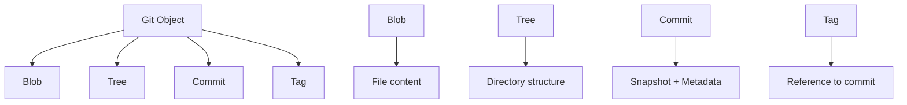

**Git Objects**:
- **Blob**: File content (no filename)
- **Tree**: Directory structure and file references
- **Commit**: Snapshot with metadata, parent commits
- **Tag**: Reference to specific commit

### Git Configuration
```bash
# User configuration
git config --global user.name "Your Name"
git config --global user.email "your.email@example.com"

# Editor configuration
git config --global core.editor "vim"

# Merge tool configuration
git config --global merge.tool "vimdiff"

# Alias configuration
git config --global alias.st "status"
git config --global alias.co "checkout"
git config --global alias.br "branch"
git config --global alias.ci "commit"
```

### .gitignore
```gitignore
# Compiled binaries
*.exe
*.o
*.out

# IDE files
.vscode/
.idea/
*.swp
*.swo

# Dependencies
node_modules/
__pycache__/

# Logs
*.log

# Environment files
.env
.env.local
```

## Collaboration Workflows

### Fork and Pull Workflow
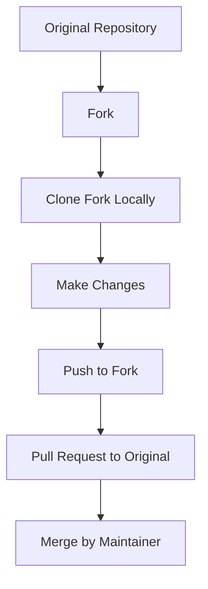

**Steps**:
1. **Fork**: Create personal copy of repository
2. **Clone**: Download fork to local machine
3. **Branch**: Create feature branch
4. **Commit**: Make changes and commit
5. **Push**: Push changes to fork
6. **Pull Request**: Propose changes to original repository

### Maintainer Workflow
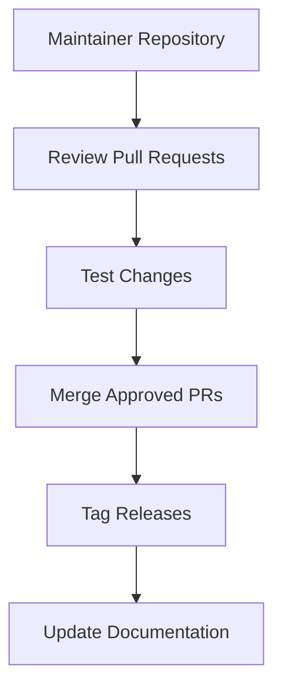

## Common Interview Questions

### Basic Questions

**Q1: What is the difference between Git and GitHub?**
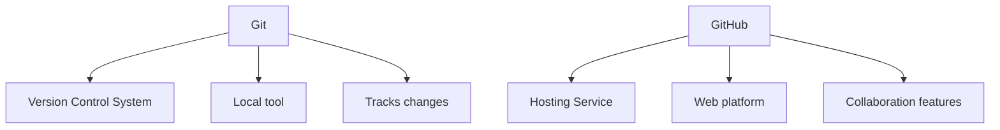

**Q2: Explain the Git workflow with commands**
1. **Working Directory**: Make changes to files
2. **git add**: Stage changes for commit
3. **git commit**: Save staged changes to repository
4. **git push**: Send commits to remote repository

**Q3: What is the difference between `git merge` and `git rebase`**
| Feature | git merge | git rebase |
|---------|-----------|------------|
| **History** | Creates merge commit | Linear history |
| **Conflicts** | One-time resolution | May need multiple resolutions |
| **Safety** | Preserves original history | Rewrites history |
| **Use Case** | Maintaining feature branches | Keeping clean history |

### Intermediate Questions

**Q4: What is the difference between `git pull` and `git fetch`?**
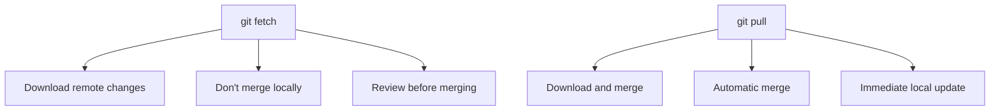

**Q5: How do you resolve merge conflicts?**
1. **Identify conflicts**: Git marks conflicted files
2. **Edit files**: Remove conflict markers and resolve
3. **Stage resolved files**: `git add <resolved-files>`
4. **Complete merge**: `git commit` with merge message

### Advanced Questions

**Q6: What is the difference between `git reset` and `git revert`?**
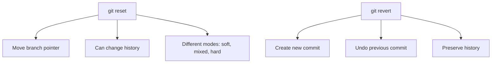

**Q7: Explain Git branching strategies**
- **Git Flow**: Structured workflow with multiple branch types
- **GitHub Flow**: Simpler workflow with feature branches
- **Trunk-Based**: Continuous integration with short-lived branches

## Best Practices

### Commit Best Practices
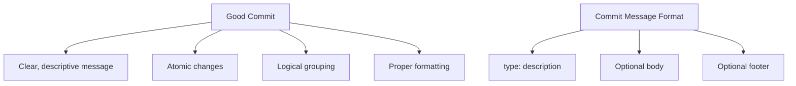

**Commit Message Format**:
```
type(scope): description

Detailed explanation of changes.

Closes #123
```

**Types**: feat, fix, docs, style, refactor, test, chore

### Branch Best Practices
- **Descriptive names**: feature/user-authentication, bugfix/login-error
- **Short-lived**: Merge frequently to avoid conflicts
- **One purpose**: Each branch for single feature/fix
- **Clean history**: Regular rebase with main branch

### Collaboration Best Practices
- **Pull frequently**: Stay updated with main branch
- **Review thoroughly**: Ensure code quality
- **Test before push**: Verify changes work correctly
- **Communicate**: Discuss major changes with team

## Quick Reference

### Essential Git Commands
| Operation | Command | Description |
|-----------|---------|-------------|
| **Initialize** | `git init` | Create new repository |
| **Clone** | `git clone <url>` | Copy remote repository |
| **Status** | `git status` | Show working directory status |
| **Add** | `git add <file>` | Stage changes |
| **Commit** | `git commit -m "msg"` | Save staged changes |
| **Push** | `git push` | Send to remote |
| **Pull** | `git pull` | Fetch and merge |
| **Branch** | `git branch <name>` | Create branch |
| **Checkout** | `git checkout <branch>` | Switch branch |
| **Merge** | `git merge <branch>` | Merge branches |
| **Log** | `git log` | Show commit history |

### Common Git Workflows
| Workflow | Description | Best For |
|----------|-------------|----------|
| **Git Flow** | Structured with multiple branches | Large teams, scheduled releases |
| **GitHub Flow** | Simple with feature branches | Small teams, continuous deployment |
| **Trunk-Based** | Direct commits to main | Very frequent deployments |

### GitHub Features Summary
| Feature | Purpose | Use Case |
|---------|---------|---------|
| **Pull Requests** | Code review and discussion | Quality control |
| **Issues** | Track bugs and features | Project management |
| **Actions** | CI/CD automation | Testing and deployment |
| **Projects** | Kanban boards | Task tracking |

### Interview Preparation Tips

1. **Practice basic commands** regularly
2. **Understand branching strategies**
3. **Know Git internals** for advanced questions
4. **Practice resolving conflicts**
5. **Be familiar with GitHub features**

### Common Mistakes to Avoid

1. **Committing sensitive data** (passwords, keys)
2. **Poor commit messages** (non-descriptive)
3. **Not pulling before pushing** (conflicts)
4. **Force pushing** to shared branches
5. **Large binary files** in repository

---

**Important Note**: Git is essential for modern software development. Practice regularly, understand the concepts behind commands, and be comfortable with common workflows. GitHub skills are increasingly important for collaborative development.