# Chapter 10: Linux and Shell Scripting

## Linux Fundamentals

### What is Linux?
- **Linux**: Open-source Unix-like operating system kernel
- **Distribution (Distro)**: Linux kernel + software packages
- **Importance**: Most servers, cloud infrastructure, development environments

### Popular Linux Distributions
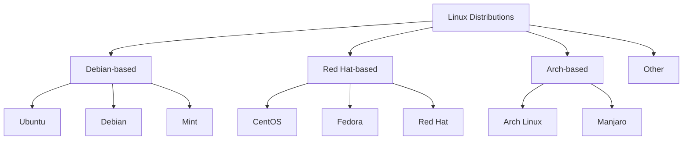

### Linux File System Hierarchy
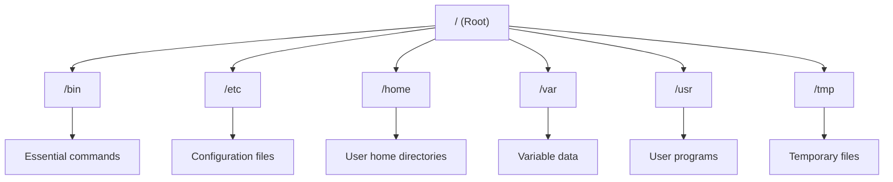

**Key Directories**:
- **/bin**: Essential user commands
- **/etc**: System configuration files
- **/home**: User personal directories
- **/var**: Variable data (logs, databases)
- **/usr**: User programs and libraries
- **/tmp**: Temporary files
- **/dev**: Device files
- **/proc**: Process information

## Basic Linux Commands

### File and Directory Operations
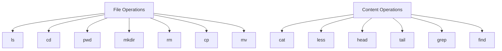

#### Essential Commands
```bash
# Directory navigation
pwd                    # Print working directory
ls                     # List directory contents
ls -la                 # List all files with details
cd /path/to/directory  # Change directory
cd ..                  # Go to parent directory
cd ~                   # Go to home directory

# File operations
touch filename.txt     # Create empty file
mkdir directory_name   # Create directory
rm filename            # Remove file
rm -r directory        # Remove directory recursively
cp source dest         # Copy file/directory
mv old_name new_name   # Move/rename file/directory

# Viewing files
cat filename           # Display file content
less filename          # View file with pagination
head -10 filename      # Show first 10 lines
tail -10 filename      # Show last 10 lines
tail -f filename       # Follow file growth

# Finding files and content
find /path -name "*.txt"     # Find files by name
grep "pattern" filename      # Search for pattern in file
grep -r "pattern" /path      # Recursive search
```

### File Permissions
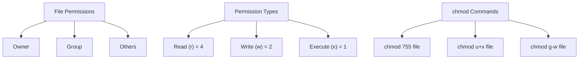

#### Permission Examples
```bash
# View permissions
ls -l filename

# Symbolic permissions
chmod u+x filename      # Add execute for owner
chmod g-w filename      # Remove write from group
chmod o=r filename      # Set read-only for others

# Numeric permissions
chmod 755 filename      # rwxr-xr-x (owner: all, group/others: read+execute)
chmod 644 filename      # rw-r--r-- (owner: read+write, others: read)

# Change ownership
sudo chown user:group filename
```

### Process Management
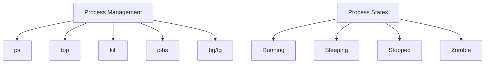

#### Process Commands
```bash
# View processes
ps aux                 # Show all processes
ps -ef                 # Show all processes in different format
top                    # Interactive process viewer
htop                   # Enhanced process viewer

# Process control
kill PID               # Terminate process
kill -9 PID            # Force kill process
killall process_name   # Kill all processes by name

# Background processes
command &              # Run command in background
jobs                   # List background jobs
bg %1                  # Resume job 1 in background
fg %1                  # Bring job 1 to foreground
Ctrl+Z                 # Suspend current process
```

## Shell Scripting Basics

### What is Shell Script?
- **Shell**: Command-line interpreter (bash, zsh, fish)
- **Shell Script**: Text file with shell commands
- **Purpose**: Automate repetitive tasks, system administration

### Creating and Running Shell Scripts
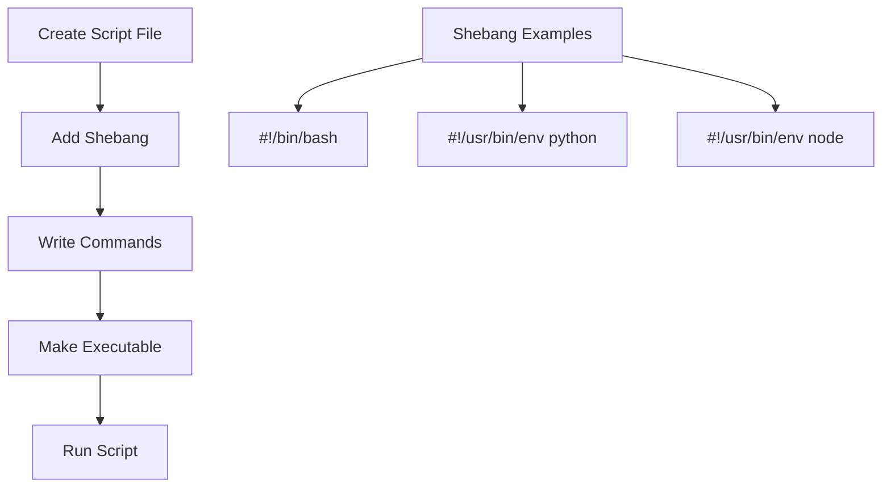

#### First Shell Script
```bash
#!/bin/bash

# This is a comment
echo "Hello, World!"

# Variables
NAME="John"
AGE=25
echo "My name is $NAME and I am $AGE years old"

# Command substitution
CURRENT_DATE=$(date)
echo "Today is: $CURRENT_DATE"

# User input
read -p "Enter your name: " USER_NAME
echo "Hello, $USER_NAME!"

# Basic arithmetic
NUM1=10
NUM2=5
SUM=$((NUM1 + NUM2))
echo "Sum: $SUM"
```

#### Making Script Executable
```bash
# Create script
nano myscript.sh

# Make executable
chmod +x myscript.sh

# Run script
./myscript.sh

# Or run with bash
bash myscript.sh
```

## Shell Scripting Concepts

### Variables and Data Types
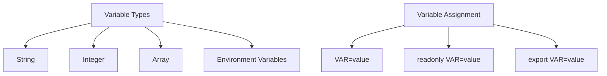

#### Variable Examples
```bash
#!/bin/bash

# String variables
NAME="Alice"
GREETING="Hello, $NAME!"

# Integer operations
NUM1=10
NUM2=20
SUM=$((NUM1 + NUM2))
PRODUCT=$((NUM1 * NUM2))

# Arrays
FRUITS=("apple" "banana" "orange")
echo "First fruit: ${FRUITS[0]}"
echo "All fruits: ${FRUITS[@]}"
echo "Number of fruits: ${#FRUITS[@]}"

# Environment variables
echo "Home directory: $HOME"
echo "Current user: $USER"
echo "Shell: $SHELL"

# Command substitution
CURRENT_DIR=$(pwd)
FILES_COUNT=$(ls | wc -l)
echo "Current directory: $CURRENT_DIR"
echo "Files count: $FILES_COUNT"

# Reading variables
read -p "Enter your age: " AGE
echo "You will be $((AGE + 1) next year"
```

### Conditional Statements
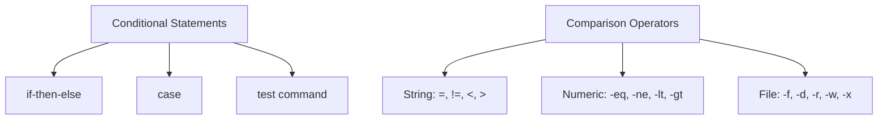

#### Conditional Examples
```bash
#!/bin/bash

# if-then-else
AGE=18
if [ $AGE -ge 18 ]; then
    echo "You are eligible to vote"
else
    echo "You are not eligible to vote"
fi

# String comparison
NAME="Alice"
if [ "$NAME" = "Alice" ]; then
    echo "Hello, Alice!"
elif [ "$NAME" = "Bob" ]; then
    echo "Hello, Bob!"
else
    echo "Hello, stranger!"
fi

# File operations
FILENAME="test.txt"
if [ -f "$FILENAME" ]; then
    echo "File exists"
    if [ -r "$FILENAME" ]; then
        echo "File is readable"
    fi
else
    echo "File does not exist"
fi

# case statement
read -p "Enter a color (red/green/blue): " COLOR
case $COLOR in
    red)
        echo "You chose red"
        ;;
    green)
        echo "You chose green"
        ;;
    blue)
        echo "You chose blue"
        ;;
    *)
        echo "Unknown color"
        ;;
esac
```

### Loops
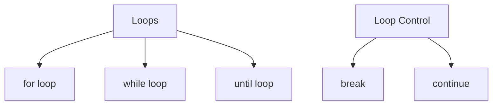

#### Loop Examples
```bash
#!/bin/bash

# for loop with range
echo "Counting 1 to 5:"
for i in {1..5}; do
    echo "Number: $i"
done

# for loop with array
FRUITS=("apple" "banana" "orange")
echo "Fruits list:"
for fruit in "${FRUITS[@]}"; do
    echo "Fruit: $fruit"
done

# for loop with file glob
echo "Text files in current directory:"
for file in *.txt; do
    echo "File: $file"
done

# while loop
COUNTER=1
echo "While loop counting:"
while [ $COUNTER -le 5 ]; do
    echo "Count: $COUNTER"
    COUNTER=$((COUNTER + 1))
done

# until loop
COUNTER=1
echo "Until loop counting:"
until [ $COUNTER -gt 5 ]; do
    echo "Count: $COUNTER"
    COUNTER=$((COUNTER + 1))
done

# loop with break and continue
echo "Loop with control:"
for i in {1..10}; do
    if [ $i -eq 5 ]; then
        continue  # Skip 5
    fi
    if [ $i -eq 8 ]; then
        break     # Exit at 8
    fi
    echo "Number: $i"
done
```

### Functions
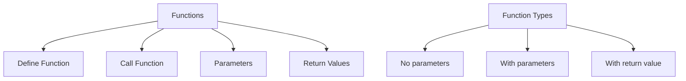

#### Function Examples
```bash
#!/bin/bash

# Simple function
greet() {
    echo "Hello, World!"
}

# Function with parameters
greet_person() {
    echo "Hello, $1! You are $2 years old."
}

# Function with return value
add_numbers() {
    local result=$((1 + 2))
    echo $result
}

# Function that returns success/failure
check_file() {
    if [ -f "$1" ]; then
        return 0  # Success
    else
        return 1  # Failure
    fi
}

# Calling functions
greet

greet_person "Alice" 25

SUM_RESULT=$(add_numbers)
echo "Sum: $SUM_RESULT"

if check_file "test.txt"; then
    echo "File exists"
else
    echo "File does not exist"
fi

# Function with local variables
calculate_area() {
    local width=$1
    local height=$2
    local area=$((width * height))
    echo "Area: $area"
}

calculate_area 5 10
```

## System Administration

### User and Group Management
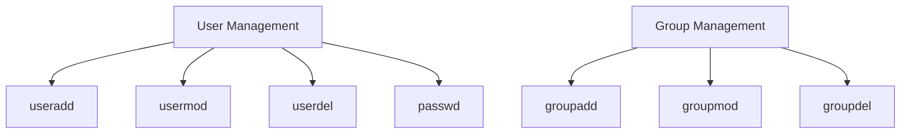

#### User Management Commands
```bash
# Create user
sudo useradd -m username          # Create user with home directory
sudo useradd -m -s /bin/bash username  # Create with specific shell

# Set password
sudo passwd username

# Modify user
sudo usermod -aG sudo username   # Add user to sudo group
sudo usermod -l newname username  # Change username

# Delete user
sudo userdel -r username          # Delete user and home directory

# Group operations
sudo groupadd developers
sudo usermod -aG developers username

# View user information
id username
groups username
```

### Service Management
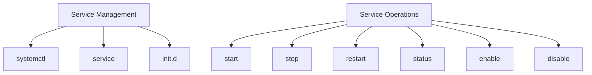

#### Service Commands
```bash
# systemctl commands (modern systems)
sudo systemctl start nginx        # Start service
sudo systemctl stop nginx         # Stop service
sudo systemctl restart nginx      # Restart service
sudo systemctl status nginx       # Check status
sudo systemctl enable nginx       # Enable at boot
sudo systemctl disable nginx      # Disable at boot

# service commands (older systems)
sudo service nginx start
sudo service nginx stop
sudo service nginx restart
sudo service nginx status

# View all services
systemctl list-units --type=service
service --status-all
```

### Log Management
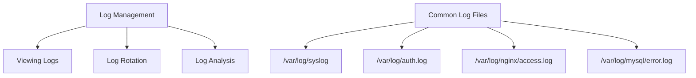

#### Log Commands
```bash
# View system logs
tail -f /var/log/syslog           # Follow log file
tail -100 /var/log/auth.log       # Last 100 lines

# Search logs
grep "error" /var/log/syslog
grep "failed" /var/log/auth.log

# View compressed logs
zcat /var/log/syslog.1.gz
zgrep "error" /var/log/syslog.1.gz

# Log rotation
sudo logrotate /etc/logrotate.conf   # Force log rotation
```

## Networking Commands

### Network Configuration and Troubleshooting
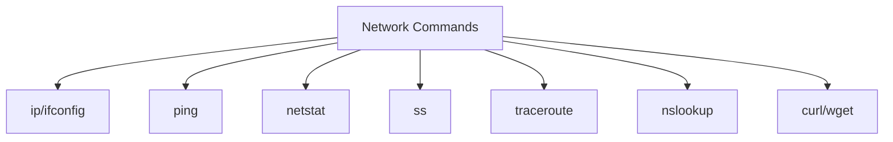

#### Network Commands
```bash
# IP configuration
ip addr show                       # Show IP addresses
ifconfig                           # Show network interfaces (legacy)
ip route show                      # Show routing table

# Network connectivity
ping google.com                    # Test connectivity
ping -c 4 google.com              # Send 4 packets
traceroute google.com             # Trace route to host

# Network statistics
netstat -tuln                     # Show listening ports
ss -tuln                          # Modern netstat alternative
netstat -i                        # Show network interfaces

# DNS resolution
nslookup google.com               # DNS lookup
dig google.com                    # Detailed DNS information

# Download/upload
curl http://example.com          # Download web content
wget http://example.com/file.txt  # Download file

# Port scanning
nmap -sS target_ip                # Port scan (requires nmap)
```

## Text Processing

### Text Manipulation Commands
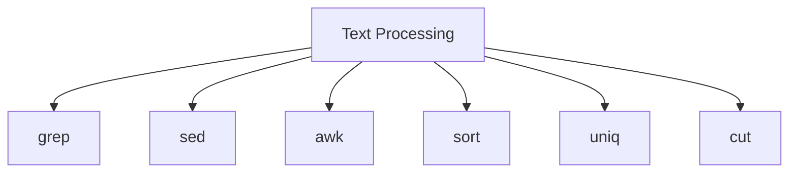

#### Text Processing Examples
```bash
# grep - search patterns
grep "error" logfile.txt          # Find lines with "error"
grep -i "error" logfile.txt       # Case insensitive
grep -r "pattern" /path/          # Recursive search
grep -n "pattern" file            # Show line numbers
grep -v "pattern" file            # Invert match

# sed - stream editor
sed 's/old/new/g' file.txt       # Replace all occurrences
sed 's/old/new/' file.txt        # Replace first occurrence
sed -i 's/old/new/g' file.txt    # Replace in place
sed '3d' file.txt                 # Delete 3rd line
sed '/pattern/d' file.txt         # Delete lines matching pattern

# awk - pattern processing
awk '{print $1}' file.txt         # Print first column
awk -F: '{print $1}' file.txt     # Use colon as delimiter
awk '{sum+=$3} END {print sum}' file.txt  # Sum third column
awk '/pattern/ {print $0}' file.txt  # Print lines matching pattern

# sort - sort lines
sort file.txt                     # Sort alphabetically
sort -n file.txt                  # Sort numerically
sort -r file.txt                  # Sort in reverse
sort -u file.txt                  # Remove duplicates

# uniq - unique lines
sort file.txt | uniq              # Remove duplicate lines
sort file.txt | uniq -c            # Count occurrences
sort file.txt | uniq -d            # Show only duplicates

# cut - extract columns
cut -d: -f1 /etc/passwd          # Extract first field (colon delimited)
cut -c1-5 file.txt               # Extract characters 1-5
```

## Automation and Scripting Examples

### Backup Script
```bash
#!/bin/bash

# Backup Script
SOURCE_DIR="/home/user/documents"
BACKUP_DIR="/backup"
DATE=$(date +%Y%m%d_%H%M%S)
BACKUP_NAME="backup_$DATE.tar.gz"

# Create backup directory if it doesn't exist
mkdir -p "$BACKUP_DIR"

# Create backup
echo "Creating backup of $SOURCE_DIR..."
tar -czf "$BACKUP_DIR/$BACKUP_NAME" "$SOURCE_DIR"

# Check if backup was successful
if [ $? -eq 0 ]; then
    echo "Backup created successfully: $BACKUP_NAME"

    # Remove backups older than 7 days
    find "$BACKUP_DIR" -name "backup_*.tar.gz" -mtime +7 -delete
    echo "Old backups removed."
else
    echo "Backup failed!"
    exit 1
fi
```

### System Monitoring Script
```bash
#!/bin/bash

# System Monitoring Script

echo "=== System Status Report ==="
echo "Date: $(date)"
echo ""

# CPU usage
echo "CPU Usage:"
top -bn1 | grep "Cpu(s)" | awk '{print $2}' | awk -F'%' '{print $1}'
echo ""

# Memory usage
echo "Memory Usage:"
free -h | grep "Mem:" | awk '{print "Used: " $3 "/" $2 " (" $3/$2*100 "%)"}'
echo ""

# Disk usage
echo "Disk Usage:"
df -h | grep -vE '^Filesystem|tmpfs|cdrom' | awk '{print $5 " " $1 " " $6}'
echo ""

# System uptime
echo "System Uptime:"
uptime
echo ""

# Running processes
echo "Top 5 Processes by CPU:"
ps aux --sort=-%cpu | head -6
echo ""

echo "Top 5 Processes by Memory:"
ps aux --sort=-%mem | head -6
```

### Log Analysis Script
```bash
#!/bin/bash

# Log Analysis Script

LOG_FILE="/var/log/nginx/access.log"
TEMP_FILE="/tmp/temp_log.txt"

# Check if log file exists
if [ ! -f "$LOG_FILE" ]; then
    echo "Log file $LOG_FILE does not exist!"
    exit 1
fi

echo "=== Log Analysis Report ==="
echo "Analyzing: $LOG_FILE"
echo "Date: $(date)"
echo ""

# Total requests
TOTAL_REQUESTS=$(wc -l < "$LOG_FILE")
echo "Total requests: $TOTAL_REQUESTS"

# Top 10 IP addresses
echo ""
echo "Top 10 IP addresses:"
awk '{print $1}' "$LOG_FILE" | sort | uniq -c | sort -nr | head -10

# Top 10 requested pages
echo ""
echo "Top 10 requested pages:"
awk '{print $7}' "$LOG_FILE" | sort | uniq -c | sort -nr | head -10

# HTTP status codes
echo ""
echo "HTTP Status Codes:"
awk '{print $9}' "$LOG_FILE" | sort | uniq -c | sort -nr

# Error requests (4xx, 5xx)
echo ""
echo "Error requests (4xx, 5xx):"
awk '$9 >= 400 {print $9 " " $7}' "$LOG_FILE" | sort | uniq -c | sort -nr
```

## Common Interview Questions

### Basic Questions

**Q1: What is the difference between `>` and `>>` in shell?**
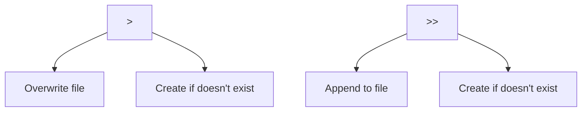

**Q2: Explain Linux file permissions**
- **Read (r = 4)**: View file contents
- **Write (w = 2)**: Modify file contents
- **Execute (x = 1)**: Execute file/enter directory
- **Numeric**: 755 = rwxr-xr-x

**Q3: What is the difference between process and thread?**
- **Process**: Independent execution unit with own memory
- **Thread**: Lightweight process sharing memory with parent

### Intermediate Questions

**Q4: How would you find all files containing "error" in /var/log?**
```bash
grep -r "error" /var/log/
# or
find /var/log -type f -exec grep -l "error" {} \;
```

**Q5: Write a shell script to monitor disk space**
```bash
#!/bin/bash
DISK_USAGE=$(df / | tail -1 | awk '{print $5}' | sed 's/%//')
if [ $DISK_USAGE -gt 80 ]; then
    echo "Warning: Disk usage is ${DISK_USAGE}%"
fi
```

### Advanced Questions

**Q6: Explain the shebang line and its importance**
- **Shebang**: `#!/bin/bash` at beginning of script
- **Purpose**: Tells system which interpreter to use
- **Importance**: Ensures script runs with correct shell

**Q7: How would you debug a shell script?**
- **bash -x script.sh**: Execute with debugging
- **set -x**: Enable debugging within script
- **echo statements**: Print variable values
- **shellcheck**: Static analysis tool

## Quick Reference

### Essential Commands
| Category | Commands | Description |
|----------|----------|-------------|
| **Navigation** | `ls`, `cd`, `pwd` | File system navigation |
| **File Ops** | `cp`, `mv`, `rm`, `mkdir` | File/directory operations |
| **Text View** | `cat`, `less`, `head`, `tail` | View file contents |
| **Search** | `grep`, `find`, `locate` | Find files and content |
| **Process** | `ps`, `top`, `kill` | Process management |
| **Network** | `ping`, `netstat`, `curl` | Network tools |
| **Permissions** | `chmod`, `chown` | File permissions |

### Shell Scripting Elements
| Element | Syntax | Example |
|---------|--------|---------|
| **Variables** | `VAR=value` | `NAME="John"` |
| **Condition** | `if [ condition ]` | `if [ $AGE -gt 18 ]` |
| **Loops** | `for var in list` | `for i in {1..5}` |
| **Functions** | `func_name() {}` | `greet() { echo "Hi"; }` |
| **Input** | `read var` | `read -p "Name: " NAME` |

### System Administration
| Task | Command | Description |
|------|---------|-------------|
| **User Management** | `useradd`, `usermod` | Create/modify users |
| **Service Management** | `systemctl` | Control services |
| **Log Viewing** | `tail -f`, `journalctl` | View logs |
| **Process Control** | `kill`, `killall` | Terminate processes |

### Interview Preparation Tips

1. **Practice basic commands** regularly
2. **Write shell scripts** for common tasks
3. **Understand file permissions** and ownership
4. **Know process management** concepts
5. **Practice text processing** with grep, sed, awk

### Common Mistakes to Avoid

1. **Not quoting variables** in shell scripts
2. **Using `rm -rf`** carelessly
3. **Forgetting file permissions** when executing scripts
4. **Not checking command exit codes**
5. **Using `sudo`** without understanding implications

---

**Important Note**: Linux and shell scripting are fundamental skills for software development and system administration. Practice regularly with real-world scenarios and understand the concepts behind the commands rather than just memorizing syntax.