# Chapter 12: DevOps Fundamentals

## DevOps Overview

### What is DevOps?
- **DevOps**: Combination of Development (Dev) and Operations (Ops)
- **Purpose**: Bridge gap between development and IT operations
- **Goal**: Faster, more reliable software delivery and deployment

### DevOps Culture and Principles
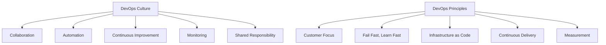

### DevOps vs Traditional Approaches
| Aspect | Traditional | DevOps |
|--------|-------------|--------|
| **Deployment** | Infrequent, risky | Frequent, automated |
| **Testing** | Late in cycle | Continuous testing |
| **Communication** | Siloed teams | Collaborative teams |
| **Responsibility** | Separate teams | Shared ownership |
| **Feedback** | Slow feedback loops | Fast feedback loops |

## CI/CD Pipeline

### Continuous Integration (CI)
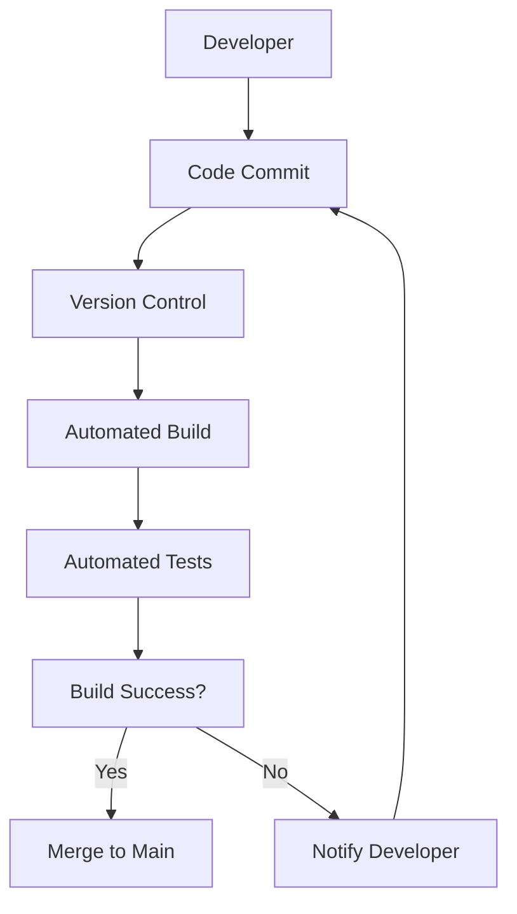

**CI Components**:
- **Version Control**: Git-based workflow
- **Automated Build**: Compile and package code
- **Automated Testing**: Unit, integration, acceptance tests
- **Quality Gates**: Code coverage, security scans

### Continuous Delivery/Deployment (CD)
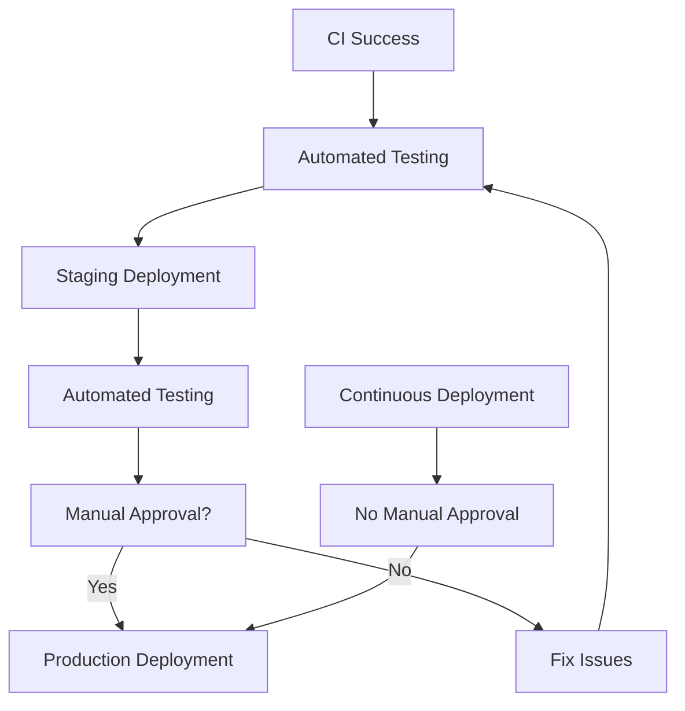

### CI/CD Pipeline Stages
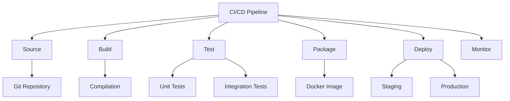

## Infrastructure as Code (IaC)

### What is Infrastructure as Code?
- **Definition**: Managing infrastructure through code and automation
- **Benefits**: Consistency, repeatability, version control, documentation
- **Purpose**: Treat infrastructure like software

### IaC Tools Comparison
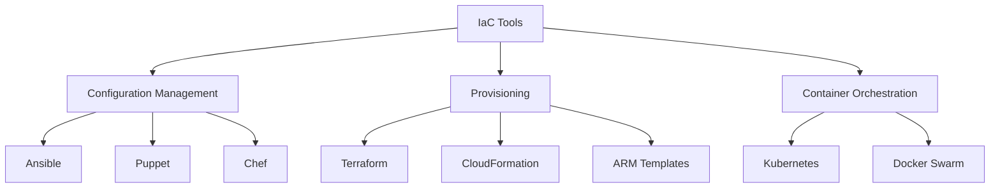

### Terraform Example
```hcl
# terraform example
provider "aws" {
    region = "us-west-2"
}

resource "aws_instance" "web_server" {
    ami           = "ami-12345678"
    instance_type = "t2.micro"

    tags = {
        Name        = "WebServer"
        Environment = "Production"
    }
}

resource "aws_security_group" "web_sg" {
    name        = "web_security_group"
    description = "Allow web traffic"

    ingress {
        from_port   = 80
        to_port     = 80
        protocol    = "tcp"
        cidr_blocks = ["0.0.0.0/0"]
    }

    egress {
        from_port   = 0
        to_port     = 0
        protocol    = "-1"
        cidr_blocks = ["0.0.0.0/0"]
    }
}
```

### Ansible Example
```yaml
# ansible playbook example
---
- hosts: webservers
    become: yes
    tasks:
        - name: Install Apache
            apt:
                name: apache2
                state: present
                update_cache: yes

        - name: Start Apache service
            service:
                name: apache2
                state: started
                enabled: yes

        - name: Copy website files
            copy:
                src: /var/www/html/
                dest: /var/www/html/
                mode: '0644'

        - name: Configure Apache virtual host
            template:
                src: templates/vhost.conf.j2
                dest: /etc/apache2/sites-available/000-default.conf
            notify: Restart Apache

    handlers:
        - name: Restart Apache
            service:
                name: apache2
                state: restarted
```

## Containerization

### Docker Fundamentals
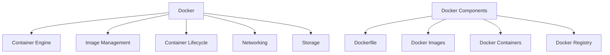

### Dockerfile Example
```dockerfile
# Dockerfile for Node.js application
FROM node:16-alpine

# Set working directory
WORKDIR /app

# Copy package files
COPY package*.json ./

# Install dependencies
RUN npm ci --only=production

# Copy application code
COPY . .

# Create non-root user
RUN addgroup -g 1001 -S nodejs
RUN adduser -S nodejs -u 1001

# Change ownership
USER nodejs

# Expose port
EXPOSE 3000

# Health check
HEALTHCHECK --interval=30s --timeout=3s --start-period=5s --retries=3 \
    CMD curl -f http://localhost:3000/ || exit 1

# Start application
CMD ["npm", "start"]
```

### Docker Compose Example
```yaml
# docker-compose.yml
version: '3.8'

services:
    web:
        build: .
        ports:
            - "3000:3000"
        environment:
            - NODE_ENV=production
            - DATABASE_URL=postgresql://user:password@db:5432/myapp
        depends_on:
            - db
        networks:
            - app-network
        restart: unless-stopped

    db:
        image: postgres:13
        environment:
            - POSTGRES_DB=myapp
            - POSTGRES_USER=user
            - POSTGRES_PASSWORD=password
        volumes:
            - postgres_data:/var/lib/postgresql/data
        networks:
            - app-network
        restart: unless-stopped

    nginx:
        image: nginx:alpine
        ports:
            - "80:80"
        volumes:
            - ./nginx.conf:/etc/nginx/nginx.conf
        depends_on:
            - web
        networks:
            - app-network
        restart: unless-stopped

volumes:
    postgres_data:

networks:
    app-network:
        driver: bridge
```

## Monitoring and Logging

### Monitoring Strategy
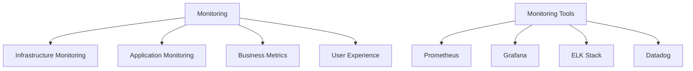

### Monitoring Stack Example
```yaml
# docker-compose.monitoring.yml
version: '3.8'

services:
    prometheus:
        image: prom/prometheus
        ports:
            - "9090:9090"
        volumes:
            - ./prometheus.yml:/etc/prometheus/prometheus.yml
            - prometheus_data:/prometheus
        command:
            - '--config.file=/etc/prometheus/prometheus.yml'
            - '--storage.tsdb.path=/prometheus'
            - '--web.console.libraries=/etc/prometheus/console_libraries'
            - '--web.console.templates=/etc/prometheus/consoles'
            - '--storage.tsdb.retention.time=200h'
            - '--web.enable-lifecycle'
        networks:
            - monitoring

    grafana:
        image: grafana/grafana
        ports:
            - "3001:3000"
        environment:
            - GF_SECURITY_ADMIN_PASSWORD=admin
        volumes:
            - grafana_data:/var/lib/grafana
            - ./grafana/provisioning:/etc/grafana/provisioning
        networks:
            - monitoring

    node-exporter:
        image: prom/node-exporter
        ports:
            - "9100:9100"
        networks:
            - monitoring

volumes:
    prometheus_data:
    grafana_data:

networks:
    monitoring:
        driver: bridge
```

### Log Management
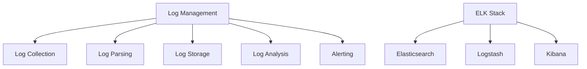

## Configuration Management

### Environment Configuration
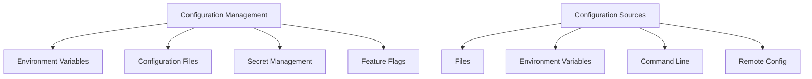

### 12-Factor App Configuration
```yaml
# config/settings.yaml
app:
  name: "MyApplication"
  version: "1.0.0"
  environment: "${APP_ENV:development}"

database:
  host: "${DB_HOST:localhost}"
  port: "${DB_PORT:5432}"
  name: "${DB_NAME:myapp}"
  user: "${DB_USER:admin}"
  password: "${DB_PASSWORD}"
  ssl_mode: "${DB_SSL:disable}"

redis:
  host: "${REDIS_HOST:localhost}"
  port: "${REDIS_PORT:6379}"
  password: "${REDIS_PASSWORD}"
  db: "${REDIS_DB:0}"

logging:
  level: "${LOG_LEVEL:info}"
  format: "${LOG_FORMAT:json}"
  file: "${LOG_FILE:/var/log/app.log}"

security:
  jwt_secret: "${JWT_SECRET}"
  jwt_expiration: "${JWT_EXPIRATION:24h}"
  bcrypt_rounds: "${BCRYPT_ROUNDS:12}"

features:
  enable_registration: "${ENABLE_REGISTRATION:true}"
  enable_social_login: "${ENABLE_SOCIAL_LOGIN:false}"
  maintenance_mode: "${MAINTENANCE_MODE:false}"
```

## Security in DevOps

### DevOps Security Practices
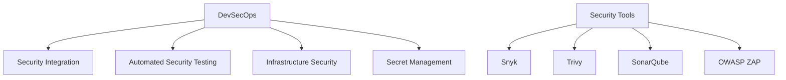

### Security Scanning in CI/CD
```yaml
# security scanning pipeline
stages:
    - security-scan
    - build
    - test
    - deploy

security-scan:
    stage: security-scan
    image: owasp/zap2docker-stable
    script:
        - mkdir -p /zap/wrk/
        - /zap/zap-baseline.py -t http://target-app
    artifacts:
        reports:
            junit: zap-report.xml
    allow_failure: false

dependency-scan:
    stage: security-scan
    image: node:16
    script:
        - npm install
        - npm audit --audit-level high
    allow_failure: false

container-scan:
    stage: security-scan
    image: aquasec/trivy
    script:
        - trivy image --exit-code 0 --severity HIGH,CRITICAL myapp:latest
    allow_failure: false
```

### Secret Management
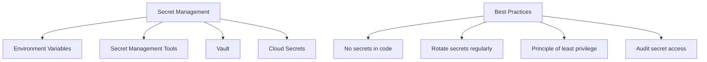

## DevOps Tools and Technologies

### Essential DevOps Tools
```mermaid
graph TD
    A["DevOps Tools"] --> B["Version Control"]
    A --> C["CI/CD"]
    A --> D["Containerization"]
    A --> E["Configuration Management"]
    A --> F["Monitoring"]
    A --> G["Cloud Platforms"]

    B --> H["Git"]
    B --> I["GitHub", "GitLab", "Bitbucket"]

    C --> J["Jenkins", "GitLab CI", "GitHub Actions"]

    D --> K["Docker", "Podman"]

    E --> L["Ansible", "Terraform", "Kubernetes"]

    F --> M["Prometheus", "Grafana", "ELK"]

    G --> N["AWS", "Azure", "GCP"]
```

### Tool Selection Matrix
| Category | Tools | Use Case |
|----------|-------|----------|
| **Version Control** | Git, GitHub, GitLab | Code management |
| **CI/CD** | Jenkins, GitHub Actions, GitLab CI | Build/deployment automation |
| **Containers** | Docker, Podman | Application packaging |
| **Orchestration** | Kubernetes, Docker Swarm | Container management |
| **IaC** | Terraform, Ansible, CloudFormation | Infrastructure management |
| **Monitoring** | Prometheus, Grafana, Datadog | Performance monitoring |
| **Logging** | ELK Stack, Splunk | Log management |
| **Security** | SonarQube, Snyk, Trivy | Security scanning |

## Common Interview Questions

### Basic Questions

**Q1: What is DevOps and why is it important?**
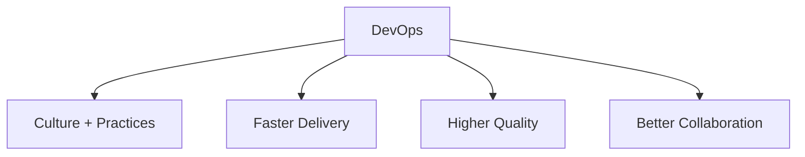

**Q2: Explain CI/CD pipeline**
- **CI**: Continuous Integration - automated testing and building
- **CD**: Continuous Delivery/Deployment - automated deployment
- **Benefits**: Faster feedback, reduced risks, automated releases

**Q3: What is Infrastructure as Code?**
- **Definition**: Managing infrastructure through code
- **Benefits**: Version control, repeatability, documentation
- **Tools**: Terraform, Ansible, CloudFormation

### Intermediate Questions

**Q4: Compare Docker and VMs**
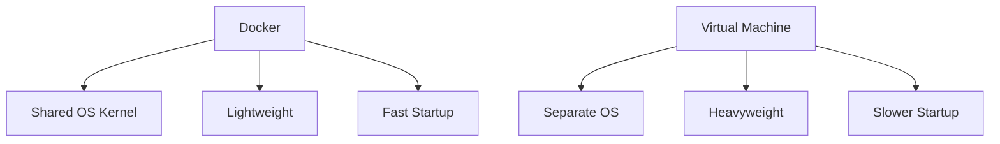

**Q5: How would you implement blue-green deployment?**
- **Blue**: Current production environment
- **Green**: New version deployed
- **Switch**: Traffic redirected to green
- **Rollback**: Easy rollback to blue if needed

### Advanced Questions

**Q6: Explain Kubernetes architecture**
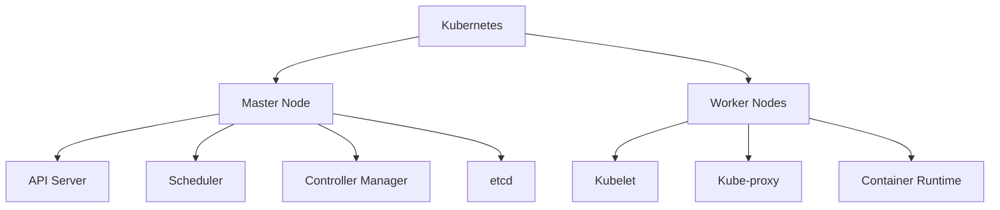

**Q7: How would you implement monitoring for a microservices application?**
- **Infrastructure monitoring**: CPU, memory, network
- **Application monitoring**: Performance metrics, error rates
- **Business metrics**: User engagement, conversion rates
- **Alerting**: Threshold-based notifications
- **Dashboard**: Real-time visualization

## Quick Reference

### DevOps Pipeline Stages
| Stage | Purpose | Tools |
|-------|---------|-------|
| **Source** | Code management | Git, GitHub |
| **Build** | Compile and package | Maven, npm, Docker |
| **Test** | Automated testing | JUnit, Selenium |
| **Package** | Create deployable artifact | Docker, npm pack |
| **Deploy** | Deploy to environments | Kubernetes, Ansible |
| **Monitor** | Observe performance | Prometheus, Grafana |

### Essential DevOps Commands
| Tool | Commands | Description |
|------|----------|-------------|
| **Docker** | `docker build`, `docker run` | Container management |
| **Kubernetes** | `kubectl apply`, `kubectl get` | Container orchestration |
| **Terraform** | `terraform plan`, `terraform apply` | IaC management |
| **Ansible** | `ansible-playbook` | Configuration management |
| **Git** | `git commit`, `git push` | Version control |

### CI/CD Best Practices
| Practice | Description | Implementation |
|----------|-------------|-------------|
| **Fast Feedback** | Quick build/test cycles | Parallel testing |
| **Quality Gates** | Prevent bad code | Automated checks |
| **Security Integration** | Security testing | SAST/DAST tools |
| **Monitoring** | Observe deployments | Metrics and logs |
| **Rollback Strategy** | Quick recovery | Blue-green deployment |

### Interview Preparation Tips

1. **Understand DevOps culture** and principles
2. **Practice with essential tools** (Docker, Kubernetes)
3. **Know CI/CD pipeline concepts** and implementation
4. **Understand monitoring** and logging practices
5. **Be familiar with cloud platforms** and services

### Common Mistakes to Avoid

1. **Treating DevOps as just tools** (it's a culture)
2. **Ignoring security** in the pipeline
3. **Not implementing proper monitoring**
4. **Overcomplicating solutions** unnecessarily
5. **Forgetting about documentation** and knowledge sharing

---

**Important Note**: DevOps is a cultural movement combined with practices and tools. Focus on understanding the principles behind DevOps, not just memorizing tool commands. The goal is to enable faster, more reliable software delivery through collaboration and automation.