# Chapter 13: AWS Cloud Computing

## Cloud Computing Fundamentals

### What is Cloud Computing?
- **Cloud Computing**: On-demand delivery of IT resources over the Internet
- **Benefits**: Pay-as-you-go, scalability, reliability, global reach
- **Providers**: AWS, Azure, Google Cloud, others

### Cloud Service Models
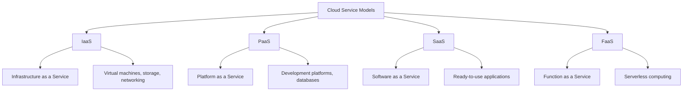

### Cloud Deployment Models
| Model | Description | Examples |
|-------|-------------|----------|
| **Public Cloud** | Owned by cloud provider | AWS S3, EC2 |
| **Private Cloud** | Single organization | On-premise AWS |
| **Hybrid Cloud** | Combination of public/private | AWS Outposts |
| **Multi-cloud** | Multiple cloud providers | AWS + Azure |

## AWS Global Infrastructure

### AWS Regions and Availability Zones
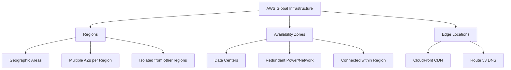

### AWS Regions
- **Definition**: Geographic areas where AWS has data centers
- **Examples**: us-east-1 (N. Virginia), eu-west-1 (Ireland), ap-south-1 (Mumbai)
- **Selection Criteria**: Latency, compliance, data residency

### Availability Zones (AZs)
- **Definition**: One or more data centers with redundant power, networking, cooling
- **Benefits**: High availability, fault tolerance
- **Usage**: Deploy applications across multiple AZs for reliability

## Core AWS Services

### Compute Services
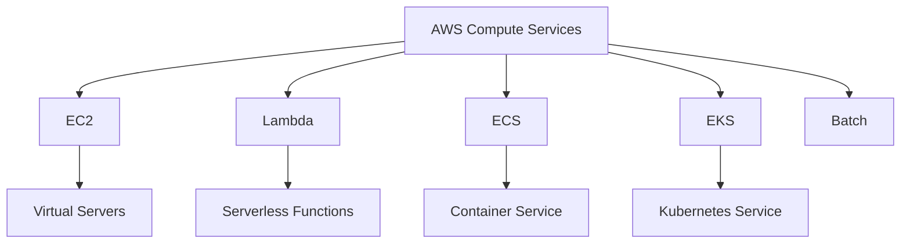

#### Amazon EC2 (Elastic Compute Cloud)
- **Purpose**: Scalable virtual servers in the cloud
- **Use Cases**: Web servers, application servers, development environments
- **Key Features**: Elastic IP, Security Groups, Auto Scaling

**EC2 Instance Types**:
| Type | Use Case | Examples |
|------|----------|----------|
| **General Purpose** | Balanced compute/memory | t3, m5 |
| **Compute Optimized** | High-performance computing | c5, c6g |
| **Memory Optimized** | Large in-memory databases | r5, x1 |
| **Storage Optimized** | High storage throughput | i3, d3 |
| **Accelerated Computing** | Machine learning, GPU | p3, g4 |

#### AWS Lambda
- **Purpose**: Serverless compute service
- **Use Cases**: Event-driven applications, data processing
- **Benefits**: No server management, pay per usage, automatic scaling

```python
# Lambda function example
import json

def lambda_handler(event, context):
    # Extract event data
    name = event.get('name', 'World')

    # Process data
    message = f"Hello, {name}!"

    # Return response
    return {
        'statusCode': 200,
        'body': json.dumps({
            'message': message
        })
    }
```

### Storage Services
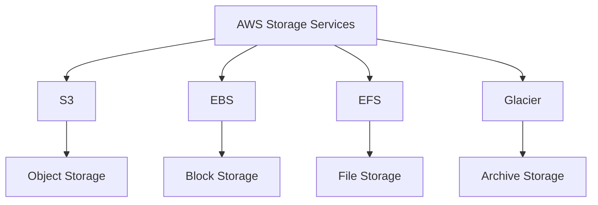

#### Amazon S3 (Simple Storage Service)
- **Purpose**: Object storage service
- **Use Cases**: Static website hosting, backup, big data analytics
- **Features**: Scalability, durability, security, performance

**S3 Storage Classes**:
| Class | Use Case | Durability | Availability |
|-------|----------|------------|-------------|
| **Standard** | Frequently accessed data | 99.999999999% | 99.99% |
| **Intelligent-Tiering** | Unknown access patterns | 99.999999999% | 99.99% |
| **Infrequent Access** | Long-lived, infrequently accessed | 99.999999999% | 99.9% |
| **Glacier** | Archive data | 99.999999999% | 99.99% |

#### Amazon EBS (Elastic Block Store)
- **Purpose**: Block-level storage volumes for EC2
- **Use Cases**: Database storage, boot volumes, applications
- **Features**: Snapshots, encryption, performance optimization

### Database Services
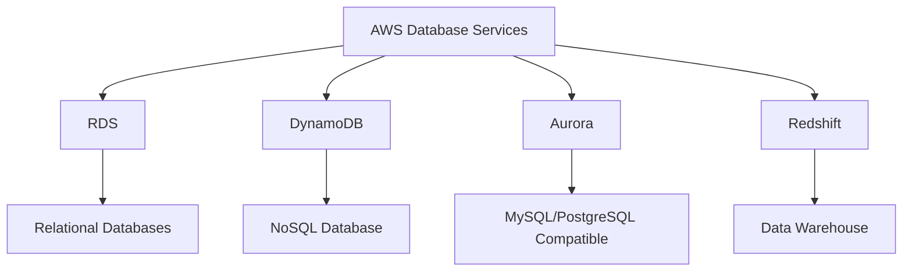

#### Amazon RDS (Relational Database Service)
- **Purpose**: Managed relational database service
- **Supported Engines**: MySQL, PostgreSQL, Oracle, SQL Server, MariaDB
- **Features**: Automated backups, patching, scaling, high availability

#### Amazon DynamoDB
- **Purpose**: Fully managed NoSQL database service
- **Use Cases**: Real-time applications, gaming, IoT
- **Features**: Single-digit millisecond latency, automatic scaling

### Networking Services
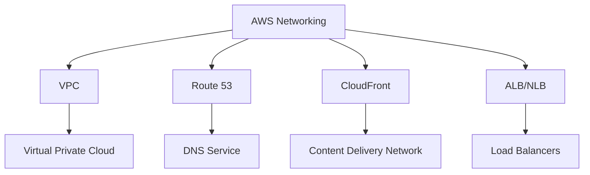

#### Amazon VPC (Virtual Private Cloud)
- **Purpose**: Isolated cloud resources
- **Components**: Subnets, route tables, internet gateway, NAT gateway
- **Features**: Network isolation, security groups, network ACLs

**VPC Architecture**:
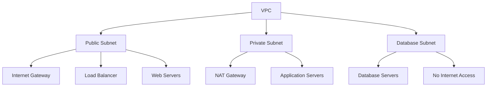

## Serverless Architecture

### Serverless Components
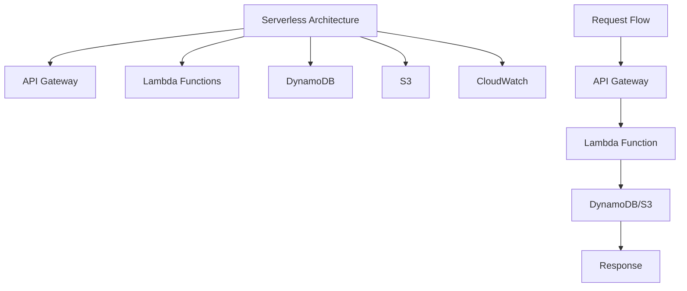

### Serverless Example
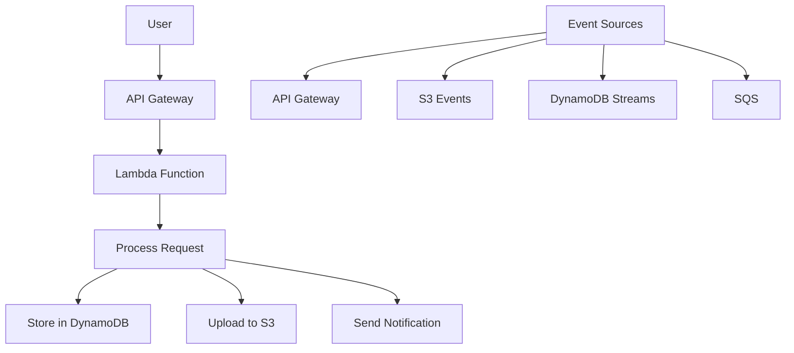

## AWS Security

### AWS Security Services
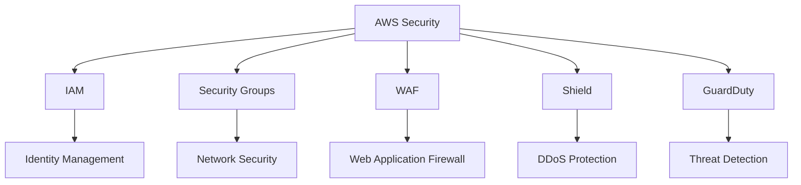

### AWS IAM (Identity and Access Management)
- **Purpose**: Manage access to AWS services and resources
- **Components**: Users, groups, roles, policies
- **Best Practices**: Principle of least privilege, MFA, regular audits

#### IAM Policy Example
```json
{
    "Version": "2012-10-17",
    "Statement": [
        {
            "Effect": "Allow",
            "Action": [
                "s3:GetObject",
                "s3:PutObject"
            ],
            "Resource": "arn:aws:s3:::my-bucket/*",
            "Condition": {
                "IpAddress": {
                    "aws:SourceIp": "203.0.113.0/24"
                }
            }
        }
    ]
}
```

### Security Best Practices
- **Principle of Least Privilege**: Grant minimum necessary permissions
- **Multi-Factor Authentication**: Enable MFA for all IAM users
- **Network Security**: Use VPC, security groups, NACLs
- **Data Encryption**: Encrypt data at rest and in transit
- **Monitoring**: Use CloudTrail, CloudWatch for security monitoring

## Monitoring and Management

### AWS Monitoring Services
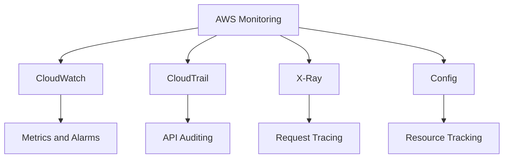

#### Amazon CloudWatch
- **Purpose**: Monitoring and observability service
- **Features**: Metrics, logs, alarms, dashboards
- **Use Cases**: Application monitoring, resource utilization, alerting

#### AWS CloudTrail
- **Purpose**: Logging service for API calls
- **Features**: Audit trail, compliance, security analysis
- **Benefits**: Track changes, troubleshoot issues, security monitoring

## Cost Management

### AWS Cost Optimization
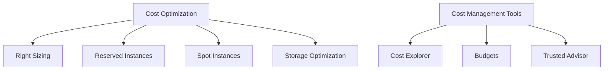

### Cost Reduction Strategies
| Strategy | Description | Savings |
|----------|-------------|---------|
| **Reserved Instances** | Commit to 1-3 years | Up to 72% |
| **Spot Instances** | Use spare capacity | Up to 90% |
| **Right Sizing** | Match resources to workload | 10-20% |
| **Storage Optimization** | Use appropriate storage class | 40-60% |

## Common AWS Architectures

### Three-Tier Web Application
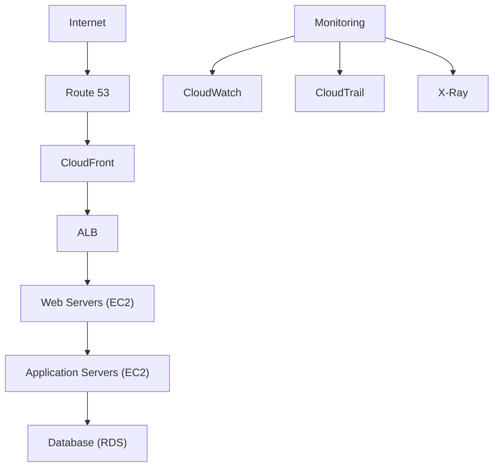

### Serverless Web Application
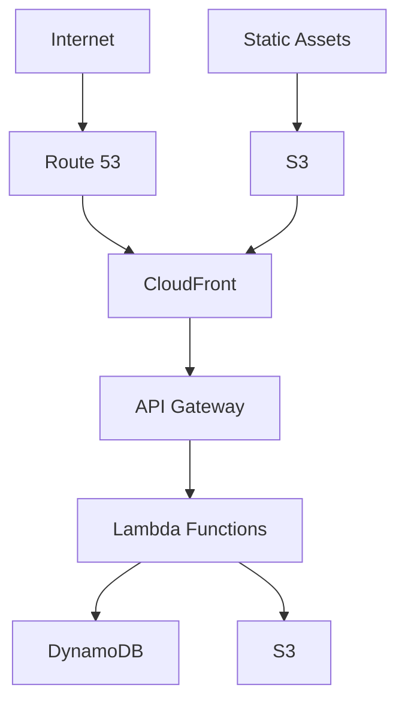

### Microservices Architecture
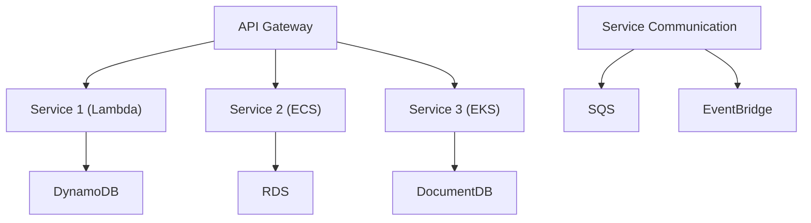

## Common Interview Questions

### Basic Questions

**Q1: What is the difference between AWS regions and availability zones?**
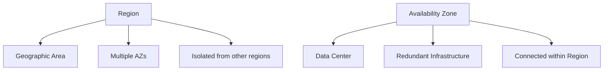

**Q2: Explain AWS IAM and its importance**
- **IAM**: Identity and Access Management
- **Purpose**: Control access to AWS resources
- **Components**: Users, groups, roles, policies

**Q3: What is Amazon S3 and its use cases?**
- **S3**: Simple Storage Service (object storage)
- **Use Cases**: Static websites, backup, big data, content distribution
- **Features**: Scalability, durability, security

### Intermediate Questions

**Q4: Compare EC2, Lambda, and Containers**
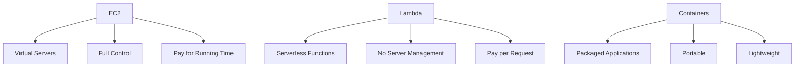

**Q5: Design a highly available architecture on AWS**
- **Multiple AZs**: Deploy across availability zones
- **Load Balancing**: Distribute traffic
- **Auto Scaling**: Automatically adjust capacity
- **Database**: Multi-AZ or read replicas
- **Monitoring**: Health checks and alerting

### Advanced Questions

**Q6: Explain serverless architecture on AWS**
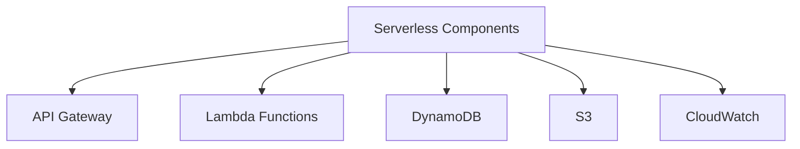

**Q7: How would you implement disaster recovery on AWS?**
- **Backup Strategy**: Regular backups to S3, cross-region replication
- **Multi-Region**: Deploy in multiple AWS regions
- **Infrastructure as Code**: Use CloudFormation or Terraform
- **Failover Testing**: Regular disaster recovery drills
- **Monitoring**: Health checks and automated failover

## Quick Reference

### Core AWS Services
| Category | Services | Use Cases |
|----------|----------|----------|
| **Compute** | EC2, Lambda, ECS | Web servers, serverless apps |
| **Storage** | S3, EBS, EFS | Object storage, block storage |
| **Database** | RDS, DynamoDB, Aurora | Relational, NoSQL databases |
| **Networking** | VPC, Route 53, CloudFront | Virtual networks, DNS, CDN |
| **Security** | IAM, Security Groups, WAF | Access control, network security |
| **Monitoring** | CloudWatch, CloudTrail | Metrics, logs, auditing |

### AWS Global Infrastructure
| Component | Description | Purpose |
|-----------|-------------|---------|
| **Region** | Geographic area | Low latency, data residency |
| **AZ** | Isolated data centers | High availability, fault tolerance |
| **Edge Location** | CDN endpoints | Content delivery, low latency |

### Cost Optimization Tips
| Strategy | Implementation | Savings |
|----------|----------------|--------|
| **Reserved Instances** | 1-3 year commitment | Up to 72% |
| **Spot Instances** | Use spare capacity | Up to 90% |
| **Right Sizing** | Match resources to workload | 10-20% |
| **Auto Scaling** | Scale based on demand | 20-40% |

### Interview Preparation Tips

1. **Understand core AWS services** and their use cases
2. **Know architectural patterns** and best practices
3. **Understand security principles** and IAM
4. **Practice cost optimization** strategies
5. **Be familiar with monitoring** and troubleshooting

### Common Mistakes to Avoid

1. **Not considering high availability** in designs
2. **Ignoring security best practices**
3. **Overlooking cost optimization** opportunities
4. **Not understanding regional differences**
5. **Forgetting about monitoring** and observability

---

**Important Note**: AWS is a vast platform with many services. Focus on understanding core services and architectural patterns rather than trying to memorize every service. Emphasize understanding the when and why of using specific services, not just the how.