# Chapter 14: Docker and Kubernetes

## Containerization Fundamentals

### What are Containers?
- **Containers**: Lightweight, standalone, executable packages
- **Purpose**: Package applications with dependencies for consistency
- **Benefits**: Portability, scalability, resource efficiency, isolation

### Containers vs Virtual Machines
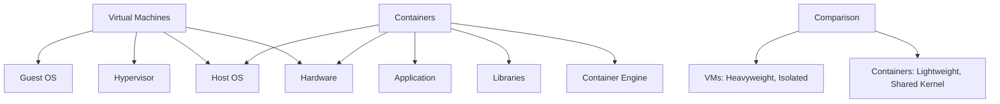

| Feature | Virtual Machines | Containers |
|---------|------------------|------------|
| **Size** | GBs of storage | MBs of storage |
| **Startup Time** | Minutes | Seconds |
| **Resource Usage** | High | Low |
| **Isolation** | Hardware-level | Process-level |
| **Portability** | Limited | Highly portable |
| **Density** | Few per host | Many per host |

## Docker Fundamentals

### Docker Architecture
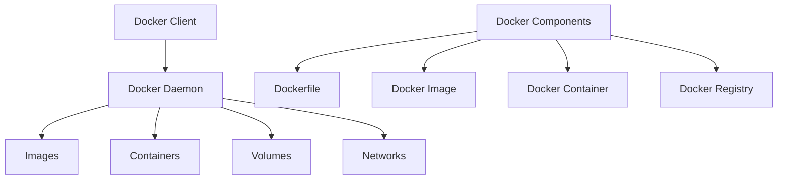

### Docker Components

#### Dockerfile
- **Purpose**: Text file with instructions to build Docker image
- **Instructions**: FROM, RUN, COPY, EXPOSE, CMD, ENTRYPOINT
- **Best Practices**: Minimal layers, security scanning, multi-stage builds

#### Dockerfile Example
```dockerfile
# Multi-stage Dockerfile for Node.js application
FROM node:16-alpine AS builder

# Set working directory
WORKDIR /app

# Copy package files
COPY package*.json ./

# Install dependencies
RUN npm ci --only=production && npm cache clean --force

# Copy application code
COPY . .

# Create non-root user
RUN addgroup -g 1001 -S nodejs && \
    adduser -S nodejs -u 1001

# Change ownership
RUN chown -R nodejs:nodejs /app

# Production stage
FROM node:16-alpine AS production

# Install dumb-init for proper signal handling
RUN apk add --no-cache dumb-init

# Create non-root user
RUN addgroup -g 1001 -S nodejs && \
    adduser -S nodejs -u 1001

# Set working directory
WORKDIR /app

# Copy from builder stage
COPY --from=builder --chown=nodejs:nodejs /app/node_modules ./node_modules
COPY --from=builder --chown=nodejs:nodejs /app/package*.json ./
COPY --from=builder --chown=nodejs:nodejs /app/src ./src

# Switch to non-root user
USER nodejs

# Health check
HEALTHCHECK --interval=30s --timeout=3s --start-period=5s --retries=3 \
    CMD node healthcheck.js

# Expose port
EXPOSE 3000

# Start application
ENTRYPOINT ["dumb-init", "--"]
CMD ["node", "src/index.js"]
```

#### Docker Commands
```bash
# Build image
docker build -t myapp:1.0 .

# Run container
docker run -d --name myapp-container -p 3000:3000 myapp:1.0

# List containers
docker ps -a

# View container logs
docker logs myapp-container

# Stop container
docker stop myapp-container

# Remove container
docker rm myapp-container

# List images
docker images

# Remove image
docker rmi myapp:1.0

# Access container shell
docker exec -it myapp-container /bin/bash
```

### Docker Compose
- **Purpose**: Define and run multi-container Docker applications
- **Configuration**: YAML file defining services, networks, volumes
- **Benefits**: Simplified deployment, environment configuration

#### Docker Compose Example
```yaml
# docker-compose.yml
version: '3.8'

services:
    # Web application
    web:
        build: .
        ports:
            - "3000:3000"
        environment:
            - NODE_ENV=production
            - DATABASE_URL=postgresql://user:password@db:5432/myapp
            - REDIS_URL=redis://redis:6379
        depends_on:
            - db
            - redis
        networks:
            - app-network
        restart: unless-stopped
        healthcheck:
            test: ["CMD", "curl", "-f", "http://localhost:3000/health"]
            interval: 30s
            timeout: 10s
            retries: 3
            start_period: 40s

    # Database
    db:
        image: postgres:13-alpine
        environment:
            - POSTGRES_DB=myapp
            - POSTGRES_USER=user
            - POSTGRES_PASSWORD=password
        volumes:
            - postgres_data:/var/lib/postgresql/data
            - ./init.sql:/docker-entrypoint-initdb.d/init.sql
        networks:
            - app-network
        restart: unless-stopped
        healthcheck:
            test: ["CMD-SHELL", "pg_isready -U user -d myapp"]
            interval: 10s
            timeout: 5s
            retries: 5

    # Cache
    redis:
        image: redis:6-alpine
        volumes:
            - redis_data:/data
        networks:
            - app-network
        restart: unless-stopped
        healthcheck:
            test: ["CMD", "redis-cli", "ping"]
            interval: 10s
            timeout: 3s
            retries: 3

    # Reverse proxy
    nginx:
        image: nginx:alpine
        ports:
            - "80:80"
            - "443:443"
        volumes:
            - ./nginx.conf:/etc/nginx/nginx.conf:ro
            - ./ssl:/etc/nginx/ssl:ro
        depends_on:
            - web
        networks:
            - app-network
        restart: unless-stopped

volumes:
    postgres_data:
    redis_data:

networks:
    app-network:
        driver: bridge
        ipam:
            config:
                - subnet: 172.20.0.0/16
```

#### Docker Compose Commands
```bash
# Start all services
docker-compose up -d

# View logs
docker-compose logs -f web

# Scale services
docker-compose up -d --scale web=3

# Stop all services
docker-compose down

# Remove volumes
docker-compose down -v

# Rebuild and start
docker-compose up -d --build
```

## Kubernetes Fundamentals

### Kubernetes Architecture
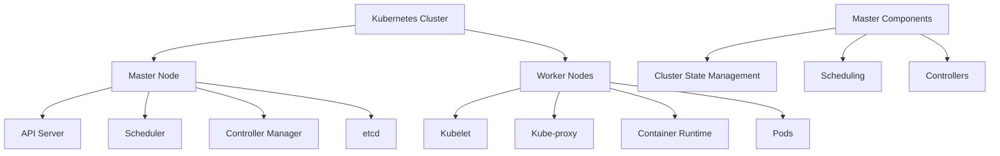

### Kubernetes Components

#### Master Node Components
- **API Server**: Central management point
- **Scheduler**: Assigns pods to nodes
- **Controller Manager**: Runs controller processes
- **etcd**: Distributed key-value store for cluster state

#### Worker Node Components
- **Kubelet**: Agent that runs on each node
- **Kube-proxy**: Network proxy and load balancer
- **Container Runtime**: Runs containers (Docker, containerd)

### Kubernetes Objects

#### Pods
- **Definition**: Smallest deployable unit in Kubernetes
- **Contains**: One or more containers with shared storage/network
- **Lifecycle**: Created, scheduled, running, terminated

#### Pod Example
```yaml
# pod.yaml
apiVersion: v1
kind: Pod
metadata:
  name: web-app
  labels:
    app: web
    version: v1
spec:
  containers:
  - name: web-container
    image: nginx:1.20-alpine
    ports:
    - containerPort: 80
    resources:
      requests:
        memory: "64Mi"
        cpu: "250m"
      limits:
        memory: "128Mi"
        cpu: "500m"
    livenessProbe:
      httpGet:
        path: /
        port: 80
      initialDelaySeconds: 30
      periodSeconds: 10
    readinessProbe:
      httpGet:
        path: /
        port: 80
      initialDelaySeconds: 5
      periodSeconds: 5
    volumeMounts:
    - name: config-volume
      mountPath: /etc/nginx/conf.d
      readOnly: true
  volumes:
  - name: config-volume
    configMap:
      name: nginx-config
  restartPolicy: Always
```

#### Deployments
- **Purpose**: Manage ReplicaSets for rolling updates
- **Benefits**: Declarative updates, rollback capabilities
- **Use Cases**: Stateless applications, web servers

#### Deployment Example
```yaml
# deployment.yaml
apiVersion: apps/v1
kind: Deployment
metadata:
  name: web-deployment
  labels:
    app: web
spec:
  replicas: 3
  selector:
    matchLabels:
      app: web
  template:
    metadata:
      labels:
        app: web
        version: v1
    spec:
      containers:
      - name: web-container
        image: nginx:1.20-alpine
        ports:
        - containerPort: 80
        env:
        - name: ENVIRONMENT
          value: "production"
        resources:
          requests:
            memory: "64Mi"
            cpu: "250m"
          limits:
            memory: "128Mi"
            cpu: "500m"
        livenessProbe:
          httpGet:
            path: /
            port: 80
          initialDelaySeconds: 30
          periodSeconds: 10
        readinessProbe:
          httpGet:
            path: /
            port: 80
          initialDelaySeconds: 5
          periodSeconds: 5
  strategy:
    type: RollingUpdate
    rollingUpdate:
      maxSurge: 1
      maxUnavailable: 1
```

#### Services
- **Purpose**: Expose applications to network traffic
- **Types**: ClusterIP, NodePort, LoadBalancer, ExternalName
- **Selector**: Routes traffic to matching pods

#### Service Example
```yaml
# service.yaml
apiVersion: v1
kind: Service
metadata:
  name: web-service
spec:
  selector:
    app: web
  ports:
  - protocol: TCP
    port: 80
    targetPort: 80
  type: ClusterIP
```

#### ConfigMaps and Secrets
```yaml
# configmap.yaml
apiVersion: v1
kind: ConfigMap
metadata:
  name: app-config
data:
  database_host: "db-service"
  database_port: "5432"
  cache_host: "redis-service"
  app.properties: |
    debug=true
    log.level=INFO

---
# secret.yaml
apiVersion: v1
kind: Secret
metadata:
  name: app-secrets
type: Opaque
data:
  database_username: dXNlcg==  # base64 encoded 'user'
  database_password: cGFzc3dvcmQ=  # base64 encoded 'password'
  api_key: bXlfc2VjcmV0X2FwaV9rZXk=  # base64 encoded 'my_secret_api_key'
```

## Kubernetes Advanced Concepts

### Ingress
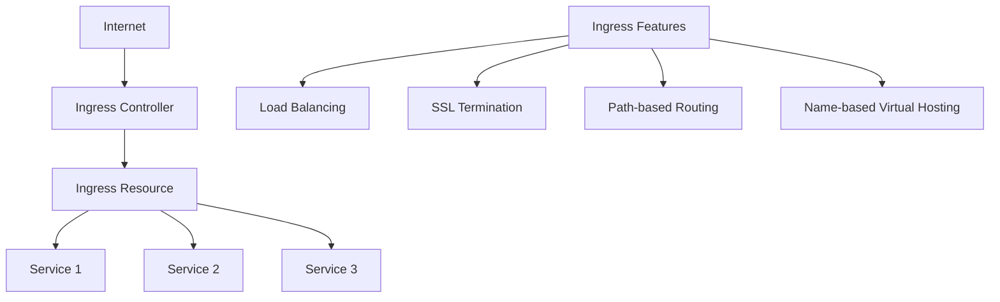

#### Ingress Example
```yaml
# ingress.yaml
apiVersion: networking.k8s.io/v1
kind: Ingress
metadata:
  name: web-ingress
  annotations:
    kubernetes.io/ingress.class: nginx
    cert-manager.io/cluster-issuer: letsencrypt-prod
    nginx.ingress.kubernetes.io/rewrite-target: /
    nginx.ingress.kubernetes.io/ssl-redirect: "true"
spec:
  tls:
  - hosts:
    - example.com
    - api.example.com
    secretName: tls-secret
  rules:
  - host: example.com
    http:
      paths:
      - path: /
        pathType: Prefix
        backend:
          service:
            name: web-service
            port:
              number: 80
  - host: api.example.com
    http:
      paths:
      - path: /api
        pathType: Prefix
        backend:
          service:
            name: api-service
            port:
              number: 3000
```

### Persistent Volumes
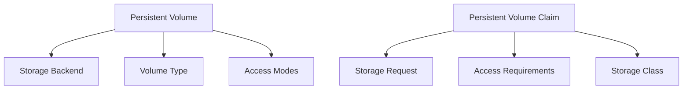

#### PV and PVC Example
```yaml
# persistent-volume.yaml
apiVersion: v1
kind: PersistentVolume
metadata:
  name: postgres-pv
spec:
  capacity:
    storage: 10Gi
  volumeMode: Filesystem
  accessModes:
  - ReadWriteOnce
  persistentVolumeReclaimPolicy: Retain
  storageClassName: manual
  hostPath:
    path: /mnt/data/postgres

---
# persistent-volume-claim.yaml
apiVersion: v1
kind: PersistentVolumeClaim
metadata:
  name: postgres-pvc
spec:
  accessModes:
  - ReadWriteOnce
  resources:
    requests:
      storage: 5Gi
  storageClassName: manual
```

### Horizontal Pod Autoscaler
```yaml
# hpa.yaml
apiVersion: autoscaling/v2
kind: HorizontalPodAutoscaler
metadata:
  name: web-hpa
spec:
  scaleTargetRef:
    apiVersion: apps/v1
    kind: Deployment
    name: web-deployment
  minReplicas: 2
  maxReplicas: 10
  metrics:
  - type: Resource
    resource:
      name: cpu
      target:
        type: Utilization
        averageUtilization: 70
  - type: Resource
    resource:
      name: memory
      target:
        type: Utilization
        averageUtilization: 80
  behavior:
    scaleDown:
      stabilizationWindowSeconds: 300
      policies:
      - type: Percent
        value: 10
        periodSeconds: 60
    scaleUp:
      stabilizationWindowSeconds: 60
      policies:
      - type: Percent
        value: 50
        periodSeconds: 60
```

## Container Orchestration Patterns

### Microservices with Kubernetes
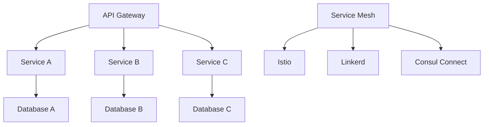

### Blue-Green Deployment
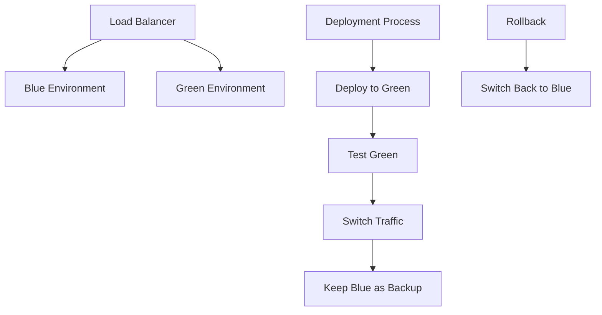

### Canary Deployment
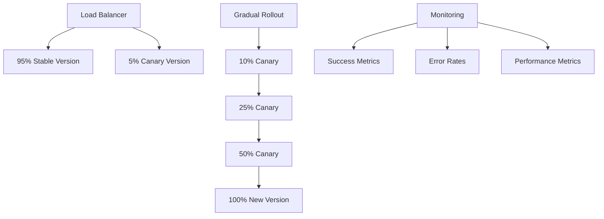

## Common Interview Questions

### Basic Questions

**Q1: What is the difference between Docker and Kubernetes?**
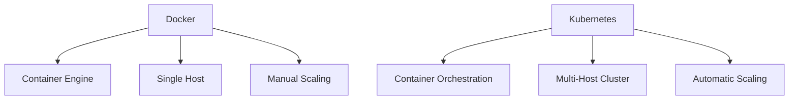

**Q2: Explain the difference between a Pod and a Container**
- **Container**: Single running process with filesystem
- **Pod**: Group of one or more containers sharing network/storage
- **Use Case**: Co-locate related containers, sidecar patterns

**Q3: What is a Dockerfile and its purpose?**
- **Dockerfile**: Text file with instructions to build Docker image
- **Purpose**: Automate image creation, ensure consistency
- **Common Instructions**: FROM, RUN, COPY, CMD, EXPOSE

### Intermediate Questions

**Q4: How does Kubernetes handle networking?**
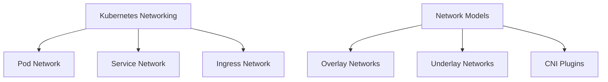

**Q5: Explain Kubernetes deployment strategies**
- **Rolling Update**: Gradual replacement of old pods
- **Recreate**: Terminate all old pods, then create new ones
- **Blue-Green**: Deploy new version alongside old version
- **Canary**: Gradually route traffic to new version

### Advanced Questions

**Q6: How would you implement high availability in Kubernetes?**
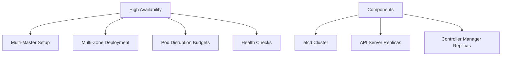

**Q7: How does Kubernetes handle persistent storage?**
- **Persistent Volume (PV)**: Cluster storage resource
- **Persistent Volume Claim (PVC)**: Request for storage
- **Storage Classes**: Different storage provisioners
- **Volume Types**: Block, file, object storage

## Quick Reference

### Docker Commands
| Category | Commands | Description |
|----------|----------|-------------|
| **Image Management** | `docker build`, `docker images` | Build and list images |
| **Container Management** | `docker run`, `docker ps` | Run and list containers |
| **Networking** | `docker network`, `docker port` | Manage networks |
| **Volumes** | `docker volume`, `docker cp` | Manage data persistence |
| **System** | `docker info`, `docker system` | System information |

### Kubernetes Objects
| Object | Purpose | Use Case |
|--------|---------|----------|
| **Pod** | Smallest deployable unit | Container grouping |
| **Deployment** | Manages ReplicaSets | Stateless applications |
| **Service** | Network endpoint | Load balancing |
| **ConfigMap** | Configuration data | Environment variables |
| **Secret** | Sensitive data | Passwords, API keys |
| **Ingress** | External access | Load balancing, SSL |

### kubectl Commands
| Category | Commands | Description |
|----------|----------|-------------|
| **Cluster Info** | `kubectl cluster-info` | Cluster information |
| **Pods** | `kubectl get pods` | List pods |
| **Deployments** | `kubectl get deployments` | List deployments |
| **Services** | `kubectl get services` | List services |
| **Logs** | `kubectl logs` | View pod logs |
| **Apply** | `kubectl apply -f` | Apply configuration |
| **Delete** | `kubectl delete` | Delete resources |

### Interview Preparation Tips

1. **Understand container concepts** and benefits
2. **Practice Docker commands** and Dockerfile writing
3. **Know Kubernetes architecture** and components
4. **Understand YAML syntax** for Kubernetes manifests
5. **Be familiar with deployment patterns** and strategies

### Common Mistakes to Avoid

1. **Running containers as root** - security risk
2. **Not setting resource limits** - resource exhaustion
3. **Ignoring health checks** - unhealthy deployments
4. **Not using liveness/readiness probes** - reliability issues
5. **Forgetting about networking** - communication failures

---

**Important Note**: Docker and Kubernetes are essential skills for modern application deployment. Focus on understanding the concepts behind containerization and orchestration rather than just memorizing commands. Practice with real-world scenarios and understand the trade-offs between different deployment strategies.