# Chapter 15: CI/CD Pipelines

## CI/CD Fundamentals

### What is CI/CD?
- **CI (Continuous Integration)**: Automate integration and testing of code changes
- **CD (Continuous Delivery/Deployment)**: Automate release and deployment process
- **Goal**: Faster, more reliable software delivery with reduced human error

### CI/CD Pipeline Overview
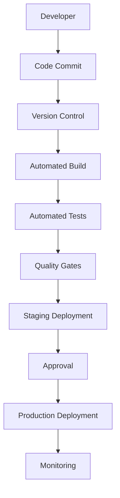

### Benefits of CI/CD
| Benefit | Description | Impact |
|---------|-------------|--------|
| **Faster Delivery** | Automated build and deploy | Reduced time to market |
| **Quality Improvement** | Automated testing | Fewer bugs in production |
| **Risk Reduction** | Small, frequent changes | Easier rollback |
| **Team Collaboration** | Shared pipeline | Better communication |
| **Consistency** | Standardized process | Predictable results |

## Continuous Integration (CI)

### CI Principles
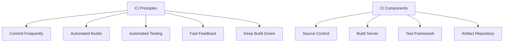

### CI Pipeline Stages
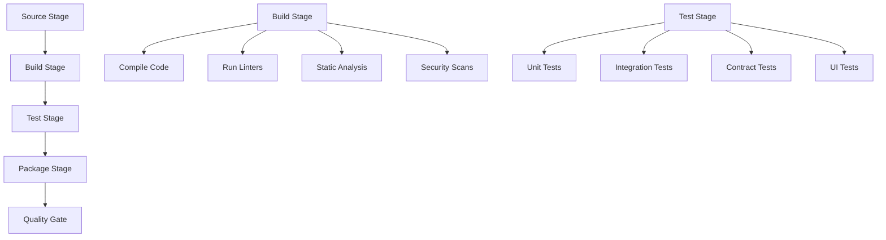

### CI Implementation Examples

#### GitHub Actions
```yaml
# .github/workflows/ci.yml
name: Continuous Integration

on:
  push:
    branches: [ main, develop ]
  pull_request:
    branches: [ main ]

env:
  NODE_VERSION: '18'
  JAVA_VERSION: '17'

jobs:
  test-node:
    runs-on: ubuntu-latest
    strategy:
      matrix:
        node-version: [16, 18, 20]

    steps:
    - name: Checkout code
      uses: actions/checkout@v4

    - name: Setup Node.js ${{ matrix.node-version }}
      uses: actions/setup-node@v4
      with:
        node-version: ${{ matrix.node-version }}
        cache: 'npm'

    - name: Install dependencies
      run: npm ci

    - name: Run linter
      run: npm run lint

    - name: Run type checking
      run: npm run type-check

    - name: Run unit tests
      run: npm run test:unit

    - name: Run integration tests
      run: npm run test:integration

    - name: Upload coverage reports
      uses: codecov/codecov-action@v3
      with:
        file: ./coverage/lcov.info

  security-scan:
    runs-on: ubuntu-latest
    steps:
    - name: Checkout code
      uses: actions/checkout@v4

    - name: Run Trivy vulnerability scanner
      uses: aquasecurity/trivy-action@master
      with:
        scan-type: 'fs'
        scan-ref: '.'
        format: 'sarif'
        output: 'trivy-results.sarif'

    - name: Upload Trivy scan results
      uses: github/codeql-action/upload-sarif@v2
      with:
        sarif_file: 'trivy-results.sarif'

  build-and-publish:
    needs: [test-node, security-scan]
    runs-on: ubuntu-latest
    if: github.ref == 'refs/heads/main'

    steps:
    - name: Checkout code
      uses: actions/checkout@v4

    - name: Set up Docker Buildx
      uses: docker/setup-buildx-action@v3

    - name: Login to Container Registry
      uses: docker/login-action@v3
      with:
        registry: ghcr.io
        username: ${{ github.actor }}
        password: ${{ secrets.GITHUB_TOKEN }}

    - name: Build and push Docker image
      uses: docker/build-push-action@v5
      with:
        context: .
        file: ./Dockerfile
        push: true
        tags: |
          ghcr.io/${{ github.repository }}:latest
          ghcr.io/${{ github.repository }}:${{ github.sha }}
        cache-from: type=gha
        cache-to: type=gha,mode=max
```

#### GitLab CI/CD
```yaml
# .gitlab-ci.yml
stages:
  - test
  - security
  - build
  - deploy

variables:
  NODE_VERSION: "18"
  DOCKER_DRIVER: overlay2

cache:
  paths:
    - node_modules/

unit_tests:
  stage: test
  image: node:${NODE_VERSION}
  before_script:
    - npm ci
  script:
    - npm run lint
    - npm run test:unit
    - npm run test:integration
  coverage: '/Lines\s*:\s*(\d+\.\d+)%/'
  artifacts:
    reports:
      junit: junit.xml
      coverage_report:
        coverage_format: cobertura
        path: coverage/cobertura-coverage.xml
  only:
    - merge_requests
    - main
    - develop

security_scan:
  stage: security
  image: node:${NODE_VERSION}
  before_script:
    - npm ci
  script:
    - npm audit --audit-level high
    - npm run security-scan
  allow_failure: false
  only:
    - merge_requests
    - main
    - develop

build_image:
  stage: build
  image: docker:20.10.16
  services:
    - docker:20.10.16-dind
  script:
    - docker build -t $CI_REGISTRY_IMAGE:$CI_COMMIT_SHA .
    - docker tag $CI_REGISTRY_IMAGE:$CI_COMMIT_SHA $CI_REGISTRY_IMAGE:latest
    - docker login -u $CI_REGISTRY_USER -p $CI_REGISTRY_PASSWORD $CI_REGISTRY
    - docker push $CI_REGISTRY_IMAGE:$CI_COMMIT_SHA
    - docker push $CI_REGISTRY_IMAGE:latest
  only:
    - main
    - develop

deploy_staging:
  stage: deploy
  image: bitnami/kubectl:latest
  script:
    - kubectl config use-context $KUBE_CONTEXT_STAGING
    - helm upgrade --install myapp ./helm-chart
      --set image.tag=$CI_COMMIT_SHA
      --set environment=staging
      --namespace staging
  environment:
    name: staging
    url: https://staging.example.com
  only:
    - develop
  when: manual

deploy_production:
  stage: deploy
  image: bitnami/kubectl:latest
  script:
    - kubectl config use-context $KUBE_CONTEXT_PROD
    - helm upgrade --install myapp ./helm-chart
      --set image.tag=$CI_COMMIT_SHA
      --set environment=production
      --namespace production
  environment:
    name: production
    url: https://example.com
  only:
    - main
  when: manual
```

## Continuous Deployment (CD)

### CD Strategies
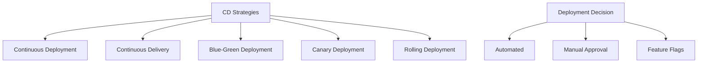

### Deployment Patterns

#### Rolling Deployment
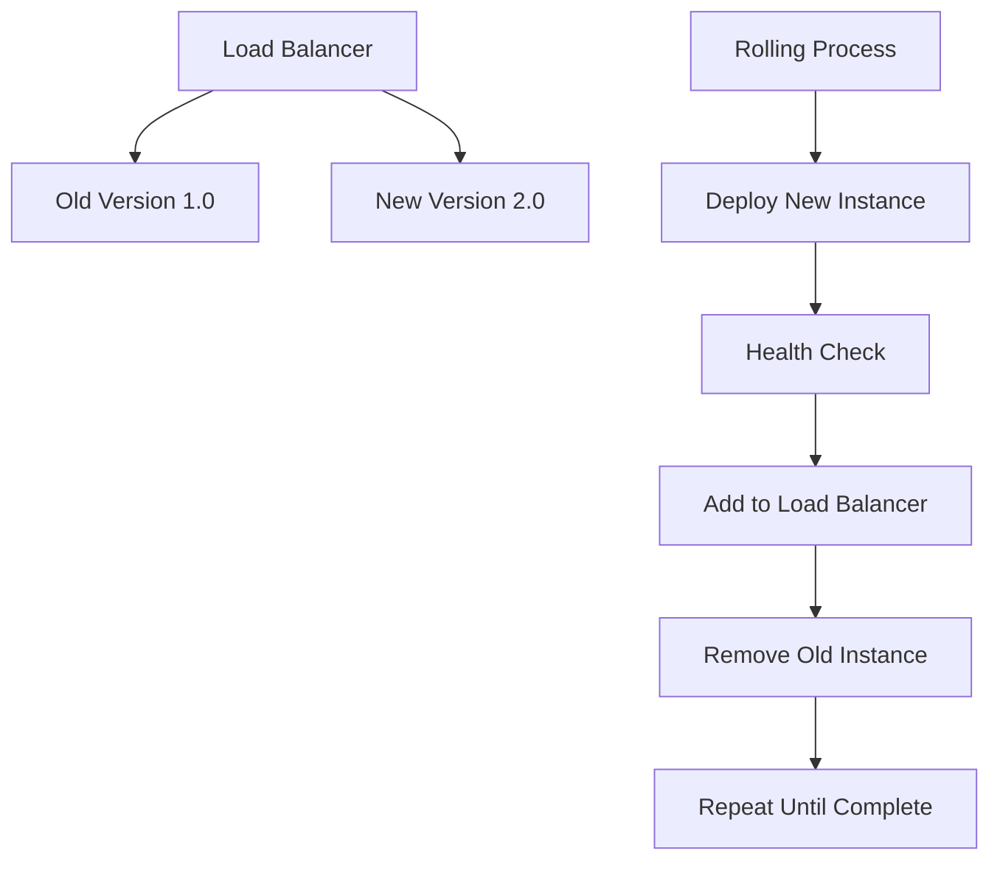

#### Blue-Green Deployment
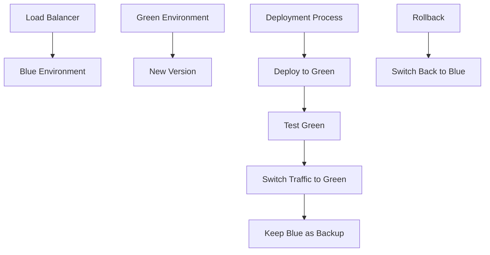

#### Canary Deployment
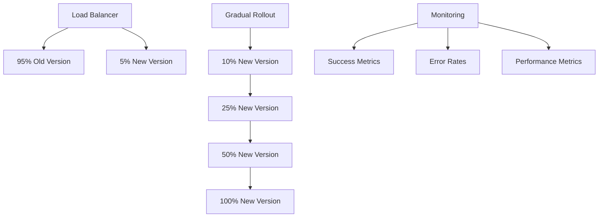

### Infrastructure as Code in CD
```yaml
# terraform/infrastructure.tf
provider "aws" {
  region = var.aws_region
}

resource "aws_vpc" "main" {
  cidr_block           = "10.0.0.0/16"
  enable_dns_hostnames = true
  enable_dns_support   = true

  tags = {
    Name        = "main-vpc"
    Environment = var.environment
    ManagedBy   = "terraform"
  }
}

resource "aws_eks_cluster" "main" {
  name     = var.cluster_name
  role_arn = aws_iam_role.eks_cluster.arn
  vpc_config {
    subnet_ids = aws_subnet.private[*].id
  }

  depends_on = [
    aws_iam_role_policy_attachment.eks_cluster_policy,
  ]

  tags = {
    Name        = var.cluster_name
    Environment = var.environment
    ManagedBy   = "terraform"
  }
}

resource "aws_eks_node_group" "main" {
  cluster_name    = aws_eks_cluster.main.name
  node_group_name = "main-nodes"
  node_role_arn   = aws_iam_role.eks_node.arn
  subnet_ids      = aws_subnet.private[*].id

  scaling_config {
    desired_size = var.desired_capacity
    max_size     = var.max_capacity
    min_size     = var.min_capacity
  }

  instance_types = [var.instance_type]

  depends_on = [
    aws_iam_role_policy_attachment.eks_worker_node_policy,
    aws_iam_role_policy_attachment.eks_cni_policy,
    aws_iam_role_policy_attachment.ec2_container_registry_readonly,
  ]

  tags = {
    Name        = "${var.cluster_name}-nodes"
    Environment = var.environment
    ManagedBy   = "terraform"
  }
}
```

## Quality Gates and Testing

### Quality Gates
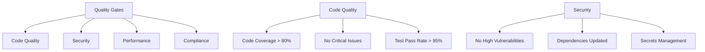

### Testing Pyramid
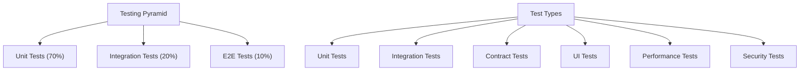

#### Automated Testing Examples
```javascript
// jest.config.js
module.exports = {
  preset: 'ts-jest',
  testEnvironment: 'node',
  collectCoverageFrom: [
    'src/**/*.ts',
    '!src/**/*.d.ts',
    '!src/**/__tests__/**',
    '!src/index.ts'
  ],
  coverageThreshold: {
    global: {
      branches: 80,
      functions: 80,
      lines: 80,
      statements: 80
    }
  },
  testMatch: [
    '<rootDir>/src/**/__tests__/**/*.ts',
    '<rootDir>/src/**/*.test.ts'
  ]
};
```

```yaml
# cypress.config.js
import { defineConfig } from 'cypress';

export default defineConfig({
  e2e: {
    baseUrl: 'http://localhost:3000',
    supportFile: 'cypress/support/e2e.ts',
    specPattern: 'cypress/e2e/**/*.cy.ts',
    video: false,
    screenshotOnRunFailure: true,
    defaultCommandTimeout: 10000,
    requestTimeout: 10000,
    responseTimeout: 10000
  },
  component: {
    devServer: {
      framework: 'react',
      bundler: 'vite'
    }
  }
});
```

## Monitoring and Feedback

### CI/CD Monitoring
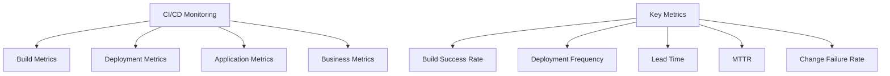

### DORA Metrics
| Metric | Definition | Target |
|--------|------------|--------|
| **Deployment Frequency** | How often deployments happen | Multiple times per day |
| **Lead Time for Changes** | Time from commit to production | < 1 hour |
| **MTTR** | Mean Time to Recover from failure | < 1 hour |
| **Change Failure Rate** | Percentage of failed deployments | < 15% |

### Alerting Strategies
```yaml
# prometheus-rules.yml
groups:
  - name: cicd.rules
    rules:
      - alert: HighFailureRate
        expr: (ci_build_failures_total / ci_builds_total) > 0.1
        for: 5m
        labels:
          severity: warning
        annotations:
          summary: "High CI/CD failure rate detected"
          description: "CI/CD failure rate is {{ $value | humanizePercentage }} for the last 5 minutes"

      - alert: SlowDeployment
        expr: ci_deployment_duration_seconds > 1800
        for: 10m
        labels:
          severity: warning
        annotations:
          summary: "Slow deployment detected"
          description: "Deployment is taking longer than 30 minutes"

      - alert: BuildQueueBacklog
        expr: ci_build_queue_size > 10
        for: 5m
        labels:
          severity: critical
        annotations:
          summary: "Build queue backlog detected"
          description: "Build queue size is {{ $value }} items"
```

## Security in CI/CD

### Security Best Practices
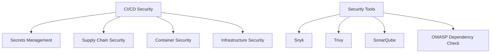

### Security Scanning Pipeline
```yaml
# security-pipeline.yml
stages:
  - security-scan
  - vulnerability-assessment
  - compliance-check

dependency-scan:
  stage: security-scan
  script:
    - npm audit --audit-level high
    - snyk test --severity-threshold=high
    - safety check
  artifacts:
    reports:
      junit: security-report.json
  allow_failure: false

container-scan:
  stage: vulnerability-assessment
  script:
    - docker build -t $CI_REGISTRY_IMAGE:latest .
    - trivy image --exit-code 0 --severity HIGH,CRITICAL $CI_REGISTRY_IMAGE:latest
    - trivy fs --exit-code 0 --severity HIGH,CRITICAL .
  artifacts:
    reports:
      junit: container-security-report.json
  allow_failure: false

compliance-scan:
  stage: compliance-check
  script:
    - sonar-scanner
    - checkov -d . -o checkov-report.json
  artifacts:
    reports:
      junit: compliance-report.json
  allow_failure: false
```

## Tools and Technologies

### CI/CD Platform Comparison
| Platform | Features | Pricing | Best For |
|----------|----------|---------|----------|
| **GitHub Actions** | Integrated with GitHub, YAML workflows | Free tier + usage | Open source projects |
| **GitLab CI/CD** | Complete DevOps platform | Self-hosted free | Enterprise environments |
| **Jenkins** | Highly customizable, plugins | Free | Complex workflows |
| **CircleCI** | Fast builds, Docker support | Usage-based | Fast CI/CD |
| **Travis CI** | Simple setup, good for open source | Free tier | Open source projects |

### Popular CI/CD Tools
```mermaid
graph TD
    A["CI/CD Tools"] --> B["Version Control"]
    A --> C["Build Tools"]
    A --> D["Testing Tools"]
    A --> E["Deployment Tools"]
    A --> F["Monitoring Tools"]

    G["Build Tools"] --> H["Maven", "Gradle", "npm", "pip"]
    I["Testing Tools"] --> J["Jest", "Cypress", "Selenium"]
    K["Deployment Tools"] --> L["Helm", "Terraform", "Ansible"]
    M["Monitoring Tools"] --> N["Prometheus", "Grafana", "Datadog"]
```

## Common Interview Questions

### Basic Questions

**Q1: What is the difference between CI and CD?**
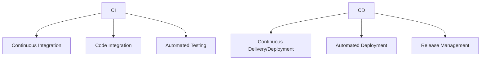

**Q2: Explain the benefits of CI/CD**
- **Faster delivery**: Reduced time to market
- **Quality improvement**: Automated testing reduces bugs
- **Risk reduction**: Small, frequent changes
- **Team collaboration**: Shared pipeline and visibility

**Q3: What are the key stages in a CI/CD pipeline?**
1. **Source**: Code commit and version control
2. **Build**: Compile and package code
3. **Test**: Automated testing (unit, integration, E2E)
4. **Package**: Create deployable artifacts
5. **Deploy**: Deploy to staging/production
6. **Monitor**: Observe performance and health

### Intermediate Questions

**Q4: How would you implement a rolling deployment strategy?**
```mermaid
graph TD
    A["Load Balancer"] --> B["Old + New Instances"]

    C["Rolling Process"] --> D["Deploy New Instance"]
    D --> E["Health Check"]
    E --> F["Add to Load Balancer"]
    F --> G["Remove Old Instance"]
    G --> H["Repeat Until Complete"
```

**Q5: What are quality gates and why are they important?**
- **Definition**: Automated checks that must pass before deployment
- **Types**: Code coverage, security scans, performance tests
- **Importance**: Ensure quality, prevent issues, maintain standards

### Advanced Questions

**Q6: How would you implement security in CI/CD pipeline?**
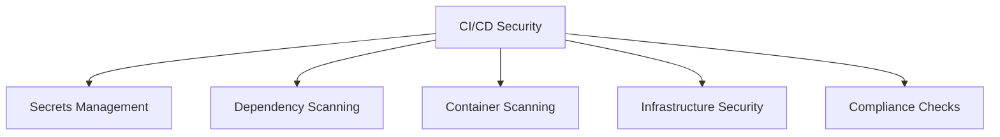

**Q7: Explain different deployment strategies with examples**
- **Rolling**: Gradual replacement of old instances
- **Blue-Green**: Deploy new version alongside old version
- **Canary**: Gradually route traffic to new version
- **A/B Testing**: Deploy different versions to different user segments

## Quick Reference

### CI/CD Pipeline Stages
| Stage | Purpose | Tools |
|-------|---------|-------|
| **Source** | Version control, code review | Git, GitHub, GitLab |
| **Build** | Compile, package, artifact creation | Maven, npm, Docker |
| **Test** | Automated testing, quality checks | Jest, Selenium, SonarQube |
| **Security** | Vulnerability scanning, compliance | Snyk, Trivy, Checkov |
| **Deploy** | Deploy to environments | Helm, Terraform, Ansible |
| **Monitor** | Observe performance, health | Prometheus, Grafana |

### Deployment Strategies
| Strategy | Downtime | Rollback | Complexity |
|----------|----------|---------|-----------|
| **Rolling** | Minimal | Easy | Low |
| **Blue-Green** | None | Instant | Medium |
| **Canary** | None | Gradual | High |
| **Recreate** | Full | Easy | Low |

### DORA Metrics
| Metric | Formula | Target |
|--------|---------|--------|
| **Lead Time** | Deploy time - Commit time | < 1 hour |
| **Deployment Frequency** | Deployments per week | Multiple per day |
| **MTTR** | Recovery time from failure | < 1 hour |
| **Change Failure** | Failed deployments / Total | < 15% |

### Interview Preparation Tips

1. **Understand CI/CD principles** and benefits
2. **Know different deployment strategies** and use cases
3. **Practice with CI/CD tools** (GitHub Actions, GitLab CI)
4. **Understand security best practices** in CI/CD
5. **Be familiar with monitoring** and quality metrics

### Common Mistakes to Avoid

1. **Skipping automated testing** in production deployments
2. **Not implementing proper security scans**
3. **Ignoring monitoring and alerting**
4. **Not having rollback strategies**
5. **Forgetting about environment management**

---

**Important Note**: CI/CD is essential for modern software development. Focus on understanding the principles behind automated pipelines and the trade-offs between different deployment strategies. Practice with real-world CI/CD tools and understand how to implement secure, reliable pipelines that deliver value quickly and safely.