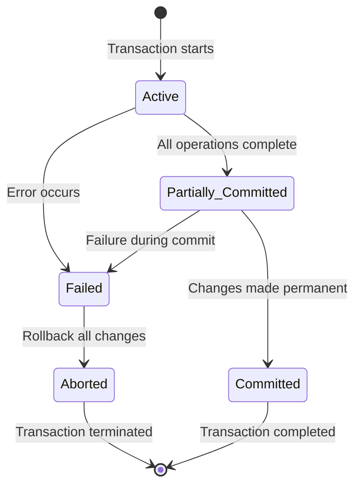

# DBMS Fast Revision 🗄️

## Why DBMS is Medium Priority 🎯

**DBMS ties back to SQL that you had learned. This time you can cover transaction and its ACID properties, indexes, normalization, ER diagrams. These are very common things asked in an interview. A very frequent topic in a lot of service-based companies.**

### **Key Interview Focus**:
- **Transaction management and ACID properties**
- **Indexing and query optimization**
- **Database normalization and design**
- **Connection to practical SQL knowledge**
- **Real-world database scenarios**

---

## Transactions & ACID Properties 🔒

### **1. Transaction Definition** 📝

**A transaction is a sequence of operations performed as a single logical unit of work. All operations must complete successfully or none at all.**

#### **Transaction States**:


#### **Transaction Example**:
```sql
-- Bank transfer transaction
START TRANSACTION;

-- Step 1: Check balance
SELECT balance FROM accounts WHERE account_id = 123;

-- Step 2: Debit from source account
UPDATE accounts
SET balance = balance - 1000
WHERE account_id = 123;

-- Step 3: Credit to destination account
UPDATE accounts
SET balance = balance + 1000
WHERE account_id = 456;

-- Step 4: Record transaction
INSERT INTO transactions (from_account, to_account, amount, timestamp)
VALUES (123, 456, 1000, NOW());

COMMIT; -- All changes permanent
-- ROLLBACK; -- All changes undone
```

### **2. ACID Properties Explained** ⚛️

#### **Atomicity (A) - All or Nothing**
**Definition**: Either all operations of a transaction are reflected properly in the database, or none are.

```sql
-- Atomicity Example
BEGIN TRANSACTION;

UPDATE accounts SET balance = balance - 500 WHERE account_id = 1;
UPDATE accounts SET balance = balance + 500 WHERE account_id = 2;

-- If either UPDATE fails, BOTH are rolled back
-- Account balances remain consistent
```

**Real-world Analogy**: Bank transfer - money either moves completely or doesn't move at all.

#### **Consistency (C) - Valid State**
**Definition**: Database moves from one valid state to another valid state. Integrity constraints must be maintained.

```sql
-- Consistency Example
-- Constraint: balance >= 0
CREATE TABLE accounts (
    account_id INT PRIMARY KEY,
    balance DECIMAL(10,2) CHECK (balance >= 0)
);

-- This transaction preserves consistency
BEGIN TRANSACTION;
UPDATE accounts SET balance = balance - 100 WHERE account_id = 1;
-- Balance will never go negative due to constraint
COMMIT;
```

**Interview Question**: "How does database ensure consistency?"
**Answer**: Through constraints, triggers, and transaction management.

#### **Isolation (I) - Concurrent Safety**
**Definition**: Concurrent transactions appear to run serially, even though they execute simultaneously.

```sql
-- Isolation Example
-- Transaction 1 and Transaction 2 running simultaneously

-- Transaction 1
BEGIN TRANSACTION;
UPDATE products SET stock = stock - 1 WHERE product_id = 123;
COMMIT;

-- Transaction 2
BEGIN TRANSACTION;
SELECT stock FROM products WHERE product_id = 123;
-- Sees consistent state based on isolation level
COMMIT;
```

#### **Durability (D) - Permanent Changes**
**Definition**: Once a transaction completes successfully, the changes persist even if system fails.

```sql
-- Durability Example
BEGIN TRANSACTION;
INSERT INTO orders (order_id, customer_id, amount)
VALUES (1001, 45, 250.00);
COMMIT;
-- This order record survives system crashes, power failures, etc.
```

**How Durability is Achieved**:
- **Write-ahead logging** (WAL)
- **Transaction logs** stored on stable storage
- **Flush to disk** before commit acknowledgment

### **3. Isolation Levels** 🔒

#### **Isolation Levels from Lowest to Highest**:

| **Level** | **Dirty Reads** | **Non-repeatable Reads** | **Phantom Reads** | **Performance** |
|-----------|----------------|-------------------------|-------------------|-----------------|
| **READ UNCOMMITTED** | Possible | Possible | Possible | Highest |
| **READ COMMITTED** | Prevented | Possible | Possible | High |
| **REPEATABLE READ** | Prevented | Prevented | Possible | Medium |
| **SERIALIZABLE** | Prevented | Prevented | Prevented | Lowest |

#### **Examples**:
```sql
-- Set isolation level
SET TRANSACTION ISOLATION LEVEL READ COMMITTED;

-- Different behaviors:
-- Dirty Read: Reading uncommitted data from another transaction
-- Non-repeatable Read: Same query returns different results
-- Phantom Read: New rows appear in subsequent queries
```

---

## Indexing & Query Optimization 🚀

### **1. What is Indexing?** 📚

**Definition**: Data structure that improves speed of data retrieval operations on a database table.**

#### **How Indexing Works**:
```
Without Index (Full Table Scan):
Table: [101-John, 102-Jane, 103-Mike, 104-Sara, 105-Tom]
Find "Mike": Check every row → 4 comparisons
Time: O(n)

With Index (B-Tree):
Index: [101, 103, 105] → Point to actual data
Find "Mike": Check index → Go directly → 1 comparison
Time: O(log n)
```

#### **Index Types**:

##### **B-Tree Index (Default)**
```sql
-- Create B-Tree index
CREATE INDEX idx_employee_name ON employees(last_name, first_name);

-- Best for: Range queries, equality queries, sorting
SELECT * FROM employees WHERE last_name = 'Smith';
SELECT * FROM employees WHERE last_name BETWEEN 'A' AND 'M';
```

##### **Hash Index**
```sql
-- Create Hash index (MySQL MEMORY engine)
CREATE INDEX idx_user_email USING HASH ON users(email);

-- Best for: Exact equality queries only
SELECT * FROM users WHERE email = 'john@example.com';
-- Not good for: range queries, LIKE operations
```

##### **Composite Index**
```sql
-- Composite index on multiple columns
CREATE INDEX idx_orders_customer_date ON orders(customer_id, order_date);

-- Effective for:
SELECT * FROM orders WHERE customer_id = 123;
SELECT * FROM orders WHERE customer_id = 123 AND order_date = '2023-01-01';

-- Not effective for:
SELECT * FROM orders WHERE order_date = '2023-01-01'; -- Leading column missing
```

### **2. Query Optimization Techniques** ⚡

#### **Index Usage Guidelines**:

##### **DO Use Index For**:
```sql
-- WHERE clause conditions
SELECT * FROM employees WHERE department_id = 5;

-- JOIN conditions
SELECT e.*, d.name FROM employees e
JOIN departments d ON e.department_id = d.id;

-- ORDER BY clauses
SELECT * FROM employees ORDER BY last_name, first_name;

-- GROUP BY clauses
SELECT department_id, COUNT(*) FROM employees GROUP BY department_id;
```

##### **DON'T Use Index For**:
```sql
-- Functions on indexed columns (index not used)
SELECT * FROM employees WHERE UPPER(last_name) = 'SMITH';

-- LIKE with leading wildcard (index not used)
SELECT * FROM employees WHERE last_name LIKE '%th';

-- OR conditions (may not use index effectively)
SELECT * FROM employees WHERE department_id = 5 OR salary > 50000;
```

#### **Query Optimization Examples**:

##### **Before Optimization**:
```sql
-- Slow query - full table scan
SELECT * FROM orders WHERE YEAR(order_date) = 2023;
SELECT * FROM products WHERE UPPER(product_name) = 'LAPTOP';
```

##### **After Optimization**:
```sql
-- Fast query - uses index
SELECT * FROM orders WHERE order_date >= '2023-01-01' AND order_date < '2024-01-01';
SELECT * FROM products WHERE product_name = 'laptop'; -- Store in consistent case
```

#### **EXPLAIN Plan Analysis**:
```sql
-- Analyze query execution plan
EXPLAIN SELECT * FROM employees WHERE department_id = 5;

-- Key columns to check:
-- type: ALL (bad), index (good), range (good)
-- key: Index being used
-- rows: Estimated rows to examine
-- Extra: Using where, Using index, etc.
```

### **3. Index Design Best Practices** 📋

#### **When to Create Index**:
- **Frequently queried columns** in WHERE clause
- **JOIN conditions** between tables
- **ORDER BY** and **GROUP BY** columns
- **Columns with high cardinality** (many unique values)

#### **When NOT to Create Index**:
- **Frequently updated columns** (slow down writes)
- **Tables with few rows** (overhead > benefit)
- **Columns with low selectivity** (gender, boolean flags)
- **Queries that return most rows** anyway

#### **Index Maintenance**:
```sql
-- Analyze index usage
SELECT * FROM pg_stat_user_indexes; -- PostgreSQL
SHOW INDEX FROM employees; -- MySQL

-- Rebuild fragmented indexes
REINDEX INDEX idx_employee_name; -- PostgreSQL
ANALYZE TABLE employees; -- MySQL
```

---

## Database Normalization 🏗️

### **1. Normalization Forms** 📊

#### **First Normal Form (1NF)**:
**Rules**:
- Each cell contains atomic (indivisible) values
- No repeating groups
- Each row is uniquely identifiable

**Before 1NF (Bad)**:
```sql
CREATE TABLE bad_orders (
    order_id INT,
    customer_name VARCHAR(100),
    products TEXT  -- "Laptop,Mouse,Keyboard"
);

-- Problems: Not atomic, hard to query individual products
```

**After 1NF (Good)**:
```sql
CREATE TABLE orders (
    order_id INT PRIMARY KEY,
    customer_name VARCHAR(100),
    order_date DATE
);

CREATE TABLE order_items (
    order_item_id INT PRIMARY KEY,
    order_id INT,
    product_name VARCHAR(100),
    quantity INT,
    price DECIMAL(10,2)
);
```

#### **Second Normal Form (2NF)**:
**Rules**:
- Must be in 1NF
- No partial dependencies (all non-key attributes depend on entire primary key)

**Before 2NF (Bad)**:
```sql
CREATE TABLE order_items (
    order_id INT,
    product_id INT,
    product_name VARCHAR(100),  -- Depends only on product_id
    quantity INT,               -- Depends on both order_id and product_id
    price DECIMAL(10,2),        -- Depends only on product_id
    PRIMARY KEY (order_id, product_id)
);

-- Problem: product_name and price depend only on product_id (partial dependency)
```

**After 2NF (Good)**:
```sql
CREATE TABLE order_items (
    order_id INT,
    product_id INT,
    quantity INT,
    PRIMARY KEY (order_id, product_id)
);

CREATE TABLE products (
    product_id INT PRIMARY KEY,
    product_name VARCHAR(100),
    price DECIMAL(10,2)
);
```

#### **Third Normal Form (3NF)**:
**Rules**:
- Must be in 2NF
- No transitive dependencies (non-key attributes don't depend on other non-key attributes)

**Before 3NF (Bad)**:
```sql
CREATE TABLE employees (
    employee_id INT PRIMARY KEY,
    employee_name VARCHAR(100),
    department_id INT,
    department_name VARCHAR(100),  -- Depends on department_id, not employee_id
    manager_name VARCHAR(100)      -- Depends on department_id
);

-- Problem: department_name depends on department_id (transitive dependency)
```

**After 3NF (Good)**:
```sql
CREATE TABLE employees (
    employee_id INT PRIMARY KEY,
    employee_name VARCHAR(100),
    department_id INT
);

CREATE TABLE departments (
    department_id INT PRIMARY KEY,
    department_name VARCHAR(100),
    manager_name VARCHAR(100)
);
```

#### **Boyce-Codd Normal Form (BCNF)**:
**Rules**:
- Stricter version of 3NF
- Every determinant must be a candidate key

**BCNF Example**:
```sql
-- This violates BCNF
CREATE TABLE course_enrollments (
    student_id INT,
    course_id INT,
    professor_id INT,
    PRIMARY KEY (student_id, course_id)
);

-- Problem: professor_id determines course_id but is not a candidate key
-- Solution: Create separate course table
```

### **2. Normalization Benefits & Trade-offs** ⚖️

#### **Benefits of Normalization**:
- **Reduces data redundancy**
- **Improves data integrity**
- **Simplifies data maintenance**
- **Prevents update anomalies**

#### **Trade-offs**:
- **More complex queries** (require JOINs)
- **Potential performance impact** (multiple table accesses)
- **Increased storage overhead** (additional tables)

#### **Denormalization** (When to Break Rules):
```sql
-- Sometimes denormalized for performance
CREATE TABLE order_summary (
    order_id INT PRIMARY KEY,
    customer_name VARCHAR(100),
    total_amount DECIMAL(10,2),
    item_count INT  -- Denormalized for quick reporting
);

-- Use when:
-- - Read-heavy workloads
-- - Reporting requirements
-- - Performance is critical
```

---

## Entity-Relationship (ER) Modeling 📊

### **1. ER Components** 🏗️

#### **Entities**:
```
Rectangle: Represents objects or things
Example: CUSTOMER, ORDER, PRODUCT
```

#### **Attributes**:
```
Oval: Represents properties of entities
Example: customer_name, order_date, product_price
```

#### **Relationships**:
```
Diamond: Represents associations between entities
Example: CUSTOMER places ORDER, ORDER contains PRODUCT
```

### **2. Relationship Types** 🔗

#### **One-to-One (1:1)**:
```
PERSON ──────── PASSPORT
Each person has exactly one passport
Each passport belongs to exactly one person
```

```sql
CREATE TABLE persons (
    person_id INT PRIMARY KEY,
    name VARCHAR(100),
    passport_id INT UNIQUE
);

CREATE TABLE passports (
    passport_id INT PRIMARY KEY,
    issue_date DATE,
    person_id INT UNIQUE,
    FOREIGN KEY (person_id) REFERENCES persons(person_id)
);
```

#### **One-to-Many (1:N)**:
```
DEPARTMENT ──────── EMPLOYEE
Each department has many employees
Each employee belongs to one department
```

```sql
CREATE TABLE departments (
    department_id INT PRIMARY KEY,
    department_name VARCHAR(100)
);

CREATE TABLE employees (
    employee_id INT PRIMARY KEY,
    employee_name VARCHAR(100),
    department_id INT,
    FOREIGN KEY (department_id) REFERENCES departments(department_id)
);
```

#### **Many-to-Many (M:N)**:
```
STUDENT ──────── COURSE
Each student can take many courses
Each course can have many students
```

```sql
CREATE TABLE students (
    student_id INT PRIMARY KEY,
    student_name VARCHAR(100)
);

CREATE TABLE courses (
    course_id INT PRIMARY KEY,
    course_name VARCHAR(100)
);

CREATE TABLE student_courses (
    student_id INT,
    course_id INT,
    grade CHAR(2),
    PRIMARY KEY (student_id, course_id),
    FOREIGN KEY (student_id) REFERENCES students(student_id),
    FOREIGN KEY (course_id) REFERENCES courses(course_id)
);
```

### **3. ER Design Example** 🎯

#### **University Database ER Diagram**:
```
┌─────────────┐       places        ┌─────────────┐
│   STUDENT    │ ──────────────── │   COURSE    │
├─────────────┤                   ├─────────────┤
│ student_id  │                   │ course_id   │
│ name        │                   │ course_name │
│ email       │                   │ credits     │
└─────────────┘                   └─────────────┘
       │                               │
       │ enrolls in                    │ has
       │                               │
┌─────────────┐                   ┌─────────────┐
│ ENROLLMENT  │                   │ DEPARTMENT  │
├─────────────┤                   ├─────────────┤
│ enrollment_id│                   │ dept_id     │
│ student_id  │                   │ dept_name   │
│ course_id   │                   │ location    │
│ grade       │                   └─────────────┘
│ semester    │                           │
└─────────────┘                           │
                                            │ belongs to
                                            │
                                    ┌─────────────┐
                                    │ INSTRUCTOR  │
                                    ├─────────────┤
                                    │ instructor_id│
                                    │ name         │
                                    │ dept_id      │
                                    └─────────────┘
```

---

## Common Interview Questions & Solutions 💼

### **Question 1: What is a deadlock in database?** 💀

**Answer Structure**:
1. **Definition**: Situation where two or more transactions are waiting for each other to release resources
2. **Conditions**: Mutual exclusion, hold and wait, no preemption, circular wait
3. **Example**: Transaction A locks Table X and wants Table Y, Transaction B locks Table Y and wants Table X
4. **Prevention**: Acquire locks in consistent order, use timeouts, implement deadlock detection

```sql
-- Deadlock Example
-- Transaction 1:
BEGIN;
UPDATE accounts SET balance = balance - 100 WHERE account_id = 1;
-- Waits for Transaction 2 to release account_id = 2
UPDATE accounts SET balance = balance + 100 WHERE account_id = 2;

-- Transaction 2:
BEGIN;
UPDATE accounts SET balance = balance - 100 WHERE account_id = 2;
-- Waits for Transaction 1 to release account_id = 1
UPDATE accounts SET balance = balance + 100 WHERE account_id = 1;
```

### **Question 2: Explain ACID properties with examples** ⚛️

**Answer**:
- **Atomicity**: Bank transfer - money moves completely or not at all
- **Consistency**: Account balance never negative
- **Isolation**: Two transfers don't interfere with each other
- **Durability**: Transfer survives system crashes

### **Question 3: When and how to use indexes?** 📚

**Answer**:
- **When**: Columns in WHERE, JOIN, ORDER BY clauses
- **How**: CREATE INDEX, composite indexes, covering indexes
- **Trade-offs**: Faster reads vs slower writes
- **Monitoring**: Use EXPLAIN to analyze index usage

### **Question 4: Database normalization examples** 🏗️

**Answer**: Provide step-by-step normalization from unnormalized to 3NF with examples

### **Question 5: How does database ensure consistency?** 🎯

**Answer**:
- **Constraints**: PRIMARY KEY, FOREIGN KEY, CHECK, UNIQUE
- **Triggers**: Automatic validation
- **Transactions**: ACID properties
- **Referential integrity**: Cascading updates/deletes

---

## DBMS Cheat Sheet 📝

### **Quick SQL Commands**:

#### **Transaction Management**:
```sql
START TRANSACTION;
-- Your SQL operations
COMMIT;  -- or ROLLBACK;
```

#### **Index Operations**:
```sql
CREATE INDEX idx_name ON table_name(column_name);
DROP INDEX idx_name ON table_name;
SHOW INDEX FROM table_name;
```

#### **Table Analysis**:
```sql
EXPLAIN SELECT * FROM table_name WHERE condition;
ANALYZE TABLE table_name;
DESCRIBE table_name;
```

### **Important Formulas**:

#### **Index Selectivity**:
```
Selectivity = Distinct Values / Total Values
Higher selectivity = Better index effectiveness
```

#### **Query Cost Estimation**:
```
Cost = I/O Cost + CPU Cost
Lower cost = Better query plan
```

### **Normalization Checklist**:

#### **1NF Check**:
- [ ] All values atomic
- [ ] No repeating groups
- [ ] Primary key defined

#### **2NF Check**:
- [ ] In 1NF
- [ ] No partial dependencies
- [ ] All attributes depend on entire primary key

#### **3NF Check**:
- [ ] In 2NF
- [ ] No transitive dependencies
- [ ] Non-key attributes don't depend on other non-key attributes

---

## Interview Preparation Checklist ✅

### **Must-Know Concepts**:
- [ ] **ACID properties** with real-world examples
- [ ] **Transaction states** and management
- [ ] **Isolation levels** and their effects
- [ ] **Index types** and when to use them
- [ ] **Query optimization** techniques
- [ ] **Normalization forms** (1NF, 2NF, 3NF, BCNF)
- [ ] **ER modeling** and relationship types
- [ ] **Deadlock handling** in databases

### **Common Problems to Solve**:
- [ ] **Design database schema** for given requirements
- [ ] **Normalize/denormalize** tables based on scenarios
- [ ] **Optimize slow queries** with indexes
- [ ] **Handle deadlock situations**
- [ ] **Design ER diagrams** for business scenarios

### **Practical Skills**:
- [ ] **Write efficient SQL queries**
- [ ] **Analyze query execution plans**
- [ ] **Design appropriate indexes**
- [ ] **Normalize database designs**
- [ ] **Handle transaction management**

---

## Key Takeaways 💡

1. **ACID Properties**: Foundation of reliable database systems
2. **Indexing**: Critical for query performance optimization
3. **Normalization**: Ensures data integrity and reduces redundancy
4. **Transaction Management**: Essential for concurrent operations
5. **ER Modeling**: Visual representation of database design
6. **Query Optimization**: Balance between read and write performance
7. **Deadlock Handling**: Important for multi-user systems
8. **Practical Application**: Connect theory to real SQL operations

**Remember**: DBMS concepts are frequently asked in service-based companies. Focus on understanding how these concepts apply to real-world database scenarios! 🗄️

---

**Next Steps**: Practice database design problems and move on to Computer Networks for complete core CS preparation.