# Operating Systems - Must-Do Interview Questions

A curated list of the most important Operating Systems interview questions that are frequently asked in technical interviews. These questions cover all fundamental topics and are essential for interview preparation.

---

## Table of Contents
1. [OS Fundamentals](#os-fundamentals)
2. [Process & Thread Management](#process--thread-management)
3. [Memory Management](#memory-management)
4. [Deadlock](#deadlock)
5. [Synchronization](#synchronization)
6. [CPU Scheduling](#cpu-scheduling)
7. [Storage & File Systems](#storage--file-systems)
8. [Advanced Topics](#advanced-topics)

---

## OS Fundamentals

### Q1. What is the main purpose of an operating system? Discuss different types.

**Main Purpose:**
An Operating System acts as an intermediary between users and computer hardware, managing resources and providing services.

**Key Purposes:**
1. **Resource Management**: CPU, memory, I/O devices, storage
2. **Abstraction**: Hide hardware complexity from users
3. **Security**: Control access to resources
4. **Efficiency**: Optimize resource utilization
5. **Convenience**: Easy interface for users

**Types of Operating Systems:**

| Type | Description | Examples |
|------|-------------|----------|
| **Batch OS** | Groups similar jobs, executes without user interaction | IBM OS/360 |
| **Multiprogramming OS** | Multiple programs in memory, CPU switches when I/O | Early Unix |
| **Multitasking OS** | Multiple tasks execute concurrently (time-sharing) | Windows, Linux |
| **Multi-processing OS** | Multiple CPUs working together | Server systems |
| **Distributed OS** | Multiple machines work as single system | Hadoop, Cloud OS |
| **Real-Time OS** | Time-critical operations with strict deadlines | VxWorks, QNX |
| **Network OS** | Manages network resources | Novell NetWare |
| **Mobile OS** | Optimized for mobile devices | Android, iOS |

---

### Q2. What is a socket, kernel and monolithic kernel?

**Socket:**
- **Definition**: Endpoint for sending/receiving data across a network
- **Purpose**: Inter-process communication (IPC) between machines
- **Components**: IP address + Port number
- **Types**: Stream sockets (TCP), Datagram sockets (UDP)

```
Socket = IP Address : Port Number
Example: 192.168.1.1:8080
```

**Kernel:**
- **Definition**: Core component of OS that manages system resources
- **Functions**:
  - Process management
  - Memory management
  - Device management
  - System calls interface
- **Mode**: Runs in privileged/kernel mode
- **Location**: Always in main memory

**Monolithic Kernel:**
- **Definition**: All OS services run in kernel space as single large process
- **Structure**: Kernel, device drivers, file systems all in kernel space

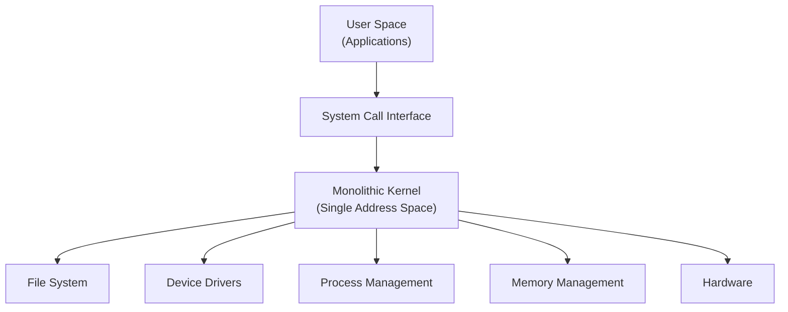

**Characteristics:**

| Advantages | Disadvantages |
|------------|---------------|
| Fast (no message passing overhead) | Large size |
| Efficient (direct function calls) | Less reliable (one bug crashes entire OS) |
| Good performance | Difficult to maintain |
| Direct hardware access | Less secure |

**Examples**: Linux, Unix, MS-DOS

---

### Q3. What is RAID? Different types.

**RAID (Redundant Array of Independent Disks):**
- **Purpose**: Combine multiple physical disks into single logical unit
- **Benefits**: Improved performance, data redundancy, fault tolerance

**RAID Levels:**

#### RAID 0 (Striping)
- **Method**: Data split across multiple disks
- **Redundancy**: None
- **Performance**: High (parallel read/write)
- **Use Case**: High performance, no critical data
- **Minimum Disks**: 2

```
Disk 1: [A1][A3][A5]
Disk 2: [A2][A4][A6]
```

#### RAID 1 (Mirroring)
- **Method**: Duplicate data on two disks
- **Redundancy**: 100% (exact copy)
- **Performance**: Good read, moderate write
- **Use Case**: Critical data, high availability
- **Minimum Disks**: 2
- **Usable Capacity**: 50%

```
Disk 1: [A][B][C]
Disk 2: [A][B][C] (Mirror)
```

#### RAID 5 (Striping with Parity)
- **Method**: Data + parity distributed across all disks
- **Redundancy**: Can survive 1 disk failure
- **Performance**: Good read, moderate write
- **Use Case**: General purpose, balanced
- **Minimum Disks**: 3
- **Usable Capacity**: (n-1)/n

```
Disk 1: [A1][B2][Cp]
Disk 2: [A2][Bp][C1]
Disk 3: [Ap][B1][C2]
```

#### RAID 6 (Striping with Double Parity)
- **Method**: Two parity blocks per stripe
- **Redundancy**: Can survive 2 disk failures
- **Performance**: Good read, slower write
- **Use Case**: High availability
- **Minimum Disks**: 4
- **Usable Capacity**: (n-2)/n

#### RAID 10 (1+0, Mirrored Stripes)
- **Method**: RAID 1 + RAID 0 (mirror then stripe)
- **Redundancy**: Can survive multiple disk failures
- **Performance**: Excellent
- **Use Case**: Databases, high performance
- **Minimum Disks**: 4
- **Usable Capacity**: 50%

**Comparison:**

| RAID Level | Min Disks | Redundancy | Performance | Capacity | Use Case |
|------------|-----------|------------|-------------|----------|----------|
| RAID 0 | 2 | None | Excellent | 100% | Gaming, temp storage |
| RAID 1 | 2 | High | Good | 50% | Critical data |
| RAID 5 | 3 | Medium | Good | (n-1)/n | General servers |
| RAID 6 | 4 | Very High | Good | (n-2)/n | Large storage |
| RAID 10 | 4 | High | Excellent | 50% | Databases |

---

### Q4. What is spooling?

**SPOOLING (Simultaneous Peripheral Operations On-Line):**

**Definition**: Process of temporarily storing data in a buffer (spool) for use by slower peripheral devices.

**How It Works:**
1. High-speed device sends data to spool (disk buffer)
2. Data queued in spool
3. Slow device reads from spool at its own pace
4. CPU free to do other tasks

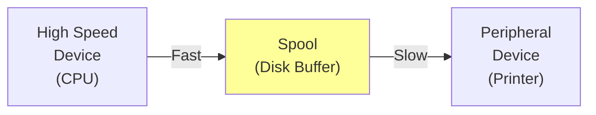

**Example - Print Spooling:**
```
1. Multiple users send print jobs
2. Jobs stored in print queue (spool)
3. Printer processes jobs one by one
4. Users don't wait for printer
```

**Advantages:**
- CPU doesn't wait for slow I/O devices
- Multiple jobs can be queued
- Better CPU utilization
- Overlapping of I/O and CPU operations

**Difference from Buffering:**

| Buffering | Spooling |
|-----------|----------|
| Temporary storage | Queue-based storage |
| For single I/O operation | For multiple jobs |
| In main memory | On disk |
| Small size | Large size |

**Real-World Use:**
- Print spooling (most common)
- Batch processing
- Email queuing
- Data streaming

---

## Process & Thread Management

### Q5. Difference between process and program and thread? Different types of process.

**Program vs Process vs Thread:**

| Program | Process | Thread |
|---------|---------|--------|
| Passive entity (code on disk) | Active entity (program in execution) | Lightweight process |
| Static | Dynamic | Part of process |
| No resource allocation | Has PCB, resources | Shares process resources |
| No state | Has states (New, Ready, Running, etc.) | Has TCB |
| Example: `.exe` file | Program loaded in memory | Function executing in process |

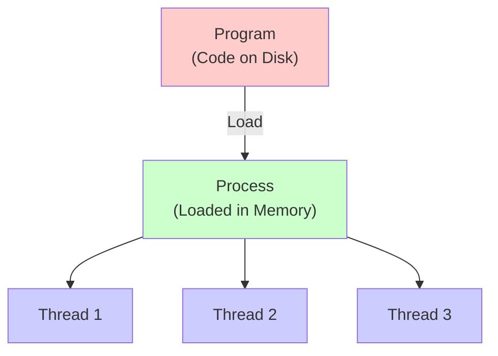

**Process Structure:**
```
| Stack      | (Local variables, function calls)
|------------|
| Heap       | (Dynamic memory)
|------------|
| Data       | (Global/static variables)
|------------|
| Text       | (Program code)
```

**Different Types of Processes:**

#### 1. Based on Execution:
- **Foreground Process**: Interactive, requires user input (e.g., text editor)
- **Background Process**: Non-interactive, runs without user intervention (e.g., antivirus scan)

#### 2. Based on Creation:
- **Parent Process**: Creates other processes
- **Child Process**: Created by parent process
- **Orphan Process**: Parent terminates before child
- **Zombie Process**: Child terminates but entry remains in process table

#### 3. Based on Memory:
- **Independent Process**: Doesn't share data with other processes
- **Cooperating Process**: Shares data with other processes

#### 4. Based on Priority:
- **System Process**: High priority, OS-related
- **User Process**: Lower priority, user applications

#### 5. Based on CPU Utilization:
- **CPU-Bound Process**: More CPU time, less I/O (e.g., video rendering)
- **I/O-Bound Process**: More I/O operations, less CPU (e.g., file copying)

**Thread Types:**

| User-Level Threads | Kernel-Level Threads |
|--------------------|---------------------|
| Managed by user library | Managed by OS |
| Fast context switching | Slow context switching |
| OS unaware | OS aware |
| If one blocks, all block | Independent blocking |
| Example: Green threads | Example: POSIX threads |

---

### Q6. Define virtual memory, thrashing, threads.

**Virtual Memory:**

**Definition**: Memory management technique that provides an abstraction of storage, allowing programs to use more memory than physically available.

**How It Works:**
1. Process uses **logical/virtual addresses**
2. OS maps virtual to physical addresses using **MMU**
3. Pages stored on disk (secondary storage)
4. Loaded to RAM on demand (**demand paging**)

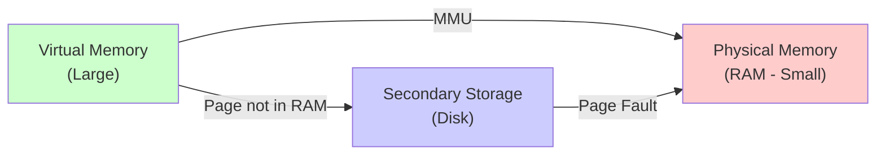

**Advantages:**
- Programs can be larger than physical RAM
- More processes can be loaded
- Less I/O needed for swapping
- Increases degree of multiprogramming

**Implementation:**
- **Paging**: Fixed-size blocks (pages)
- **Segmentation**: Variable-size blocks (segments)

---

**Thrashing:**

**Definition**: Situation where system spends more time **swapping pages** in and out of memory than executing processes.

**Cause:**
- Too many processes in memory
- Insufficient RAM
- High page fault rate

```
Page Fault → Load from Disk → Another Page Fault → Load → ...
(Continuous swapping, no actual work done)
```

**Effects:**
- CPU utilization drops drastically
- System becomes unresponsive
- Extremely slow performance

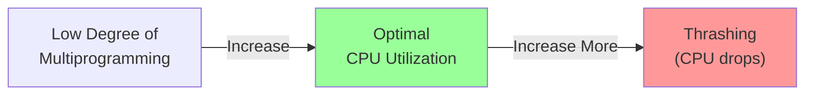

**Why Thrashing Occurs:**
1. **High degree of multiprogramming**: Too many processes
2. **Insufficient frames**: Not enough memory per process
3. **Poor page replacement**: Wrong pages evicted
4. **Lack of locality**: Process doesn't exhibit locality of reference

**Prevention:**
- **Working Set Model**: Keep frequently used pages in memory
- **Page Fault Frequency**: Monitor and control page faults
- **Local Replacement**: Each process has fixed frames
- **Increase RAM**: More physical memory
- **Decrease multiprogramming**: Fewer processes

---

**Threads:**

**Definition**: Lightweight process, smallest unit of execution within a process.

**Characteristics:**
- Share process resources (code, data, files)
- Have own **TCB** (Thread Control Block)
- Own stack and registers
- Fast creation and context switching

**Thread Components:**
- Thread ID
- Program Counter
- Register set
- Stack

**Why Use Threads:**
1. **Parallelism**: Utilize multiple CPUs
2. **Responsiveness**: One thread blocks, others continue
3. **Resource Sharing**: Share memory, files
4. **Economy**: Cheaper than creating processes
5. **Scalability**: Better performance on multicore

**Example:**
```
Web Browser Process:
- Thread 1: Handle user input
- Thread 2: Download images
- Thread 3: Render HTML
- Thread 4: Run JavaScript
```

**Thread vs Process:**

| Threads | Processes |
|---------|-----------|
| Lightweight | Heavyweight |
| Share memory | Separate memory |
| Fast context switch | Slow context switch |
| Less overhead | More overhead |
| Communication easy | Communication complex (IPC) |

---

## Memory Management

### Q7. What is fragmentation? Types of fragmentation.

**Fragmentation**: Wasted memory space that cannot be allocated to processes.

**Types of Fragmentation:**

#### 1. Internal Fragmentation

**Definition**: Wasted space **inside** an allocated memory block.

**Cause**:
- Fixed-size allocation
- Process gets more memory than needed
- Leftover space inside block cannot be used

```
Allocated Block (10 KB)
|==================|
| Process (7 KB)   |
|------------------|
| Wasted (3 KB)    | ← Internal Fragmentation
|==================|
```

**Example:**
- Process needs 7 KB
- Block size is 10 KB
- 3 KB wasted inside allocated block

**Occurs In:**
- **Fixed partitioning** (partition larger than process)
- **Paging** (last page partially filled)

**Solution:**
- Use variable partition sizes
- Use smaller page sizes (but increases overhead)

---

#### 2. External Fragmentation

**Definition**: Free memory scattered in **small non-contiguous blocks**, unable to satisfy allocation requests.

**Cause**:
- Processes of different sizes allocated and deallocated
- Creates holes between allocated blocks

```
Memory Layout:
|==========| Process A
|          | ← 2 KB free (hole)
|==========| Process B
|          | ← 3 KB free (hole)
|==========| Process C
|          | ← 2 KB free (hole)

Total free: 7 KB (but non-contiguous)
New process needs: 5 KB (cannot allocate!)
```

**Occurs In:**
- **Dynamic partitioning**
- **Variable-size allocation**
- **Segmentation**

**Solution:**
1. **Compaction**: Shuffle processes to combine holes
   - Expensive (requires relocation)
   - Possible only with dynamic relocation

2. **Paging**: Eliminate external fragmentation completely
   - Fixed-size pages (no holes between)

3. **Best Fit/First Fit**: Allocation algorithms
   - Minimize fragmentation

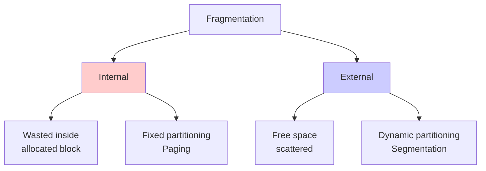

**Comparison:**

| Internal Fragmentation | External Fragmentation |
|------------------------|------------------------|
| Inside allocated block | Between allocated blocks |
| Fixed-size allocation | Variable-size allocation |
| Occurs in paging | Occurs in segmentation |
| Solution: Smaller blocks | Solution: Compaction, paging |
| Less severe | More severe |

---

### Q8. What is paging and why do we need it?

**Paging**: Memory management scheme that eliminates need for **contiguous allocation** and reduces **external fragmentation**.

**Key Concepts:**
- **Page**: Fixed-size block of logical memory (typically 4 KB)
- **Frame**: Fixed-size block of physical memory (same size as page)
- **Page Table**: Maps logical pages to physical frames

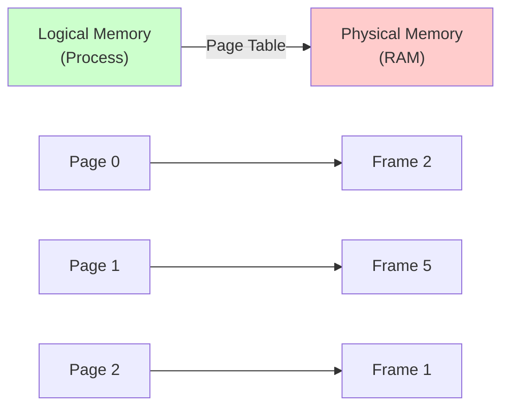

**How Paging Works:**

1. **Divide** logical memory into pages
2. **Divide** physical memory into frames
3. **Load** pages into any available frames
4. **Page table** tracks mapping

**Logical Address Translation:**
```
Logical Address = Page Number + Page Offset

Example: 32-bit address, 4 KB page
- Page Number: 20 bits (2^20 pages)
- Page Offset: 12 bits (4096 bytes = 2^12)

Address 8196:
- Page Number: 8196 / 4096 = 2
- Offset: 8196 % 4096 = 4
- Physical Address: Frame[2] * 4096 + 4
```

**Why Do We Need Paging?**

#### 1. Eliminates External Fragmentation
- Fixed-size pages fit perfectly in frames
- No holes between allocated blocks

#### 2. Allows Non-Contiguous Allocation
- Process pages can be scattered in memory
- No need to find large contiguous block

#### 3. Simplifies Memory Allocation
- Any free frame can be allocated
- No need for complex allocation algorithms

#### 4. Enables Virtual Memory
- Pages can reside on disk
- Load only needed pages (demand paging)

#### 5. Provides Protection
- Each page can have access rights
- Isolates processes from each other

#### 6. Enables Sharing
- Multiple processes can share pages
- Example: Shared libraries

**Page Table Structure:**

```
Page Table Entry (PTE):
|------------------------------------------------|
| Frame Number | Present | Dirty | Reference | RWX |
|------------------------------------------------|

Present: 1 if page in memory, 0 if on disk
Dirty: 1 if modified, 0 otherwise
Reference: 1 if recently accessed
RWX: Read/Write/Execute permissions
```

**Advantages:**
- No external fragmentation
- Non-contiguous allocation
- Efficient memory utilization
- Supports virtual memory
- Easy to implement

**Disadvantages:**
- Internal fragmentation (last page)
- Overhead of page table storage
- Additional memory access for page table lookup
- Solved by TLB (Translation Look-aside Buffer)

---

### Q9. Demand Paging, Segmentation

#### Demand Paging

**Definition**: Load pages into memory **only when needed** (on demand), not all at once.

**Working:**
1. Initially, no pages in memory
2. When page needed, **page fault** occurs
3. OS loads page from disk to frame
4. Update page table
5. Resume execution

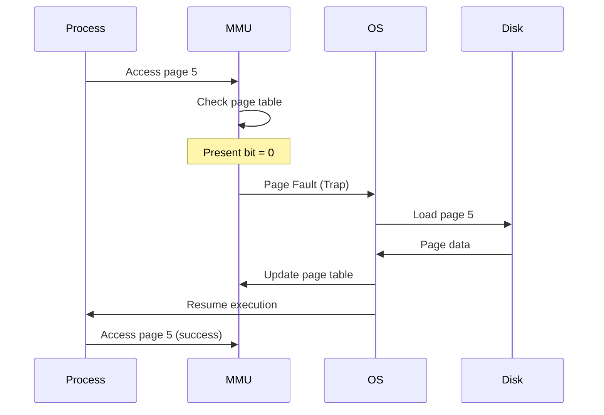

**Page Fault Handling Steps:**
1. Trap to OS (page fault)
2. Save process state
3. Check if invalid reference → terminate
4. Find free frame
5. Issue disk read
6. Update page table (present bit = 1)
7. Restart instruction

**Effective Access Time (EAT):**
```
EAT = (1 - p) × Memory Access Time + p × Page Fault Time

Where:
p = Page fault rate (0 ≤ p ≤ 1)
Memory Access = 200 ns
Page Fault Time = 8 ms = 8,000,000 ns

Example: p = 0.01 (1% page faults)
EAT = 0.99 × 200 + 0.01 × 8,000,000
    = 198 + 80,000 = 80,198 ns
```

**Advantages:**
- Less memory needed
- Faster program start
- More programs can run
- Better resource utilization

**Disadvantages:**
- High page fault rate → Thrashing
- Additional overhead
- Slower initial access

**Optimization:**
- **Prepaging**: Load likely-needed pages in advance
- **Locality of Reference**: Programs access nearby pages
- **Working Set**: Keep frequently used pages

---

#### Segmentation

**Definition**: Memory management scheme that divides logical memory into **variable-size segments** based on logical divisions.

**Segment**: Logical unit like:
- Code segment
- Data segment
- Stack segment
- Heap segment

```
Process Logical Memory:
|===================|
| Code Segment      | ← Segment 0
|-------------------|
| Data Segment      | ← Segment 1
|-------------------|
| Stack Segment     | ← Segment 2
|-------------------|
| Heap Segment      | ← Segment 3
|===================|
```

**Segmentation Table:**
```
Segment Table Entry:
|--------------------------|
| Base | Limit | Attributes |
|--------------------------|

Base: Starting physical address
Limit: Length of segment
```

**Logical Address:**
```
Logical Address = <Segment Number, Offset>

Translation:
1. Check if offset < limit (protection)
2. Physical Address = Base[segment] + Offset
```

**Example:**
```
Segment Table:
Seg | Base  | Limit
----|-------|-------
0   | 1000  | 500   (Code)
1   | 2000  | 300   (Data)
2   | 3500  | 200   (Stack)

Logical Address: <1, 50>
Physical Address: 2000 + 50 = 2050

Logical Address: <1, 350>
ERROR: 350 > 300 (Segment overflow)
```

**Segmentation vs Paging:**

| Segmentation | Paging |
|--------------|--------|
| Variable-size segments | Fixed-size pages |
| Logical division (user view) | Physical division (OS view) |
| External fragmentation | Internal fragmentation |
| Segment table | Page table |
| Supports sharing & protection | Less flexible sharing |
| Visible to programmer | Transparent to programmer |

**Advantages of Segmentation:**
- Logical grouping
- Easy sharing (code segment shared)
- Protection (read-only code segment)
- Dynamic growth (heap can grow)
- Matches programmer's view

**Disadvantages:**
- External fragmentation
- Complex memory allocation
- Segment table overhead

**Segmentation with Paging:**
- Combine both techniques
- Segment divided into pages
- Eliminates external fragmentation
- Keeps logical benefits

```
Logical Address → Segment Number + Page Number + Offset
```

---

### Q10. Difference between main memory and secondary memory.

| Main Memory (Primary) | Secondary Memory (Secondary Storage) |
|----------------------|-------------------------------------|
| **RAM** (Random Access Memory) | Hard Disk, SSD, Optical Disks |
| **Volatile** (data lost on power off) | **Non-volatile** (persistent) |
| **Fast** (nanoseconds) | **Slow** (milliseconds) |
| **Expensive** per GB | **Cheap** per GB |
| **Small capacity** (4-64 GB typical) | **Large capacity** (500 GB - 10 TB) |
| Directly accessible by CPU | Not directly accessible (needs I/O) |
| Stores **running programs** | Stores **programs & data** long-term |
| SRAM, DRAM | HDD, SSD, CD, DVD |
| Limited size | Virtually unlimited |
| Example: 16 GB RAM | Example: 1 TB SSD |

**Memory Hierarchy:**
```
Fast, Expensive, Small
        ↓
    Registers (CPU)
        ↓
    Cache (L1, L2, L3)
        ↓
    Main Memory (RAM)
        ↓
    Secondary Storage (Disk)
        ↓
    Tertiary Storage (Tape)
        ↓
Slow, Cheap, Large
```

**Working Together:**
- Programs stored on **secondary memory**
- Loaded to **main memory** for execution
- CPU fetches instructions from **main memory**
- Virtual memory uses disk as extended RAM

---

### Q11. Dynamic Binding

**Binding**: Process of mapping program addresses to actual memory locations.

**Types of Binding:**

#### 1. Static Binding (Compile/Load Time)
- Addresses fixed before execution
- Cannot change during runtime

#### 2. Dynamic Binding (Runtime)
- Addresses determined during execution
- Can change during runtime

**Dynamic Binding (Focus):**

**Definition**: Mapping of logical addresses to physical addresses done **during execution** rather than load time.

**How It Works:**
1. Program uses **logical addresses** (relative)
2. At runtime, **MMU** translates to physical addresses
3. **Relocation register** added to each logical address

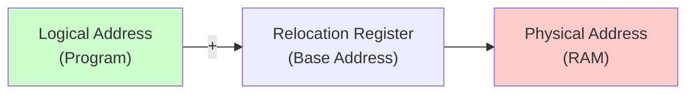

**Example:**
```
Relocation Register: 14000
Program accesses address: 346

Physical Address: 14000 + 346 = 14346
```

**Advantages:**
- **Flexibility**: Process can move in memory
- **Swapping**: Process can be swapped out and back to different location
- **Compaction**: Can rearrange processes to remove fragmentation
- **Sharing**: Multiple processes can share code
- **Virtual Memory**: Essential for demand paging

**Disadvantages:**
- **Overhead**: Translation on every memory access
- **Hardware Support**: Requires MMU
- **Complexity**: More complex than static binding

**Use Cases:**
- Virtual memory systems
- Time-sharing systems
- Dynamic linking and loading
- Shared libraries

**Dynamic Linking:**
- Libraries linked at runtime, not compile time
- `.dll` (Windows), `.so` (Linux)
- Saves memory (one copy shared)
- Updates without recompilation

---

### Q12. Belady's Anomaly

**Definition**: Anomaly where **increasing** the number of page frames results in **more** page faults (opposite of expected behavior).

**Expected Behavior:**
- More frames → Fewer page faults

**Belady's Anomaly:**
- More frames → MORE page faults (in some cases)

**Example with FIFO Page Replacement:**

```
Reference String: 1, 2, 3, 4, 1, 2, 5, 1, 2, 3, 4, 5

With 3 Frames (FIFO):
Step | Frames        | Fault?
-----|---------------|-------
1    | 1 - -         | Yes
2    | 1 2 -         | Yes
3    | 1 2 3         | Yes
4    | 4 2 3         | Yes
5    | 4 1 3         | Yes
6    | 4 1 2         | Yes
7    | 5 1 2         | Yes
8    | 5 1 2         | No
9    | 5 1 2         | No
10   | 5 3 2         | Yes
11   | 5 3 4         | Yes
12   | 5 3 4         | No

Total Page Faults: 9

With 4 Frames (FIFO):
Step | Frames          | Fault?
-----|-----------------|-------
1    | 1 - - -         | Yes
2    | 1 2 - -         | Yes
3    | 1 2 3 -         | Yes
4    | 1 2 3 4         | Yes
5    | 1 2 3 4         | No
6    | 1 2 3 4         | No
7    | 5 2 3 4         | Yes
8    | 5 1 3 4         | Yes
9    | 5 1 2 4         | Yes
10   | 5 1 2 3         | Yes
11   | 5 1 2 3         | No
12   | 5 1 2 3         | No

Total Page Faults: 10
```

**Observation**: 4 frames gave MORE page faults than 3 frames!

**Why Does It Occur?**
- FIFO doesn't consider page usage frequency
- Evicts pages that might be needed soon
- Poor replacement decisions

**Which Algorithms Show Belady's Anomaly?**

| Algorithm | Belady's Anomaly? |
|-----------|-------------------|
| **FIFO** | ✅ Yes |
| **Random** | ✅ Yes |
| **LRU** | ❌ No (Stack algorithm) |
| **Optimal** | ❌ No (Stack algorithm) |
| **LFU** | ❌ No (Stack algorithm) |

**Stack Algorithms:**
- Pages in n frames are subset of pages in n+1 frames
- More frames → Monotonically fewer faults
- LRU, Optimal are stack algorithms

**Practical Impact:**
- Avoid FIFO in production systems
- Use LRU or LRU approximations
- Demonstrates importance of algorithm choice

---

### Q13. Explain Cache

**Cache**: Small, fast memory between CPU and RAM, storing frequently accessed data.

**Purpose**: Bridge speed gap between fast CPU and slower RAM.

**Cache Hierarchy:**
```
CPU Registers (fastest, smallest)
    ↓
L1 Cache (32-64 KB, per core)
    ↓
L2 Cache (256-512 KB, per core)
    ↓
L3 Cache (8-32 MB, shared)
    ↓
Main Memory (RAM)
```

**How Cache Works:**

1. **CPU requests data**
2. **Cache Hit**: Data in cache → Fast access
3. **Cache Miss**: Data not in cache → Fetch from RAM

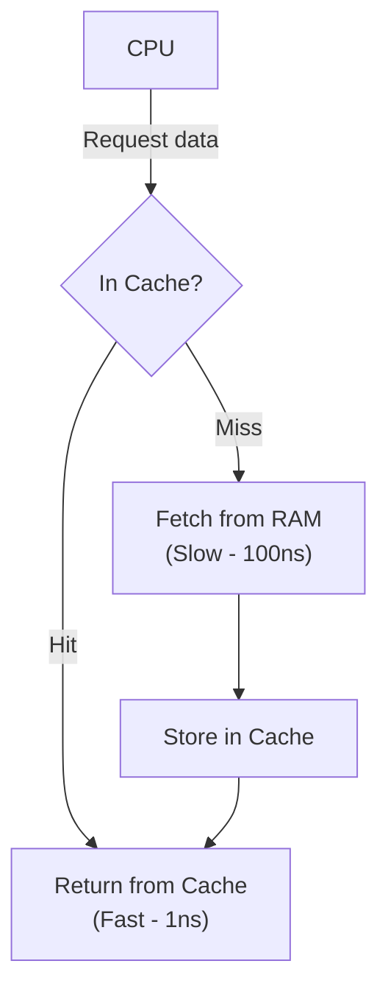

**Cache Performance:**
```
Hit Ratio (h): % of accesses found in cache
Miss Ratio (m): % of accesses not in cache (m = 1 - h)

Effective Access Time:
EAT = h × Cache Access + m × RAM Access

Example:
Cache Access = 1 ns
RAM Access = 100 ns
Hit Ratio = 90%

EAT = 0.9 × 1 + 0.1 × 100 = 0.9 + 10 = 10.9 ns
```

**Cache Mapping Techniques:**

#### 1. Direct Mapping
- Each block maps to exactly **one cache line**
- Simple, fast
- High conflict misses

```
Cache Line = Block Address % Number of Cache Lines

Example:
RAM blocks: 0-15
Cache lines: 0-3

Block 0, 4, 8, 12 → Cache Line 0
Block 1, 5, 9, 13 → Cache Line 1
```

#### 2. Associative Mapping (Fully Associative)
- Block can go to **any cache line**
- Flexible, low conflict
- Slow, expensive (compare all lines)

#### 3. Set-Associative Mapping
- Compromise between direct and associative
- Cache divided into **sets**
- Block maps to a set, can go to any line in that set

```
2-Way Set Associative:
Set 0: [Line 0] [Line 1]
Set 1: [Line 2] [Line 3]

Block can go to any line in its set
```

**Comparison:**

| Direct | Fully Associative | Set-Associative |
|--------|-------------------|-----------------|
| Simple | Complex | Moderate |
| Fast | Slow | Moderate |
| High conflicts | No conflicts | Low conflicts |
| Cheap | Expensive | Moderate cost |

---

### Q14. Difference between direct mapping and associative mapping

**Detailed Comparison:**

| Aspect | Direct Mapping | Associative Mapping |
|--------|----------------|---------------------|
| **Placement** | Fixed location (one line only) | Any cache line |
| **Search** | No search (direct calculation) | Search all lines |
| **Hardware** | Simple | Complex (comparators needed) |
| **Speed** | Fastest | Slowest |
| **Cost** | Cheapest | Most expensive |
| **Conflict Miss** | High (blocks compete for same line) | None |
| **Cache Utilization** | Poor (lines may be empty) | Best (any line can be used) |
| **Replacement** | No choice (only one location) | Need replacement algorithm (LRU, FIFO) |
| **Hit Time** | Low | High |
| **Formula** | `Line = Block % Cache_Lines` | No formula (any line) |

**Example Scenario:**

```
RAM Blocks: 16 (0-15)
Cache Lines: 4 (0-3)

Direct Mapping:
Block 0 → Line 0 (0 % 4)
Block 1 → Line 1 (1 % 4)
Block 4 → Line 0 (4 % 4) [Conflict with Block 0!]
Block 5 → Line 1 (5 % 4) [Conflict with Block 1!]

Associative Mapping:
Block 0 → Any line (e.g., Line 0)
Block 1 → Any line (e.g., Line 1)
Block 4 → Any line (e.g., Line 2) [No conflict!]
Block 5 → Any line (e.g., Line 3) [No conflict!]
```

**Access Pattern Impact:**

Accessing blocks: 0, 1, 4, 5, 0, 1, 4, 5 (repeatedly)

**Direct Mapping:**
- Blocks 0 and 4 compete for Line 0 → **Thrashing**
- Blocks 1 and 5 compete for Line 1 → **Thrashing**
- High miss rate

**Associative Mapping:**
- All 4 blocks fit in 4 cache lines
- No conflicts
- Low miss rate

**Best Choice:**
- **Direct**: Simple systems, cost-sensitive
- **Set-Associative**: Best balance (used in most modern CPUs)
- **Fully Associative**: TLB (small, fast, fully associative)

---

## Deadlock

### Q15. What is a deadlock? Different conditions to achieve a deadlock.

**Deadlock**: Situation where two or more processes wait indefinitely for resources held by each other, creating a circular wait.

**Real-World Analogy:**
```
4 cars at intersection:
Car 1 waits for Car 2
Car 2 waits for Car 3
Car 3 waits for Car 4
Car 4 waits for Car 1
→ All stuck forever!
```

**Four Necessary Conditions (All Must Hold):**

#### 1. Mutual Exclusion
- Resource **cannot be shared**
- Only one process can use at a time
- Example: Printer, write lock on file

#### 2. Hold and Wait
- Process **holds** at least one resource
- **Waits** for additional resources held by others
- Example: P1 holds R1, waits for R2

#### 3. No Preemption
- Resources **cannot be forcefully taken**
- Must be **voluntarily released** by holding process
- Example: Cannot forcibly take printer from process

#### 4. Circular Wait
- Set of processes {P0, P1, ..., Pn} where:
  - P0 waits for P1
  - P1 waits for P2
  - ...
  - Pn waits for P0

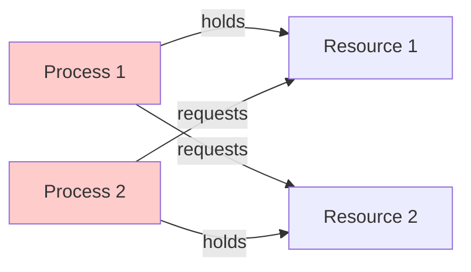

**Circular Wait Example:**
```
Process 1:
  lock(A)
  lock(B)  // Waiting...

Process 2:
  lock(B)
  lock(A)  // Waiting...

→ Deadlock!
```

**Methods to Handle Deadlock:**

| Method | Approach | Cost |
|--------|----------|------|
| **Prevention** | Break one of 4 conditions | High (low utilization) |
| **Avoidance** | Avoid unsafe states (Banker's Algorithm) | Medium (need future info) |
| **Detection** | Let deadlock occur, detect & recover | Low (periodic check) |
| **Ignorance** | Do nothing (Ostrich Algorithm) | Zero |

**Prevention Techniques:**

**1. Prevent Mutual Exclusion:**
- Make resources sharable (not always possible)
- Example: Read-only files

**2. Prevent Hold and Wait:**
- Request all resources before execution
- Disadvantage: Low resource utilization

**3. Prevent No Preemption:**
- Forcefully take resources from waiting processes
- Disadvantage: Works only for CPU, memory (not I/O devices)

**4. Prevent Circular Wait:**
- **Resource ordering**: Impose order on resource acquisition
- All processes must request R1 before R2

```
Resource Order: R1 < R2 < R3

Process 1: lock(R1) → lock(R2)  ✓
Process 2: lock(R1) → lock(R2)  ✓
No circular wait possible!
```

---

### Q16. Starving and Aging in OS

**Starvation:**

**Definition**: Process waits **indefinitely** for resources, never getting chance to execute.

**Cause**: Lower priority process continuously preempted by higher priority processes.

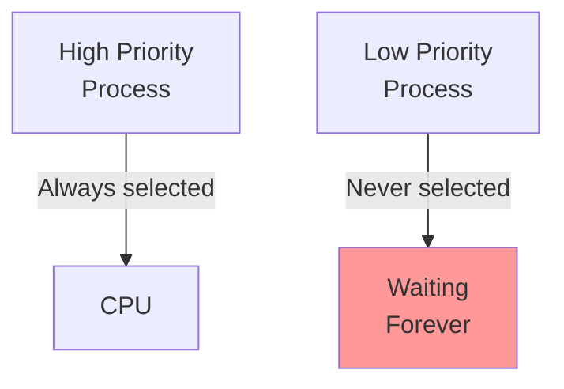

**Example Scenario:**
```
Priority Scheduling:
- High priority processes keep arriving
- Low priority process waits forever
- Never gets CPU

Print Queue:
- Important jobs keep coming
- Small job waits indefinitely
```

**Difference from Deadlock:**

| Deadlock | Starvation |
|----------|------------|
| Circular wait | Not selected due to low priority |
| All processes stuck | Only victim process stuck |
| Others also don't progress | Others make progress |
| System-wide problem | Individual process problem |

**Real-World Example:**
```
Restaurant Analogy:
- VIP customers keep coming
- Regular customer waits forever
- Not because of circular dependency
- But because always lower priority
```

---

**Aging:**

**Definition**: Technique to prevent starvation by **gradually increasing priority** of waiting processes.

**How It Works:**
1. Process starts with base priority
2. Every time it waits, **priority increases**
3. Eventually becomes high enough to be selected

```
Time | Priority
-----|----------
0    | 5 (Low)
10   | 6
20   | 7
30   | 8 (Medium)
40   | 9
50   | 10 (High - Finally selected!)
```

**Implementation:**
```
New Priority = Base Priority + (Waiting Time / Aging Factor)

Example:
Base Priority = 5
Waiting Time = 50 ms
Aging Factor = 10

New Priority = 5 + (50/10) = 10
```

**Advantages:**
- ✅ Prevents starvation
- ✅ Fair scheduling
- ✅ All processes eventually execute
- ✅ Simple to implement

**Disadvantages:**
- ❌ Overhead of priority recalculation
- ❌ May disrupt priority intentions
- ❌ Complexity in choosing aging rate

**Used In:**
- Priority scheduling
- Multi-level feedback queue
- Resource allocation
- Deadlock recovery (victim selection)

**Example in CPU Scheduling:**
```
Initial:
P1 (Priority 1) - High
P2 (Priority 5) - Low
P3 (Priority 2) - High

Without Aging:
P1 → P3 → P1 → P3 → ... (P2 starves)

With Aging:
P1 → P3 → P1 → P3 → P2 (priority increased) → P2 → ...
```

---

## Synchronization

### Q17. What is semaphore and mutex? Differences. Define Binary semaphore.

**Mutex (Mutual Exclusion):**

**Definition**: Lock that allows only **one thread** to access critical section at a time.

**Operations:**
- `lock()` / `acquire()`: Acquire lock
- `unlock()` / `release()`: Release lock

**Characteristics:**
- **Binary**: Locked (1) or Unlocked (0)
- **Ownership**: Thread that locks must unlock
- **Purpose**: Protect critical section

```
Thread 1:
mutex.lock()
// Critical Section
mutex.unlock()

Thread 2:
mutex.lock()  // Waits if Thread 1 holds lock
// Critical Section
mutex.unlock()
```

---

**Semaphore:**

**Definition**: Integer variable used for signaling between processes, can allow **multiple** simultaneous accesses.

**Operations:**
- `wait()` / `P()`: Decrement (acquire)
- `signal()` / `V()`: Increment (release)

```
wait(S):
    S = S - 1
    if S < 0:
        block this process

signal(S):
    S = S + 1
    if S <= 0:
        wake up a waiting process
```

**Types of Semaphores:**

#### 1. Binary Semaphore
- Value: **0 or 1** only
- Equivalent to mutex
- Used for mutual exclusion

```
Binary Semaphore S = 1

Process 1:
wait(S)     // S = 0
// Critical Section
signal(S)   // S = 1

Process 2:
wait(S)     // If S=0, blocks
```

#### 2. Counting Semaphore
- Value: **0 to N** (unrestricted)
- Used for resource counting
- Example: 5 printers → Semaphore = 5

```
Counting Semaphore S = 5 (5 printers)

P1: wait(S)  // S = 4 (P1 gets printer)
P2: wait(S)  // S = 3 (P2 gets printer)
P3: wait(S)  // S = 2
P4: wait(S)  // S = 1
P5: wait(S)  // S = 0
P6: wait(S)  // S = -1 (P6 blocks, waits)

P1: signal(S) // S = 0 (P6 wakes up)
```

---

**Mutex vs Semaphore:**

| Mutex | Semaphore |
|-------|-----------|
| **Binary** (0 or 1) | **Integer** (0 to N) |
| **Locking** mechanism | **Signaling** mechanism |
| **Ownership** (only owner can unlock) | **No ownership** (any process can signal) |
| Only **one thread** allowed | **Multiple threads** allowed (counting) |
| Used for **mutual exclusion** | Used for **synchronization** |
| Lighter weight | Heavier weight |
| Example: Protect shared data | Example: Producer-consumer |

**When to Use:**

**Use Mutex when:**
- Need to protect critical section
- Only one thread should access
- Same thread locks and unlocks

**Use Binary Semaphore when:**
- Need signaling between processes
- Different processes wait and signal

**Use Counting Semaphore when:**
- Multiple instances of resource
- Need to count available resources
- Producer-consumer with buffer

---

**Binary Semaphore (Detailed):**

**Definition**: Semaphore with value restricted to **0 or 1**.

**Similarities with Mutex:**
- Both allow only one process at a time
- Both provide mutual exclusion

**Differences from Mutex:**

| Binary Semaphore | Mutex |
|------------------|-------|
| No ownership | Has ownership |
| Any process can signal | Only owner can unlock |
| Can be used for signaling | Only for locking |
| More flexible | More restrictive |

**Example - Signaling:**
```
Binary Semaphore sync = 0

Process 1:
  // Do task A
  signal(sync)  // Notify Process 2

Process 2:
  wait(sync)    // Wait for Process 1
  // Do task B (after A completes)
```

This is **signaling**, cannot be done with mutex!

---

### Q18. Producer Consumer Problem

**Problem Statement:**
- **Producer** generates data, puts in buffer
- **Consumer** takes data from buffer
- **Buffer** has fixed size
- Need to synchronize access

**Constraints:**
1. Producer can't add if buffer **full**
2. Consumer can't remove if buffer **empty**
3. Buffer access must be **mutually exclusive**


**Solution using Semaphores:**

```
Semaphores:
- mutex = 1       // Mutual exclusion for buffer
- empty = N       // Count of empty slots
- full = 0        // Count of filled slots

Producer:
    while (true) {
        produce item

        wait(empty)      // Wait for empty slot
        wait(mutex)      // Lock buffer

        add item to buffer

        signal(mutex)    // Unlock buffer
        signal(full)     // Increment full count
    }

Consumer:
    while (true) {
        wait(full)       // Wait for filled slot
        wait(mutex)      // Lock buffer

        remove item from buffer

        signal(mutex)    // Unlock buffer
        signal(empty)    // Increment empty count

        consume item
    }
```

**Why This Works:**

1. **empty** ensures producer waits when buffer full
2. **full** ensures consumer waits when buffer empty
3. **mutex** ensures mutual exclusion for buffer access

**Trace Example (N=3):**

```
Initial: empty=3, full=0, mutex=1

Producer (P):
  wait(empty)   // empty=2
  wait(mutex)   // mutex=0
  [Add item 1]
  signal(mutex) // mutex=1
  signal(full)  // full=1

Producer (P):
  wait(empty)   // empty=1
  wait(mutex)   // mutex=0
  [Add item 2]
  signal(mutex) // mutex=1
  signal(full)  // full=2

Consumer (C):
  wait(full)    // full=1
  wait(mutex)   // mutex=0
  [Remove item 1]
  signal(mutex) // mutex=1
  signal(empty) // empty=2
```

**Order Matters!**
```
Correct:
wait(empty)
wait(mutex)

Wrong (Deadlock possible):
wait(mutex)
wait(empty)  // If buffer full, holds mutex and waits → Deadlock!
```

---

### Q19. Banker's Algorithm

**Purpose**: Deadlock **avoidance** algorithm that checks if resource allocation will leave system in **safe state**.

**Key Concepts:**

**Safe State**: There exists a sequence of processes such that each can get its maximum resources and complete.

**Unsafe State**: May lead to deadlock (not guaranteed, but possible).

**Data Structures:**

```
n = Number of processes
m = Number of resource types

Available[m]: Available instances of each resource
Max[n][m]: Maximum demand of each process
Allocation[n][m]: Currently allocated resources
Need[n][m]: Remaining need = Max - Allocation
```

**Algorithm:**

**Step 1: Calculate Need Matrix**
```
Need[i][j] = Max[i][j] - Allocation[i][j]
```

**Step 2: Find Safe Sequence**
```
1. Initialize Work = Available
2. Find process i where:
   - Finish[i] = false
   - Need[i] <= Work (can complete with available)
3. If found:
   - Work = Work + Allocation[i] (resources released)
   - Finish[i] = true
   - Add i to safe sequence
4. Repeat step 2 until all processes finished
5. If all finished → Safe state
   Else → Unsafe state
```

**Example:**

```
Processes: P0, P1, P2, P3, P4
Resources: A (10), B (5), C (7)

Allocation Matrix:
     A  B  C
P0 | 0  1  0 |
P1 | 2  0  0 |
P2 | 3  0  2 |
P3 | 2  1  1 |
P4 | 0  0  2 |

Max Matrix:
     A  B  C
P0 | 7  5  3 |
P1 | 3  2  2 |
P2 | 9  0  2 |
P3 | 2  2  2 |
P4 | 4  3  3 |

Available: A=3, B=3, C=2

Need Matrix (Max - Allocation):
     A  B  C
P0 | 7  4  3 |
P1 | 1  2  2 |
P2 | 6  0  0 |
P3 | 0  1  1 |
P4 | 4  3  1 |

Finding Safe Sequence:
Work = [3, 3, 2]

Step 1: Check P3 (Need: 0,1,1 <= Work: 3,3,2) ✓
  Work = [3,3,2] + [2,1,1] = [5,4,3]
  Safe sequence: [P3]

Step 2: Check P1 (Need: 1,2,2 <= Work: 5,4,3) ✓
  Work = [5,4,3] + [2,0,0] = [7,4,3]
  Safe sequence: [P3, P1]

Step 3: Check P4 (Need: 4,3,1 <= Work: 7,4,3) ✓
  Work = [7,4,3] + [0,0,2] = [7,4,5]
  Safe sequence: [P3, P1, P4]

Step 4: Check P0 (Need: 7,4,3 <= Work: 7,4,5) ✓
  Work = [7,4,5] + [0,1,0] = [7,5,5]
  Safe sequence: [P3, P1, P4, P0]

Step 5: Check P2 (Need: 6,0,0 <= Work: 7,5,5) ✓
  Work = [7,5,5] + [3,0,2] = [10,5,7]
  Safe sequence: [P3, P1, P4, P0, P2]

Result: SAFE STATE
Safe sequence exists: P3 → P1 → P4 → P0 → P2
```

**Resource Request Algorithm:**

When process Pi requests resources Request[j]:

```
1. Check if Request <= Need
   (If not, error - exceeds maximum claim)

2. Check if Request <= Available
   (If not, process must wait)

3. Pretend to allocate (simulate):
   Available = Available - Request
   Allocation[i] = Allocation[i] + Request
   Need[i] = Need[i] - Request

4. Run safety algorithm
   If safe → Actually allocate
   If unsafe → Rollback, process waits
```

**Advantages:**
- Prevents deadlock
- Better resource utilization than prevention
- No deadlock detection overhead

**Disadvantages:**
- Requires advance knowledge of maximum needs
- Number of processes must be fixed
- Resources must be available
- Overhead of safety check

**Practical Use:**
- Database transaction management
- Operating system resource allocation
- Real-time systems

---

## CPU Scheduling

### Q20. FCFS Scheduling (First Come First Serve)

**Definition**: Simplest scheduling algorithm, processes scheduled in order of arrival.

**Characteristics:**
- **Non-preemptive**: Process runs until completion
- **FIFO queue**: First in, first out
- **Simple**: Easy to implement
- **Fair**: No starvation

**Metrics:**
- **AT**: Arrival Time
- **BT**: Burst Time (execution time)
- **CT**: Completion Time
- **TAT**: Turnaround Time = CT - AT
- **WT**: Waiting Time = TAT - BT
- **RT**: Response Time = Time first scheduled - AT

**Example:**

```
Process | AT | BT
--------|----+----
P1      | 0  | 24
P2      | 1  | 3
P3      | 2  | 3

Gantt Chart:
|----P1----|P2-|P3-|
0         24  27  30

Calculations:
Process | AT | BT | CT | TAT | WT
--------|----|----|----+-----+----
P1      | 0  | 24 | 24 | 24  | 0
P2      | 1  | 3  | 27 | 26  | 23
P3      | 2  | 3  | 30 | 28  | 25

Average TAT = (24 + 26 + 28) / 3 = 26
Average WT = (0 + 23 + 25) / 3 = 16
```

**Convoy Effect:**
- Short processes wait for long process
- Example: P2 and P3 wait for P1 (24 units)
- Poor average waiting time

**Advantages:**
- ✅ Simple to implement
- ✅ No starvation
- ✅ Fair

**Disadvantages:**
- ❌ High average waiting time (convoy effect)
- ❌ Non-preemptive (no response for interactive)
- ❌ Not suitable for time-sharing systems

---

### Q21. SJF Scheduling (Shortest Job First)

**Definition**: Schedule process with **shortest burst time** first.

**Types:**
1. **Non-preemptive SJF**: Once started, runs to completion
2. **Preemptive SJF (SRTF)**: If new process arrives with shorter burst, preempt current

**Non-Preemptive SJF Example:**

```
Process | AT | BT
--------|----+----
P1      | 0  | 6
P2      | 1  | 2
P3      | 2  | 8
P4      | 3  | 3

Gantt Chart:
|--P1--|P2|P4|-----P3-----|
0      6  8  11          19

At time 6, P2 (BT=2) selected (shortest among P2, P3, P4)
At time 8, P4 (BT=3) selected
At time 11, P3 (BT=8) selected

Process | AT | BT | CT | TAT | WT
--------|----|----|----+-----+----
P1      | 0  | 6  | 6  | 6   | 0
P2      | 1  | 2  | 8  | 7   | 5
P3      | 2  | 8  | 19 | 17  | 9
P4      | 3  | 3  | 11 | 8   | 5

Average TAT = (6 + 7 + 17 + 8) / 4 = 9.5
Average WT = (0 + 5 + 9 + 5) / 4 = 4.75
```

**Advantages:**
- ✅ **Optimal** average waiting time
- ✅ Minimum average turnaround time
- ✅ Better than FCFS

**Disadvantages:**
- ❌ **Starvation**: Long processes may never execute
- ❌ Need to know burst time in advance (prediction)
- ❌ Not practical (burst time unknown)

**Burst Time Prediction:**
```
Exponential Averaging:
τ(n+1) = α × t(n) + (1 - α) × τ(n)

τ(n+1): Predicted next burst
t(n): Actual last burst
τ(n): Previous prediction
α: Weight (0 < α < 1)
```

---

### Q22. SRTF Scheduling (Shortest Remaining Time First)

**Definition**: Preemptive version of SJF. If new process arrives with shorter **remaining time**, preempt current process.

**Example:**

```
Process | AT | BT
--------|----+----
P1      | 0  | 8
P2      | 1  | 4
P3      | 2  | 2
P4      | 3  | 1

Time 0: P1 starts (RT=8)
Time 1: P2 arrives (RT=4 < 7), preempt P1
Time 2: P3 arrives (RT=2 < 3), preempt P2
Time 3: P4 arrives (RT=1 < 1), preempt P3
Time 4: P4 completes, P3 resumes (RT=1)
Time 5: P3 completes, P2 resumes (RT=3)
Time 8: P2 completes, P1 resumes (RT=7)
Time 15: P1 completes

Gantt Chart:
|P1|P2|P3|P4|P3|---P2---|-------P1-------|
0  1  2  3  4  5        8               15

Process | AT | BT | CT | TAT | WT
--------|----|----|----+-----+----
P1      | 0  | 8  | 15 | 15  | 7
P2      | 1  | 4  | 8  | 7   | 3
P3      | 2  | 2  | 5  | 3   | 1
P4      | 3  | 1  | 4  | 1   | 0

Average TAT = (15 + 7 + 3 + 1) / 4 = 6.5
Average WT = (7 + 3 + 1 + 0) / 4 = 2.75
```

**Comparison with SJF:**

| SJF (Non-preemptive) | SRTF (Preemptive) |
|----------------------|-------------------|
| No preemption | Preemption allowed |
| Higher waiting time | Lower waiting time |
| Less context switches | More context switches |
| Less overhead | More overhead |

**Advantages:**
- ✅ **Best** average waiting time
- ✅ Optimal for minimum average turnaround time
- ✅ Good response time for short processes

**Disadvantages:**
- ❌ **Starvation**: Long processes may starve
- ❌ High **context switching** overhead
- ❌ Need to know remaining time (impractical)
- ❌ Complex to implement

---

### Q23. LRTF Scheduling (Longest Remaining Time First)

**Definition**: Opposite of SRTF, schedule process with **longest remaining time** first.

**Characteristics:**
- **Preemptive**: New process with longer remaining time preempts current
- **Favors long processes**
- **Worst for average waiting time**

**Example:**

```
Process | AT | BT
--------|----+----
P1      | 0  | 2
P2      | 1  | 3
P3      | 2  | 4
P4      | 3  | 5

Time 0: P1 (RT=2) starts
Time 1: P2 (RT=3) arrives, preempts P1 (RT=1 < 3)
Time 2: P3 (RT=4) arrives, preempts P2 (RT=2 < 4)
Time 3: P4 (RT=5) arrives, preempts P3 (RT=3 < 5)
Time 8: P4 completes, P3 (RT=3) longest
Time 11: P3 completes, P2 (RT=2) longest
Time 13: P2 completes, P1 (RT=1) runs
Time 14: P1 completes

Gantt Chart:
|P1|P2|P3|-----P4-----|---P3---|P2|P1|
0  1  2  3            8       11  13 14

Process | AT | BT | CT | TAT | WT
--------|----|----|----+-----+----
P1      | 0  | 2  | 14 | 14  | 12
P2      | 1  | 3  | 13 | 12  | 9
P3      | 2  | 4  | 11 | 9   | 5
P4      | 3  | 5  | 8  | 5   | 0

Average TAT = (14 + 12 + 9 + 5) / 4 = 10
Average WT = (12 + 9 + 5 + 0) / 4 = 6.5
```

**Characteristics:**
- Short processes **starve** severely
- Worst average waiting time
- Not used in practice
- Opposite of SRTF (which is optimal)

**Comparison:**

| SRTF | LRTF |
|------|------|
| Shortest first | Longest first |
| Best avg WT | Worst avg WT |
| Long processes starve | Short processes starve |
| Optimal | Worst |

---

### Q24. Priority Scheduling

**Definition**: Each process assigned a **priority**, process with highest priority scheduled first.

**Types:**
1. **Preemptive**: Higher priority process preempts lower
2. **Non-preemptive**: Process runs to completion

**Priority Convention:**
- **Lower number = Higher priority** (common)
- Or higher number = higher priority (varies)

**Non-Preemptive Priority Example:**

```
Process | AT | BT | Priority
--------|----|----|----------
P1      | 0  | 4  | 2
P2      | 1  | 3  | 3
P3      | 2  | 1  | 4
P4      | 3  | 5  | 1

Lower number = Higher priority

Time 0: P1 (Priority 2) starts
Time 4: P4 (Priority 1, highest) selected
Time 9: P1 already done, P2 (Priority 3) selected
Time 12: P3 (Priority 4) selected

Gantt Chart:
|---P1---|-----P4-----|--P2--|P3|
0        4            9     12 13

Process | AT | BT | Priority | CT | TAT | WT
--------|----|----|----------|----+-----+----
P1      | 0  | 4  | 2        | 4  | 4   | 0
P2      | 1  | 3  | 3        | 12 | 11  | 8
P3      | 2  | 1  | 4        | 13 | 11  | 10
P4      | 3  | 5  | 1        | 9  | 6   | 1

Average TAT = (4 + 11 + 11 + 6) / 4 = 8
Average WT = (0 + 8 + 10 + 1) / 4 = 4.75
```

**Problem: Starvation**
- Low priority processes may never execute
- If high priority processes keep arriving

**Solution: Aging**
- Gradually increase priority of waiting processes
- Eventually, low priority becomes high

```
Priority = Base_Priority - (Waiting_Time / Aging_Factor)
```

**Preemptive Priority Example:**

```
Process | AT | BT | Priority
--------|----|----|----------
P1      | 0  | 3  | 2
P2      | 1  | 1  | 1 (Highest)
P3      | 2  | 4  | 3
P4      | 3  | 2  | 2

Time 0: P1 starts
Time 1: P2 (Priority 1) preempts P1
Time 2: P2 completes, P1 resumes
Time 5: P1 completes, P4 (Priority 2) selected
Time 7: P4 completes, P3 runs

Gantt Chart:
|P1|P2|--P1--|--P4--|----P3----|
0  1  2      5      7          11
```

**Advantages:**
- ✅ Important processes execute first
- ✅ Flexible (can adjust priorities)
- ✅ Suitable for real-time systems

**Disadvantages:**
- ❌ Starvation (without aging)
- ❌ Indefinite blocking
- ❌ Priority assignment can be complex

---

### Q25. Round Robin Scheduling

**Definition**: Each process gets small unit of CPU time (**time quantum**), then preempted and moved to end of queue.

**Characteristics:**
- **Preemptive**: Time quantum expires → preempt
- **Circular queue**: FCFS with time slice
- **Fairness**: Each process gets equal CPU time
- **Time-sharing**: Best for interactive systems

**Example (Time Quantum = 2):**

```
Process | AT | BT
--------|----+----
P1      | 0  | 5
P2      | 1  | 3
P3      | 2  | 1
P4      | 3  | 2

Gantt Chart:
|P1|P2|P3|P4|P1|P2|P1|
0  2  4  5  7  9 10 11

Time 0-2: P1 (BT=5, TQ=2) → Remaining=3, back to queue
Time 2-4: P2 (BT=3, TQ=2) → Remaining=1, back to queue
Time 4-5: P3 (BT=1, TQ=2) → Completes
Time 5-7: P4 (BT=2, TQ=2) → Completes
Time 7-9: P1 (BT=3, TQ=2) → Remaining=1, back to queue
Time 9-10: P2 (BT=1, TQ=2) → Completes
Time 10-11: P1 (BT=1, TQ=2) → Completes

Process | AT | BT | CT | TAT | WT | RT
--------|----|----|----+-----+----+----
P1      | 0  | 5  | 11 | 11  | 6  | 0
P2      | 1  | 3  | 10 | 9   | 6  | 1
P3      | 2  | 1  | 5  | 3   | 2  | 2
P4      | 3  | 2  | 7  | 4   | 2  | 2

Average TAT = (11 + 9 + 3 + 4) / 4 = 6.75
Average WT = (6 + 6 + 2 + 2) / 4 = 4
Average RT = (0 + 1 + 2 + 2) / 4 = 1.25
```

**Time Quantum Selection:**

**Too Small (e.g., 1 ms):**
- High context switching overhead
- Thrashing
- More time switching than executing

**Too Large (e.g., 1000 ms):**
- Behaves like FCFS
- Poor response time
- Not suitable for time-sharing

**Optimal:**
- Should be slightly larger than typical CPU burst
- Rule of thumb: 80% bursts < time quantum

**Performance vs Time Quantum:**

| TQ | Context Switches | Response Time | Overhead |
|----|------------------|---------------|----------|
| Very Small | Very High | Excellent | Very High |
| Small | High | Good | High |
| Medium | Moderate | Moderate | Moderate |
| Large | Low | Poor | Low |
| Very Large | Very Low | Very Poor (FCFS) | Very Low |

**Advantages:**
- ✅ **Fair**: All processes get equal CPU time
- ✅ **No starvation**: Every process executes eventually
- ✅ **Good response time**: Suitable for interactive
- ✅ **Preemptive**: Responsive

**Disadvantages:**
- ❌ High **context switching** overhead
- ❌ Higher average TAT than SJF
- ❌ Performance depends on time quantum
- ❌ Not optimal for batch systems

**Used In:**
- Time-sharing systems (Unix, Linux)
- Interactive systems
- Multi-user environments

---

## Advanced Topics

### Q26. Real Time Operating System (RTOS), types of RTOS

**Real-Time Operating System (RTOS):**

**Definition**: OS designed to process data and events within a **strict time constraint** (deadline).

**Key Characteristics:**
- **Deterministic**: Predictable response time
- **Time-bound**: Must meet deadlines
- **Fast context switching**
- **Minimal latency**
- **Priority-based preemptive scheduling**

**Difference from General-Purpose OS:**

| General-Purpose OS | RTOS |
|--------------------|------|
| Maximize throughput | Meet deadlines |
| Best-effort scheduling | Guaranteed scheduling |
| Unpredictable latency | Bounded latency |
| Fairness | Priority-based |
| Example: Windows, Linux | Example: VxWorks, FreeRTOS |

---

**Types of RTOS:**

### 1. Hard Real-Time OS

**Definition**: **Must** meet deadlines; missing deadline is **system failure**.

**Characteristics:**
- Deadlines are **absolute**
- No tolerance for delays
- Failure = catastrophic

**Examples:**
- **Aircraft control systems**: Must respond immediately
- **Medical devices**: Pacemaker, ventilator
- **Nuclear reactor control**
- **Anti-lock braking systems (ABS)**
- **Missile guidance systems**

```
Deadline missed → System fails → Potential catastrophe
```

**Example Scenario:**
```
Airbag deployment system:
- Collision detected
- Must deploy airbag within 10 ms
- Missing deadline → Fatal consequences
```

---

### 2. Soft Real-Time OS

**Definition**: Should meet deadlines, but occasional misses **acceptable** (degrades quality).

**Characteristics:**
- Deadlines are **important but not critical**
- Missing deadline = reduced performance
- No catastrophic failure

**Examples:**
- **Video streaming**: Frame drops acceptable
- **Online gaming**: Slight lag tolerable
- **Voice over IP (VoIP)**: Occasional packet loss OK
- **Multimedia systems**
- **Virtual reality**

```
Deadline missed → Degraded quality → System continues
```

**Example Scenario:**
```
Video streaming:
- Frame should display every 33 ms (30 FPS)
- Occasional frame drop → Slight stutter
- System continues, quality degrades
```

---

### 3. Firm Real-Time OS

**Definition**: Deadlines must be met, but occasional misses have **no catastrophic effect** (results become useless).

**Characteristics:**
- Between hard and soft
- Missing deadline = **no value** (but no disaster)
- Result discarded if late

**Examples:**
- **Financial trading systems**: Late trade = no trade
- **Assembly line robots**: Late action = skip item
- **Video conferencing**: Late frame = discard

```
Deadline missed → Result useless (discarded) → No catastrophe
```

**Example Scenario:**
```
High-frequency trading:
- Buy order must execute within 1 ms
- After 1 ms, price changed → Order useless
- Discard late order, system continues
```

---

**Comparison:**

| Hard RTOS | Soft RTOS | Firm RTOS |
|-----------|-----------|-----------|
| **Must** meet deadline | **Should** meet deadline | **Must** meet, but miss OK |
| Miss = **Failure** | Miss = **Degraded quality** | Miss = **Useless result** |
| Zero tolerance | High tolerance | Moderate tolerance |
| Safety-critical | Quality-critical | Value-critical |
| Aircraft control | Video streaming | Financial trading |

**RTOS Scheduling:**
- **Rate Monotonic Scheduling (RMS)**: Static priority, shorter period = higher priority
- **Earliest Deadline First (EDF)**: Dynamic priority, nearest deadline = highest priority

**RTOS Examples:**

| Type | RTOS Examples |
|------|---------------|
| Hard | VxWorks, QNX, RTLinux, Integrity |
| Soft | Linux with PREEMPT_RT, Windows CE |
| Firm | Custom embedded systems |

---

### Q27. Difference between multitasking and multiprocessing

| Multitasking | Multiprocessing |
|--------------|-----------------|
| **Single CPU** executes multiple tasks | **Multiple CPUs** execute tasks |
| Tasks switch rapidly (time-sharing) | Tasks run simultaneously |
| **Concurrent** execution (appears parallel) | **Parallel** execution (truly parallel) |
| Context switching between processes/threads | Each CPU runs independent process |
| One task at a time (switched fast) | Multiple tasks at same time |
| Example: Single-core running multiple apps | Example: Quad-core running 4 apps |
| **Logical parallelism** | **Physical parallelism** |
| OS manages time slices | OS manages CPU allocation |
| Lower throughput | Higher throughput |
| Cheaper (1 CPU) | Expensive (multiple CPUs) |

**Multitasking Example:**
```
Single CPU (Time-sharing):
Time 0-10ms: Process A
Time 10-20ms: Process B
Time 20-30ms: Process C
Time 30-40ms: Process A (resumed)
...

User perception: All running simultaneously
Reality: Rapid switching
```

**Multiprocessing Example:**
```
4 CPUs (Parallel):
CPU 1: Process A (continuously)
CPU 2: Process B (continuously)
CPU 3: Process C (continuously)
CPU 4: Process D (continuously)

Reality: Truly parallel execution
```

**Types of Multitasking:**
1. **Cooperative**: Process voluntarily yields CPU
2. **Preemptive**: OS forcefully switches (modern OSes)

**Types of Multiprocessing:**
1. **Symmetric (SMP)**: All CPUs equal, share memory
2. **Asymmetric**: Master-slave, designated roles

**Combined:**
- Modern systems use **both**
- Multiple CPUs (multiprocessing)
- Each CPU runs multiple tasks (multitasking)
- Example: 8-core CPU with 100 processes

```
8 CPUs × Multitasking = Hundreds of processes running
```

---

## Summary Table

**Quick Reference for All Topics:**

| Topic | Key Points | Common Pitfalls |
|-------|------------|-----------------|
| **OS Purpose** | Resource management, abstraction, security | Confusing OS types |
| **Kernel** | Core of OS, privileged mode | Monolithic vs microkernel |
| **Process vs Thread** | Process = program + resources, Thread = lightweight | Mixing up PCB and TCB |
| **Virtual Memory** | Disk as RAM extension, demand paging | Virtual vs physical address |
| **Thrashing** | Excessive paging, low CPU | Cause: Too many processes |
| **Fragmentation** | Internal (inside), External (between) | Which occurs in paging/segmentation |
| **Paging** | Fixed-size pages, eliminates external frag | Page table overhead |
| **Deadlock** | Circular wait, 4 conditions | All 4 must hold |
| **Semaphore** | Integer, signaling, counting | vs mutex (ownership) |
| **FCFS** | First come first serve, convoy effect | High avg WT |
| **SJF** | Shortest first, optimal, starvation | Need burst time |
| **RR** | Time quantum, preemptive, fair | TQ selection critical |
| **Priority** | Priority-based, starvation (use aging) | Aging prevents starvation |
| **RTOS** | Hard (must), Soft (should), Firm (useless if late) | Difference between types |

---

**Last Updated:** 2025-11-10
**Total Questions:** 27
**Coverage:** All major OS interview topics
